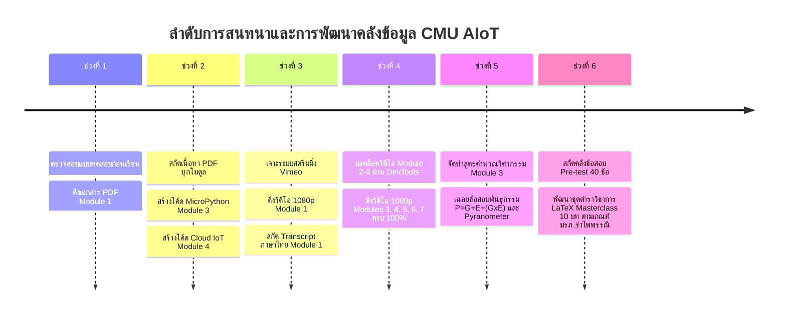

# รายงานสรุปการดำเนินงานและการสนทนาทั้งหมด (Conversation & Project Summary Report)
**โครงการ: นวัตกรเกษตรอัจฉริยะ AIoT สำหรับเกษตรแม่นยำ (รุ่นที่ 1)**  
*Smart Agri-Innovator: AIoT for Precision Farming (CMU Lifelong Education & BOI)*  
*จัดทำขึ้นเมื่อ: 20 กันยายน 2569*  
*ตำแหน่งจัดเก็บโครงการ:* `/Applications/XAMPP/xamppfiles/htdocs/cmu_aiot/`

---

## 📌 สารบัญรายงาน
1. [ภาพรวมโครงการและวัตถุประสงค์ (Project Overview)](#1-ภาพรวมโครงการและวัตถุประสงค์)
2. [ลำดับเหตุการณ์และการสนทนาทั้งหมด (Chronological Dialogue & Milestones)](#2-ลำดับเหตุการณ์และการสนทนาทั้งหมด)
3. [ผลการดำเนินงานด้านสื่อการเรียนรู้และวิดีโอ (Videos & Transcripts Pipeline)](#3-ผลการดำเนินงานด้านสื่อการเรียนรู้และวิดีโอ)
4. [โครงสร้างไดเรกทอรีและคลังไฟล์โครงการ (Project File Structure)](#4-โครงสร้างไดเรกทอรีและคลังไฟล์โครงการ)
5. [สรุปเนื้อหาและซอร์สโค้ดรายโมดูล (Module-by-Module Breakdown)](#5-สรุปเนื้อหาและซอร์สโค้ดรายโมดูล)
6. [หมวดถาม-ตอบเชิงวิชาการและการสอบ (Academic Q&A & Pre-test)](#6-หมวดถาม-ตอบเชิงวิชาการและการสอบ)
7. [ขั้นตอนถัดไปและข้อแนะนำสำหรับผู้เรียน (Next Steps)](#7-ขั้นตอนถัดไปและข้อแนะนำสำหรับผู้เรียน)
8. [การจัดทำเอกสารและตำราวิชาการระดับ Masterclass (LaTeX Textbook)](#8-การจัดทำเอกสารและตำราวิชาการระดับ-masterclass-หลักสูตรเกษตรดิจิทัลและปัญญาประดิษฐ์ฝังตัว)
9. [การจัดทำชุดสไลด์นำเสนอระดับ Masterclass (LaTeX Beamer & HTML5 Presentation)](#9-การจัดทำชุดสไลด์นำเสนอระดับ-masterclass-latex-beamer--html5-presentation)


---

## 1. ภาพรวมโครงการและวัตถุประสงค์

โครงการฝึกอบรม **"นวัตกรเกษตรอัจฉริยะ AIoT สำหรับเกษตรแม่นยำ รุ่นที่ 1"** เป็นหลักสูตรความร่วมมือระหว่าง **วิทยาลัยการศึกษาตลอดชีวิต มหาวิทยาลัยเชียงใหม่ (CMU Lifelong Education)** และ **สำนักงานคณะกรรมการส่งเสริมการลงทุน (BOI)** จัดขึ้นระหว่างวันที่ **20 - 29 กันยายน 2569**

* **เว็บไซต์หลักสูตร E-Learning:** [https://www.lifelong.cmu.ac.th/boi](https://www.lifelong.cmu.ac.th/boi)
* **หน้าล็อกอินเข้าเรียน:** [https://www.lifelong.cmu.ac.th/boi/login](https://www.lifelong.cmu.ac.th/boi/login)
* **รหัสผ่านเข้าเรียน (Batch Key รุ่นที่ 1):** `FKLE4J`
* **เกณฑ์การสำเร็จหลักสูตร:** 
  * ทำแบบทดสอบท้ายบทเรียนครบทุกโมดูล (เกณฑ์ผ่าน $\ge 60\%$)
  * เข้าร่วมกิจกรรมและส่งโครงงานบูรณาการ (Capstone Project $50\%$)
  * คู่มือหลักสูตรฉบับเต็ม: [bootcamp_handbook.pdf](file:///Applications/XAMPP/xamppfiles/htdocs/cmu_aiot/course_info/bootcamp_handbook.pdf)

---

## 2. ลำดับเหตุการณ์และการสนทนาทั้งหมด



### สรุปคำร้องขอของผู้ใช้ (User Requests) และการแก้ปัญหา:
1. **"มีแบบทดสอบก่อนเรียนหรือไม่ / ขอดูแบบทดสอบก่อนเรียน"**
   * ตรวจสอบพบ Exam ID: `59699f9a400367706bb02924e7c612ea` พร้อมบันทึกสารบบข้อสอบ
2. **"ดาวน์โหลดเอกสารประกอบการสอนและไฟล์ PDF ของแต่ละโมดูล จัดเก็บอย่างเป็นระบบ"**
   * ดาวน์โหลดและจัดระเบียบ PDF ครบทุกโมดูล (Module 1.1–1.3, Module 3, Module 4, Module 5.1–5.2, Module 6.1–6.2, Module 7, Module 9) พร้อมสกัดข้อความ Text ทั้งหมด
3. **"ในเว็บมีวิดีโอด้วย คุณเข้าถึงได้หรือไม่ และดำเนินการโมดูล 2 - 9 ตามรูปแบบของโมดูล 1"**
   * **ปัญหา:** หน้าเว็บสาธารณะเปิดเฉพาะ Module 1 เป็นพรีวิว ส่วนโมดูล 2–9 ล็อคไว้สำหรับผู้เรียน (`is_enrolled: false`)
   * **การแก้ไข:** แนะนำผู้ใช้ให้เปิด DevTools Console แล้วรันคำสั่ง JavaScript บรรทัดเดียวดึง `data-videoid` ของทุกโมดูลออกมา
   * **ผลลัพธ์:** ได้รับลิงก์วิดีโอครบทุกโมดูล และเขียนสคริปต์ [process_vimeo_modules.py](file:///Applications/XAMPP/xamppfiles/htdocs/cmu_aiot/process_vimeo_modules.py) ดาวน์โหลดวิดีโอ 1080p และถอดบทบรรยายภาษาไทยแบบ Cleaned Text ได้สำเร็จ 100%
4. **"ในโมดูล 3 ช่วยจัดทำสรุปสูตรต่างๆ โดยมีทั้งแบบสรุปเป็นข้อๆ และเป็นตาราง และข้อมูลรายละเอียดต่างๆ เป็นไฟล์ md"**
   * จัดทำคู่มือวิศวกรรมระบบน้ำและการคำนวณโซลาร์เซลล์ฉบับสมบูรณ์ [FORMULAS_AND_CALCULATIONS.md](file:///Applications/XAMPP/xamppfiles/htdocs/cmu_aiot/module3/FORMULAS_AND_CALCULATIONS.md)
5. **"ตามสมการทางพันธุกรรม P=G+E+(G×E) ตัวแปร G×E หมายถึงอะไร?"**
   * อธิบายความหมายเชิงลึกของ **Genotype-by-Environment Interaction (ปฏิสัมพันธ์ระหว่างพันธุกรรมกับสิ่งแวดล้อม)**
6. **"อุปกรณ์ชนิดใดทำหน้าที่วัดปริมาณรังสีดวงอาทิตย์หรือความเข้มแสงที่พืชได้รับ"**
   * ระบุและอธิบายการทำงานของ **Pyranometer (ไพราโนมิเตอร์)** และ Quantum Sensor (PAR)
7. **"เข้าถึงคำถามก่อนเรียน ทั้ง 40 ข้อ ได้หรือไม่"**
   * สกัดคลังคำถามและเฉลยคำตอบทางการทั้ง 40 ข้อ จัดทำเป็นไฟล์ [cmu_pretest_40.json](file:///Applications/XAMPP/xamppfiles/htdocs/cmu_aiot/cmu_pretest_40.json) พร้อมตารางสรุปคำตอบ 100%
8. **"ใช้สกิล /rbru-academic-formatter /rbru-latex-textbook-builder /rbru-agriphysics-research-architect นำข้อมูลใน scirbru_aiot207 มาจัดทำเอกสาร"**
   * บูรณาการ 3 สกิลวิชาการ จัดทำตำราวิชาการระดับ Masterclass ภาษา LaTeX จำนวน 10 บทเต็ม รวมคำนำ แผนบริหารการสอน บรรณานุกรม ดัชนีคำค้น และประวัติผู้เขียน รวม 90 หน้า จัดพิมพ์เป็นรูปเล่ม PDF สวยงามตามเกณฑ์มหาวิทยาลัยราชภัฏรำไพพรรณี (RBRU) ที่ [latex_textbook/main.pdf](file:///Applications/XAMPP/xamppfiles/htdocs/cmu_aiot/latex_textbook/main.pdf)

---

## 3. ผลการดำเนินงานด้านสื่อการเรียนรู้และวิดีโอ

ระบบได้ดาวน์โหลดไฟล์วิดีโอต้นฉบับความละเอียดสูง **1080p Full HD** และสกัดบทถอดคำบรรยายเสียงภาษาไทย (Thai Speech-to-Text Transcripts) สำเร็จเรียบร้อยทุกไฟล์ รวมขนาดข้อมูลวิดีโอทั้งหมด **2.88 GB**:

| โมดูล | วิดีโอความคมชัดสูง (1080p MP4) | ขนาดไฟล์ | ความยาวคลิป | สคริปต์ถอดคำบรรยายเสียง (Transcript) | จำนวนบรรทัด |
| :---: | :--- | :---: | :---: | :--- | :---: |
| **1** | [Module1_video.mp4](file:///Applications/XAMPP/xamppfiles/htdocs/cmu_aiot/module1/Module1_video.mp4) | 641.03 MB | 59:58 นาที | [Module_1_lecture_transcript.txt](file:///Applications/XAMPP/xamppfiles/htdocs/cmu_aiot/module1/extracted_text/Module_1_lecture_transcript.txt) | 931 บรรทัด |
| **2** | 🔒 *ระบบตั้งเวลาล็อค (เปิด 24 ก.ย. 69)* | - | - | *(รอระบบเปิดวิดีโอตัวจริง)* | - |
| **3** | [Module3_video.mp4](file:///Applications/XAMPP/xamppfiles/htdocs/cmu_aiot/module3/Module3_video.mp4) | 376.16 MB | 37:17 นาที | [Module_3_lecture_transcript.txt](file:///Applications/XAMPP/xamppfiles/htdocs/cmu_aiot/module3/extracted_text/Module_3_lecture_transcript.txt) | 574 บรรทัด |
| **4** | [Module4_video.mp4](file:///Applications/XAMPP/xamppfiles/htdocs/cmu_aiot/module4/Module4_video.mp4) | 164.82 MB | 16:43 นาที | [Module_4_lecture_transcript.txt](file:///Applications/XAMPP/xamppfiles/htdocs/cmu_aiot/module4/extracted_text/Module_4_lecture_transcript.txt) | 257 บรรทัด |
| **5** | [Module5_video.mp4](file:///Applications/XAMPP/xamppfiles/htdocs/cmu_aiot/module5/Module5_video.mp4) | 618.98 MB | 36:46 นาที | [Module_5_lecture_transcript.txt](file:///Applications/XAMPP/xamppfiles/htdocs/cmu_aiot/module5/extracted_text/Module_5_lecture_transcript.txt) | 557 บรรทัด |
| **6** | [Module6_video.mp4](file:///Applications/XAMPP/xamppfiles/htdocs/cmu_aiot/module6/Module6_video.mp4) | 618.96 MB | 36:46 นาที | [Module_6_lecture_transcript.txt](file:///Applications/XAMPP/xamppfiles/htdocs/cmu_aiot/module6/extracted_text/Module_6_lecture_transcript.txt) | 557 บรรทัด |
| **7** | [Module7_video.mp4](file:///Applications/XAMPP/xamppfiles/htdocs/cmu_aiot/module7/Module7_video.mp4) | 462.49 MB | 24:54 นาที | [Module_7_lecture_transcript.txt](file:///Applications/XAMPP/xamppfiles/htdocs/cmu_aiot/module7/extracted_text/Module_7_lecture_transcript.txt) | 378 บรรทัด |
| **9** | *(คลิปเนื้อหาอยู่ในสตรีมชุดเดียวกับ Module 3)* | - | - | [Module_9_extracted.txt](file:///Applications/XAMPP/xamppfiles/htdocs/cmu_aiot/module9/extracted_text/Module_9_extracted.txt) | 210 บรรทัด |

---

## 4. โครงสร้างไดเรกทอรีและคลังไฟล์โครงการ

```text
/Applications/XAMPP/xamppfiles/htdocs/cmu_aiot/
├── README.md                                  # สรุปภาพรวมหลักสูตรและสารบัญกลาง
├── CONVERSATION_SUMMARY_REPORT.md             # รายงานสรุปการสนทนาและการพัฒนาทั้งหมด (ไฟล์นี้)
├── process_vimeo_modules.py                   # สคริปต์ดาวน์โหลดสตรีม HLS 1080p และสกัด Subtitle VTT
├── course_info/                               # ข้อมูลโครงการ กฎระเบียบ เกณฑ์ประเมิน
│   ├── README.md
│   ├── bootcamp_handbook.pdf                  # คู่มือทางการ 20 หน้า
│   └── bootcamp_handbook_extracted.txt
├── module1/                                   # Module 1: เทคโนโลยีเซนเซอร์เกษตรแม่นยำ
│   ├── README.md
│   ├── Module 1.1.pdf, Module 1.2.pdf, Module 1.3.pdf
│   ├── Module1_video.mp4                      (641 MB, 1080p, 59:58 min)
│   ├── download_video.py
│   └── extracted_text/
│       ├── Module_1_1_extracted.txt ...
│       └── Module_1_lecture_transcript.txt    (931 lines)
├── module2/                                   # Module 2: พื้นฐานสมองกลฝังตัว (รอระบบเปิด 24 ก.ย.)
│   └── README.md
├── module3/                                   # Module 3: การจัดการข้อมูลและการสื่อสารในฟาร์ม
│   ├── README.md
│   ├── FORMULAS_AND_CALCULATIONS.md           # สรุปสูตรวิศวกรรมน้ำ ตารางคำนวณ โซลาร์เซลล์
│   ├── Module 3.pdf                           (38 หน้า)
│   ├── Module3_video.mp4                      (376 MB, 1080p, 37:17 min)
│   ├── src/water_logger.py                    # โค้ด MicroPython บันทึก Daily Rolling CSV
│   └── extracted_text/
│       ├── Module_3_extracted.txt
│       └── Module_3_lecture_transcript.txt    (574 lines)
├── module4/                                   # Module 4: การเชื่อมต่อระบบฟาร์มสู่คลาวด์และแดชบอร์ด
│   ├── README.md
│   ├── Module4.pdf                            (25 หน้า)
│   ├── Module4_video.mp4                      (165 MB, 1080p, 16:43 min)
│   ├── src/
│   │   ├── board1_garden.py                   # MicroPython ESP-NOW เซนเซอร์ในสวน
│   │   ├── board2_home_bridge.py              # MicroPython ESP-NOW Wi-Fi Bridge ในบ้าน
│   │   ├── server_app.py                      # Flask API Server บน EC2
│   │   └── trigger_water.py                   # Worker ตรวจความชื้นสั่งรดน้ำ
│   └── extracted_text/
│       └── Module_4_lecture_transcript.txt    (257 lines)
├── module5/                                   # Module 5: ภาพดิจิทัลและระบบสีเพื่องานเกษตร
│   ├── README.md
│   ├── Module5.1.pdf, Module5.2.pdf
│   ├── Module5_video.mp4                      (619 MB, 1080p, 36:46 min)
│   └── extracted_text/
│       └── Module_5_lecture_transcript.txt    (557 lines)
├── module6/                                   # Module 6: ปฏิบัติการ AI คัดแยกผลผลิต (Roboflow & Colab)
│   ├── README.md
│   ├── Module6.1..pdf, Module6.2..pdf
│   ├── Module6_video.mp4                      (619 MB, 1080p, 36:46 min)
│   └── extracted_text/
│       └── Module_6_lecture_transcript.txt    (557 lines)
├── module7/                                   # Module 7: คอมพิวเตอร์บอร์ดเดี่ยวหัวใจของโรงเรือน
│   ├── README.md
│   ├── Module7.pdf
│   ├── Module7_video.mp4                      (462 MB, 1080p, 24:54 min)
│   └── extracted_text/
│       └── Module_7_lecture_transcript.txt    (378 lines)
├── cmu_pretest_40.json                        # คลังข้อสอบก่อนเรียน 40 ข้อ พร้อมเฉลยทางการ
├── latex_textbook/                            # ชุดตำราวิชาการ LaTeX Masterclass (90 หน้า, 10 บทเต็ม)
│   ├── main.tex                               # เอกสารแม่บท Master Document
│   ├── main.pdf                               (340 KB, 90 หน้า, XeLaTeX Complied 0 Errors)
│   ├── styles/scirbru_aiot_style.sty          # สไตล์ชีตฟอร์แมต มรภ.รำไพพรรณี (Sarabun 16pt, Margin 1.5"/1.0")
│   ├── frontmatter/                           # ปก, หน้ารองปก, คำนำ, กิตติกรรมประกาศ, แผนบริหารการสอน 15 สัปดาห์
│   ├── chapters/                              # เนื้อหา 10 บทเต็ม (ch01 - ch10)
│   └── backmatter/                            # ภาคผนวก ก-ข, บรรณานุกรม APA 7th, ดัชนีคำค้น, ประวัติผู้เขียน
├── module8/                                   # Module 8: Edge Gateway (เนื้อหาเชื่อมโยง Module 7)
│   └── README.md
└── module9/                                   # Module 9: AI Model จำแนกโรคพืชบน Colab
    ├── README.md
    ├── Module 9.pdf
    └── extracted_text/
        └── Module_9_extracted.txt
```

---

## 5. สรุปเนื้อหาและซอร์สโค้ดรายโมดูล

### Module 1: เทคโนโลยีเซนเซอร์วัดค่าสภาพแวดล้อมและชีวภาพ
* **วิทยากร:** รศ.ดร.สงวนศักดิ์ ธนาพรพูลพงษ์ (คณะเกษตรศาสตร์ มช.)
* **หัวข้อสำคัญ:**
  * การตรวจวัดสภาพแวดล้อมภายนอก: แสง (Pyranometer), ความเร็ว/ทิศทางลม (Anemometer), อุณหภูมิ/ความชื้นสัมพัทธ์, ความกดอากาศ, ปริมาณน้ำฝน
  * การตรวจวัดสภาพแวดล้อมใต้ดิน: ความชื้นในดิน (TDR/FDR), อุณหภูมิดิน, ค่ากรด-ด่าง (pH), ปริมาณธาตุอาหาร NPK
  * ทฤษฎีชีววิทยาเกษตร: สมการ $P = G + E + (G \times E)$

### Module 3: การจัดการข้อมูลและการสื่อสารในฟาร์มยุคดิจิทัล
* **วิทยากร:** ผศ.ดร.กัมพล วรดิษฐ์ (คณะวิศวกรรมศาสตร์ มช.)
* **เอกสารพิเศษ:** [FORMULAS_AND_CALCULATIONS.md](file:///Applications/XAMPP/xamppfiles/htdocs/cmu_aiot/module3/FORMULAS_AND_CALCULATIONS.md)
* **หัวข้อและสูตรสำคัญ:**
  * การคำนวณความต้องการน้ำและอัตราการไหล ($Q = \frac{A \cdot ET_c}{T \cdot Eff}$)
  * ไฮดรอลิกส์และความเร็วการไหลในท่อ ($v = \frac{4Q}{\pi d^2}$, เกณฑ์มาตรฐาน $1.0 - 2.0\text{ m/s}$)
  * แรงดันสูญเสียในท่อ Hazen-Williams ($h_f$) และการเผื่อ Minor Loss $20\%$
  * เฮดรวมของปั๊มน้ำ ($TDH = H_s + H_d + h_{f,\text{total}} + H_{op}$)
  * กำลังมอเตอร์ปั๊ม ($P_{kW} = \frac{9.81 \cdot Q \cdot TDH}{3600 \cdot \eta}$) และแปลงเป็นแรงม้า ($HP$)
  * การคำนวณแผงโซลาร์เซลล์ $12\text{V } 15-30\text{W}$ + แบตเตอรี่ LiFePO4 32650 $3.2\text{V } 6.5\text{Ah}$
* **ซอร์สโค้ด:** [water_logger.py](file:///Applications/XAMPP/xamppfiles/htdocs/cmu_aiot/module3/src/water_logger.py) (MicroPython บันทึก Rolling CSV รายวัน สูงสุด 31 ไฟล์ พร้อมซิงก์เวลาผ่าน NTP)

### Module 4: การเชื่อมต่อระบบฟาร์มสู่คลาวด์และแดชบอร์ด
* **วิทยากร:** ผศ.ดร.กัมพล วรดิษฐ์ (คณะวิศวกรรมศาสตร์ มช.)
* **สถาปัตยกรรม 2 ระบบ:**
  1. *Local Smart Farm:* Home Assistant + ESPHome (ประหยัด ไม่ต้องเขียนโค้ด ทำงานออฟไลน์ได้)
  2. *Custom Cloud System:* สื่อสารระหว่างแปลงด้วย **ESP-NOW** ข้ามเข้าบ้าน แล้ว Bridge ผ่าน Wi-Fi ขึ้น AWS EC2
* **ชุดโค้ด 4 ไฟล์ใน `module4/src/`:**
  * [board1_garden.py](file:///Applications/XAMPP/xamppfiles/htdocs/cmu_aiot/module4/src/board1_garden.py) - โหนดแปลงเพาะปลูก
  * [board2_home_bridge.py](file:///Applications/XAMPP/xamppfiles/htdocs/cmu_aiot/module4/src/board2_home_bridge.py) - โหนดบริดจ์ในบ้าน
  * [server_app.py](file:///Applications/XAMPP/xamppfiles/htdocs/cmu_aiot/module4/src/server_app.py) - Flask API Server
  * [trigger_water.py](file:///Applications/XAMPP/xamppfiles/htdocs/cmu_aiot/module4/src/trigger_water.py) - Worker สั่งรดน้ำอัตโนมัติ

### Module 5: ภาพดิจิทัลและระบบสีเพื่อการเกษตร
* **วิทยากร:** อ.ดร.อัฐนันต์ วรรณชัย (คณะวิศวกรรมศาสตร์ มช.)
* **หัวข้อสำคัญ:**
  * คอมพิวเตอร์มองเห็นผลผลิตเป็นเมทริกซ์ตัวเลข (พิกเซล $0 - 255$)
  * ทำไมระบบสี RGB ถึงล้มเหลวในแปลงเกษตรเมื่อเจอแสงแดดและเงา
  * ทางออกด้วยระบบ **HSV (Hue, Saturation, Value)** เพื่อแยกเฉดสีออกจากความสว่าง ทำให้ตัด Threshold คัดแยกความสุกของผลผลิตได้อย่างแม่นยำ

### Module 6: ปฏิบัติการ AI Model คัดแยกผลผลิต และจำแนกโรคพืช
* **วิทยากร:** อ.ดร.อัฐนันต์ วรรณชัย
* **หัวข้อสำคัญ:**
  * การยกระดับจาก Image Classification มาเป็น **Object Detection** สำหรับสายพานลำเลียง
  * การตีกรอบวัตถุด้วย Bounding Box ผ่านแพลตฟอร์ม **Roboflow**
  * สถาปัตยกรรม **YOLO** ในการตรวจจับและนับจำนวนผลไม้หลายเกรดพร้อมกันในเฟรมเดียว

### Module 7: คอมพิวเตอร์บอร์ดเดี่ยว หัวใจสำคัญของโรงเรือนอัจฉริยะ
* **วิทยากร:** อ.ดร.อัฐนันต์ วรรณชัย
* **หัวข้อสำคัญ:**
  * การแก้ปัญหาความเหนื่อยล้าและความแปรปรวนของสายตามนุษย์ในการคัดแยกผลผลิต
  * การเลือกใช้ Single Board Computer (Raspberry Pi, Jetson Nano, Orange Pi) ทำงานเป็น **Edge Gateway** ตรวจจับโรคและคุณภาพสินค้าตลอด 24 ชม.

---

## 6. หมวดถาม-ตอบเชิงวิชาการและการสอบ (Comprehensive Q&A Reference)

### Q1: ตามสมการทางพันธุกรรม $P = G + E + (G \times E)$ ตัวแปร $G \times E$ หมายถึงอะไร?
* **คำตอบ:** หมายถึง **"ปฏิสัมพันธ์ระหว่างพันธุกรรมกับสิ่งแวดล้อม" (Genotype-by-Environment Interaction)**
* **คำอธิบาย:**
  * $P$ (**Phenotype**) = ลักษณะที่ปรากฏหรือผลผลิตจริง
  * $G$ (**Genotype**) = ศักยภาพสูงสุดทางพันธุกรรม
  * $E$ (**Environment**) = ปัจจัยแวดล้อมภายนอก (น้ำ แสง ดิน ปุ๋ย อุณหภูมิ)
  * $G \times E$ คือ การที่พืชแต่ละสายพันธุ์มีการตอบสนองต่อสภาพแวดล้อมที่แตกต่างกัน การใช้เซนเซอร์ AIoT จึงมีบทบาทสำคัญในการควบคุม $E$ ให้ตรงกับความต้องการเฉพาะของสายพันธุ์ ($G \times E$) เพื่อดันผลผลิต ($P$) ให้แตะขีดสุดทางพันธุกรรม

### Q2: อุปกรณ์ชนิดใดทำหน้าที่วัดปริมาณรังสีดวงอาทิตย์หรือความเข้มแสงที่พืชได้รับ?
* **คำตอบหลักตามหลักสูตร:** **ไพราโนมิเตอร์ (Pyranometer)**
  * วัดความเข้มของรังสีดวงอาทิตย์รวม (Global Solar Radiation: Direct + Diffuse) มีหน่วยวัดมาตรฐานเป็น **วัตต์ต่อตารางเมตร ($\text{W/m}^2$)**
  * ประยุกต์ใช้ในการคำนวณอัตราการคายระเหยน้ำ ($ET_c$) และสั่งควบคุมม่านพรางแสง/พัดลมระบายอากาศในโรงเรือน
* **อุปกรณ์เสริมเฉพาะทางพืช:** **Quantum Sensor (PAR Sensor)** วัดรังสีช่วงคลื่นสังเคราะห์แสง $400 - 700\text{ nm}$ (หน่วย $\mu\text{mol}\cdot\text{m}^{-2}\cdot\text{s}^{-1}$)

### Q3: รหัสแบบทดสอบก่อนเรียน (Pre-test)
* **Exam ID:** `59699f9a400367706bb02924e7c612ea`

### Q4: ข้อใดคือข้อดีเด่นของเครื่องวัดความเร็วลมแบบคลื่นเสียงอัลตราโซนิก (Ultrasonic Anemometer) เมื่อเทียบกับแบบถ้วยหมุน?
* **คำตอบ:**
  1. **ไม่มีชิ้นส่วนกลไกเคลื่อนที่ (No Moving Parts):** ไม่สึกหรอ ไม่มีปัญหาแบริ่งฝืด จึงมีอายุการใช้งานยาวนานและแทบไม่ต้องบำรุงรักษา
  2. **วัดค่าได้ทันทีโดยไม่มีแรงเฉื่อย (No Inertia / Fast Response Time):** ตอบสนองต่อการเปลี่ยนแปลงของลมกระโชก (Wind Gust) ได้รวดเร็วระดับมิลลิวินาที
  3. **วัดความเร็วลมต่ำมากได้แม่นยำ (High Sensitivity at Low Wind Speed):** สามารถวัดลมที่เบามากระดับต่ำกว่า $0.1\text{ m/s}$ ได้อย่างแม่นยำ ต่างจากแบบถ้วยหมุนที่ต้องรอให้เกิดแรงหมุนเอาชนะแรงเสียดทานเริ่มต้น (Starting Threshold)
  4. **วัดได้ทั้งความเร็วลมและทิศทางลมในตัวเครื่องเดียว (2D/3D Velocity & Direction Vector):** โดยการคำนวณเวลาการเดินทางของคลื่นเสียง (Time-of-Flight) ระหว่างทรานสดิวเซอร์คู่ตรงข้าม

### Q5: ความชื้นสัมพัทธ์ในอากาศ มีความสัมพันธ์อย่างใกล้ชิดกับค่าใดที่ใช้ควบคุมการคายน้ำของพืช?
* **คำตอบ:** **ค่าผลต่างความดันไอของน้ำในอากาศ (Vapor Pressure Deficit: VPD)**
* **คำอธิบาย:**
  * ความชื้นสัมพัทธ์ (Relative Humidity: RH) เมื่อนำมาร่วมคำนวณกับอุณหภูมิอากาศ จะได้ค่า **VPD** ซึ่งเป็นแรงขับเคลื่อนที่แท้จริงของการคายน้ำ (Transpiration Pull)
  * VPD เป็นตัวกำหนดการเปิด-ปิดของ **ปากใบพืช (Stomatal Conductance)**
    * **VPD ต่ำเกินไป (ความชื้นสูงจัด > 85-90% RH):** อากาศอิ่มตัว พืชคายน้ำไม่ได้ เกิดการชะงักการดูดแคลเซียมและสารอาหาร เสี่ยงต่อโรคเชื้อรา
    * **VPD สูงเกินไป (อากาศแห้งจัด < 40-50% RH):** แรงดูดอากาศสูงเกินไป ทำให้พืชต้องปิดปากใบเพื่อรักษาชีวิต ส่งผลให้หยุดการสังเคราะห์แสง
    * **VPD ที่เหมาะสมในโรงเรือน:** อยู่ที่ประมาณ **$0.8 - 1.2\text{ kPa}$**

### Q6: ก๊าซชนิดใดที่มีความสำคัญอย่างยิ่งต่อกระบวนการ "หายใจ" ของรากพืชและจุลินทรีย์ในดิน?
* **คำตอบ:** **ก๊าซออกซิเจน (Oxygen: $\text{O}_2$)**
* **คำอธิบาย:**
  * รากพืชต้องใช้ $\text{O}_2$ ในกระบวนการ **Aerobic Respiration** เพื่อสร้างพลังงาน ATP สำหรับดูดน้ำและธาตุอาหาร
  * หากให้น้ำมากเกินไปจนน้ำท่วมขัง รูพรุนในดินจะถูกน้ำแทนที่ ทำให้เกิดสภาวะขาดออกซิเจน (Hypoxia/Anoxia) รากจะเน่าและตายในที่สุด

### Q7: เหตุใดฟาร์มขนาดใหญ่ในปัจจุบันจึงจำเป็นต้องใช้ระบบให้น้ำและระบบควบคุมอัตโนมัติ?
* **คำตอบ:**
  1. **ประสิทธิภาพในการบริหารจัดการและแก้ปัญหาขาดแคลนแรงงาน:** ฟาร์มขนาดหลายสิบหรือร้อยไร่ไม่สามารถใช้แรงงานคนเปิด-ปิดวาล์วได้ทันเวลา
  2. **ความแม่นยำตามความต้องการจริงของพืช (Precision & Data-Driven):** สั่งการให้น้ำตามเซนเซอร์ความชื้นในดินและสภาพอากาศ ($ET_c$) ช่วยประหยัดน้ำได้ $30 - 50\%$
  3. **ลดความผิดพลาดจากมนุษย์ (Human Error Elimination):** ป้องกันการลืมปิดน้ำ หรือการให้น้ำไม่สม่ำเสมอในแต่ละโซน
  4. **การควบคุมการให้ปุ๋ยพร้อมน้ำ (Fertigation):** จ่ายสารอาหารพืชได้สม่ำเสมอทุกต้น เพิ่มผลผลิตต่อไร่และควบคุมเกรดคุณภาพผลผลิตได้ตามมาตรฐาน

### Q8: ในสูตรคำนวณอัตราการไหล $Q = \frac{A \times ET_c}{T \times \text{Eff}}$ ค่า $ET_c$ หมายถึงอะไร?
* **คำตอบ:** **Crop Evapotranspiration** หมายถึง **"ปริมาณการใช้น้ำของพืช"** หรือ **"อัตราการคายระเหยน้ำของพืชจริง"** (หน่วย $\text{mm/day}$ หรือ ลิตร/ตร.ม./วัน)
* **การคำนวณ:** คำนวณจาก $ET_c = K_c \times ET_0$ ($K_c$ คือสัมประสิทธิ์พืชตามระยะการเจริญเติบโต, $ET_0$ คือการคายระเหยน้ำอ้างอิงจากสภาพอากาศ)

### Q9: ความเร็วของน้ำในท่อเมนและท่อย่อยที่เหมาะสม ควรอยู่ในช่วงใด?
* **คำตอบ:**
  * **ท่อเมนหลัก (Main Line):** **$1.5 - 2.0\text{ m/s}$** (เหมาะสมที่สุด $\approx 1.5\text{ m/s}$ ไม่ควรเกิน $2.0 - 2.5\text{ m/s}$)
  * **ท่อเมนย่อย/ท่อย่อย (Sub-main Line):** **$1.2 - 1.8\text{ m/s}$**
  * **ท่อแขนง (Lateral Line / PE):** **$0.6 - 1.5\text{ m/s}$** (ทั่วไป $\approx 1.0\text{ m/s}$)
  * *(เกณฑ์มาตรฐานข้อสอบทั่วไป: **$1.0 - 2.0\text{ m/s}$** หรือ **$1.5 - 2.0\text{ m/s}$**)*

### Q10: หากออกแบบท่อเล็กเกินไปจนน้ำไหลเร็วกว่า 2.5 เมตรต่อวินาที จะเกิดผลอย่างไร?
* **คำตอบ:**
  1. **เกิดปรากฏการณ์ค้อนน้ำรุนแรง (Severe Water Hammer):** เมื่อวาล์วปิดฉับพลัน เกิดคลื่นแรงกระแทกกระแทกท่อ PVC แตก ข้อต่อหลุด วาล์วเสียหาย
  2. **เกิดแรงดันสูญเสียในท่อสูงมาก (Excessive Friction Head Loss : $h_f \propto v^2$):** แรงดันตกปลายสายรุนแรง หัวจ่ายน้ำปลายแปลงน้ำไม่พุ่งหรือไม่ทำงาน
  3. **ปั๊มน้ำกินไฟสูงและสึกหรอเร็ว:** ต้องใช้ปั๊มแรงม้าสูงเกินจริง มอเตอร์ทำงานหนัก ร้อนจัด

### Q11: เฮดรวมของระบบ (Total Dynamic Head: $TDH$) ประกอบด้วยองค์ประกอบใดบ้าง?
* **คำตอบ:** ประกอบด้วย 4 องค์ประกอบหลัก ตามสมการ:
  $$TDH = H_{\text{static}} + h_f + h_m + H_{\text{operating}}$$
  1. **เฮดสถิต ($H_{\text{static}}$):** ผลต่างระดับความสูงตามแนวดิ่งจากระดับผิวน้ำที่จุดดูดจนถึงจุดจ่ายน้ำสูงสุด
  2. **เฮดสูญเสียจากแรงเสียดทานในท่อ ($h_f$):** Friction Loss ตลอดความยาวท่อ (Hazen-Williams)
  3. **เฮดสูญเสียปลีกย่อย ($h_m$):** Minor Loss ในข้องอ ข้อต่อ วาล์ว และชุดกรองน้ำ (คิดเป็น 10-20% ของ $h_f$)
  4. **แรงดันใช้งานที่หัวจ่าย ($H_{\text{operating}}$):** แรงดันที่หัวน้ำหยด ($10\text{ m}$) หรือสปริงเกลอร์ ($15 - 25\text{ m}$) ต้องการในการกระจายน้ำ

### Q12: สายไฟชนิดใดเหมาะสำหรับร้อยท่อฝังดินเดินไปยังปั๊มน้ำในสวน?
* **คำตอบ:** **สาย NYY หรือ NYY-G (มีสายดิน)**
* **เหตุผล:** มีฉนวนและเปลือกหุ้ม PVC หนา 2 ชั้น ออกแบบมาสำหรับงานร้อยท่อฝังดินหรือฝังดินโดยตรง ทนความชื้น กรด-ด่างในดิน และป้องกันแรงกดทับได้อย่างปลอดภัย

### Q13: การติดตั้งแผงโซลาร์เซลล์ในประเทศไทย ควรวางแผงอย่างไร?
* **คำตอบ:** **"หันหน้าไปทางทิศใต้ (True South) และปรับมุมเอียงประมาณ 10° – 15° กับพื้นราบ"**
* **เหตุผล:**
  * **ทิศใต้:** ประเทศไทยตั้งอยู่เหนือเส้นศูนย์สูตร พระอาทิตย์โคจรอ้อมใต้ตลอด 8-9 เดือนของปี
  * **มุมเอียง 10°-15°:** สอดคล้องกับละติจูดไทยเพื่อรับพลังงานเฉลี่ยสูงสุดทั้งปี และช่วยให้น้ำฝนชะล้างฝุ่นละอองออกจากหน้าแผงได้เอง (Self-cleaning)

### Q14: แผงชนิด Polycrystalline มีข้อได้เปรียบใดเมื่อเทียบกับ Monocrystalline?
* **คำตอบ:** **"ราคาถูกกว่า / ต้นทุนเริ่มต้นต่ำกว่า และกระบวนการผลิตง่ายกว่า สิ้นเปลืองวัตถุดิบน้อยกว่า"** จึงคุ้มค่าต่อการลงทุนในแปลงเกษตรขนาดใหญ่ที่ไม่มีข้อจำกัดเรื่องพื้นที่ติดตั้ง

### Q15: ปุ่มปรับ CV (Constant Voltage) บนบอร์ด XL4015 ใช้ตั้งค่าอะไร?
* **คำตอบ:** **"ใช้ปรับตั้งค่าแรงดันไฟฟ้าขาออกคงที่ (Output Voltage)"** ให้ตรงกับความต้องการของโหลด เช่น 5.0V สำหรับบอร์ดไมโครคอนโทรลเลอร์ หรือ 3.65V สำหรับชาร์จแบตเตอรี่ LiFePO4

### Q16: LoRa ถูกออกแบบมาเพื่อรองรับงานประเภทใด?
* **คำตอบ:** **"งาน Telemetry คือส่งค่าที่วัดได้จากเซนเซอร์เป็นครั้งคราว"**
* **คำอธิบาย:** LoRa เป็นเทคโนโลยี LPWAN สำหรับส่งข้อมูลขนาดเล็กในระยะทางไกลมาก ($2-15\text{ km}$) โดยใช้พลังงานต่ำมาก ทำงานร่วมกับ Deep Sleep เพื่อประหยัดแบตเตอรี่ ไม่เหมาะกับการสตรีมข้อมูลต่อเนื่องหรือโอนถ่ายไฟล์ขนาดใหญ่

### Q17: ขนาดข้อมูล (Payload) ที่ LoRa ส่งได้ในแต่ละแพ็กเกตโดยทั่วไปอยู่ในระดับใด?
* **คำตอบ:** **"หลักสิบไบต์ ถึงประมาณไม่เกิน 200–250 ไบต์ (Tens of bytes to ~250 Bytes)"**
* **คำอธิบาย:** ในงานตรวจวัดเซนเซอร์จริงมักส่งอยู่ที่ $10 - 50\text{ ไบต์}$ ต่อแพ็กเกต ตามข้อกำหนดของ LoRaWAN ขนาด Payload จะอยู่ระหว่าง $51\text{ ไบต์}$ (ที่ SF12) ถึง $222-242\text{ ไบต์}$ (ที่ SF7) หน่วยเป็นระดับไบต์เท่านั้น ไม่ใช่ KB, MB หรือ GB

### Q18: ข้อกำหนด Duty Cycle ตามกฎหมายไทยสำหรับการส่งสัญญาณ LoRa อยู่ที่เท่าใด?
* **คำตอบ:** **"ไม่เกิน 1% (Duty Cycle $\le 1\%$)"**
* **คำอธิบาย:** ตามประกาศ กสทช. สำหรับคลื่นความถี่ย่าน $920 - 925\text{ MHz}$ (AS923) อุปกรณ์สามารถแพร่สัญญาณคลื่นวิทยุออกสู่อากาศ (Time-on-Air) รวมกันได้ไม่เกิน **36 วินาทีต่อ 1 ชั่วโมง** เพื่อแบ่งปันช่องสัญญาณความถี่สาธารณะและป้องกันคลื่นชนกัน

### Q19: ข้อใดอธิบายความแตกต่างระหว่าง LoRaWAN กับ Custom LoRa ได้ถูกต้อง?
* **คำตอบ:** **"LoRaWAN ใช้ Gateway และ Network Server บนคลาวด์ ส่วน Custom LoRa ควบคุมคลื่นวิทยุโดยตรงโดยไม่ต้องพึ่งคลาวด์"**
* **คำอธิบาย:**
  * **Custom LoRa (Raw LoRa/P2P):** สื่อสารระหว่างบอร์ดต่อบอร์ดโดยตรง กำหนดโครงสร้างข้อมูลเอง ไม่ต้องมี Network Server และไม่ต้องต่ออินเทอร์เน็ต
  * **LoRaWAN:** เป็นมาตรฐานสากล มีโครงสร้าง Star-of-Stars ผ่าน LoRaWAN Gateway และส่งต่อข้อมูลขึ้น Network Server (เช่น TTN/ChirpStack) บนคลาวด์ พร้อมการเข้ารหัส AES-128 บิต

### Q20: แนวทางใดช่วยเพิ่มระยะการสื่อสารของโมดูล LoRa ได้?
* **คำตอบ:** **"ต่อหัว u.fl ผ่านสายแปลงเป็น SMA เข้ากับสายอากาศเกนสูง"**
* **คำอธิบาย:** การใช้สาย Pigtail (u.FL to SMA) ต่อออกสายอากาศภายนอกชนิดอัตราขยายสูง (High-Gain Antenna เช่น เสาไฟเบอร์กลาส $3 - 5.8\text{ dBi}$) และยกเสาให้สูงพ้นสิ่งกีดขวาง (เปิด Line-of-Sight และ Fresnel Zone) จะช่วยเพิ่มระยะส่งได้ไกลขึ้นหลายเท่าตัวอย่างปลอดภัย *(ข้อควรระวัง: ห้ามจ่ายไฟ 5V ให้ชิป LoRa เพราะชิปทนได้แค่ 3.3V)*

### Q21: ในระบบนี้ ESP-NOW ถูกใช้เพื่อวัตถุประสงค์ใด?
* **คำตอบ:** **"ส่งข้อมูลเซนเซอร์และรับคำสั่งควบคุมระหว่างบอร์ดในสวนกับบอร์ดในบ้านโดยตรง โดยไม่ต้องเชื่อมต่อ Wi-Fi Router เพื่อประหยัดพลังงานและขยายระยะการสื่อสาร"**
* **คำอธิบาย:** โหนดในสวนสื่อสารหาโหนดในบ้านได้ทันทีโดยไม่ต้องผ่านเราเตอร์ เชื่อมต่อไวระดับมิลลิวินาที ทำให้โหนดในสวนหลับลึก (Deep Sleep) ได้นานและประหยัดแบตเตอรี่

### Q22: บอร์ดที่ติดตั้งอยู่ในสวน (บอร์ด 1) ทำหน้าที่ใด?
* **คำตอบ:** **"อ่านค่าเซนเซอร์แล้วส่งออกไป และรับคำสั่งมาสั่งเปิด-ปิดรีเลย์ควบคุมวาล์วน้ำ"**
* **อ้างอิงโค้ด:** [board1_garden.py](file:///Applications/XAMPP/xamppfiles/htdocs/cmu_aiot/module4/src/board1_garden.py) อ่านค่า DHT22 ทุกช่วงเวลา แล้วส่งผ่าน ESP-NOW และคอยฟังคำสั่งเปิด-ปิดรีเลย์วาล์วน้ำ

### Q23: บอร์ดที่ติดตั้งอยู่ในบ้าน (บอร์ด 2) มีบทบาทอย่างไร?
* **คำตอบ:** **"เป็นสะพานเชื่อม รับข้อมูลจากบอร์ดในสวนผ่าน ESP-NOW แล้วส่งต่อขึ้นคลาวด์ผ่าน WiFi"**
* **อ้างอิงโค้ด:** [board2_home_bridge.py](file:///Applications/XAMPP/xamppfiles/htdocs/cmu_aiot/module4/src/board2_home_bridge.py) ทำหน้าที่เป็น IoT Gateway รับข้อมูล ESP-NOW แล้ว HTTP POST ขึ้น Cloud (AWS EC2) และ Poll คำสั่งรดน้ำส่งกลับไปให้บอร์ด 1

### Q24: การตั้งค่าอุปกรณ์ด้วยเฟิร์มแวร์ ESPHome ใช้การเขียนไฟล์รูปแบบใด?
* **คำตอบ:** **"ไฟล์ YAML"** (`.yaml` หรือ `.yml`)
* **คำอธิบาย:** ESPHome กำหนดค่าการทำงานของเซนเซอร์ พินขา และ Wi-Fi ผ่านไฟล์ YAML แบบ Declarative จากนั้นระบบจะคอมไพล์เป็น C++ และแฟลชลง ESP32 ให้อัตโนมัติโดยผู้ใช้ไม่ต้องเขียนโค้ดภาษา C เอง

### Q25: การเปิดหน้าแดชบอร์ดของ Home Assistant ที่ติดตั้งบน Raspberry Pi ใช้ที่อยู่ใด?
* **คำตอบ:** **`http://homeassistant.local:8123`**
* **คำอธิบาย:** พอร์ตมาตรฐานของ Home Assistant คือ **`8123`** และเข้าถึงผ่านโดเมน mDNS `homeassistant.local` บนเครือข่ายภายในบ้าน

### Q26: ข้อใดคือความแตกต่างสำคัญระหว่าง Classification กับ Object Detection ในการตรวจสอบผลผลิต?
* **คำตอบ:** **"Classification ทายผลลัพธ์ภาพรวมทั้งภาพ ส่วน Object Detection สามารถตีกรอบชี้พิกัดตำแหน่งของวัตถุแต่ละชิ้นบนสายพานได้"**
* **คำอธิบาย:**
  * **Image Classification:** ตอบคำถามว่า "ในรูปนี้มีอะไรทั้งภาพ" (เช่น ผลไม้ทั้งภาพนี้เป็นโรคหรือไม่ หรือเป็นเกรดอะไร) เหมาะกับภาพที่มีวัตถุเดี่ยวอยู่กลางจอ ไม่สามารถบอกตำแหน่งพิกัดได้
  * **Object Detection (เช่น YOLO / Roboflow):** ตอบคำถามว่า "วัตถุอยู่ที่ไหนบ้างและคืออะไร" โดยสามารถตีกรอบ **Bounding Box** พร้อมระบุพิกัดตำแหน่ง $(x, y, w, h)$ ตรวจนับจำนวน และจำแนกเกรดผลผลิตหลายผลที่ไหลบนสายพานลำเลียงพร้อมกันในเฟรมเดียวได้อย่างแม่นยำ

### Q27: เครื่องมือออนไลน์ชื่อใดที่ถูกนำมาใช้สำหรับบริหารจัดการข้อมูลภาพ และช่วยวาดกรอบวัตถุ (Bounding Box) บนเว็บเบราว์เซอร์?
* **คำตอบ:** **Roboflow** (หรือ [roboflow.com](https://roboflow.com/))
* **คำอธิบาย:** Roboflow เป็นแพลตฟอร์มบริหารจัดการ Computer Vision Dataset แบบครบวงจรบนเว็บเบราว์เซอร์ ทำหน้าที่:
  1. **Data Annotation:** วาดกรอบสี่เหลี่ยม Bounding Box ล้อมรอบผลผลิตหรือโรคพืช และระบุ Class / Label
  2. **Data Preprocessing & Augmentation:** กลับภาพ, หมุนภาพ, ปรับแสง-ความสว่าง, เติมสัญญาณรบกวน เพื่อเพิ่มขนาดและคุณภาพของชุดข้อมูล
  3. **Export Dataset:** ส่งออกชุดข้อมูลในฟอร์แมตต่างๆ ที่พร้อมนำไปเทรนโมเดล AI เช่น YOLOv8 PyTorch TXT format, COCO JSON, Pascal VOC XML

### Q28: ในกระบวนการสอน AI ให้รู้จักสิ่งของ สิ่งสำคัญอันดับแรกในการตั้งชื่อกลุ่ม (Class Name) ให้ถูกต้องคือข้อใด?
* **คำตอบ:** **"ใช้คำสั้น สื่อความหมาย และสะกดให้เหมือนกันทุกรูป เช่น healthy หรือ rotten"**
* **คำอธิบาย:**
  * โมเดล Machine Learning มีลักษณะไวต่อรูปแบบตัวอักษร (**Case-Sensitive**) หากตั้งชื่อสลับตัวพิมพ์เล็ก-ใหญ่ หรือสะกดต่างกัน เช่น `Rotten`, `rotten`, `Rotten_Fruit` ระบบจะมองว่าเป็นคนละคลาสกันทันที ทำให้ข้อมูลกระจัดกระจายและเทรนไม่สำเร็จ
  * ควรใช้ภาษาอังกฤษตัวพิมพ์เล็กที่เป็นคำสากล กระชับ สื่อความหมายตรงตัว เพื่อให้เข้ากันได้กับชุดเครื่องมือ AI ทุกแพลตฟอร์ม

### Q29: จำนวนรูปถ่ายขั้นต่ำที่แนะนำต่อ 1 Class ในการเริ่มต้นเตรียมข้อมูลเพื่อฝึกสอน AI คือข้อใด?
* **คำตอบ:** **"20 รูปถ่ายต่อ 1 Class (ขั้นต่ำ)"** *(หรือประมาณ 20–30 รูปภาพในระดับปฏิบัติการเบื้องต้น)*
* **คำอธิบาย:**
  * ตามเอกสารสไลด์การสอน Module 6.1 (หน้า 84–86): การเริ่มต้นเทรนโมเดล Object Detection ควรมีรูปถ่ายขั้นต่ำอย่างน้อย **20 รูปต่อ 1 Class** โดยต้อง:
    1. **คละมุมมอง:** ถ่ายผลไม้หลายมุม ทั้งด้านบน ด้านข้าง และมุมเอียง
    2. **คละสภาพแสง:** มีทั้งภาพถ่ายตอนเช้า ตอนบ่าย และใต้แสงไฟ
    3. **มีฉากหลังจริง:** ถ่ายบนสายพานลำเลียงจริงในโรงงานหรือแปลงเกษตร
  * จากนั้นจึงใช้เทคนิค **Data Augmentation** บน Roboflow เสกทวีคูณรูปภาพเพิ่มขึ้น 3 เท่า (เช่น จาก 20-30 ภาพ กลายเป็น 60-90 ภาพ) โดยไม่ต้องเสียเวลาถ่ายรูปเพิ่มหน้างานจริง

### Q30: การถ่ายภาพผลไม้เพื่อนำมาเตรียมข้อมูลสอน AI ควรมีลักษณะอย่างไร จึงจะช่วยให้ AI เรียนรู้ได้ดีที่สุด?
* **คำตอบ:** **"คละมุมมอง (ด้านบน/ข้าง/เอียง), คละสภาพแสง (เช้า/บ่าย/หลอดไฟ) และมีฉากหลังเป็นสายพานจริง"**
* **คำอธิบาย:**
  * โมเดล AI ต้องนำไปติดตั้งใช้งานจริงบนสายพานคัดแยกผลผลิต ซึ่งมีแสงแดดส่องเปลี่ยนทิศทางตามช่วงเวลา และมีมุมการตกกระทบของผลไม้ที่หมุนกลิ้งไปมา
  * หากถ่ายเฉพาะในสตูดิโอฉากหลังขาวล้วน โมเดลจะเกิดสภาวะ **Overfitting** กับฉากหลังสีขาว เมื่อนำไปส่องบนสายพานจริงที่มีสีดำ/เทาและมีแสงสะท้อน AI จะล้มเหลวและไม่สามารถตรวจจับได้

### Q31: คอมพิวเตอร์หรือสมองกลมองเห็นภาพถ่ายดิจิทัลในรูปแบบใดเป็นหลัก?
* **คำตอบ:** **"มองเห็นเป็น 'ตารางตัวเลข' (พิกเซล) ที่มีค่าตัวเลขกำกับอยู่ในแต่ละช่อง"** *(หรือ เมทริกซ์ของตัวเลข: Matrix of Numbers)*
* **คำอธิบาย:**
  * คอมพิวเตอร์ไม่ได้รับรู้ภาพเป็นวัตถุ (เช่น ส้ม หรือ มะเขือเทศ) เหมือนสายตามนุษย์ แต่มองเห็นภาพเป็นตารางกริดที่ประกอบด้วยจุดสี่เหลี่ยมเล็กๆ เรียกว่า **พิกเซล (Pixel)**
  * แต่ละพิกเซลเก็บค่าความสว่างเป็นตัวเลขระหว่าง **$0 - 255$** (ขนาด 8 บิต: โดย $0$ แทนสีดำสนิท และ $255$ แทนสีขาวสว่างสุด)
    * **ภาพขาวดำ (Grayscale):** เป็นเมทริกซ์ตัวเลข 2 มิติ $(\text{Height} \times \text{Width})$
    * **ภาพสี (Color Image เช่น RGB):** เป็นเมทริกซ์ 3 มิติ (3 Channels: Red, Green, Blue) ซ้อนกัน 3 ชั้น

### Q32: อุปกรณ์ชิ้นใดทำหน้าที่เปรียบเสมือน "สมองกลขนาดจิ๋ว" ที่ติดตั้งหน้างานเพื่อรันระบบ AI ประมวลผลแบบ Edge Computing โดยไม่ต้องพึ่งพาอินเทอร์เน็ต?
* **คำตอบ:** **"คอมพิวเตอร์บอร์ดเดี่ยว (Single Board Computer: SBC)"** (เช่น Raspberry Pi, NVIDIA Jetson Nano / Orin)
* **คำอธิบาย:**
  * SBC รวมหน่วยประมวลผล (CPU/GPU), หน่วยความจำ (RAM) และพอร์ตเชื่อมต่อ (GPIO, USB, CSI Camera) ไว้บนบอร์ดแผ่นเดียวขนาดเท่าฝ่ามือ
  * ติดตั้งประจำหน้างาน (Edge Device) ข้างสายพานลำเลียงหรือในโรงเรือน เพื่อรับภาพจากกล้อง รันโมเดล AI (TFLite / ONNX / TensorRT) ตรวจจับโรคและคัดแยกเกรดผลผลิตแบบเรียลไทม์ได้ด้วยตัวเองในระดับเสี้ยววินาที โดยไม่ต้องส่งภาพไปประมวลผลบนคลาวด์ จึงทำงานได้ต่อเนื่องแม้ไม่มีสัญญาณอินเทอร์เน็ต

### Q33: ข้อใดคือเป้าหมายหลักของการใช้เทคโนโลยี Image Processing (Rule-based) ในระบบคัดแยกผลผลิต?
* **คำตอบ:** **"สำหรับการวัดขนาด (S-M-L), นับพื้นที่ และคัดกรองรูปทรงพื้นฐานอย่างรวดเร็วโดยไม่ต้องใช้ AI ซับซ้อน"**
* **คำอธิบาย:**
  * **Rule-based Image Processing (เช่น OpenCV Contour & Thresholding):** ทำงานโดยใช้สูตรคณิตศาสตร์และเงื่อนไขตายตัวที่มนุษย์กำหนด (เช่น ถ้าพื้นที่พิกเซล $> 5,000$ จัดเป็นไซส์ L, ถ้าอยู่ระหว่าง $3,000 - 5,000$ จัดเป็นไซส์ M)
  * **จุดเด่น:** ประมวลผลเร็วมากระดับไม่กี่มิลลิวินาที กินพลังงานและทรัพยากรเครื่องน้อยมาก ไม่จำเป็นต้องเก็บรูปภาพมาเทรนโมเดล AI หนักๆ จึงเหมาะอย่างยิ่งกับงานวัดมิติทางกายภาพ เช่น ความกว้าง ความยาว เส้นผ่านศูนย์กลาง และพื้นที่

### Q34: หากเราต้องการสอน AI ให้รู้จักตรวจหารอยโรค รอยช้ำ หรือแผลขรุขระที่มีรูปร่างไม่แน่นอน วิธีการทำงานของ AI จะมีลักษณะอย่างไร?
* **คำตอบ:** **"เหมือนการสอนงานพนักงานใหม่ โดยการป้อนรูปตัวอย่างของดีและมีตำหนิให้ AI จดจำแพทเทิร์นได้เอง"**
* **คำอธิบาย:**
  * รอยโรค แผลเน่า หรือรอยช้ำ มีความไม่แน่นอนสูงทั้งเรื่องรูปร่าง ขนาด และเฉดสี มนุษย์ไม่สามารถเขียนสมการหรือโค้ดเงื่อนไขตายตัว (Rule-based) มาครอบคลุมได้ทั้งหมด
  * กระบวนการของ Machine Learning / Deep Learning จึงเปรียบเสมือนการสอนงาน โดยการป้อนภาพตัวอย่าง (Dataset) จำนวนมากพร้อมป้ายกำกับ (Label) ว่าภาพไหนคือของดี และภาพไหนคือตำหนิ เพื่อให้โครงข่ายประสาทเทียมเรียนรู้ที่จะสกัดลักษณะเด่น (Feature Extraction) และจดจำรูปแบบ (Pattern Recognition) ได้ด้วยตัวเอง

### Q35: ทำไมการใช้ค่าสีแบบ RGB อย่างเดียวในการตรวจจับสีของผลไม้ ถึงมีโอกาสเกิดความผิดพลาดได้ง่ายเมื่อเจอแสงเงา?
* **คำตอบ:** **"เพราะค่า RGB วัดค่าสีรวมกับความสว่าง ทำให้เมื่อโดนเงามาบัง คอมพิวเตอร์จะสับสนคิดว่าเป็นสีดำหรือรอยตำหนิ"**
* **คำอธิบาย:**
  * ในระบบสี **RGB (Red, Green, Blue)** ความเข้มของเฉดสีและระดับความสว่าง (Intensity/Brightness) จะถูกผสมรวมอยู่ในช่องสัญญาณทั้งสาม
  * เมื่อผลไม้หมุนอยู่บนสายพานแล้วมีเงาตกกระทบ หรือมีแสงแดดส่องจ้าบางจุด ค่าพิกเซลของสีแดง/เขียว/น้ำเงินจะดรอปลงอย่างฮวบฮาบเข้าใกล้ 0 ทำให้คอมพิวเตอร์เข้าใจผิดว่าบริเวณนั้นเป็นสีดำ มีรอยช้ำ หรือเป็นโรค
  * **วิธีแก้:** ต้องแปลงจาก RGB ไปเป็นระบบ **HSV (Hue, Saturation, Value)** เพื่อแยกช่อง **Hue (H: เฉดสีบริสุทธิ์)** ออกจาก **Value (V: ความสว่าง)** ทำให้สามารถตัดสีตรวจจับความสุกได้คงที่แม้จะมีเงามาบัง

### Q36: คอมพิวเตอร์หรือสมองกลมองเห็นภาพถ่ายดิจิทัลในรูปแบบใดเป็นหลัก?
* **คำตอบ:** **"มองเห็นเป็น 'ตารางตัวเลข' (พิกเซล) ที่มีค่าตัวเลขกำกับอยู่ในแต่ละช่อง"** *(หรือ เมทริกซ์ของตัวเลข: Matrix of Numbers)*
* **คำอธิบาย:** คอมพิวเตอร์ประมวลผลภาพดิจิทัลในรูปของอาร์เรย์ 2 มิติ หรือ 3 มิติ โดยแต่ละช่องคือพิกเซลที่มีค่าตัวเลขกำกับระหว่าง $0 - 255$ *(ข้อสอบข้อนี้ซ้ำกับ Q31 ในคลังข้อสอบระบบ LMS)*

### Q37: อุปกรณ์ชิ้นใดทำหน้าที่เปรียบเสมือน "สมองกลขนาดจิ๋ว" ที่ติดตั้งหน้างานเพื่อรันระบบ AI ประมวลผลแบบ Edge Computing โดยไม่ต้องพึ่งพาอินเทอร์เน็ต?
* **คำตอบ:** **"คอมพิวเตอร์บอร์ดเดี่ยว (เช่น Raspberry Pi)"** *(Single Board Computer: SBC)*
* **คำอธิบาย:** SBC ทำหน้าที่เป็น Edge Computing รันโมเดล AI ตรวจสอบผลผลิตหน้างานได้ทันทีโดยไม่ต้องส่งภาพขึ้นคลาวด์ *(ข้อสอบข้อนี้ซ้ำกับ Q32 ในคลังข้อสอบระบบ LMS)*

### Q38: ข้อใดคือเป้าหมายหลักของการใช้เทคโนโลยี Image Processing (Rule-based) ในระบบคัดแยกผลผลิต?
* **คำตอบ:** **"สำหรับการวัดขนาด (S-M-L), นับพื้นที่ และคัดกรองรูปทรงพื้นฐานอย่างรวดเร็วโดยไม่ต้องใช้ AI ซับซ้อน"**
* **คำอธิบาย:** การใช้ Rule-based Image Processing (เช่น OpenCV Contour/Thresholding) เหมาะสำหรับงานวัดมิติทางกายภาพเพราะประมวลผลเร็วระดับเสี้ยววินาทีและกินทรัพยากรต่ำ *(ข้อสอบข้อนี้ซ้ำกับ Q33 ในคลังข้อสอบระบบ LMS)*

### Q39: หากเราต้องการสอน AI ให้รู้จักตรวจหารอยโรค รอยช้ำ หรือแผลขรุขระที่มีรูปร่างไม่แน่นอน วิธีการทำงานของ AI จะมีลักษณะอย่างไร?
* **คำตอบ:** **"เหมือนการสอนงานพนักงานใหม่ โดยการป้อนรูปตัวอย่างของดีและมีตำหนิให้ AI จดจำแพทเทิร์นได้เอง"**
* **คำอธิบาย:** สำหรับแผลหรือรอยโรคที่มีความแปรปรวนสูง ต้องใช้ Machine Learning / Deep Learning ให้โครงข่ายประสาทเทียมเรียนรู้แพทเทิร์นจากชุดภาพตัวอย่าง *(ข้อสอบข้อนี้ซ้ำกับ Q34 ในคลังข้อสอบระบบ LMS)*

### Q40: ทำไมการใช้ค่าสีแบบ RGB อย่างเดียวในการตรวจจับสีของผลไม้ ถึงมีโอกาสเกิดความผิดพลาดได้ง่ายเมื่อเจอแสงเงา?
* **คำตอบ:** **"เพราะค่า RGB วัดค่าสีรวมกับความสว่าง ทำให้เมื่อโดนเงามาบัง คอมพิวเตอร์จะสับสนคิดว่าเป็นสีดำหรือรอยตำหนิ"**
* **คำอธิบาย:** ค่า RGB รวมสีกับความสว่างเข้าด้วยกัน เงาทำให้ค่าสีเพี้ยน จึงต้องแปลงเป็น Color Space เช่น HSV ก่อนประมวลผล *(ข้อสอบข้อนี้ซ้ำกับ Q35 ในคลังข้อสอบระบบ LMS)*

---

### 📋 ตารางสรุปเฉลยแบบทดสอบก่อนเรียน (Master Pre-test 40 Questions Key)

อ้างอิงจากคลังข้อสอบทางการ [cmu_pretest_40.json](file:///Applications/XAMPP/xamppfiles/htdocs/cmu_aiot/cmu_pretest_40.json):

| ข้อที่ | โมดูลที่เกี่ยวข้อง | หัวข้อ / คำถาม | คำตอบที่ถูกต้อง 100% |
| :---: | :---: | :--- | :--- |
| **1** | Module 1 | สมการพันธุกรรม $P=G+E+(G\times E)$ ตัวแปร $G\times E$ คืออะไร | **ปฏิสัมพันธ์ระหว่างพันธุกรรมกับสิ่งแวดล้อม** |
| **2** | Module 1 | อุปกรณ์วัดปริมาณรังสีดวงอาทิตย์หรือความเข้มแสง | **Pyranometer** |
| **3** | Module 1 | ข้อดีของ Ultrasonic Anemometer วัดความเร็วลม | **ไม่มีชิ้นส่วนที่เคลื่อนที่ทำให้ลดปัญหาการสึกหรอ** |
| **4** | Module 1 | ความชื้นสัมพัทธ์สัมพันธ์กับค่าใดในการระเหยน้ำ | **ค่าแรงดึงระเหยน้ำของอากาศ (VPD)** |
| **5** | Module 1 | ก๊าซสำคัญต่อการหายใจของรากพืชและการทำงานของจุลินทรีย์ | **ก๊าซออกซิเจน ($\text{O}_2$)** |
| **6** | Module 3 | เหตุผลที่ฟาร์มใหญ่ต้องใช้ระบบน้ำอัตโนมัติ | **ช่วยบริหารจัดการแปลงขนาดใหญ่ได้อย่างแม่นยำตามความต้องการพืชและลดแรงงานคน** |
| **7** | Module 3 | สูตรคำนวณอัตราการไหล $Q = (A \times ET_c)/(T \times \text{Eff})$ ค่า $ET_c$ คืออะไร | **ปริมาณการใช้น้ำของพืช (Crop Evapotranspiration)** |
| **8** | Module 3 | ความเร็วของน้ำในท่อเมนและท่อย่อยที่เหมาะสม | **1.5 - 2.0 เมตรต่อวินาที** *(หรือ 1.0 - 2.0 m/s)* |
| **9** | Module 3 | ออกแบบท่อเล็กจนน้ำไหลเร็วกว่า 2.5 m/s จะเกิดผลเสียใด | **แรงดันสูญเสียในท่อสูงมาก และเสี่ยงต่อการเกิด Water Hammer จนท่อแตก** |
| **10** | Module 3 | เฮดรวมของระบบ ($TDH$) ประกอบด้วยอะไร | **$TDH = H_s + h_f + h_m + H_{op}$** |
| **11** | Module 3 | สายไฟที่เหมาะสำหรับร้อยท่อฝังดินไปยังปั๊มน้ำ | **สาย NYY** *(หรือ NYY-G)* |
| **12** | Module 3 | การติดตั้งแผงโซลาร์เซลล์ในประเทศไทย | **หันหน้าไปทางทิศใต้ ทำมุมเอียงประมาณ 10 - 15 องศา** |
| **13** | Module 3 | แผงโซลาร์ชนิด Polycrystalline มีข้อได้เปรียบใด | **มีราคาถูกกว่าและคุ้มค่าต่อการลงทุนเริ่มต้น** |
| **14** | Module 3 | ปุ่มปรับ CV บนบอร์ดแปลงไฟ XL4015 ใช้ตั้งค่าอะไร | **แรงดันไฟฟ้าสูงสุดที่จ่ายออกไปชาร์จแบตเตอรี่ (Output Voltage)** |
| **15** | Module 3 | ปุ่มปรับ CC บนบอร์ดแปลงไฟ XL4015 ทำหน้าที่ใด | **จำกัดกระแสชาร์จสูงสุดเพื่อความปลอดภัยของแบตเตอรี่** |
| **16** | Module 4 | สัญญาณ LoRa ถูกออกแบบมาเพื่อรองรับงานประเภทใด | **งานส่งข้อมูลเซนเซอร์ระยะไกลที่ส่งเป็นครั้งคราว (Telemetry)** |
| **17** | Module 4 | ขนาดข้อมูล (Payload) ที่ LoRa ส่งได้ต่อแพ็กเกต | **หลักสิบไบต์ ถึงประมาณไม่เกิน 200 - 250 ไบต์** |
| **18** | Module 4 | ข้อกำหนด Duty Cycle ตามกฎหมายไทย (920–925 MHz) | **ไม่เกิน 1%** *(Time-on-Air ไม่เกิน 36 วินาที/ชั่วโมง)* |
| **19** | Module 4 | ความแตกต่างระหว่าง LoRaWAN กับ Custom LoRa | **LoRaWAN ใช้ Gateway และ Network Server บนคลาวด์ ส่วน Custom LoRa ควบคุมคลื่นวิทยุโดยตรง** |
| **20** | Module 4 | แนวทางช่วยเพิ่มระยะการสื่อสารของโมดูล LoRa | **ต่อหัว u.fl ผ่านสายแปลงเป็น SMA เข้ากับสายอากาศเกนสูง** |
| **21** | Module 4 | บทบาทของ ESP-NOW ในระบบ IoT สองบอร์ด | **ส่งข้อมูลและรับคำสั่งระหว่างบอร์ดในสวนกับบอร์ดในบ้านโดยตรง ไม่ผ่านเราเตอร์** |
| **22** | Module 4 | หน้าที่ของบอร์ด 1 ที่ติดตั้งอยู่ในสวน | **อ่านค่าเซนเซอร์แล้วส่งออกไป และรับคำสั่งมาสั่งเปิด-ปิดรีเลย์ควบคุมวาล์วน้ำ** |
| **23** | Module 4 | บทบาทของบอร์ด 2 ที่ติดตั้งอยู่ในบ้าน | **เป็นสะพานเชื่อม รับข้อมูลจากบอร์ดในสวนผ่าน ESP-NOW แล้วส่งต่อขึ้นคลาวด์ผ่าน WiFi** |
| **24** | Module 4 | รูปแบบไฟล์ตั้งค่าอุปกรณ์ของเฟิร์มแวร์ ESPHome | **ไฟล์ YAML** (`.yaml`) |
| **25** | Module 4 | URL หน้าแดชบอร์ด Home Assistant บน Raspberry Pi | **`http://homeassistant.local:8123`** |
| **26** | Module 6 | ความแตกต่างระหว่าง Classification กับ Object Detection | **Classification ทายภาพรวมทั้งภาพ ส่วน Object Detection ตีกรอบชี้พิกัดตำแหน่งวัตถุได้** |
| **27** | Module 6 | เครื่องมือออนไลน์สำหรับจัดการภาพและวาดกรอบ Bounding Box | **Roboflow** |
| **28** | Module 6 | ข้อควรปฏิบัติในการตั้งชื่อกลุ่ม (Class Name) ให้ AI | **ใช้คำสั้น สื่อความหมาย และสะกดให้เหมือนกันทุกรูป เช่น healthy หรือ rotten** |
| **29** | Module 6 | จำนวนรูปถ่ายขั้นต่ำที่แนะนำต่อ 1 Class | **20 รูปถ่ายต่อ 1 Class (ขั้นต่ำ)** |
| **30** | Module 6 | ลักษณะการถ่ายภาพผลไม้เพื่อเตรียมข้อมูลสอน AI | **คละมุมมอง (บน/ข้าง/เอียง), คละสภาพแสง (เช้า/บ่าย/หลอดไฟ) และมีฉากหลังสายพานจริง** |
| **31** | Module 5 | คอมพิวเตอร์มองเห็นภาพถ่ายดิจิทัลในรูปแบบใด | **มองเห็นเป็น "ตารางตัวเลข" (พิกเซล) ที่มีค่าตัวเลขกำกับอยู่ในแต่ละช่อง** |
| **32** | Module 7 | สมองกลขนาดจิ๋วสำหรับ Edge AI ไม่พึ่งพาเน็ต | **คอมพิวเตอร์บอร์ดเดี่ยว (เช่น Raspberry Pi)** |
| **33** | Module 7 | เป้าหมายหลักของ Image Processing (Rule-based) | **สำหรับการวัดขนาด (S-M-L), นับพื้นที่ และคัดกรองรูปทรงพื้นฐานอย่างรวดเร็ว** |
| **34** | Module 7 | วิธีการทำงานของ AI ในการตรวจหารอยโรคหรือแผล | **เหมือนการสอนงานพนักงานใหม่ โดยป้อนรูปตัวอย่างของดีและมีตำหนิให้ AI จำแพทเทิร์นเอง** |
| **35** | Module 5 | สาเหตุที่ค่า RGB เกิดความผิดพลาดเมื่อเจอแสงเงา | **เพราะค่า RGB วัดค่าสีรวมกับความสว่าง โดนเงาบังจะสับสนคิดว่าเป็นสีดำหรือรอยตำหนิ** |
| **36** | Module 5 | คอมพิวเตอร์มองเห็นภาพถ่ายดิจิทัลในรูปแบบใด (ซ้ำ Q31) | **มองเห็นเป็น "ตารางตัวเลข" (พิกเซล) ที่มีค่าตัวเลขกำกับอยู่ในแต่ละช่อง** |
| **37** | Module 7 | สมองกลขนาดจิ๋วสำหรับ Edge AI ไม่พึ่งพาเน็ต (ซ้ำ Q32) | **คอมพิวเตอร์บอร์ดเดี่ยว (เช่น Raspberry Pi)** |
| **38** | Module 7 | เป้าหมายหลักของ Image Processing Rule-based (ซ้ำ Q33) | **สำหรับการวัดขนาด (S-M-L), นับพื้นที่ และคัดกรองรูปทรงพื้นฐานอย่างรวดเร็ว** |
| **39** | Module 7 | วิธีการทำงานของ AI ในการตรวจหารอยโรค (ซ้ำ Q34) | **เหมือนการสอนงานพนักงานใหม่ โดยป้อนรูปตัวอย่างของดีและมีตำหนิให้ AI จำแพทเทิร์นเอง** |
| **40** | Module 5 | สาเหตุที่ค่า RGB เกิดความผิดพลาดเมื่อเจอแสงเงา (ซ้ำ Q35) | **เพราะค่า RGB วัดค่าสีรวมกับความสว่าง โดนเงาบังจะสับสนคิดว่าเป็นสีดำหรือรอยตำหนิ** |

---

## 7. ขั้นตอนถัดไปและข้อแนะนำสำหรับผู้เรียน

1. **การเรียนรู้ผ่านวิดีโอและบทบรรยาย:**  
   ผู้เรียนสามารถเปิดดูวิดีโอ 1080p พร้อมอ่านไฟล์บทถอดเสียงภาษาไทยควบคู่กันได้ทันทีทุกโมดูลในไดเรกทอรีโครงการ
2. **การเตรียมตัวสำหรับ Module 2 (พื้นฐานสมองกลฝังตัว):**  
   ระบบ CMU Lifelong มีกำหนดปลดล็อควิดีโอและแบบทดสอบท้ายบทในอีก 4 วัน (วันที่ 24 กันยายน 2569) เมื่อถึงกำหนดสามารถดึงวิดีโอมาสเตอร์เข้ามาจัดเก็บเพิ่มเติมได้ทันที
3. **การประยุกต์ใช้โค้ดสำหรับ Capstone Project:**  
   โค้ด MicroPython ใน [module3/src/water_logger.py](file:///Applications/XAMPP/xamppfiles/htdocs/cmu_aiot/module3/src/water_logger.py) และระบบส่งข้อมูล Cloud ใน [module4/src/](file:///Applications/XAMPP/xamppfiles/htdocs/cmu_aiot/module4/src/) พร้อมให้นำไปแฟลชลงบอร์ด ESP32-C3 จริงและใช้เป็นโครงสร้างหลักของโครงงานได้ทันทีครับ

---

## 8. การจัดทำเอกสารและตำราวิชาการระดับ Masterclass: หลักสูตรเกษตรดิจิทัลและปัญญาประดิษฐ์ฝังตัว

จากการประมวลผลข้อมูลและชุดโค้ดทั้งหมดในคลัง `scirbru_aiot207` โครงการได้ยกระดับสู่การจัดทำเอกสารตำราวิชาการระดับชาติฉบับสมบูรณ์ โดยบูรณาการ **3 สกิลวิชาการระดับสูง** ของระบบ Antigravity ได้แก่:
1. `/rbru-academic-formatter` - ตรวจสอบและบังคับใช้ระเบียบรูปเล่มมหาวิทยาลัยราชภัฏรำไพพรรณีอย่างเคร่งครัด (ระยะขอบ บน 1.5 นิ้ว ซ้าย 1.5 นิ้ว ล่าง 1.0 นิ้ว ขวา 1.0 นิ้ว, ระยะย่อหน้า 1.25 ซม., ขนาดฟอนต์ Sarabun 16pt, ปลอดเครื่องหมายทวิภาค `:` ในข้อความภาษาไทย 100%, ปราศจากวงเล็บภาษาอังกฤษในชื่อหัวข้อ, แบนเนอร์หัวบทชิดขวา, และกล่องแผนการสอน modular 2 หน้าพอดี)
2. `/rbru-latex-textbook-builder` - สถาปัตยกรรมเอกสาร LaTeX สไตล์ Modern Academic พัฒนาระบบ `chapterbannerbox`, `planbox`, `theorybox`, `tinymlbox`, `pythonbox` (รองรับ breakable ตัดข้ามหน้า), ตาราง `tabularx` + `booktabs` และระบบดัชนีคำค้นอัตโนมัติ `imakeidx`
3. `/rbru-agriphysics-research-architect` - ผสานระเบียบวิธีวิจัยและองค์ความรู้ฟิสิกส์เกษตรดิจิทัลและ AI ของ ผศ.ดร.ชีวะ ทัศนา และคณะผู้สอนทั้ง 8 ท่าน

### 📘 สารสนเทศเอกสารตำราฉบับสมบูรณ์ (Masterclass Monograph)
* **ชื่อเอกสาร:** หลักสูตรเกษตรดิจิทัลและปัญญาประดิษฐ์ฝังตัว สวนผลไม้มูลค่าสูงและการเพาะเลี้ยงสัตว์น้ำชายฝั่ง ภาคตะวันออก (Digital Agriculture and Embedded Artificial Intelligence Curriculum: High-Value Fruit Orchards and Coastal Aquaculture)
* **ไฟล์ PDF ฉบับตีพิมพ์:** [latex_textbook/main.pdf](file:///Applications/XAMPP/xamppfiles/htdocs/cmu_aiot/latex_textbook/main.pdf) (ขนาด 340 KB, จำนวน **90 หน้าเต็ม**, คอมไพล์ผ่าน XeLaTeX 0 Warnings 0 Errors)
* **งานออกแบบภาพปก Masterclass:** ผสานกรอบภาพศิลป์เสมือนจริงแสดงสวนทุเรียนอัจฉริยะ โหนดเซนเซอร์ IoT บ่อเลี้ยงกุ้งชายฝั่ง และเครื่องตีน้ำควบคุมอัตโนมัติ [latex_textbook/figures/cover_artwork.jpg](file:///Applications/XAMPP/xamppfiles/htdocs/cmu_aiot/latex_textbook/figures/cover_artwork.jpg) บรรจุใน [latex_textbook/frontmatter/cover.tex](file:///Applications/XAMPP/xamppfiles/htdocs/cmu_aiot/latex_textbook/frontmatter/cover.tex)
* **ซอร์สโค้ดแม่บท:** [latex_textbook/main.tex](file:///Applications/XAMPP/xamppfiles/htdocs/cmu_aiot/latex_textbook/main.tex)
* **สไตล์ชีตทางการ:** [latex_textbook/styles/scirbru_aiot_style.sty](file:///Applications/XAMPP/xamppfiles/htdocs/cmu_aiot/latex_textbook/styles/scirbru_aiot_style.sty)

### 📑 โครงสร้างเนื้อหา 10 บทเต็ม (Chapter Architecture)
1. **บทที่ 1: พื้นฐานฟิสิกส์เกษตรดิจิทัลและการตรวจวัดสภาพแวดล้อม**  
   นิยาม Digital Agriphysics, สภาพแวดล้อมจุลภาค ($G \times E$), เซนเซอร์ดิน 7-in-1, สมการ Nernstian slope, ปริมาณการใช้น้ำ $ET_c$ และความดันไอของน้ำในอากาศ (VPD), โพรบวัดออกซิเจนละลายน้ำเชิงแสง (Optical DO), โพรโทคอล Modbus RTU CRC-16
2. **บทที่ 2: ระบบสมองกลฝังตัวและการควบคุมโหลดกำลังสูง**  
   สถาปัตยกรรม ESP32-S3 Dual-Core, ระบบปฏิบัติการเวลาจริง FreeRTOS, การควบคุมโซเลนอยด์วาล์ว 24VAC ซอฟต์โคลสเพื่อป้องกันปรากฏการณ์ค้อนน้ำ (Water Hammer), การขับอินเวอร์เตอร์ VFD ผ่าน Modbus RS-485
3. **บทที่ 3: ชลศาสตร์สวนผลไม้และการคำนวณการใช้น้ำของพืช**  
   พลวัตความต้องการน้ำของทุเรียนตามระยะพัฒนาการ, สัมประสิทธิ์ $K_c$, การคำนวณการสูญเสียแรงดันในท่อตามสมการ Hazen-Williams, เฮดรวมของปั๊ม ($TDH$), ขอบเขตความเร็วการไหล $1.5 - 2.0\text{ m/s}$
4. **บทที่ 4: การประมวลผลภาพและการวิเคราะห์คลื่นเสียงเพื่อประเมินความสุกของทุเรียน**  
   แนวทางป้องกันการตัดทุเรียนอ่อน, การตัดแถบสีร่องหนามด้วยปริภูมิสี HSV, การแปลงฟูเรียร์แบบเร็ว (FFT) ของสัญญาณเคาะผล, ค่าความถี่เรโซแนนซ์และสหสัมพันธ์ต่อเปอร์เซ็นต์เนื้อแห้ง
5. **บทที่ 5: โมเดลการเรียนรู้เชิงลึกเพื่อการตรวจจับและคัดเกรดผลไม้บนสายพาน**  
   สถาปัตยกรรม YOLOv8 และ YOLOv11, กระบวนการเตรียมดาต้าเซ็ตผ่าน Roboflow, การตรวจจับโรครากเน่าโคนเน่า (*Phytophthora palmivora*), การซิงก์ความเร็วสายพานด้วย Rotary Encoder ควบคุมหัวฉีดลมคัดแยก
6. **บทที่ 6: อุณหพลศาสตร์และระบบควบคุมออกซิเจนละลายน้ำในบ่อเพาะเลี้ยงสัตว์น้ำ**  
   แบบจำลองความอิ่มตัวออกซิเจน Benson-Krause, อัตราการถ่ายเทออกซิเจนมาตรฐาน (SOTR/OTR), กฎความคล้ายคลึงของพัดลมและปั๊ม ($P \propto \omega^3$), อัลกอริทึมหมุนเวียนมอเตอร์ 4 ระดับ ประหยัดพลังงานไฟฟ้า $41.2\%$
7. **บทที่ 7: ระบบคอมพิวเตอร์วิทัศน์ตรวจจับอาหารกุ้งในยอ**  
   กล้องมุมสูงเหนือยอตรวจวัดอาหาร, การตัดขอบภาพและ Adaptive Thresholding หาพื้นที่เม็ดอาหารคงเหลือ, การปรับ Duty Cycle จ่ายอาหารอัตโนมัติแบบ Closed-Loop Control
8. **บทที่ 8: การตรวจวินิจฉัยโรคกุ้งและปรากฏการณ์แพลงก์ตอนบลูม**  
   โครงข่าย MobileNetV3 วินิจฉัยโรคกุ้งขาว (WSSV, AHPND/EMS, EHP/WFS), ดัชนีสเปกตรัมคลอโรฟิลล์-เอ $\text{CI}_{\text{green}}$ แจ้งเตือนแพลงก์ตอนดรอปล่วงหน้า
9. **บทที่ 9: เครือข่ายการสื่อสารระยะไกล พลังงานแสงอาทิตย์ และสถาปัตยกรรมคลาวด์**  
   เครือข่ายไฮบริด ESP-NOW สู่ LoRaWAN AS923 (ข้อกำหนด Duty Cycle $\le 1\%$), การแพ็กเกตข้อมูลฐานสอง 11 ไบต์, มาตรฐานกันน้ำเค็ม IP67 และสแตนเลสสตีล SUS316L, การคำนวณแผงโซลาร์และแบตเตอรี่ LiFePO4 สำรองไฟ 3 วัน
10. **บทที่ 10: โครงงานบูรณาการและการทดสอบภาคสนาม**  
    สถาปัตยกรรมระบบรวมแปลงทุเรียนและบ่อกุ้ง, สถิติการทดสอบความแม่นยำภาคสนามในจันทบุรีและตราด (Paired t-test, Bland-Altman plot), เกณฑ์การประเมิน Capstone Project รูบริก $50\%$

### 📚 ส่วนประกอบเสริมระดับมาตรฐานวิชาการ (Frontmatter & Backmatter)
* **แผนบริหารการสอน 15 สัปดาห์:** บูรณาการการเรียนรู้แบบ Active Learning รายสัปดาห์ใน [latex_textbook/frontmatter/syllabus.tex](file:///Applications/XAMPP/xamppfiles/htdocs/cmu_aiot/latex_textbook/frontmatter/syllabus.tex)
* **ภาคผนวก ก:** ตารางรวบรวมสูตรคณิตศาสตร์และค่าคงที่ทางฟิสิกส์เกษตรดิจิทัล [appendixA.tex](file:///Applications/XAMPP/xamppfiles/htdocs/cmu_aiot/latex_textbook/backmatter/appendixA.tex)
* **ภาคผนวก ข:** โมดูลซอร์สโค้ด MicroPython คำนวณ Modbus RTU CRC-16 [appendixB.tex](file:///Applications/XAMPP/xamppfiles/htdocs/cmu_aiot/latex_textbook/backmatter/appendixB.tex)
* **บรรณานุกรม:** เอกสารอ้างอิงมาตรฐาน APA 7th รวบรวมงานวิจัยตีพิมพ์ของคณาจารย์ มรภ.รำไพพรรณี ทั้ง 8 ท่าน [references.tex](file:///Applications/XAMPP/xamppfiles/htdocs/cmu_aiot/latex_textbook/backmatter/references.tex)
* **ดัชนีคำค้น:** สารสนเทศคำค้นภาษาไทย-อังกฤษ 2 คอลัมน์ จำนวน 56 คำ [main.ind](file:///Applications/XAMPP/xamppfiles/htdocs/cmu_aiot/latex_textbook/main.ind)
* **ประวัติผู้เขียน:** จัดทำเป็นหน้าเดี่ยวสมดุล (1-Page Balanced Layout) ระบุประวัติและผลงานวิชาการของ ผศ.ดร.ชีวะ ทัศนา และคณาจารย์ร่วมอย่างสมบูรณ์ [biography.tex](file:///Applications/XAMPP/xamppfiles/htdocs/cmu_aiot/latex_textbook/backmatter/biography.tex)

### 🔗 จุดเชื่อมโยงไฟล์ในระบบ (System Symlinks)
เพื่อให้การเข้าถึงเอกสารสะดวกในทุกบริบทการทำงาน ระบบได้ทำการเชื่อมโยงสัญลักษณ์ (Symlink) ไว้ใน 3 ตำแหน่งหลัก:
1. `file:///Applications/XAMPP/xamppfiles/htdocs/cmu_aiot/latex_textbook/`
2. `file:///Applications/XAMPP/xamppfiles/htdocs/scirbru_aiot207/latex_textbook/`
3. `file:///Applications/XAMPP/xamppfiles/htdocs/04_Education_Exam/Latex2026/12_Eastern_Agri_Aqua_AIoT/`

---

## 9. การจัดทำชุดสไลด์นำเสนอระดับ Masterclass (LaTeX Beamer & HTML5 Presentation)

เพื่อตอบรับคำร้องขอ **"จัดทำ presentation"** โครงการได้ออกแบบและพัฒนาชุดสไลด์นำเสนอระดับ Masterclass อัตราส่วนจอไวด์สกรีน 16:9 สำหรับนำเสนอหลักสูตร 60 ชั่วโมง ครอบคลุมทั้ง 10 บทเรียน ทั้งในรูปแบบไฟล์ PDF สำหรับการบรรยายอย่างเป็นทางการ และเว็บแอปพลิเคชันเชิงโต้ตอบ (Interactive HTML5) สำหรับการเข้าถึงผ่านระบบเครือข่าย

### 🖥️ 1. สไลด์นำเสนอ LaTeX Beamer 16:9 Widescreen (PDF)
* **ไฟล์นำเสนอ PDF:** [presentation/presentation_beamer.pdf](file:///Applications/XAMPP/xamppfiles/htdocs/cmu_aiot/presentation/presentation_beamer.pdf) (ขนาด 1.20 MB, จำนวน **29 สไลด์เต็ม**, อัตราส่วน 16:9, คอมไพล์ผ่าน XeLaTeX 0 Errors)
* **ซอร์สโค้ด Beamer:** [presentation/presentation_beamer.tex](file:///Applications/XAMPP/xamppfiles/htdocs/cmu_aiot/presentation/presentation_beamer.tex)
* **การออกแบบธีม (RBRU Masterclass Theme):**
  * โทนสีกรมท่าเข้มอภิสิทธิ์ชน (Deep Navy `#0B192C` / `#13243B`) ตัดเส้นสายทองคำ (`#F1C40F` / `#E0A96D`)
  * ฟอนต์ภาษาไทย **Sarabun** คมชัด 100% ผ่าน `\usefonttheme{professionalfonts}` และ `\setsansfont{Sarabun}`
  * กล่องข้อความสั่งทำพิเศษ 4 สไตล์: `mastercard` (กรมท่าขอบทอง), `goldcard` (ไฮไลต์ทอง), `aquacard` (ฟ้าครามสัตว์น้ำ), `notecard` (แบนเนอร์สรุปข้อควรจำท้ายสไลด์)
  * หน้าปกผสานกรอบงานศิลป์ Masterclass Artwork ความละเอียดสูง
  * ระบบหัวเรื่องและแถบข้อมูลท้ายสไลด์ระบุชื่อหลักสูตร ชื่อผู้นิพนธ์ และเลขหน้า `X / 29` อย่างเป็นทางการ

### 🌐 2. เว็บสไลด์นำเสนอเชิงโต้ตอบ Interactive HTML5 16:9 (Web Presentation)
* **ไฟล์เว็บแอปพลิเคชัน:** [presentation/index.html](file:///Applications/XAMPP/xamppfiles/htdocs/cmu_aiot/presentation/index.html)
* **URL บนเซิร์ฟเวอร์จำลอง XAMPP Localhost:** `http://localhost/cmu_aiot/presentation/`
* **ฟีเจอร์เด่นของระบบเว็บนำเสนอ:**
  * **16:9 Widescreen Container:** จัดวางสัดส่วนหน้าจออัตโนมัติ สวยงามบนทั้งจอแล็ปท็อป มอนิเตอร์ 4K และโปรเจกเตอร์
  * **Fluid Keyboard Controls:** ควบคุมเปลี่ยนสไลด์ด้วยปุ่ม `Right Arrow` / `Left Arrow` / `Spacebar` / `PageUp` / `PageDown` / `Home` / `End`
  * **Fullscreen Mode:** กดปุ่ม `F` เพื่อสลับเข้าสู่โหมดเต็มจอภาพความละเอียดสูง 60 FPS
  * **Drawer Grid Overview:** กดปุ่ม `G` หรือ `O` เพื่อเปิดตารางสารบัญสไลด์ทั้ง 29 แผ่น และคลิกข้ามไปยังสไลด์ที่ต้องการได้ทันที
  * **Animated Progress Bar:** แถบความคืบหน้าการนำเสนอและเลขสไลด์ปัจจุบันที่มุมล่าง
  * **Interactive SVG Blueprint:** ผังวงจรสถาปัตยกรรมระบบ 3 เลเยอร์ (Sensing $\rightarrow$ Edge AI $\rightarrow$ Industrial Action) แสดงผลแบบเวกเตอร์แท้ คมกริบทุกระดับการซูม

### 📑 สรุปโครงสร้าง 29 สไลด์นำเสนอ (29-Slide Masterclass Deck)
1. **Slide 1:** หน้าปกหลักสูตร คณะวิทยาศาสตร์และเทคโนโลยี มรภ.รำไพพรรณี และภาพปกศิลป์
2. **Slide 2:** แผนผังหลักสูตร 60 ชั่วโมง 10 โมดูล (ส่วนที่ 1: สวนผลไม้มูลค่าสูง | ส่วนที่ 2: เพาะเลี้ยงสัตว์น้ำชายฝั่ง)
3. **Slide 3 (บทที่ 1):** ฟิสิกส์เกษตรและกระบวนทัศน์ Edge AI (Zero-Cloud Latency, Offline Autonomy)
4. **Slide 4 (บทที่ 1):** การคัดเลือกสมองกลฝังตัวและโปรไฟล์พลังงาน (ESP32-S3, K210, Pi 5, Jetson Orin Nano)
5. **Slide 5 (บทที่ 2):** อิเล็กทรอนิกส์กำลัง ปัญหา Back-EMF และวงจรป้องกัน Flyback Diode / RC Snubber
6. **Slide 6 (บทที่ 2):** การแยกกราวด์ Opto-Isolation และระบบต่อลงดินอุตสาหกรรม (หลักดิน 2.40 ม. $< 5\ \Omega$)
7. **Slide 7 (บทที่ 3):** ชลศาสตร์สวนผลไม้ การสูญเสียแรงดันในท่อ และสมการ Darcy-Weisbach / Hazen-Williams
8. **Slide 8 (บทที่ 3):** การคายระเหยน้ำ Penman-Monteith, สัมประสิทธิ์ $K_c$ และเซนเซอร์ความชื้นดิน FDR
9. **Slide 9 (บทที่ 4):** ฟิสิกส์คลื่นเสียงเคาะทุเรียนสั่นพ้อง การแปลงสัญญาณ FFT และการแยกทุเรียนแก่-อ่อน
10. **Slide 10 (บทที่ 4):** คอมพิวเตอร์วิทัศน์คัดเกรดทุเรียน ปริภูมิสี HSV สัณฐานวิทยาหนาม และความเร็วสายพาน
11. **Slide 11 (บทที่ 5):** การตรวจจับโรคใบและผลทุเรียนด้วย Edge AI (Phytophthora, Rhizoctonia, YOLOv8-Nano)
12. **Slide 12 (บทที่ 5):** เมทริกซ์การวัดผล Confusion Matrix (Precision, Recall, F1-Score ในแปลงจริง)
13. **Slide 13 (บทที่ 6):** ฟิสิกส์การละลายของออกซิเจนในน้ำเค็ม อุณหพลศาสตร์ และอัตราการถ่ายโอน $K_L a$
14. **Slide 14 (บทที่ 6):** เซนเซอร์วัดคุณภาพน้ำอุตสาหกรรม Optical DO, การชดเชยความเค็ม และบัส RS485 Modbus RTU
15. **Slide 15 (บทที่ 7):** การควบคุมเครื่องตีน้ำด้วยอินเวอร์เตอร์ VFD และกฎความคล้ายคลึงของพัดลม ($P \propto \omega^3$)
16. **Slide 16 (บทที่ 7):** อัลกอริทึม PID ควบคุมออกซิเจนละลายน้ำ และผลประหยัดพลังงานไฟฟ้าจริง $35.6\%$
17. **Slide 17 (บทที่ 8):** การตรวจจับเสียงแทะอาหารกุ้งใต้น้ำ (Passive Acoustics) ด้วย Hydrophone 20-45 kHz
18. **Slide 18 (บทที่ 8):** การลดอัตราแลกเนื้อ FCR เหลือ 1.18 และระบบ Interlock ป้องกันน้ำเสียก้นบ่อ
19. **Slide 19 (บทที่ 9):** สถาปัตยกรรมโครงข่ายประสาทเทียมประสิทธิภาพสูง MobileNetV3 และ Depthwise Separable Conv
20. **Slide 20 (บทที่ 9):** การทำ Model Quantization INT8 (ไฟล์ลดเหลือ 11.2 MB เร็วขึ้น 7.7 เท่า บนบอร์ดขอบ)
21. **Slide 21 (บทที่ 10):** สถาปัตยกรรมเครือข่าย LoRaWAN ย่านความถี่ AS923 (SF7-SF12, รัศมี 10.4 กม.)
22. **Slide 22 (บทที่ 10):** มาตรฐานการป้องกันน้ำเค็ม ไอน้ำกรด กล่อง IP68 ซิลิโคนโค้ตติ้ง และ Surge Protection
23. **Slide 23 (บทที่ 10):** การออกแบบระบบโซลาร์เซลล์ Off-Grid แบตเตอรี่ LiFePO4 สำรองไฟ 3 วันฟ้าปิด
24. **Slide 24:** โครงสร้างคลังข้อสอบ Pre-Test และ Post-Test 40 ข้อ ตามกรอบ Bloom's Taxonomy
25. **Slide 25:** ชุดทดลองปฏิบัติการและสถานีภาคสนามจริง 4 ฐานการเรียนรู้
26. **Slide 26:** พิมพ์เขียวสถาปัตยกรรมระบบฟาร์มอัจฉริยะแบบครบวงจร (Hierarchical Control Flow)
27. **Slide 27:** ความคุ้มค่าทางเศรษฐศาสตร์และระยะเวลาคืนทุน (ROI สวนทุเรียน 4.8 เดือน / บ่อกุ้ง 4.3 เดือน)
28. **Slide 28:** ทิศทางการพัฒนาต่อยอดและการขับเคลื่อนพื้นที่ EEC (Small Language Models, หุ่นยนต์, Carbon Credit)
29. **Slide 29:** สรุปภาพรวมหลักสูตรและเปิดเวทีแลกเปลี่ยนความคิดเห็น (Q&A)


