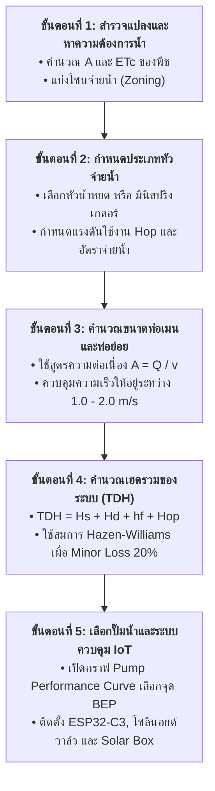

# คู่มือสรุปสูตรการคำนวณวิศวกรรมระบบน้ำอัจฉริยะ (Module 3)
**Smart Agri-Irrigation Hydraulics & IoT Sizing Formulas**  
*หลักสูตร: นวัตกรเกษตรอัจฉริยะ AIoT สำหรับเกษตรแม่นยำ รุ่นที่ 1*  
*วิทยาลัยการศึกษาตลอดชีวิต มหาวิทยาลัยเชียงใหม่ ร่วมกับ สำนักงานคณะกรรมการส่งเสริมการลงทุน (BOI)*  
*วิทยากรผู้สอน: ผู้ช่วยศาสตราจารย์ ดร.กัมพล วรดิษฐ์ (ภาควิชาวิศวกรรมคอมพิวเตอร์ คณะวิศวกรรมศาสตร์ มช.)*

---

## 📑 สารบัญเอกสาร
1. [สรุปสูตรคำนวณหลักแบบแยกเป็นข้อๆ (Detailed Formula Breakdown)](#1-สรุปสูตรคำนวณหลักแบบแยกเป็นข้อๆ)
   * 1.1 [สูตรคำนวณความต้องการน้ำและอัตราการไหล ($Q$)](#11-สูตรคำนวณความต้องการน้ำและอัตราการไหล-q)
   * 1.2 [สูตรคำนวณขนาดหน้าตัดท่อและความเร็วการไหล ($v$)](#12-สูตรคำนวณขนาดหน้าตัดท่อและความเร็วการไหล-v)
   * 1.3 [สูตรคำนวณแรงดันสูญเสียจากแรงเสียดทานในท่อ ($h_f$ - Hazen-Williams)](#13-สูตรคำนวณแรงดันสูญเสียจากแรงเสียดทานในท่อ-h_f---hazen-williams)
   * 1.4 [สูตรคำนวณเฮดรวมของระบบปั๊มน้ำ ($TDH$)](#14-สูตรคำนวณเฮดรวมของระบบปั๊มน้ำ-tdh)
   * 1.5 [สูตรคำนวณกำลังมอเตอร์ปั๊มน้ำ ($P$)](#15-สูตรคำนวณกำลังมอเตอร์ปั๊มน้ำ-p)
   * 1.6 [สูตรคำนวณการแบ่งโซนควบคุมให้น้ำ ($N_{zone}$)](#16-สูตรคำนวณการแบ่งโซนควบคุมให้น้ำ-n_zone)
2. [ตารางสรุปสูตร ตัวแปร หน่วย และข้อแนะนำวิศวกรรม (Engineering Summary Table)](#2-ตารางสรุปสูตร-ตัวแปร-หน่วย-และข้อแนะนำวิศวกรรม)
3. [ตารางค่าคงที่และพารามิเตอร์อ้างอิง (Reference Parameters & Constants)](#3-ตารางค่าคงที่และพารามิเตอร์อ้างอิง)
   * 3.1 [ค่าสัมประสิทธิ์ความเรียบผิวท่อ ($C$)](#31-ค่าสัมประสิทธิ์ความเรียบผิวท่อ-c-hazen-williams-coefficient)
   * 3.2 [เกณฑ์ความเร็วของน้ำในท่อ ($v$)](#32-เกณฑ์ความเร็วของน้ำในท่อ-flow-velocity-guidelines)
   * 3.3 [แรงดันใช้งานของหัวจ่ายน้ำแต่ละประเภท ($H_{op}$)](#33-แรงดันใช้งานของหัวจ่ายน้ำแต่ละประเภท-operating-pressure)
4. [ตัวอย่างโจทย์คำนวณจริงทีละขั้นตอน (Step-by-Step Worked Example)](#4-ตัวอย่างโจทย์คำนวณจริงทีละขั้นตอน)
5. [การคำนวณระบบพลังงานโซลาร์และแบตเตอรี่สำหรับ IoT Node (Solar Power Sizing)](#5-การคำนวณระบบพลังงานโซลาร์และแบตเตอรี่สำหรับ-iot-node)
   * 5.1 [การคำนวณพลังงานที่โหนด IoT ใช้ต่อวัน](#51-การคำนวณพลังงานที่โหนด-iot-ใช้ต่อวัน-daily-energy-consumption)
   * 5.2 [การเลือกขนาดแบตเตอรี่ LiFePO4](#52-การเลือกขนาดแบตเตอรี่-battery-sizing)
   * 5.3 [การเลือกขนาดแผงโซลาร์เซลล์](#53-การเลือกขนาดแผงโซลาร์เซลล์-solar-panel-sizing)
   * 5.4 [แนวปฏิบัติวิศวกรรมไฟฟ้าและโซลาร์เซลล์ในแปลงเกษตร (Field Wiring & Solar Best Practices)](#54-แนวปฏิบัติวิศวกรรมไฟฟ้าและโซลาร์เซลล์ในแปลงเกษตร-field-wiring--solar-best-practices)
6. [ขั้นตอนการออกแบบระบบ 5 ขั้นตอน (5-Step Design Workflow)](#6-ขั้นตอนการออกแบบระบบ-5-ขั้นตอน)

---

## 1. สรุปสูตรคำนวณหลักแบบแยกเป็นข้อๆ

### 1.1 สูตรคำนวณความต้องการน้ำและอัตราการไหล ($Q$)
ใช้สำหรับหาปริมาณน้ำสูงสุดที่แปลงเพาะปลูกต้องการต่อวัน (*Peak Crop Water Demand*) เพื่อนำไปกำหนดอัตราการจ่ายน้ำรวมของปั๊มและระบบท่อ

$$\mathbf{Q = \frac{A \times ET_c}{T \times Eff}}$$

* **คำอธิบายตัวแปรและหน่วย:**
  * $\mathbf{Q}$: อัตราการไหลที่ต้องการ (*Flow Rate*) หน่วยเป็น **$\text{m}^3/\text{hr}$** (ลูกบาศก์เมตรต่อชั่วโมง) หรือ **$\text{L/min}$** (ลิตรต่อนาที)
  * $\mathbf{A}$: พื้นที่เพาะปลูกรวม (*Cultivated Area*) หน่วยเป็น **$\text{m}^2$** (ตารางเมตร)
    * *การแปลงหน่วยพื้นที่ไทย:* $1\text{ ไร่} = 1,600\text{ m}^2$, $1\text{ งาน} = 400\text{ m}^2$
  * $\mathbf{ET_c}$: อัตราการคายระเหยน้ำของพืช (*Crop Evapotranspiration*) หน่วยเป็น **$\text{mm/day}$** (มิลลิเมตรต่อวัน)
    * คำนวณจาก $ET_c = K_c \times ET_0$ ($K_c$ คือสัมประสิทธิ์พืช, $ET_0$ คืออัตราการคายน้ำอ้างอิง)
    * *หมายเหตุการแปลงปริมาตรน้ำ:* น้ำสูง $1\text{ mm} = 1\text{ L/m}^2 = 0.001\text{ m}^3/\text{m}^2$
  * $\mathbf{T}$: ระยะเวลาที่กำหนดให้เปิดน้ำในแต่ละวัน (*Irrigation Operation Time*) หน่วยเป็น **$\text{hr/day}$** (ชั่วโมงต่อวัน)
  * $\mathbf{Eff}$: ประสิทธิภาพของระบบให้น้ำ (*Application Efficiency*) เป็นค่าไร้หน่วย ($0.0 - 1.0$)
    * ระบบน้ำหยด (Drip Irrigation): $Eff \approx 0.90$ ($90\%$)
    * ระบบมินิสปริงเกลอร์ (Micro-sprinkler): $Eff \approx 0.80 - 0.85$ ($80 - 85\%$)
    * ระบบสปริงเกลอร์ทั่วไป (Overhead Sprinkler): $Eff \approx 0.70 - 0.75$ ($70 - 75\%$)

---

### 1.2 สูตรคำนวณขนาดหน้าตัดท่อและความเร็วการไหล ($v$)
ใช้กฎความต่อเนื่องของการไหล (*Continuity Equation*) เพื่อเลือกขนาดเส้นผ่านศูนย์กลางภายในของท่อเมนและท่อย่อย ไม่ให้น้ำไหลเร็วเกินไปจนเกิดแรงกระแทกค้อนน้ำ (*Water Hammer*) หรือช้าเกินไปจนท่อมีขนาดใหญ่เกินความจำเป็น

$$\mathbf{Q = A_{pipe} \times v = \frac{\pi \times d^2}{4} \times v}$$

แปลงสูตรเพื่อหาความเร็วการไหล ($\mathbf{v}$):

$$\mathbf{v = \frac{4 \times Q}{\pi \times d^2}}$$

แปลงสูตรเพื่อหาขนาดเส้นผ่านศูนย์กลางภายในท่อ ($\mathbf{d}$):

$$\mathbf{d = \sqrt{\frac{4 \times Q}{\pi \times v}}}$$

* **คำอธิบายตัวแปรและหน่วย:**
  * $\mathbf{v}$: ความเร็วเฉลี่ยของน้ำในท่อ (*Velocity*) หน่วยเป็น **$\text{m/s}$** (เมตรต่อวินาที)
  * $\mathbf{Q}$: อัตราการไหล หน่วยเป็น **$\text{m}^3/\text{s}$** *(ต้องแปลงจาก $\text{m}^3/\text{hr}$ โดยหารด้วย 3,600)*
  * $\mathbf{d}$: เส้นผ่านศูนย์กลางภายในของท่อ (*Inner Diameter*) หน่วยเป็น **$\text{m}$** (เมตร)
  * $\mathbf{A_{pipe}}$: พื้นที่หน้าตัดภายในท่อ หน่วยเป็น **$\text{m}^2$**

---

### 1.3 สูตรคำนวณแรงดันสูญเสียจากแรงเสียดทานในท่อ ($h_f$ - Hazen-Williams)
เมื่อน้ำไหลผ่านท่อ ความหนืดของน้ำและผิวสัมผัสท่อจะทำให้เกิดแรงเสียดทาน ส่งผลให้แรงดันปลายท่อลดลง สามารถคำนวณได้แม่นยำด้วยสมการ **Hazen-Williams Equation**:

$$\mathbf{h_f = \frac{10.67 \times L \times Q^{1.852}}{C^{1.852} \times D^{4.87}}}$$

* **คำอธิบายตัวแปรและหน่วย:**
  * $\mathbf{h_f}$: การสูญเสียเฮดจากแรงเสียดทาน (*Friction Head Loss*) หน่วยเป็น **$\text{m}$** (เมตรน้ำ)
  * $\mathbf{L}$: ความยาวท่อตรงรวม (*Pipe Length*) หน่วยเป็น **$\text{m}$** (เมตร)
  * $\mathbf{Q}$: อัตราการไหลของน้ำ หน่วยเป็น **$\text{m}^3/\text{s}$**
  * $\mathbf{D}$: เส้นผ่านศูนย์กลางภายในท่อ หน่วยเป็น **$\text{m}$**
  * $\mathbf{C}$: ค่าสัมประสิทธิ์ความเรียบผิวท่อ (*Hazen-Williams Roughness Coefficient*) เป็นค่าไร้หน่วย (ท่อ PVC/PE มีค่า $140 - 150$)
* **การเผื่อความสูญเสียเฉพาะจุด (Minor Losses):**
  * น้ำไหลผ่านข้องอ สามทาง วาล์ว ข้อลด ข้อต่อ และกรองน้ำ จะเกิด Minor Loss
  * **กฎเชิงปฏิบัติ (Rule of Thumb):** ให้เผื่อ Minor Loss เพิ่มอีก **$10\% - 20\%$** ของ $h_f$ ท่อตรง:
    $$\mathbf{h_{f,\text{total}} = (1.10 \sim 1.20) \times h_f}$$

---

### 1.4 สูตรคำนวณเฮดรวมของระบบปั๊มน้ำ ($TDH$)
พลังงานแรงดันทั้งหมดที่ปั๊มน้ำต้องสร้างขึ้น (*Total Dynamic Head*) เพื่อส่งน้ำจากแหล่งน้ำไปยังจุดจ่ายน้ำปลายทางที่อยู่สูงสุดและไกลสุดได้อย่างมีแรงดันเพียงพอตามสเปกหัวจ่าย

$$\mathbf{TDH = H_s + H_d + h_{f,\text{total}} + H_{op}}$$

* **คำอธิบายองค์ประกอบ 4 ส่วนของ TDH:**
  1. $\mathbf{H_s}$ (**Static Suction Head**): ระยะความสูงในแนวดิ่งจากระดับผิวน้ำถึงกึ่งกลางใบพัดปั๊ม (เมตร)
  2. $\mathbf{H_d}$ (**Static Discharge Head**): ระยะความสูงในแนวดิ่งจากกึ่งกลางปั๊มถึงจุดปล่อยน้ำที่สูงที่สุดในแปลง (เมตร)
  3. $\mathbf{h_{f,\text{total}}}$ (**Total Friction Loss**): ผลรวมแรงดันสูญเสียในท่อดูด ท่อส่ง ข้อต่อ ข้องอ และวาล์วทั้งหมด (เมตร)
  4. $\mathbf{H_{op}}$ (**Operating Pressure Head**): แรงดันใช้งานที่หัวสปริงเกลอร์หรือหัวน้ำหยดต้องการ ณ ปลายสาย (เมตร)
     * *การแปลงหน่วยแรงดัน:* $1.0\text{ bar} \approx 10.0\text{ m of water} \approx 14.5\text{ psi}$

---

### 1.5 สูตรคำนวณกำลังมอเตอร์ปั๊มน้ำ ($P$)
ใช้สำหรับหาขนาดกำลังวัตต์ (kW) หรือแรงม้า (HP) ของมอเตอร์ไฟฟ้าที่ต้องใช้ขับปั๊มน้ำ

* **สูตรคำนวณหากใช้ $Q$ ในหน่วย $\text{m}^3/\text{hr}$:**

$$\mathbf{P_{kW} = \frac{\rho \times g \times Q \times TDH}{3600 \times \eta \times 1000} = \frac{9.81 \times Q \times TDH}{3600 \times \eta}}$$

* **สูตรแปลงเป็นแรงม้า (Horsepower - HP):**

$$\mathbf{P_{HP} = \frac{P_{kW}}{0.746}}$$

* **คำอธิบายตัวแปรและค่าคงที่:**
  * $\mathbf{P_{kW}}$: กำลังไฟฟ้าของมอเตอร์ หน่วยเป็น **$\text{kW}$** (กิโลวัตต์)
  * $\mathbf{P_{HP}}$: กำลังของมอเตอร์ หน่วยเป็น **$\text{HP}$** (แรงม้า)
  * $\mathbf{\rho}$: ความหนาแน่นของน้ำบริสุทธิ์ $= 1,000\text{ kg/m}^3$
  * $\mathbf{g}$: ความเร่งเนื่องจากแรงโน้มถ่วงของโลก $= 9.81\text{ m/s}^2$
  * $\mathbf{Q}$: อัตราการไหลรวมของปั๊ม หน่วยเป็น $\text{m}^3/\text{hr}$
  * $\mathbf{TDH}$: เฮดรวมของระบบ หน่วยเป็นเมตร ($\text{m}$)
  * $\mathbf{\eta}$: ประสิทธิภาพรวมของปั๊มและมอเตอร์ (*Overall Pump & Motor Efficiency*) อยู่ในช่วง **$0.60 - 0.75$** ($60\% - 75\%$)
  * **Service Factor (เผื่อกำลังสำรอง):** ควรเผื่อขนาดมอเตอร์เพิ่มอีก **$15\% - 20\%$** ($P_{\text{select}} = 1.15 \sim 1.20 \times P_{\text{calc}}$) เพื่อป้องกันมอเตอร์โอเวอร์โหลดขณะสตาร์ตและใช้งานต่อเนื่อง

---

### 1.6 สูตรคำนวณการแบ่งโซนควบคุมให้น้ำ ($N_{zone}$)
การให้น้ำทั้งแปลงพร้อมกันในคราวเดียวต้องใช้ปั๊มน้ำและท่อเมนขนาดมหึมา การแบ่งแปลงออกเป็นหลายโซนแล้วใช้โซลินอยด์วาล์วสลับรดทีละโซน จะช่วยลดขนาดปั๊มและท่อลงได้อย่างมหาศาล

$$\mathbf{Q_{pump} = \frac{Q_{total}}{N_{zone}}}$$

$$\mathbf{T_{total} = N_{zone} \times T_{zone}}$$

* เมื่อ $N_{zone}$ คือจำนวนโซน, $T_{zone}$ คือเวลาให้น้ำต่อโซน ($T_{total}$ ต้องไม่เกินเวลาที่สามารถให้น้ำได้ต่อวัน)

---

## 2. ตารางสรุปสูตร ตัวแปร หน่วย และข้อแนะนำวิศวกรรม

| ลำดับ | หัวข้อการคำนวณ | สูตรคณิตศาสตร์ / ความสัมพันธ์ | หน่วยของตัวแปร | ข้อแนะนำและเกณฑ์การออกแบบทางวิศวกรรม |
| :---: | :--- | :--- | :---: | :--- |
| **1** | **อัตราการไหลที่ต้องการ ($Q$)** | $$Q = \frac{A \times ET_c}{T \times Eff}$$ | $Q$: $\text{m}^3/\text{hr}$ หรือ $\text{L/min}$ $A$: $\text{m}^2$, $ET_c$: $\text{mm/day}$ $T$: $\text{hr/day}$, $Eff$: ไร้หน่วย | คำนวณจากช่วงพีคสูงสุดในฤดูแล้ง ระบบน้ำหยด $Eff=0.9$, สปริงเกลอร์ $Eff=0.75$ |
| **2** | **ความเร็วการไหลในท่อ ($v$)** | $$v = \frac{4 \times Q}{\pi \times d^2}$$ | $v$: $\text{m/s}$ $Q$: $\text{m}^3/\text{s}$ $d$: $\text{m}$ (เส้นผ่านศูนย์กลางใน) | ควบคุมให้อยู่ระหว่าง **$1.0 - 2.0\text{ m/s}$** ถ้าเกิน $2.5\text{ m/s}$ เสี่ยง Water Hammer และแรงดันตก |
| **3** | **ขนาดท่อภายใน ($d$)** | $$d = \sqrt{\frac{4 \times Q}{\pi \times v}}$$ | $d$: $\text{m}$ (หรือแปลงเป็น $\text{mm}$) $Q$: $\text{m}^3/\text{s}$, $v$: $\text{m/s}$ | ใช้เลือกขนาดท่อ PVC Class 8.5/13.5 หรือ PE PN6/PN10 ตามท้องตลาด |
| **4** | **แรงดันสูญเสียในท่อ ($h_f$)** | $$h_f = \frac{10.67 \cdot L \cdot Q^{1.852}}{C^{1.852} \cdot D^{4.87}}$$ | $h_f$: $\text{m}$ (เมตรน้ำ) $L$: $\text{m}$, $Q$: $\text{m}^3/\text{s}$ $D$: $\text{m}$, $C$: ไร้หน่วย | สูตร Hazen-Williams ท่อ PVC/PE ใช้ $C=140-150$ ให้บวกเผื่อ Minor Loss อีก **$10-20\%$** |
| **5** | **เฮดรวมของระบบ ($TDH$)** | $$TDH = H_s + H_d + h_{f,\text{total}} + H_{op}$$ | ทุกพจน์มีหน่วยเป็น **$\text{m}$** ($1\text{ bar} \approx 10\text{ m}$) | นำคู่ลำดับ $(Q, TDH)$ ไปเปิดดูกราฟ **Pump Performance Curve** เพื่อเลือกจุด BEP |
| **6** | **กำลังมอเตอร์ปั๊ม ($P_{kW}$)** | $$P_{kW} = \frac{9.81 \times Q \times TDH}{3600 \times \eta}$$ | $P$: $\text{kW}$ $Q$: $\text{m}^3/\text{hr}$ $TDH$: $\text{m}$, $\eta \approx 0.65$ | ประสิทธิภาพปั๊มหอยโข่ง $\eta \approx 0.60-0.75$ เผื่อ Safety Factor มอเตอร์อีก **$15-20\%$** |
| **7** | **กำลังมอเตอร์ในหน่วยแรงม้า ($HP$)** | $$P_{HP} = \frac{P_{kW}}{0.746}$$ | $P_{HP}$: แรงม้า ($\text{HP}$) | $1\text{ HP} \approx 746\text{ Watts}$ ใช้เทียบซื้อขนาดปั๊มในท้องตลาด (เช่น 1 HP, 2 HP, 3 HP) |
| **8** | **การแบ่งโซนควบคุม ($Q_{zone}$)** | $$Q_{zone} = \frac{Q_{total}}{N_{zone}}$$ | $Q$: $\text{m}^3/\text{hr}$ $N_{zone}$: จำนวนโซน | ช่วยลดขนาดปั๊มน้ำ ลดขนาดท่อเมน และลดต้นทุนรวมของระบบลงได้มากกว่า $40-50\%$ |

---

## 3. ตารางค่าคงที่และพารามิเตอร์อ้างอิง

### 3.1 ค่าสัมประสิทธิ์ความเรียบผิวท่อ ($C$ - Hazen-Williams Coefficient)
ค่า $C$ ยิ่งสูง ผิวท่อยิ่งเรียบ เกิดแรงเสียดทานน้อย และสูญเสียแรงดันในระบบน้อย

| ประเภทของวัสดุท่อ | ค่าสัมประสิทธิ์ $C$ | คุณลักษณะและการนำไปใช้งานในฟาร์ม |
| :--- | :---: | :--- |
| **ท่อพีวีซีแข็ง (uPVC Class 8.5 / 13.5)** | **$140 - 150$** | นิยมใช้มากที่สุดในแปลงเกษตร ผิวเรียบมาก ทนแรงดันได้ดี ราคาประหยัด |
| **ท่อโพลีเอทิลีน (HDPE / LDPE)** | **$140 - 150$** | ผิวเรียบ เหนียว ยืดหยุ่น ทนรังสี UV นิยมใช้เป็นท่อย่อยและสายน้ำหยด |
| **ท่อทองแดง / ท่อสเตนเลส** | **$130 - 150$** | ผิวเรียบมาก ความทนทานสูง นิยมใช้ในระบบปุ๋ยเคมีเข้มข้นหรือโรงเรือนปิด |
| **ท่อเหล็กอาบสังกะสี (Galvanized Iron - GI)** | **$120$** | แข็งแรงทนทาน ทนแรงกระแทกภายนอกได้ดี ผิวสากกว่า PVC เล็กน้อย |
| **ท่อเหล็กหล่อใหม่ (Cast Iron - New)** | **$120 - 130$** | ใช้ในงานชลประทานขนาดใหญ่ |
| **ท่อเหล็กหล่อเก่ามีสนิม (Cast Iron - Old)** | **$80 - 100$** | ผิวขรุขระ มีตะกรันสนิมเกาะ แรงเสียดทานสูงมาก |

---

### 3.2 เกณฑ์ความเร็วของน้ำในท่อ (Flow Velocity Guidelines)

| ช่วงความเร็ว ($v$) | สถานะ | ผลกระทบต่อระบบวิศวกรรมท่อ |
| :---: | :---: | :--- |
| **$< 0.5\text{ m/s}$** | ❌ ช้าเกินไป | ตะกอนและสารแขวนลอยตกค้างในท่อ, ท่อมีขนาดใหญ่เกินความจำเป็น ทำให้สิ้นเปลืองต้นทุนค่าท่อสูงเกินจริง |
| **$0.5 - 1.0\text{ m/s}$** | ⚠️ ปานกลางค่อนข้างต่ำ | เหมาะสำหรับท่อทางดูดของปั๊มน้ำ (Suction Pipe) เพื่อป้องกันการเกิดโพรงไอ (*Cavitation*) |
| **$1.0 - 2.0\text{ m/s}$** | ✅ **ช่วงที่เหมาะสมที่สุด (Optimal Range)** | **จุดสมดุลระหว่างต้นทุนค่าท่อและการสูญเสียแรงดัน (Head Loss ต่ำ)** เป็นเกณฑ์มาตรฐานสำหรับท่อเมนและท่อแยก |
| **$2.0 - 2.5\text{ m/s}$** | ⚠️ ยอมรับได้ในท่อสั้นๆ | ยอมรับได้เฉพาะท่อช่วงสั้นๆ แต่ต้องระวังแรงดันตกคร่อม |
| **$> 2.5\text{ m/s}$** | ❌ เร็วเกินไป (อันตราย) | เกิดแรงเสียดทานสูงมาก สิ้นเปลืองพลังงานปั๊ม และเสี่ยงต่อ **Water Hammer** ที่ทำให้ท่อแตกหรือข้อต่อหลุดเมื่อวาล์วปิดกะทันหัน |

---

### 3.3 แรงดันใช้งานของหัวจ่ายน้ำแต่ละประเภท ($H_{op}$)

| ประเภทหัวจ่ายน้ำ | แรงดันใช้งานที่เหมาะสม ($\text{bar}$) | เฮดแรงดันใช้งาน ($H_{op}$ หน่วยเมตร) | อัตราจ่ายน้ำต่อหัว | ลักษณะการประยุกต์ใช้ |
| :--- | :---: | :---: | :---: | :--- |
| **เทปน้ำหยด / หัวหยด (Drip Emitter)** | $0.8 - 1.5\text{ bar}$ | **$8 - 15\text{ m}$** | $1 - 4\text{ L/hr}$ | แปลงพืชผัก, แตงโม, สวนกล้วย, ไม้กระถาง ประหยัดน้ำสูงสุด |
| **มินิสปริงเกลอร์ (Micro-Sprinkler)** | $1.5 - 2.5\text{ bar}$ | **$15 - 25\text{ m}$** | $30 - 150\text{ L/hr}$ | สวนทุเรียน, สวนส้ม, ลำไย, ผักสลัดในโรงเรือน |
| **สปริงเกลอร์หมุน (Impact Sprinkler)** | $2.5 - 4.0\text{ bar}$ | **$25 - 40\text{ m}$** | $500 - 2,500\text{ L/hr}$ | พืชไร่, ไร่ข้าวโพด, ไร่อ้อย, สนามหญ้า รัศมีการกระจายกว้าง |
| **หัวพ่นหมอกลดความร้อน (Misting / Fogger)** | $3.0 - 6.0\text{ bar}$ | **$30 - 60\text{ m}$** | $5 - 20\text{ L/hr}$ | โรงเรือนเพาะเห็ด, โรงเรือนกล้วยไม้, ฟาร์มปศุสัตว์ |

---

## 4. ตัวอย่างโจทย์คำนวณจริงทีละขั้นตอน (Step-by-Step Worked Example)

### 📌 ข้อมูลโจทย์:
ต้องการออกแบบระบบรดน้ำอัจฉริยะสำหรับ **สวนทุเรียน 5 ไร่** ด้วยระบบมินิสปริงเกลอร์ โดยมีรายละเอียดดังนี้:
* พื้นที่เพาะปลูก: $A = 5\text{ ไร่} = 5 \times 1,600 = 8,000\text{ m}^2$
* อัตราการคายน้ำสูงสุดของทุเรียน: $ET_c = 6\text{ mm/day}$
* ประสิทธิภาพระบบมินิสปริงเกลอร์: $Eff = 0.80$ ($80\%$)
* กำหนดเวลาให้น้ำต่อวัน: $T = 2\text{ ชั่วโมง/วัน}$
* แบ่งการรดน้ำออกเป็น **4 โซน** สลับกันรดด้วยโซลินอยด์วาล์ว โซนละ 30 นาที ($T_{zone} = 0.5\text{ hr}$)
* ความยาวท่อเมน PVC จากปั๊มถึงโซนไกลสุด: $L = 150\text{ m}$ ($C = 140$)
* ความสูงระดับผิวน้ำถึงปั๊ม: $H_s = 3\text{ m}$
* ความสูงจากปั๊มถึงจุดสูงสุดของแปลง: $H_d = 5\text{ m}$
* มินิสปริงเกลอร์ต้องการแรงดันใช้งาน: $2.0\text{ bar}$ ($H_{op} = 20\text{ m}$)

---

### ขั้นตอนการคำนวณ:

#### ขั้นที่ 1: คำนวณปริมาณน้ำรวมและอัตราการไหล ($Q$)
* ปริมาณน้ำรวมที่ต้องการต่อวัน:
  $$V_{total} = \frac{A \times ET_c}{Eff} = \frac{8,000\text{ m}^2 \times 0.006\text{ m}}{0.80} = 60\text{ m}^3/\text{day}$$
* แบ่งรด 4 โซน ปริมาณน้ำต่อโซน:
  $$V_{zone} = \frac{60}{4} = 15\text{ m}^3/\text{zone}$$
* รดโซนละ 30 นาที ($0.5\text{ hr}$) ดังนั้นอัตราการไหลของปั๊มต่อโซนคือ:
  $$Q = \frac{15\text{ m}^3}{0.5\text{ hr}} = \mathbf{30\text{ m}^3/\text{hr}} = \frac{30}{3,600} = \mathbf{0.00833\text{ m}^3/\text{s}}\text{ (หรือ } 500\text{ L/min)}$$

#### ขั้นที่ 2: คำนวณขนาดท่อเมน ($d$)
* กำหนดความเร็วในท่อเมนที่เหมาะสม $v = 1.5\text{ m/s}$:
  $$d = \sqrt{\frac{4 \times Q}{\pi \times v}} = \sqrt{\frac{4 \times 0.00833}{\pi \times 1.5}} = \sqrt{0.00707} \approx 0.0841\text{ m} = \mathbf{84.1\text{ mm}}$$
* **การเลือกท่อจริง:** เลือกใช้ท่อ **PVC ขนาด 3 นิ้ว** (เส้นผ่านศูนย์กลางภายในประมาณ $80 - 82\text{ mm}$)  
  ตรวจสอบความเร็วจริงในท่อ 3 นิ้ว ($d = 0.080\text{ m}$):
  $$v = \frac{4 \times 0.00833}{\pi \times (0.080)^2} = \mathbf{1.66\text{ m/s}}$$ *(ผ่านเกณฑ์มาตรฐาน $1.0 - 2.0\text{ m/s}$)*

#### ขั้นที่ 3: คำนวณการสูญเสียแรงดันในท่อ ($h_f$)
* ใช้สูตร Hazen-Williams ที่ $L = 150\text{ m}, Q = 0.00833\text{ m}^3/\text{s}, C = 140, D = 0.080\text{ m}$:
  $$h_f = \frac{10.67 \times 150 \times (0.00833)^{1.852}}{(140)^{1.852} \times (0.080)^{4.87}}$$
  * $(0.00833)^{1.852} \approx 0.000142$
  * $(140)^{1.852} \approx 9,335$
  * $(0.080)^{4.87} \approx 4.54 \times 10^{-6}$
  * $h_f \approx \frac{1600.5 \times 0.000142}{9335 \times 4.54 \times 10^{-6}} = \frac{0.2273}{0.04238} \approx \mathbf{5.36\text{ m}}$
* เผื่อ Minor Loss อีก $20\%$ (ข้อต่อ, วาล์ว, กรอง):
  $$h_{f,\text{total}} = 1.20 \times 5.36 = \mathbf{6.43\text{ m}}$$

#### ขั้นที่ 4: คำนวณเฮดรวมของระบบ ($TDH$)
$$TDH = H_s + H_d + h_{f,\text{total}} + H_{op}$$
$$TDH = 3\text{ m} + 5\text{ m} + 6.43\text{ m} + 20\text{ m} = \mathbf{34.43\text{ m}}$$

#### ขั้นที่ 5: คำนวณขนาดกำลังมอเตอร์ปั๊มน้ำ ($P$)
* ประสิทธิภาพปั๊มหอยโข่ง $\eta = 0.65$:
  $$P_{kW} = \frac{9.81 \times Q \times TDH}{3600 \times \eta} = \frac{9.81 \times 30 \times 34.43}{3600 \times 0.65} = \frac{10,133.5}{2,340} = \mathbf{4.33\text{ kW}}$$
* แปลงเป็นแรงม้า (HP):
  $$P_{HP} = \frac{4.33}{0.746} = \mathbf{5.80\text{ HP}}$$
* เผื่อ Service Factor $+15\%$:
  $$P_{\text{select}} = 5.80 \times 1.15 = \mathbf{6.67\text{ HP}}$$
* **สรุปการเลือกซื้อปั๊ม:** เลือก **ปั๊มหอยโข่งไฟฟ้าขนาด 7.5 แรงม้า (7.5 HP)** ที่มีจุดทำงาน (*Operating Point*) ที่ **$Q = 30\text{ m}^3/\text{hr}$ ที่ $TDH \ge 35\text{ m}$**

---

## 5. การคำนวณระบบพลังงานโซลาร์และแบตเตอรี่สำหรับ IoT Node

สำหรับโหนดเซนเซอร์และบอร์ดควบคุมวาล์วกลางแจ้ง (Outdoor ESP32-C3 Node) ที่ไม่มีไฟฟ้าบ้าน ต้องคำนวณขนาดแผงโซลาร์และแบตเตอรี่ให้สามารถทำงานได้ต่อเนื่อง 24 ชม. แม้ในวันที่ฟ้าครึ้มฝนตกติดต่อกัน (*Days of Autonomy*)

### 5.1 การคำนวณการใช้พลังงานของโหนด (Daily Energy Consumption)
* บอร์ด ESP32-C3 + DHT22 + รีเลย์:
  * ช่วง Active (อ่านค่า + สื่อสาร ESP-NOW): กระแส $80\text{ mA}$ ที่ $3.3\text{V}$ ($0.264\text{ W}$) วันละ $1\text{ ชม.}$ รวม $= 0.264\text{ Wh}$
  * ช่วง Deep Sleep / Standby: กระแส $5\text{ mA}$ ที่ $3.3\text{V}$ ($0.0165\text{ W}$) วันละ $23\text{ ชม.}$ รวม $= 0.380\text{ Wh}$
  * การเปิดโซลินอยด์วาล์ว $12\text{V}$ (กินไฟ $0.5\text{A} = 6\text{W}$) วันละ $0.5\text{ ชม.}$ รวม $= 3.0\text{ Wh}$
  * **พลังงานรวมที่ใช้ต่อวัน ($E_{day}$):** $\approx 3.65\text{ Wh/day}$ (คิดเผื่อ Loss ในวงจร $= \mathbf{5.0\text{ Wh/day}}$)

### 5.2 การเลือกขนาดแบตเตอรี่ (Battery Sizing)
* ใช้แบตเตอรี่ **LiFePO4 (ลิเธียมฟอสเฟต)** แรงดัน $3.2\text{V}$ (ปลอดภัย ไม่ระเบิด ทนแดด อายุการใช้งาน $> 2,000$ รอบ):
* สำรองไฟเผื่อฝนตก $3\text{ วัน}$ ($Autonomy = 3$) และ Depth of Discharge ($DoD = 80\%$):
  $$Capacity_{\text{Wh}} = \frac{E_{day} \times 3}{0.80} = \frac{5.0 \times 3}{0.80} = 18.75\text{ Wh}$$
  $$Capacity_{\text{Ah}} = \frac{18.75\text{ Wh}}{3.2\text{ V}} \approx \mathbf{5.86\text{ Ah}}$$
* **อุปกรณ์ที่เลือกใช้ตามสไลด์ Module 3:**
  * แบตเตอรี่: **LiFePO4 32650 3.2V ขนาด 6.0 - 6.5 Ah** จำนวน 1 ก้อน
  * แผ่นป้องกันแบตเตอรี่: **1S BMS LiFePO4 3.2V 12A**

### 5.3 การเลือกขนาดแผงโซลาร์เซลล์ (Solar Panel Sizing)
* แดดเฉลี่ยต่อวัน (*Peak Sun Hours*): $4.5\text{ ชั่วโมง/วัน}$
* ประสิทธิภาพการชาร์จรวม: $70\%$ ($0.70$)
  $$P_{\text{solar}} = \frac{E_{day}}{4.5 \times 0.70} = \frac{5.0}{3.15} \approx 1.59\text{ W}$$
* **อุปกรณ์ที่เลือกใช้ตามสไลด์ Module 3:**
  * เพื่อให้สามารถชาร์จแบตเตอรี่เต็มเร็วและมีพลังงานเพียงพอแม้ในฤดูฝน แนะนำใช้แผงโซลาร์เซลล์ขนาด **12V 15W - 30W**
  * ร่วมกับโมดูลชาร์จ **XL4015 5A MPPT Buck Converter** และสเต็ปดาวน์ **TPS63020 Buck-Boost Converter** จ่ายไฟนิ่ง $3.3\text{V}$ ให้บอร์ด ESP32-C3

### 5.4 แนวปฏิบัติวิศวกรรมไฟฟ้าและโซลาร์เซลล์ในแปลงเกษตร (Field Wiring & Solar Best Practices)

#### 5.4.1 การเลือกสายไฟสำหรับร้อยท่อฝังดินเดินไปยังปั๊มน้ำ
* **ชนิดสายไฟที่ถูกต้อง:** ใช้ **สาย NYY หรือ NYY-G (มีสายดิน)**
* **คุณสมบัติ:** เปลือกและฉนวน PVC 2 ชั้น หนาพิเศษ ทนความชื้นสูง ทนกรด-ด่างในดิน และป้องกันแรงกดทับของดินได้อย่างสมบูรณ์
* *(ข้อห้าม: ห้ามใช้สาย VAF ในการร้อยท่อฝังดินเด็ดขาด)*

#### 5.4.2 การติดตั้งและวางทิศทางแผงโซลาร์เซลล์ในประเทศไทย
* **ทิศทางการหันหน้าแผง:** **หันหน้าไปทาง "ทิศใต้ (True South)"** เนื่องจากประเทศไทยตั้งอยู่เหนือเส้นศูนย์สูตร (ละติจูด 5°–20° N) ดวงอาทิตย์จะโคจรอ้อมไปทางทิศใต้เป็นเวลา 8–9 เดือนของปี
* **มุมเอียงของแผง (Tilt Angle):** ทำมุมเอียง **$10^\circ - 15^\circ$** กับพื้นราบ เพื่อให้รับแสงอาทิตย์เฉลี่ยสูงสุดทั้งปี และช่วยให้น้ำฝนชะล้างฝุ่นละออง/คราบสกปรกออกจากหน้าแผงได้เองตามธรรมชาติ (*Self-cleaning*)

#### 5.4.3 การเปรียบเทียบแผง Monocrystalline vs Polycrystalline
* **แผง Monocrystalline (โมโน):** ประสิทธิภาพสูงกว่า ($20-24\%$) ประหยัดพื้นที่ติดตั้ง ทำงานได้ดีในที่แสงน้อยและทนความร้อนได้ดีกว่า แต่ราคาสูงกว่า
* **แผง Polycrystalline (โพลี):** มีข้อได้เปรียบเด่นคือ **"ราคาถูกกว่าและต้นทุนการผลิตต่ำกว่า"** กระบวนการหลอมขึ้นรูปไม่ซับซ้อน เกิดของเสียน้อย จึงคุ้มค่ามากสำหรับฟาร์มเกษตรที่มีพื้นที่ติดตั้งกว้างขวางไม่จำกัด

#### 5.4.4 การปรับจูนโมดูลสเต็ปดาวน์ XL4015 (Buck Converter)
* **ปุ่มปรับ CV (Constant Voltage):** ใช้ปรับตั้งค่า **"แรงดันไฟฟ้าขาออกคงที่ (Output Voltage)"** ให้ตรงกับระดับแรงดันที่โหลดต้องการ (เช่น 5.0V สำหรับเลี้ยงบอร์ดคอนโทรลเลอร์ หรือ 3.65V สำหรับชาร์จแบตเตอรี่ LiFePO4 1S)
* **ปุ่มปรับ CC (Constant Current):** ใช้ปรับตั้งค่า **"ขีดจำกัดกระแสไฟฟ้าสูงสุด (Output Current Limit)"** เพื่อป้องกันกระแสชาร์จเกินหรือจำกัดกระแสโหลด

---

## 6. ขั้นตอนการออกแบบระบบ 5 ขั้นตอน (5-Step Design Workflow)

1. **ขั้นตอนที่ 1: สังเกตพื้นที่และคำนวณความต้องการน้ำ (Site Survey & Crop Demand):**
   * สำรวจขนาดแปลง ($A$), ชนิดพืช, ชนิดดิน, และอัตราการคายระเหยน้ำสูงสุด ($ET_c$)
   * วางแผนแบ่งโซนการจ่ายน้ำ ($N_{zone}$) ตามกำลังแหล่งน้ำและงบประมาณ
2. **ขั้นตอนที่ 2: เลือกประเภทหัวจ่ายน้ำ (Emitter Selection):**
   * เลือกระหว่างหัวน้ำหยด ($H_{op} \approx 10-15\text{ m}$) หรือมินิสปริงเกลอร์ ($H_{op} \approx 20\text{ m}$)
   * หาอัตราการจ่ายน้ำรวมของแต่ละโซน ($Q_{zone}$)
3. **ขั้นตอนที่ 3: คำนวณขนาดท่อส่งน้ำ (Pipe Sizing):**
   * ใช้กฎความต่อเนื่อง $Q = A \times v$
   * เลือกขนาดท่อที่ทำให้ความเร็ว $v$ อยู่ในช่วง **$1.0 - 2.0\text{ m/s}$**
4. **ขั้นตอนที่ 4: คำนวณเฮดรวมของระบบ (TDH Calculation):**
   * วัดความสูงด้านดูด ($H_s$), ความสูงด้านส่ง ($H_d$)
   * คำนวณแรงเสียดทานในท่อ ($h_f$) ด้วย Hazen-Williams และเผื่อ Minor Loss $10-20\%$
   * รวมเป็น $TDH = H_s + H_d + h_{f,\text{total}} + H_{op}$
5. **ขั้นตอนที่ 5: เลือกปั๊มน้ำและติดตั้งระบบควบคุมอัจฉริยะ (Pump & IoT Integration):**
   * นำ $(Q, TDH)$ ไปเปิดกราฟปั๊ม เลือกจุดทำงานที่ตรงกับ **Best Efficiency Point (BEP)**
   * ติดตั้งตู้ควบคุม IoT (ESP32-C3, โซลินอยด์วาล์วแยกโซน, เซนเซอร์สภาพแวดล้อม และระบบพลังงานโซลาร์เซลล์)

---

> 🔗 **ไฟล์ที่เกี่ยวข้องใน Module 3:**
> * 📄 [Module3.pdf](file:///Applications/XAMPP/xamppfiles/htdocs/cmu_aiot/module3/Module3.pdf) - เอกสารสไลด์บรรยายฉบับเต็ม
> * 🎬 [Module3_video.mp4](file:///Applications/XAMPP/xamppfiles/htdocs/cmu_aiot/module3/Module3_video.mp4) - ไฟล์วิดีโอบรรยายความคมชัดสูง 1080p (37:17 นาที)
> * 📝 [Module_3_lecture_transcript.txt](file:///Applications/XAMPP/xamppfiles/htdocs/cmu_aiot/module3/extracted_text/Module_3_lecture_transcript.txt) - บทถอดเสียงบรรยายภาษาไทยฉบับสมบูรณ์
> * 💻 [water_logger.py](file:///Applications/XAMPP/xamppfiles/htdocs/cmu_aiot/module3/src/water_logger.py) - สคริปต์ MicroPython บันทึกข้อมูลสภาพแวดล้อมและควบคุมการรดน้ำ
