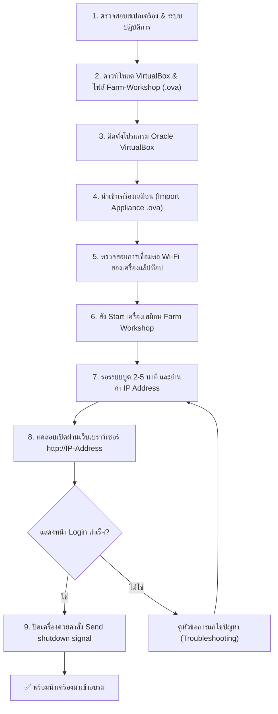

# 📖 คู่มือการติดตั้งและใช้งานเครื่องเสมือน Farm Workshop (Home Assistant)
### สำหรับผู้เริ่มต้นใช้งาน — โครงการอบรม IoT ในฟาร์มอัจฉริยะ (Smart Farm IoT)

---

## 📌 บทนำและวัตถุประสงค์

คู่มือฉบับนี้จัดทำขึ้นเพื่อให้ผู้เข้ารับการอบรมสามารถติดตั้งและเตรียมความพร้อมของระบบ **Home Assistant** ผ่านเครื่องเสมือน **Farm Workshop** บนแล็ปท็อปของตนเองได้อย่างถูกต้องเป็นขั้นตอน เพื่อให้พร้อมสำหรับการฝึกปฏิบัติต่ออุปกรณ์ IoT เซนเซอร์ และระบบควบคุมในวันอบรมจริง

> [!IMPORTANT]
> **ข้อกำหนดสำคัญก่อนวันอบรม:**
> * ต้องดำเนินการติดตั้งและทดสอบให้แล้วเสร็จจากที่บ้านก่อนเดินทางมาอบรม (ใช้เวลาประมาณ 20–30 นาที)
> * ไฟล์เครื่องเสมือนมีขนาดใหญ่ประมาณ **2.6 GB** ห้ามรอมาดาวน์โหลดที่สถานที่อบรม เนื่องจากความจุของเครือข่ายจะไม่เพียงพอหากดาวน์โหลดพร้อมกัน

---

## 💻 1. ข้อกำหนดของคอมพิวเตอร์ (System Requirements)

| รายการ | ความต้องการขั้นต่ำ | สเปกที่แนะนำ |
| :--- | :--- | :--- |
| **หน่วยความจำ (RAM)** | 8 GB ขึ้นไป | 16 GB ขึ้นไป |
| **พื้นที่ว่างบนดิสก์** | 20 GB ขึ้นไป | 30 GB ขึ้นไป (SSD) |
| **ระบบปฏิบัติการ** | Windows 10/11 (64-bit)<br>macOS (Intel หรือ Apple Silicon) | Windows 11 / macOS ล่าสุด |
| **อุปกรณ์ที่ไม่รองรับ** | ❌ Chromebook, iPad / Tablet, Windows ชิป ARM | — |

---

## 🗺️ 2. แผนผังขั้นตอนการทำงาน (Workflow Overview)



---

## 📥 3. แหล่งดาวน์โหลดโปรแกรมและไฟล์ (.ova)

โปรดเลือกลิงก์ดาวน์โหลดให้ตรงกับระบบปฏิบัติการของคอมพิวเตอร์ที่ท่านใช้งาน:

### 🪟 ก. สำหรับผู้ใช้ Windows (Intel / AMD 64-bit)
1. **โปรแกรม VirtualBox:** [ดาวน์โหลด VirtualBox for Windows Hosts](https://www.virtualbox.org/wiki/Downloads)
2. **ไฟล์เครื่องเสมือน:** [Farm-Workshop-win-1.2.ova (Google Drive)](https://drive.google.com/file/d/1DrX4O-jywvnCA0b4aqdQ3z9r7F2EkEf8/view?usp=sharing)
3. **โปรแกรมเสริม (กรณีติดตั้งแล้วเปิดไม่ขึ้น):** [Microsoft Visual C++ Redistributable (x64)](https://aka.ms/vs/17/release/vc_redist.x64.exe)

---

### 🍏 ข. สำหรับผู้ใช้ macOS ชิป Apple Silicon (M1 / M2 / M3 / M4)
> *วิธีตรวจเช็ก:* คลิกที่เมนู Apple () มุมซ้ายบน → เลือก **About This Mac** → ดูบรรทัด **Chip** หากขึ้นต้นด้วย Apple M1, M2, M3, M4 แสดงว่าเป็นรุ่นนี้
1. **โปรแกรม VirtualBox:** [ดาวน์โหลด VirtualBox 7.2+ for Apple Silicon](https://www.virtualbox.org/wiki/Downloads) *(เลือก macOS / Apple Silicon hosts)*
2. **ไฟล์เครื่องเสมือน:** [Farm-Workshop-arm64-1.2.ova (Google Drive Folder)](https://drive.google.com/drive/folders/1XiTigV52XVenZ8DhMZ6351dHOZvRHgMD)
   * *SHA256 Checksum:* `86a23d9e6c7b52928699ad25426c4e753aad8a0e739d5e77f2fe3f4c371450d0`

---

### 🍎 ค. สำหรับผู้ใช้ macOS ชิป Intel
1. **โปรแกรม VirtualBox:** [ดาวน์โหลด VirtualBox for macOS / Intel Hosts](https://www.virtualbox.org/wiki/Downloads)
2. **ไฟล์เครื่องเสมือน:** [Farm-Workshop-win-1.2.ova (Google Drive)](https://drive.google.com/file/d/1DrX4O-jywvnCA0b4aqdQ3z9r7F2EkEf8/view?usp=sharing)

---

## 🛠️ 4. ขั้นตอนการติดตั้งอย่างละเอียดทีละสเต็ป

### ขั้นตอนที่ 1: ติดตั้งโปรแกรม Oracle VirtualBox
1. ดับเบิลคลิกไฟล์ติดตั้ง VirtualBox ที่ดาวน์โหลดมา
   * **Windows:** ดับเบิลคลิกไฟล์ `.exe` → กด **Next** → **Yes** → **Install** จนจบกระบวนการ
   * **macOS:** ดับเบิลคลิกไฟล์ `.dmg` → ดับเบิลคลิกไอคอน **VirtualBox.pkg** → ทำตามขั้นตอนบนหน้าจอ ป้อนรหัสผ่านเครื่องหรือแตะ Touch ID
2. เมื่อติดตั้งเสร็จ ให้เปิดโปรแกรม **Oracle VirtualBox** ขึ้นมา

---

### ขั้นตอนที่ 2: นำเข้าไฟล์เครื่องเสมือน (Import Appliance)
1. ในหน้าต่างโปรแกรม VirtualBox ให้ไปที่เมนูด้านบน:
   * **File** → **Import Appliance...** (หรือกดปุ่มลัด `Ctrl + I` บน Windows / `Cmd + I` บน Mac)
2. คลิกที่ไอคอนแฟ้มสีเหลือง แล้วเลือกไฟล์ `.ova` ที่ดาวน์โหลดไว้:
   * สำหรับ Windows หรือ Mac Intel: เลือก `Farm-Workshop-win-1.2.ova`
   * สำหรับ Mac Apple Silicon: เลือก `Farm-Workshop-arm64-1.2.ova`
3. กดปุ่ม **Next** (ถัดไป)
4. จะปรากฏหน้าจอสรุปการตั้งค่าของเครื่องเสมือน (Appliance Settings):
   * ชื่อเครื่อง: `Farm Workshop`
   * CPU: `2 Core`
   * RAM: `2048 MB`
   * *ไม่ต้องแก้ไขค่าใด ๆ ให้ใช้ค่าเริ่มต้นตามที่กำหนดไว้*
5. กดปุ่ม **Finish** (หรือ **Import**)
6. รอแถบแสดงสถานะทำงานจนครบ 100% (ใช้เวลาประมาณ 1–3 นาที) เมื่อเสร็จสิ้นจะปรากฏชื่อเครื่อง **Farm Workshop** ทางฝั่งซ้ายของโปรแกรม

---

### ขั้นตอนที่ 3: ตรวจสอบการตั้งค่าการเชื่อมต่อเครือข่าย (Network Bridge)
เพื่อให้เครื่องเสมือนสามารถรับหมายเลข IP ในวงเดียวกับแล็ปท็อปและสมาร์ตโฟนได้:
1. คลิกขวาที่ชื่อเครื่อง **Farm Workshop** → เลือก **Settings** (การตั้งค่า)
2. เลือกแถบหัวข้อ **Network** (เครือข่าย)
3. ตรวจสอบที่ **Adapter 1**:
   * **Enable Network Adapter:** ต้องถูกติ๊กถูก ✅
   * **Attached to:** เลือกเป็น **Bridged Adapter**
   * **Name:** ตรวจสอบว่าเลือกการ์ด Wi-Fi ที่เรากำลังใช้งานอยู่ (เช่น บน Mac คือ `en0: Wi-Fi` หรือบน Windows คือ `Wi-Fi / Wireless Network Adapter`)
4. กดปุ่ม **OK**

---

### ขั้นตอนที่ 4: การเปิดเครื่องเสมือนและการตรวจสอบความพร้อม (First Boot)

> [!WARNING]
> **สำคัญมาก:** แล็ปท็อปของท่านต้องเชื่อมต่อเข้ากับเครือข่าย Wi-Fi ให้เรียบร้อย **ก่อนที่จะกดเปิดเครื่องเสมือน** เสมอ

1. คลิกเลือกเครื่อง **Farm Workshop** ในโปรแกรม VirtualBox
2. กดปุ่ม **Start** (ไอคอนรูปลูกศรสีเขียว)
3. หน้าต่างคอนโซลสีดำจะปรากฏขึ้นมาระหว่างที่ระบบปฏิบัติการกำลังบูต
4. **รอประมาณ 2–5 นาที** ระบบจะทำการโหลดบริการและรับหมายเลข IP อัตโนมัติ
5. เมื่อระบบพร้อมใช้งาน ให้สังเกตข้อความบนหน้าจอดำ:

```text
============================================================
Farm Workshop (Home Assistant OS)
============================================================

IPv4 addresses for enp0s3: 192.168.1.50/24    <-- (สำหรับ Windows / Mac Intel)
IPv4 addresses for enp0s8: 192.168.1.50/24    <-- (สำหรับ Mac Apple Silicon)

URL: http://192.168.1.50:8123  หรือ  http://192.168.1.50
============================================================
```

> [!NOTE]
> * ตัวเลข IP ในแต่ละสถานที่และแต่ละเครื่องจะไม่เหมือนกัน ให้นำ **ตัวเลขที่อยู่ก่อนเครื่องหมาย `/`** มาใช้งาน (เช่น `192.168.1.50` หรือ `10.100.2.x`)
> * บน Mac Apple Silicon บรรทัดนี้จะขึ้นต้นด้วย `enp0s8` แทน `enp0s3` ซึ่งใช้งานได้เหมือนกัน

---

### ขั้นตอนที่ 5: การทดสอบเข้าใช้งานผ่านเว็บเบราว์เซอร์
1. เปิดเว็บเบราว์เซอร์บนแล็ปท็อป (เช่น Google Chrome, Safari, Edge)
2. ในช่องพิมพ์ที่อยู่เว็บไซต์ ให้พิมพ์หมายเลข IP ของท่าน:
   ```text
   http://192.168.1.50
   ```
   *(เปลี่ยนตัวเลขเป็น IP จริงที่ปรากฏบนหน้าจอดำของท่าน)*
3. **ผลลัพธ์ที่ถูกต้อง:** หน้าจอจะแสดงหน้า **Login ของ Home Assistant**
   * 🎉 **ถือว่าผ่านขั้นตอนการเตรียมเครื่องเรียบร้อยแล้ว!**
   * ⚠️ **ยังไม่ต้องลงทะเบียนหรือเข้าระบบ:** ผู้สอนจะแจ้งชื่อผู้ใช้งาน (Username) และรหัสผ่าน (Password) ให้ในวันอบรม
4. **การทดสอบผ่านสมาร์ตโฟน:**
   * เชื่อมต่อสมาร์ตโฟนของท่านเข้ากับ Wi-Fi วงเดียวกันกับแล็ปท็อป
   * เปิดเบราว์เซอร์ในสมาร์ตโฟน แล้วพิมพ์ URL เดียวกัน
   * หากแสดงหน้า Login เหมือนกัน แสดงว่าพร้อมสำหรับการทดลองควบคุมฟาร์มผ่านมือถือในห้องอบรม

> [!CAUTION]
> **ข้อห้ามเด็ดขาด:** ห้ามพิมพ์เข้าผ่าน `http://homeassistant.local` เป็นอันขาด เพราะในห้องอบรมมีผู้เข้าร่วมหลายท่าน หากทุกคนใช้ชื่อนี้ ระบบเครือข่ายจะสับสนและชื่อจะชนกัน **ต้องใช้หมายเลข IP เสมอ**

---

### ขั้นตอนที่ 6: วิธีการปิดเครื่องเสมือนอย่างปลอดภัย (Safe Shutdown)

เพื่อป้องกันไม่ให้ฐานข้อมูลและไฟล์ระบบของเครื่องเสมือนเสียหาย เมื่อทดสอบเสร็จสิ้นให้ปิดเครื่องตามวิธีนี้เท่านั้น:

1. คลิกที่ปุ่มปิดหน้าต่างเครื่องเสมือน (ปุ่มกากบาทมุมขวาบนใน Windows หรือปุ่มสีแดงมุมซ้ายบนใน Mac)
2. จะมีหน้าต่างถามตัวเลือกการปิด ให้เลือก:
   * 🔘 **Send the shutdown signal** (ส่งสัญญาณปิดระบบ)
3. กดปุ่ม **OK**
4. หน้าต่างเครื่องเสมือนจะค่อย ๆ ปิดตัวเองลงอย่างถูกต้อง


> [!CAUTION]
> **คำเตือน:** 
> * ❌ **ห้ามเลือก "Power off the machine"** เพราะเปรียบเสมือนการดึงปลั๊กไฟออกทันที อาจทำให้ไฟล์เสียหายจนต้อง Import ใหม่อีกรอบ
> * ❌ **ไม่ต้องเลือก "Save the machine state"** เพราะอาจทำให้เกิดปัญหาเรื่องการอัปเดตหมายเลข IP เมื่อเปลี่ยนสถานที่เชื่อมต่อ Wi-Fi

---

## 🎒 5. รายการสิ่งที่ต้องเตรียมมาในวันอบรม (Checklist)

- [ ] แล็ปท็อปที่ติดตั้ง VirtualBox และนำเข้าเครื่องเสมือน Farm Workshop เรียบร้อยแล้ว
- [ ] สายชาร์จ / อะแดปเตอร์จ่ายไฟของแล็ปท็อป (แนะนำให้พกปลั๊กพ่วงส่วนตัวมาด้วย)
- [ ] สมาร์ตโฟนที่สามารถเชื่อมต่อ Wi-Fi ได้ (สำหรับใช้ทดสอบควบคุมระบบ)
- [ ] เมาส์ (แนะนำเพื่อให้ทำงานได้สะดวกและรวดเร็วยิ่งขึ้น)
- [ ] **ห้ามลบ** ไฟล์หรือเครื่อง Farm Workshop ออกจากโปรแกรมเด็ดขาด

---

## ❓ 6. การแก้ไขปัญหาที่พบบ่อย (Troubleshooting)

### ปัญหาที่ 1: เลข IP ไม่แสดง หรือได้เลขที่ขึ้นต้นด้วย `169.254.x.x`
* **สาเหตุ:** แล็ปท็อปไม่ได้เชื่อมต่อ Wi-Fi ก่อนเปิดเครื่องเสมือน หรือการ์ดเครือข่ายเลือกผิดตัว
* **วิธีแก้ไข:**
  1. ปิดเครื่องเสมือน (Send shutdown signal)
  2. เชื่อมต่อ Wi-Fi ของแล็ปท็อปให้เชื่อมต่ออินเทอร์เน็ตได้ก่อน
  3. ไปที่ VirtualBox → คลิกขวาที่ `Farm Workshop` → **Settings** → **Network**
  4. ตรวจสอบว่าเลือก **Bridged Adapter** และเลือกชื่อการ์ด Wi-Fi ที่ถูกต้อง (เช่น `en0: Wi-Fi`)
  5. กด Start เปิดเครื่องใหม่อีกครั้ง

### ปัญหาที่ 2: พิมพ์หมายเลข IP ในเบราว์เซอร์แล้วหน้าเว็บหมุนค้าง (ไม่ขึ้นหน้า Login)
* **สาเหตุ:** พิมพ์พอร์ตผิด หรือไม่ได้พิมพ์ `http://` นำหน้า
* **วิธีแก้ไข:**
  1. ให้ลองระบุพอร์ต `:8123` ต่อท้าย เช่น `http://192.168.1.50:8123`
  2. ตรวจสอบให้แน่ใจว่าพิมพ์ `http://` ไม่ใช่ `https://`
  3. ตรวจสอบว่าแล็ปท็อปไม่ได้เปิดโปรแกรม VPN ทำงานอยู่ (หากมี ให้กด Disconnect ชั่วคราว)

### ปัญหาที่ 3: (Windows) เปิดโปรแกรม VirtualBox แล้วขึ้นข้อผิดพลาดหรือรัน VM ไม่ได้
* **สาเหตุ:** ขาดชุดไลบรารี Microsoft Visual C++
* **วิธีแก้ไข:**
  * ดาวน์โหลดและติดตั้ง [vc_redist.x64.exe](https://aka.ms/vs/17/release/vc_redist.x64.exe) จากนั้นรีสตาร์ตคอมพิวเตอร์ 1 รอบ

### ปัญหาที่ 4: (macOS Apple Silicon) VirtualBox แจ้งเรื่อง System Extension ถูกบล็อก
* **สาเหตุ:** กลไกความปลอดภัยของ macOS กำหนดให้ผู้ใช้กดยินยอม
* **วิธีแก้ไข:**
  1. ไปที่ **System Settings** (การตั้งค่าระบบ) → **Privacy & Security** (ความเป็นส่วนตัวและความปลอดภัย)
  2. เลื่อนลงมาด้านล่าง มองหาหัวข้อ Security และคลิกปุ่ม **Allow** สำหรับ Oracle
  3. ทำตามคำแนะนำบนหน้าจอเพื่อยืนยัน

---

## 🛡️ 7. คู่มือการจัดกิจกรรมเชิงปฏิบัติการ: กิจกรรมที่ 5 — จำลองปัญหาและเพิ่มระบบป้องกัน (Failure Lab)

สำหรับวิทยากร ผู้ช่วยสอน (TA) และผู้เรียนที่ต้องการนำไปใช้ซ้ำหรือเป็นคู่มือจัดอบรมในอนาคต:
* **เอกสารคู่มือฉบับเต็ม (Markdown):** [activity_5_failure_lab_guide.md](activity_5_failure_lab_guide.md)
* **หน้าเว็บคู่มือภาพสี & ไดอะแกรม (HTML):** [activity_5_failure_lab_guide.html](activity_5_failure_lab_guide.html)
* **ใบงานกิจกรรมที่ 5 พร้อมเฉลยครบถ้วน:** [iot_training_workshop/renders/activity-5.html](../iot_training_workshop/renders/activity-5.html)

### สรุปสาระสำคัญของ 4 ฐานการจำลองปัญหา (Failure Matrix):
1. **ฐาน 5.1 (น้ำหมด / Dry Run):** เมื่อสวิตช์ลูกลอยเป็น Dry สั่งตัดรีเลย์ทันที และเพิ่มเงื่อนไขในกฎรดน้ำว่าต้องเป็น Wet เท่านั้น
2. **ฐาน 5.2 (สั่งแล้วปั๊มไม่เดิน / Vibration Feedback):** ตรวจจับแรงสั่นสะเทือน หากรีเลย์เปิดค้าง 15 วินาทีแล้วปั๊มไม่สั่น ให้สั่งตัดและแจ้งเตือนตรวจสายไฟ
3. **ฐาน 5.3 (บอร์ดเซนเซอร์ดับ / Unavailable):** เมื่อค่าความชื้นกลายเป็น `unavailable` หรือ `unknown` ให้สั่งปิดรีเลย์ทันทีเพื่อป้องกันปั๊มค้าง
4. **ฐาน 5.4 (ปั๊มเดินนานเกินไป / Safety Timeout):** จำกัดเวลาทำงานสูงสุดของปั๊มไว้ที่ 30 วินาที ตัดอัตโนมัติหากความชื้นไม่ข้ามเกณฑ์
5. **การป้องกันระดับฮาร์ดแวร์ (Hardware Interlock):** กรณี Home Assistant ดับ ให้ต่อสวิตช์ลูกลอยตัดวงจรไฟเลี้ยงคอยล์รีเลย์หรือปั๊มโดยตรงทางกายภาพ

---

## 📝 8. แบบทดสอบวัดความรู้และการวิเคราะห์ปัญหา (Post-test & Assessment Quiz)

แบบทดสอบชุดนี้รวบรวมสถานการณ์จำลองในการปฏิบัติงานจริง เพื่อทดสอบความเข้าใจเชิงลึกเกี่ยวกับระบบสมองกลฝังตัว, สถาปัตยกรรม Home Assistant, การทำงานของเซนเซอร์และรีเลย์, ตรรกะ Automation และการเลือกใช้เทคโนโลยีเครือข่าย

---

### ข้อที่ 1: การตรวจหาสาเหตุเมื่อระบบอัตโนมัติไม่ทำงาน
**คำถาม:** ถ้าเราลองกดเปิด–ปิดรีเลย์จากหน้าอุปกรณ์ แล้วหลอดไฟทำงานตามคำสั่ง และเมื่อบังเซนเซอร์ ค่าแสงใน Home Assistant ก็ลดลงด้วย แต่พอค่าแสงลดจากสูงกว่าเกณฑ์ลงมาต่ำกว่าเกณฑ์ ไฟกลับไม่เปิดตามกฎอัตโนมัติ เราควรตรวจอะไรต่อ?
* ก. ตรวจแรงดันของแหล่งจ่ายไฟที่ต่อให้หลอด
* ข. ตรวจขั้วหน้าสัมผัสรีเลย์ที่ต่อกับหลอดไฟ
* ค. ตรวจการตอบสนองของเซนเซอร์บนบอร์ด
* ง. **ตรวจการเปิดใช้กฎและอุปกรณ์ที่เลือกในกฎ (เฉลยถูก ✅)**

> [!NOTE]
> **คำอธิบายทางเทคนิค:**
> * การที่กดสั่ง Manual แล้วไฟติด ยืนยันว่าวงจรรีเลย์ แหล่งจ่ายไฟ และหลอดไฟทำงานสมบูรณ์ 100%
> * การที่บังเซนเซอร์แล้วค่าแสงใน Home Assistant ลดลง ยืนยันว่าฮาร์ดแวร์เซนเซอร์และการส่งข้อมูลผ่าน Wi-Fi ทำงานปกติ
> * ปัญหาจึงอยู่ที่ตรรกะใน Home Assistant เอง ได้แก่: สถานะการเปิดใช้งาน Automation (Toggle ON/OFF) หรือการเลือก Entity/Device และ Action ผิดตัว

---

### ข้อที่ 2: ค่าเซนเซอร์ไม่อัปเดตเข้าสู่ส่วนกลาง
**คำถาม:** หากเราใช้มือบังเซนเซอร์แสง แล้วเห็นค่าแสงบนหน้าเว็บของบอร์ดลดลง แต่ Home Assistant ยังแสดงค่าเดิม ควรตรวจอะไรเป็นอันดับแรกก่อนปรับเกณฑ์เปิดไฟ?
* ก. การต่อหลอดไฟกับหน้าสัมผัสของรีเลย์
* ข. แรงดันไฟจากแหล่งจ่ายที่ต่อให้หลอด LED
* ค. ตำแหน่งติดตั้งหลอดไฟเมื่อเทียบกับเซนเซอร์
* ง. **การส่งค่าจากบอร์ดเข้า Home Assistant (เฉลยถูก ✅)**

> [!NOTE]
> **คำอธิบายทางเทคนิค:**
> ค่าแสงบนหน้าเว็บของบอร์ดลดลง แปลว่าเซนเซอร์และ ADC บนตัวบอร์ดทำงานปกติ แต่ Home Assistant ยังค้างที่ค่าเดิม แสดงว่าเกิดปัญหาในชั้นการสื่อสาร (Network/Integration Layer) เช่น บอร์ดหลุดการเชื่อมต่อ Wi-Fi หรือ ESPHome API / MQTT หลุดการติดต่อ

---

### ข้อที่ 3: ปัญหาจังหวะเวลาของ Trigger และ Condition (มืดก่อนเวลา)
**คำถาม:** ถ้าต้องการให้เปิดไฟ (1) เมื่อมืด และ (2) เวลาตั้งแต่ 18.30 น. เป็นต้นไป แล้วสร้าง Trigger ที่ตรวจว่าค่าแสงต่ำกว่าเกณฑ์หรือไม่ และมี Condition ตรวจเวลาด้วย ปัญหาที่จะพบคือระบบจะไม่เปิดไฟตอน 18.30 น. ถ้าแสงมืดก่อนเวลา เราต้องแก้ไขอย่างไร?
* ก. **ใช้ Trigger แสงและเวลา แล้วตรวจทั้งเวลาและแสงใน Condition (เฉลยถูก ✅)**
* ข. ใช้ Trigger แสงอย่างเดียว แล้วตรวจเวลาใน Condition สองครั้ง
* ค. ใช้ Trigger แสงและเวลา แล้วตรวจเฉพาะเวลาใน Condition
* ง. ใช้ Trigger เวลาอย่างเดียว แล้วตรวจว่าแสงต่ำกว่าเกณฑ์หรือไม่

> [!NOTE]
> **คำอธิบายทางเทคนิค:**
> Trigger ใน Home Assistant เป็นแบบ **Edge-triggered (เกิดเฉพาะเสี้ยววินาทีที่ค่าข้ามเส้นเกณฑ์)** หากฟ้ามืดตั้งแต่ 18.15 น. Trigger แสงจะทำงานไปแล้วแต่ติด Condition เวลา และหลังจากนั้นจะไม่มี Trigger แสงเกิดขึ้นอีก การแก้ปัญหาที่ถูกต้องคือต้องตั้ง Trigger ทั้ง 2 เหตุการณ์ (แสงต่ำกว่าเกณฑ์ หรือ เวลาถึง 18.30 น.) และตรวจทั้งสองเงื่อนไขใน Condition ซ้ำเสมอ

---

### ข้อที่ 4: ความทนทานต่อการขัดข้อง (Local Edge vs Cloud Architecture)
**คำถาม:** สมมุติว่าระบบ A ประมวลผลกฎและบันทึกข้อมูลด้วยเครื่องในฟาร์ม โดยใช้อุปกรณ์ใน WiFi เท่านั้น ส่วนระบบ B ส่งข้อมูลให้คลาวด์ตัดสินใจแล้วรับคำสั่งกลับมา โดยไม่มีระบบสำรอง ถ้าอินเทอร์เน็ตของฟาร์มใช้งานไม่ได้ แต่ไฟฟ้าและ WiFi ยังปกติ แล้วทั้งสองระบบจะเป็นอย่างไร?
* ก. **ระบบ A ใช้กฎได้ ระบบ B รับคำสั่งใหม่ไม่ได้ (เฉลยถูก ✅)**
* ข. ทั้งสองระบบยังใช้กฎได้ เพราะ WiFi ไม่ขัดข้อง
* ค. ระบบ A ใช้กฎไม่ได้ ระบบ B ยังรับคำสั่งได้
* ง. ทั้งสองระบบใช้กฎไม่ได้ เพราะอินเทอร์เน็ตขาด

> [!NOTE]
> **คำอธิบายทางเทคนิค:**
> ระบบ A เป็น Local Edge (เช่น Home Assistant ภายในฟาร์ม) ประมวลผลในวงแลนจึงทำงานได้ปกติแม้เน็ตตัด ส่วนระบบ B พึ่งพาคลาวด์ภายนอก เมื่อไม่มีอินเทอร์เน็ตจึงไม่สามารถส่งข้อมูลหรือรับคำสั่งใหม่ได้

---

### ข้อที่ 5: การแยกแยะวงจรควบคุมและวงจรโหลด (Relay Troubleshooting)
**คำถาม:** ถ้าเราสั่งเปิดรีเลย์ แล้ว Home Assistant แสดงสถานะเป็น On และไฟแสดงสถานะบนรีเลย์ก็ติด แต่โมดูล LED ที่ต่อไว้ไม่สว่าง เราควรสรุปจากข้อมูลนี้อย่างไร?
* ก. ปัญหาอยู่ที่การรับคำสั่งของรีเลย์
* ข. หน้าสัมผัสต่อถูกแล้ว จึงเหลือเพียงปัญหาแรงดัน
* ค. ปัญหาอยู่ที่ตัวหลอด เพราะรีเลย์เปิดแล้ว
* ง. **ยังระบุไม่ได้ ต้องตรวจวงจรหลอดไฟต่อ (เฉลยถูก ✅)**

> [!NOTE]
> **คำอธิบายทางเทคนิค:**
> ไฟสถานะบนบอร์ดรีเลย์ติด ยืนยันว่าวงจรควบคุม (Control Circuit) ได้รับคำสั่งปกติ แต่วงจรฝั่งโหลด (Load Circuit) มีองค์ประกอบหลายส่วนที่อาจขัดข้อง เช่น ต่อขั้ว NO/NC ผิด, ขั้วสายหลวม, สลับขั้วบวกลบ, แหล่งจ่ายโหลดไม่มีไฟ หรือหลอดขาด จึงยังไม่สามารถด่วนสรุปได้ทันที ต้องตรวจวัดด้วยเครื่องมือต่อไป

---

### ข้อที่ 6: การคำนวณสถานะฮิสเทอรีซิส (Hysteresis / Deadband Control)
**คำถาม:** ถ้าตั้งกฎให้เปิดไฟเมื่อค่าแสงต่ำกว่า 40 และปิดไฟเมื่อสูงกว่า 60 แล้วตอนเริ่มต้นค่าแสงเป็น 70 และไฟดับอยู่ จากนั้นค่าแสงเปลี่ยนเป็น 30, 50, 70 และ 50 ตามลำดับ สถานะของไฟที่ทั้ง 4 จุดเหล่านี้จะเป็นอย่างไร?
* ก. ครั้งแรกดับ ครั้งที่สองติด ครั้งที่สามดับ และครั้งสุดท้ายติด
* ข. ครั้งแรกติด ครั้งที่สองดับ ครั้งที่สามดับ และครั้งสุดท้ายดับ
* ค. ครั้งแรกติด ครั้งที่สองติด ครั้งที่สามดับ และครั้งสุดท้ายติด
* ง. **ครั้งแรกติด ครั้งที่สองติด ครั้งที่สามดับ และครั้งสุดท้ายดับ (เฉลยถูก ✅)**

> [!NOTE]
> **การวิเคราะห์การเปลี่ยนสถานะ:**
> * เริ่มต้น: แสง 70 $\rightarrow$ ไฟดับ
> * จุดที่ 1 (แสง 30): $30 < 40$ ตรงเงื่อนไขเปิด $\rightarrow$ **ไฟติด**
> * จุดที่ 2 (แสง 50): อยู่ในช่วง Deadband ($40-60$) รักษาสถานะเดิม $\rightarrow$ **ไฟติด**
> * จุดที่ 3 (แสง 70): $70 > 60$ ตรงเงื่อนไขปิด $\rightarrow$ **ไฟดับ**
> * จุดที่ 4 (แสง 50): อยู่ในช่วง Deadband ($40-60$) รักษาสถานะเดิม $\rightarrow$ **ไฟดับ**

---

### ข้อที่ 7: ผลกระทบเมื่อเครื่องแม่ข่ายฟาร์มขัดข้อง (Remote Access Failure)
**คำถาม:** ถ้าเราตั้งค่าให้เข้าถึง Home Assistant ของฟาร์มจากโทรศัพท์นอกฟาร์มผ่านคลาวด์ได้ แล้วเครื่อง Home Assistant ที่ฟาร์มเกิดดับไป แต่โทรศัพท์ยังมีอินเทอร์เน็ต จะเกิดอะไรขึ้น?
* ก. คลาวด์ประมวลผลกฎและสั่งอุปกรณ์แทน
* ข. **ควบคุมผ่านคลาวด์ไม่ได้จนกว่าเครื่องที่ฟาร์มจะทำงาน (เฉลยถูก ✅)**
* ค. รีเลย์เชื่อมกับโทรศัพท์โดยตรงเพื่อรับคำสั่ง
* ง. โทรศัพท์ประมวลผลกฎผ่านหน้าเว็บที่เปิดไว้

> [!NOTE]
> **คำอธิบายทางเทคนิค:**
> คลาวด์ทำหน้าที่เป็นเพียงทางผ่าน (Tunnel Proxy) สู่เครื่อง Home Assistant ปลายทาง ไม่ได้ทำหน้าที่ประมวลผลกฎแทน เมื่อเครื่องที่ฟาร์มดับ การเชื่อมต่อทั้งหมดจะตัดลงจนกว่าเครื่องที่ฟาร์มจะเปิดทำงาน

---

### ข้อที่ 8: การเลือกโครงสร้างพื้นฐานเครือข่ายที่เหมาะสม
**คำถาม:** ถ้าโรงเรือนมีไฟฟ้าและสัญญาณ WiFi ครอบคลุมอยู่แล้ว และบอร์ดเซนเซอร์ก็รองรับ WiFi โดยส่งข้อมูลเพียงเล็กน้อยทุกนาทีและไม่จำเป็นต้องใช้แบตเตอรี่ เราควรเลือกวิธีเชื่อมต่อใดให้เหมาะกับสิ่งที่มีอยู่?
* ก. เปลี่ยนบอร์ดทุกจุดไปใช้เครือข่าย LoRa
* ข. เดินสาย RS-485 เชื่อมจุดวัดเข้าระบบ
* ค. ติดตั้งโมเด็มมือถือให้บอร์ดแต่ละจุดใช้สัญญาณ 4G, 5G จากมือถือ
* ง. **ใช้ WiFi เดิมเหมาะสมอยู่แล้ว (เฉลยถูก ✅)**

> [!NOTE]
> **คำอธิบายทางเทคนิค:**
> การใช้อุปกรณ์และโครงสร้างพื้นฐานเดิมที่มีความพร้อมอยู่แล้ว ช่วยลดความซับซ้อนและประหยัดงบประมาณสูงสุด ไม่ต้องเพิ่มเกตเวย์หรือค่าบริการเครือข่ายโดยไม่จำเป็น

---

### ข้อที่ 9: การเตรียมระบบเชื่อมต่อระยะไกลด้วย LoRa
**คำถาม:** ถ้าเราต้องติดตั้งจุดวัดความชื้นในแปลง โดยส่งค่าทุก 10 นาที แล้วทดลองพบว่า LoRa มีระยะส่งข้อมูลถึงที่บ้านได้ เราต้องเตรียมการเชื่อมต่ออย่างไร?
* ก. ส่งค่าจากเซนเซอร์ผ่าน LoRa เข้าเราเตอร์ WiFi โดยตรง
* ข. ส่งค่าผ่านตัวส่งและตัวรับ LoRa อุปกรณ์จะถูกเพิ่มเข้า Home Assistant เอง พร้อมใช้งานได้เองทันที
* ค. ส่งค่าจากเซนเซอร์ผ่าน LoRa เข้า Home Assistant โดยไม่ใช้ตัวรับ
* ง. **ส่งค่าผ่านตัวส่งและตัวรับ LoRa แล้วเพิ่มอุปกรณ์พร้อมตั้งค่าใน Home Assistant เพื่อให้พร้อมใช้งาน (เฉลยถูก ✅)**

> [!NOTE]
> **คำอธิบายทางเทคนิค:**
> LoRa ส่งสัญญาณด้วยคลื่นวิทยุความถี่เฉพาะ เราเตอร์ Wi-Fi หรือเครื่องคอมพิวเตอร์ไม่สามารถรับตรงได้ จึงต้องมี Node ฝั่งส่ง และ Gateway/Receiver ฝั่งรับ และผู้ใช้ต้องทำการสร้าง/ตั้งค่า Entity ใน Home Assistant เพื่อแปลง Payload เข้าสู่ระบบ

---

### ข้อที่ 10: การป้องกันข้อผิดพลาดกรณีตั้ง Trigger เวลาอย่างเดียว
**คำถาม:** หากต้องการให้เปิดไฟ (1) เมื่อค่าแสงลดลงจนต่ำกว่า 40 และ (2) ถึงเวลา 18.30 น. แต่ตั้ง automation ให้ Trigger ด้วยเวลาเท่านั้น จะเกิดปัญหาอะไรขึ้นถ้าถึงเวลาแล้วค่าแสงยังสูงกว่า 40 และต้องแก้ไขอย่างไร?
* ก. ไฟไม่เปิด เพราะต้องเกิดทั้งสอง Trigger จึงใช้กฎเดิมได้
* ข. **ไฟเปิดทั้งที่สว่าง จึงต้องเพิ่ม Condition ตรวจว่าแสงต่ำกว่า 40 (เฉลยถูก ✅)**
* ค. ไฟเปิดตามประวัติแสงที่บันทึกไว้ จึงควรลบข้อมูลย้อนหลัง
* ง. ไฟไม่เปิด เพราะ Trigger แสงตรวจความมืดแล้ว จึงใช้กฎเดิมได้

> [!NOTE]
> **คำอธิบายทางเทคนิค:**
> หากมีเฉพาะ Trigger เวลา 18.30 น. เมื่อถึงเวลาระบบจะยิงคำสั่งเปิดไฟทันทีโดยไม่สนใจระดับแสง หากวันนั้นฟ้ายังสว่างอยู่ไฟก็จะเปิด วิธีแก้คือต้องเพิ่ม Condition ตรวจสอบว่า $\text{ค่าแสง} < 40$ ก่อนเสมอ

---

## ☁️ 8. แบบทดสอบปฏิบัติการ Cloud, ESP-NOW & ระบบรดน้ำอัตโนมัติ (Module 4 Assessment Quiz - 10 ข้อ)

แบบทดสอบชุดนี้ประเมินความรู้เชิงลึกเกี่ยวกับสถาปัตยกรรมคลาวด์ (AWS EC2, Flask API), การสื่อสารไร้สายระยะไกลด้วยโพรโทคอล ESP-NOW, สถาปัตยกรรม HTTP Polling, การตั้งเวลาด้วย Linux Cron Job และการประมวลผลคำสั่งรดน้ำอัตโนมัติ

---

### ข้อที่ 1: การตรวจสอบความถูกต้องของข้อมูลผ่าน API (Payload Validation)
**คำถาม:** หากมีการยิง POST ไปที่ `/api/data` โดยข้อมูลที่ส่งไม่มีคีย์ `temp` หรือ `hum` เซิร์ฟเวอร์จะตอบกลับอย่างไร?
* ก. ตอบสถานะ 200 พร้อมบันทึกค่าว่างลง CSV
* ข. **ตอบสถานะ 400 พร้อมข้อความแจ้งว่า payload ไม่ถูกต้อง (เฉลยถูก ✅)**
* ค. เปลี่ยนไปเรียกคำสั่งรดน้ำแทน
* ง. ตอบสถานะ 500 แล้วหยุดการทำงานของเซิร์ฟเวอร์

> [!NOTE]
> **คำอธิบายทางเทคนิค:**
> ในโค้ด `server_app.py` มีการตรวจสอบโครงสร้าง JSON ผ่านเงื่อนไข `if not data or 'temp' not in data or 'hum' not in data:` หากคีย์ไม่ครบถ้วน เซิร์ฟเวอร์จะตอบกลับด้วย `jsonify({'error': 'Invalid payload'}), 400` ทันที และจะไม่มีการบันทึกข้อมูลลงไฟล์ CSV

---

### ข้อที่ 2: การตัดสินใจสั่งรดน้ำจากข้อมูลความชื้นสภาพแวดล้อม (Moisture Threshold Logic)
**คำถาม:** Cron รันสคริปต์ `trigger_water.py` แล้วพบว่าค่าความชื้นล่าสุดในไฟล์ CSV คือ 85% ระบบจะทำอย่างไร (เกณฑ์ตั้งไว้ที่ 80%)?
* ก. สั่งเปิดน้ำเป็นเวลาครึ่งหนึ่งของที่กำหนดไว้
* ข. สั่งเปิดน้ำทันทีเพราะค่าความชื้นสูง
* ค. **ข้ามการรดน้ำ เพราะถือว่าฝนตกหรือดินชื้นเพียงพอแล้ว (เฉลยถูก ✅)**
* ง. แจ้งข้อผิดพลาดว่าไม่มีข้อมูลความชื้น

> [!NOTE]
> **คำอธิบายทางเทคนิค:**
> สคริปต์ `trigger_water.py` มีเงื่อนไข `if hum >= HUMIDITY_THRESHOLD:` (โดยกำหนด `HUMIDITY_THRESHOLD = 80.0`) ค่า 85% มีค่ามากกว่าเกณฑ์ จึงถือว่ามีฝนตกหรือสภาพดินมีความชื้นเพียงพอ ระบบจึงสั่งข้ามรอบการรดน้ำ (Skip) เพื่อช่วยประหยัดน้ำและป้องกันรากพืชเน่า

---

### ข้อที่ 3: ไวยากรณ์การตั้งเวลาทำงานอัตโนมัติด้วย Crontab (Cron Scheduling)
**คำถาม:** บรรทัดใน crontab ที่เขียนว่า `0 7,17 * * *` หมายความว่าอย่างไร?
* ก. ทำงานทุกวันที่ 7 และ 17 ของเดือน
* ข. ทำงานทุก 7 ถึง 17 นาที
* ค. **ทำงานทุกวัน เวลา 07:00 น. และ 17:00 น. (เฉลยถูก ✅)**
* ง. ทำงานทุก 17 ชั่วโมง เริ่มตอน 7 โมง

> [!NOTE]
> **คำอธิบายทางเทคนิค:**
> โครงสร้าง Crontab มาตรฐาน 5 ช่อง ได้แก่ `[นาที] [ชั่วโมง] [วัน] [เดือน] [วันในสัปดาห์]` ดังนั้น `0 7,17 * * *` จึงหมายถึง นาทีที่ 0 ของชั่วโมงที่ 7 (07:00 น.) และชั่วโมงที่ 17 (17:00 น.) ของทุกวัน ซึ่งเป็นรอบเวลารดน้ำเช้า-เย็นที่เหมาะสม

---

### ข้อที่ 4: การกำหนดรอบเวลาส่งข้อมูลเพื่อประหยัดพลังงาน (SEND_INTERVAL)
**คำถาม:** โค้ดบอร์ด 1 กำหนด `SEND_INTERVAL = 300` หมายความว่าอย่างไร?
* ก. **ส่งค่าเซนเซอร์ทุก 5 นาที (เฉลยถูก ✅)**
* ข. ส่งค่าเซนเซอร์ได้สูงสุด 300 ครั้งต่อวัน
* ค. ส่งค่าเซนเซอร์ทุก 300 มิลลิวินาที
* ง. เก็บข้อมูลย้อนหลังได้ 300 แถว

> [!NOTE]
> **คำอธิบายทางเทคนิค:**
> ค่าเวลาในไลบรารี `time` ของภาษา Python มีหน่วยวัดเป็นวินาที ดังนั้น $300 \text{ วินาที} \div 60 = 5 \text{ นาที}$ การตั้งรอบเวลา 5 นาทีช่วยให้อุปกรณ์เซนเซอร์ที่ใช้พลังงานจากแบตเตอรี่ในแปลงเกษตรประหยัดพลังงานได้สูงสุด

---

### ข้อที่ 5: การประเมินความล่าช้าของสถาปัตยกรรม Polling (Worst-case Latency)
**คำถาม:** บอร์ด 2 ตั้งค่า `POLL_INTERVAL = 15` เมื่อผู้ใช้กดสั่งรดน้ำผ่านคลาวด์ คำสั่งอาจใช้เวลานานที่สุดประมาณเท่าใดกว่าวาล์วน้ำจะเปิด?
* ก. **ประมาณ 15 วินาที ตามรอบที่บอร์ดไปถามคำสั่ง (เฉลยถูก ✅)**
* ข. ประมาณ 5 นาที ตามรอบการส่งค่าเซนเซอร์
* ค. ทันทีเสมอ เพราะเซิร์ฟเวอร์ส่งคำสั่งไปหาบอร์ดโดยตรง
* ง. ประมาณ 60 วินาที ตามระยะเวลารดน้ำ

> [!NOTE]
> **คำอธิบายทางเทคนิค:**
> บอร์ด 2 อยู่ในเครือข่ายภายในบ้าน (หลังไฟร์วอลล์และเราเตอร์ NAT) คลาวด์ไม่สามารถยิงคำสั่งเข้าไปหาตรงๆ ได้ บอร์ด 2 จึงต้องทำ HTTP Polling ไปถามเซิร์ฟเวอร์ทุก 15 วินาที หากผู้ใช้กดสั่งทันทีหลังบอร์ดเพิ่งถามเสร็จ คำสั่งจะค้างรอในเซิร์ฟเวอร์จนครบรอบ 15 วินาทีถัดไป

---

### ข้อที่ 6: การป้องกันการสั่งงานซ้ำซ้อนใน API Command Queue
**คำถาม:** เมื่อบอร์ด 2 เรียก `GET /api/command` และได้รับคำสั่ง `WATER_ON` แล้ว เซิร์ฟเวอร์จะทำอย่างไรต่อ?
* ก. เก็บคำสั่ง WATER_ON ไว้เหมือนเดิมจนกว่าจะมีคำสั่งใหม่มาทับ
* ข. **เคลียร์ค่าคำสั่งกลับเป็น NONE เพื่อไม่ให้บอร์ดสั่งงานซ้ำในรอบถัดไป (เฉลยถูก ✅)**
* ค. บันทึกคำสั่งลงไฟล์ sensor_data.csv
* ง. ส่งคำสั่งเดิมซ้ำอีกครั้งเพื่อความแน่นอน

> [!NOTE]
> **คำอธิบายทางเทคนิค:**
> ในฟังก์ชัน `get_command()` เมื่ออ่านค่าคำสั่งค้าง `cmd = pending_command` ออกมาแล้ว จะมีคำสั่ง `pending_command = "NONE"` ทันที เพื่อล้างคิวคำสั่ง ป้องกันไม่ให้บอร์ด 2 ที่ส่งคำขอรอบถัดไปได้รับคำสั่งเปิดน้ำซ้ำอีก

---

### ข้อที่ 7: การแก้ไขปัญหาไฟร์วอลล์บนระบบคลาวด์ (Cloud Security Group)
**คำถาม:** ติดตั้งและรันสคริปต์ Flask บน EC2 เรียบร้อยแล้ว แต่บอร์ด 2 ส่งข้อมูลเข้าไปไม่ได้เลย สิ่งใดควรตรวจสอบเป็นลำดับแรก?
* ก. ระดับแบตเตอรี่ของบอร์ดในสวน
* ข. ค่า HUMIDITY_THRESHOLD ในสคริปต์รดน้ำ
* ค. **Inbound Rule ของ EC2 ว่าเปิดรับ Traffic พอร์ต 5000 แบบ Custom TCP แล้วหรือยัง (เฉลยถูก ✅)**
* ง. จำนวนแถวข้อมูลในไฟล์ sensor_data.csv

> [!NOTE]
> **คำอธิบายทางเทคนิค:**
> ค่าเริ่มต้นของ AWS EC2 Security Group จะบล็อกพอร์ตทั้งหมดจากภายนอก ยกเว้น SSH พอร์ต 22 หากไม่เปิด Inbound Rules พอร์ต 5000 ชนิด Custom TCP แหล่งที่มา Anywhere (`0.0.0.0/0`) เซิร์ฟเวอร์จะไม่สามารถรับคำขอ HTTP จากบอร์ดภายนอกได้

---

### ข้อที่ 8: การรักษาการทำงานของโปรแกรมหลังปิด Terminal (Background Process)
**คำถาม:** รันคำสั่ง `python3 app.py` แล้วโปรแกรมหยุดทำงานทุกครั้งที่ปิดหน้าต่าง Terminal ควรแก้ไขอย่างไรตามที่แนะนำไว้?
* ก. ติดตั้ง Flask ใหม่ด้วย pip3 install flask requests
* ข. ย้ายไปรันบน Raspberry Pi แทน
* ค. **รันด้วยคำสั่ง `nohup python3 app.py &` เพื่อให้ทำงานเป็น Background (เฉลยถูก ✅)**
* ง. เปลี่ยนพอร์ตจาก 5000 เป็น 80

> [!NOTE]
> **คำอธิบายทางเทคนิค:**
> การปิดหน้าต่าง Terminal จะส่งสัญญาณ `SIGHUP` ไปหยุดการทำงานของทุกกระบวนการ การใช้คำสั่ง `nohup` (No Hang Up) ร่วมกับ `&` จะสั่งให้โปรแกรมทำงานต่อเนื่องในพื้นหลัง (Background) โดยเพิกเฉยต่อสัญญาณปิดหน้าต่าง

---

### ข้อที่ 9: การกำหนดค่า MAC Address ในโพรโทคอล ESP-NOW
**คำถาม:** หากกรอกค่า `BOARD_2_MAC` ในโค้ดบอร์ด 1 ไม่ถูกต้อง จะเกิดผลอย่างไร และควรหาค่าที่ถูกได้จากที่ใด?
* ก. ข้อมูลจะถูกส่งขึ้นคลาวด์โดยตรงแทน
* ข. **ข้อมูลจะส่งไปไม่ถึงปลายทาง ต้องอ่านค่า MAC จากบอร์ด 2 ด้วยคำสั่ง wlan.config('mac') (เฉลยถูก ✅)**
* ค. บอร์ด 1 จะรีสตาร์ตซ้ำ ๆ ต้องแก้ด้วยการติดตั้งเฟิร์มแวร์ใหม่
* ง. ระบบยังทำงานได้ปกติ เพราะ ESP-NOW ค้นหาอุปกรณ์เองอัตโนมัติ

> [!NOTE]
> **คำอธิบายทางเทคนิค:**
> ESP-NOW ทำงานที่ Data Link Layer โดยสื่อสารระหว่างชิปโดยตรงผ่าน Hardware MAC Address หากใส่ค่า MAC ผิด ข้อมูลจะไม่สามารถส่งถึงบอร์ดรับได้ การหาค่า MAC ทำได้โดยรันคำสั่ง `wlan.config('mac')` บนบอร์ด 2 ผ่าน MicroPython

---

### ข้อที่ 10: ลำดับขั้นตอนการทำงานของสคริปต์รดน้ำอัตโนมัติ (Execution Sequence)
**คำถาม:** หากค่าความชื้นล่าสุดคือ 60% ลำดับการทำงานของสคริปต์รดน้ำจะเป็นอย่างไร?
* ก. ส่งคำสั่งไปยังบอร์ด 1 ผ่าน ESP-NOW โดยตรงโดยไม่ผ่าน API
* ข. สั่ง WATER_ON แล้วปล่อยให้วาล์วเปิดค้างไว้จนกว่าความชื้นจะถึงเกณฑ์
* ค. สั่ง WATER_OFF ก่อนแล้วจึงสั่ง WATER_ON
* ง. **สั่ง WATER_ON รอครบ 60 วินาที แล้วจึงสั่ง WATER_OFF (เฉลยถูก ✅)**

> [!NOTE]
> **คำอธิบายทางเทคนิค:**
> เมื่อความชื้น 60% ต่ำกว่าเกณฑ์ 80% สคริปต์จะยิง POST สั่ง `WATER_ON` จากนั้นหน่วงเวลาด้วย `time.sleep(60)` รอครบ 60 วินาที แล้วจึงยิง POST สั่ง `WATER_OFF` เพื่อปิดวาล์วน้ำ เป็นการควบคุมแบบจำกัดเวลาเพื่อความปลอดภัย

---

## 📚 8. สารบัญคู่มือการจัดกิจกรรมเชิงปฏิบัติการ 11 กิจกรรม (Full Workshop Curriculum Guides)

คู่มือฉบับสมบูรณ์สำหรับวิทยากร ผู้ช่วยสอน (TA) และผู้เรียน ครอบคลุม 4 ช่วงการอบรม (11 กิจกรรม) พร้อมแผนการจัดเวลา (Facilitator Matrix), ผังวงจรฮาร์ดแวร์, โค้ดตัวอย่าง, เฉลยใบงาน และเกณฑ์การประเมิน 20 คะแนน:

| ช่วง | กิจกรรม | เวลา | หัวข้อหลัก / เทคโนโลยี | คู่มือฉบับเว็บ (HTML) | คู่มือ Markdown (.md) | ใบงานในเวิร์กช็อป |
| :---: | :--- | :---: | :--- | :---: | :---: | :---: |
| **ช่วงที่ 1** | **กิจกรรมที่ 1: รู้จักและทดลองอ่านค่าเซนเซอร์ (Sense)** | 45 นาที | โหนด GoGo-IoT (ESP32-C3), สวิตช์ลูกลอย (Dry Contact), SHT30 I2C, เซนเซอร์สั่นสะเทือน, mDNS Web UI | [เปิดคู่มือ HTML](activity_1_sense_guide.html) | [อ่าน .md](activity_1_sense_guide.md) | [ใบงาน 1](../iot_training_workshop/renders/activity-1.html) |
| **ช่วงที่ 1** | **กิจกรรมที่ 2: ต่อวงจรและสั่งงานหลอดไฟ (Act)** | 45 นาที | โหนด GoGo-Relay, รีเลย์กลไกแยกกักทางไฟฟ้า, ขั้ว COM/NO/NC, วงจรหลอดไฟ 12V DC, สั่งงานผ่านเว็บ | [เปิดคู่มือ HTML](activity_2_act_guide.html) | [อ่าน .md](activity_2_act_guide.md) | [ใบงาน 2](../iot_training_workshop/renders/activity-2.html) |
| **ช่วงที่ 1** | **กิจกรรมที่ 3: สร้างกฎควบคุมระบบ (Logic)** | 50 นาที | บูรณาการเข้า Home Assistant ผ่าน ESPHome Native API, ตั้ง Threshold, Automation Engine, การตรวจ Traces | [เปิดคู่มือ HTML](activity_3_logic_guide.html) | [อ่าน .md](activity_3_logic_guide.md) | [ใบงาน 3](../iot_training_workshop/renders/activity-3.html) |
| **ช่วงที่ 2** | **กิจกรรมที่ 4: ตั้งกฎให้ระบบทำงานอัตโนมัติ (Think)** | 50 นาที | ป้องกัน Chattering ด้วย Hysteresis Band, เงื่อนไขเวลา Time Condition, ต่อปั๊มน้ำจริง, Helper Auto/Manual | [เปิดคู่มือ HTML](activity_4_think_guide.html) | [อ่าน .md](activity_4_think_guide.md) | [ใบงาน 4](../iot_training_workshop/renders/activity-4.html) |
| **ช่วงที่ 2** | **กิจกรรมที่ 5: จำลองปัญหาและเพิ่มระบบป้องกัน (Failure Lab)** | 55 นาที | จำลอง 4 สถานการณ์ความล้มเหลว (น้ำแห้ง, ปั๊มไม่สั่น, บอร์ดดับ, ปั๊มเดินแช่นาน), แผนบำรุงรักษา, Hardware Interlock | [เปิดคู่มือ HTML](activity_5_failure_lab_guide.html) | [อ่าน .md](activity_5_failure_lab_guide.md) | [ใบงาน 5](../iot_training_workshop/renders/activity-5.html) |
| **ช่วงที่ 3** | **กิจกรรมที่ 6: การอ่านข้อมูลที่บันทึกไว้ย้อนหลัง (History)** | 45 นาที | วิเคราะห์อนุกรมเวลาใน History Graph และ Logbook, จับคู่ยอดกราฟ, ค่า Min/Max รอบวัน, วินิจฉัย Data Gaps | [เปิดคู่มือ HTML](activity_6_history_guide.html) | [อ่าน .md](activity_6_history_guide.md) | [ใบงาน 6](../iot_training_workshop/renders/activity-6.html) |
| **ช่วงที่ 3** | **กิจกรรมที่ 7: สร้างหน้าจอติดตามและควบคุมฟาร์ม (Dashboard)** | 45 นาที | ออกแบบ UI/UX ตาม User Persona, จัด Information Hierarchy, Lovelace Cards (Gauge, Button, Entities), Peer Testing | [เปิดคู่มือ HTML](activity_7_dashboard_guide.html) | [อ่าน .md](activity_7_dashboard_guide.md) | [ใบงาน 7](../iot_training_workshop/renders/activity-7.html) |
| **ช่วงที่ 3** | **กิจกรรมที่ 8: ออกแบบระบบสำหรับฟาร์ม (Design)** | 50 นาที | เปรียบเทียบ Wi-Fi / ESP-NOW / LoRa / 4G, สถาปัตยกรรมคลาวด์/VPN, Power Budgeting โซลาร์เซลล์และแบตเตอรี่ LiFePO4 | [เปิดคู่มือ HTML](activity_8_farm_design_guide.html) | [อ่าน .md](activity_8_farm_design_guide.md) | [ใบงาน 8](../iot_training_workshop/renders/activity-8.html) |
| **ช่วงที่ 4** | **กิจกรรมที่ 9: อัปเดตบอร์ดที่แปลงให้ส่งข้อมูลด้วย ESP-NOW (Send)** | 45 นาที | แฟลชเฟิร์มแวร์ผ่าน Web Serial (Chrome), สื่อสารไร้สาย Connectionless Broadcast, ค้นหา MAC, Dual-Stack | [เปิดคู่มือ HTML](activity_9_espnow_send_guide.html) | [อ่าน .md](activity_9_espnow_send_guide.md) | [ใบงาน 9](../iot_training_workshop/renders/activity-9.html) |
| **ช่วงที่ 4** | **กิจกรรมที่ 10: เพิ่มบอร์ดตัวรับที่ตัวเรือน (Receive)** | 45 นาที | โหนดเกตเวย์ตัวรับ (ESP32-C3), การกรองและจับคู่ MAC, ทดสอบระยะทางและ RSSI, จำลองแปลงเงียบ (Fail-to-Unknown) | [เปิดคู่มือ HTML](activity_10_espnow_receive_guide.html) | [อ่าน .md](activity_10_espnow_receive_guide.md) | [ใบงาน 10](../iot_training_workshop/renders/activity-10.html) |
| **ช่วงที่ 4** | **กิจกรรมที่ 11: นำข้อมูลจากแปลงไกลขึ้นแดชบอร์ด (Bridge)** | 45 นาที | บริดจ์ ESP-NOW เข้า Home Assistant, เทียบค่าสองทาง, แดชบอร์ดแปลงไกล, Automation เตือนแปลงเงียบ (Deadman Alert) | [เปิดคู่มือ HTML](activity_11_bridge_guide.html) | [อ่าน .md](activity_11_bridge_guide.md) | [ใบงาน 11](../iot_training_workshop/renders/activity-11.html) |

---

*จัดทำขึ้นสำหรับการอบรมเชิงปฏิบัติการ Smart Farm AIoT & Cloud Automation เพื่อการเกษตรแม่นยำและระบบควบคุมอัจฉริยะ (CMU & RBRU)*


