# 📥 คู่มือการจัดกิจกรรมเชิงปฏิบัติการ: กิจกรรมที่ 10 — เพิ่มบอร์ดตัวรับที่ตัวเรือน (Receive)
### คู่มือมาตรฐานสำหรับวิทยากร ผู้ช่วยสอน (TA) และผู้เรียน — โครงการ Smart Farm AIoT Workshop

---

## 📌 1. บทนำและแนวคิดวิศวกรรม (Receive Principles)

ในเมื่อบอร์ดที่แปลงเกษตรส่งข้อมูลออกมาทางอากาศด้วย ESP-NOW บอร์ดในตัวเรือนที่มีสัญญาณ Wi-Fi จึงต้องทำหน้าที่เป็น **"เกตเวย์ตัวรับ" (Gateway Receiver)** เพื่อดักฟังข้อมูล ตรวจสอบความถูกต้อง และเตรียมส่งต่อเข้าสู่ระบบส่วนกลาง

**แนวคิดสำคัญในกิจกรรมที่ 10:**
1. **Edge Gateway Pattern:** โครงสร้างที่แบ่งหน้าที่ชัดเจน: โหนดแปลงทำหน้าที่ส่งอย่างเดียว (ลดภาระ กินไฟน้อย) ส่วนโหนดตัวรับในบ้านเสียบไฟถาวรทำหน้าที่รับและต่ออินเทอร์เน็ต
2. **MAC Address Filtering & Pairing:** ในบรรยากาศมีคลื่นวิทยุจากหลายกลุ่ม บอร์ดตัวรับต้องกรองรับเฉพาะแพ็กเก็ตที่มี MAC Address ตรงกับบอร์ดแปลงของตนเองเท่านั้น เพื่อไม่ให้ข้อมูลปะปนกัน
3. **RSSI & Radio Propagation (การแพร่กระจายคลื่นวิทยุ):** ค่าความแรงของสัญญาณ (Received Signal Strength Indicator: RSSI) มีหน่วยเป็น dBm (ติดลบ ยิ่งใกล้ 0 ยิ่งแรง เช่น -40 dBm ดีมาก, -85 dBm ใกล้หลุด) คลื่น 2.4 GHz จะถูกลดทอนอย่างรุนแรงเมื่อเดินทางผ่านผนังคอนกรีต ใบไม้ หรือผลไม้ที่มีน้ำ
4. **Silent Node Detection (Fail-to-Unknown):** หากตัวรับไม่ได้รับข้อมูลจากแปลงเกินเวลาที่กำหนด (Timeout) ต้องลบค่าเดิมทิ้งและแสดงเป็น `unknown` ทันที เพื่อไม่ให้ระบบเข้าใจผิดว่าสถานะยังปกติดี

---

## ⏱️ 2. แผนการจัดการเรียนรู้และเวลา (Facilitator Time Matrix)

* **เวลารวม:** 45 นาที
* **รูปแบบการจัด:** ปฏิบัติการจับคู่โหนดและเดินทดสอบระยะสัญญาณจริงข้ามห้อง/กลางแจ้ง

```mermaid
gantt
    title ลำดับขั้นตอนกิจกรรมที่ 10: ESP-NOW Receive (45 นาที)
    dateFormat  m
    axisFormat %M นาที
    section แฟลชตัวรับ
    ติดตั้งเฟิร์มแวร์ Receiver บน ESP32-C3  :a1, 0, 10m
    section จับคู่ MAC
    กรอก MAC ของบอร์ดแปลงในหน้าเว็บตัวรับ :a2, after a1, 10m
    section ทดสอบระยะทาง
    เดินถือบอร์ดแปลงถอยห่าง & ดูค่า RSSI   :a3, after a2, 15m
    section แปลงเงียบ & สรุป
    ปิดบอร์ดแปลง สังเกต unknown & 10-Q   :a4, after a3, 10m
```



| ช่วงเวลา | กิจกรรมย่อย | บทบาทวิทยากร / TA | ผลลัพธ์ที่ต้องได้ |
| :--- | :--- | :--- | :--- |
| **00:00 - 10:00** | 10.1 & 10.2 ติดตั้งเฟิร์มแวร์ตัวรับ | แจกบอร์ด ESP32-C3 ตัวที่สอง แนะนำการแฟลชไฟล์ `receiver.bin` | บอร์ดตัวรับบูตขึ้นมาและต่อ Wi-Fi สำเร็จ |
| **10:00 - 20:00** | 10.3 & 10.4 เปิดเว็บตัวรับ & ผูก MAC | ให้เปิดหน้าเว็บ IP ของตัวรับ กรอก MAC ของบอร์ดแปลงที่จดไว้ | หน้าเว็บตัวรับเริ่มแสดงอุณหภูมิ/ความชื้นตรงกัน |
| **20:00 - 35:00** | 10.5 ทดสอบระยะทางและสิ่งกีดขวาง | ให้ผู้เรียนถือบอร์ดแปลงเดินออกไปนอกห้อง สังเกตค่า RSSI และการสูญหายของแพ็กเก็ต | บันทึกระยะทางที่รับได้ และจุดที่สัญญาณเริ่มขาด |
| **35:00 - 45:00** | 10.6 จำลองแปลงเงียบ & สรุป 10-Q | ให้ปิดสวิตช์บอร์ดแปลง สังเกตว่าตัวรับเปลี่ยนค่าเป็น `unknown` ใน 15 วินาที | เข้าใจหลักการ Fail-safe ของ Gateway และตอบ 10-Q |

---

## 🔌 3. รายการอุปกรณ์และการเชื่อมต่อ (Hardware BOM & Interfacing)

```mermaid
flowchart LR
    subgraph FIELD["แปลงปลูก (ระยะ 50-100 ม.)"]
        SENDER["บอร์ด GoGo-IoT (ส่ง ESP-NOW)"]
    end

    subgraph HOUSE["ตัวเรือน / อาคารควบคุม"]
        RCV["บอร์ดตัวรับ ESP32-C3 (Receiver Gateway)"]
        WIFI_ROUTER["Wi-Fi Router ประจำโซน"]
        LAPTOP["แล็ปท็อปผู้เรียน"]
    end

    SENDER -->|ESP-NOW Broadcast (กรองด้วย MAC)| RCV
    RCV -->|Wi-Fi HTTP Web Server| WIFI_ROUTER --> LAPTOP
```

| ลำดับ | รายการอุปกรณ์ | สเปก / คุณสมบัติ | หน้าที่ในระบบ |
| :---: | :--- | :--- | :--- |
| 1 | **บอร์ด ESP32-C3 ตัวรับ (Receiver)** | บอร์ดไมโครคอนโทรลเลอร์ ESP32-C3 ทั่วไป (ไม่มีเซนเซอร์) | ทำหน้าที่เป็นเกตเวย์รับ ESP-NOW ในบ้าน |
| 2 | **แหล่งจ่ายไฟพกพา (Power Bank)** | แบตเตอรี่สำรอง 5V พร้อมสาย USB | จ่ายไฟให้บอร์ดแปลงขณะเดินทดสอบระยะทางนอกห้อง |
| 3 | **บอร์ด GoGo-IoT จากกิจกรรมที่ 9** | ติดตั้งเฟิร์มแวร์ส่งสัญญาณ ESP-NOW | เป็นโหนดส่งข้อมูลจากแปลง |

---

## 🧪 4. ขั้นตอนการทดลองอย่างละเอียดทีละขั้น (Step-by-Step Lab Protocol)

### ขั้นตอนที่ 10.1: ติดตั้งเฟิร์มแวร์บอร์ดตัวรับ
1. เสียบบอร์ด ESP32-C3 ตัวใหม่เข้ากับพอร์ต USB ของแล็ปท็อป
2. เปิด Google Chrome ไปที่หน้าติดตั้งเฟิร์มแวร์ เลือกไฟล์ `receiver_zone_xx.bin`
3. ติดตั้งจนเสร็จ 100% อ่านหมายเลข IP ของตัวรับจากหน้า Logs

### ขั้นตอนที่ 10.2: เปิดหน้าเว็บตัวรับและระบุ MAC Address ของบอร์ดแปลง
1. เปิดเบราว์เซอร์ เข้าไปที่ IP ของบอร์ดตัวรับ (เช่น `http://192.168.1.118`)
2. ในช่อง **Target Sender MAC Address** ให้กรอกหมายเลข MAC ของบอร์ดแปลงที่จดไว้จากกิจกรรมที่ 9
3. กดปุ่ม **Save & Pair**

### ขั้นตอนที่ 10.3: ตรวจสอบความถูกต้องของข้อมูล
1. รอประมาณ 3-5 วินาที สังเกตหน้าจอของตัวรับ:
   * ค่าอุณหภูมิ ความชื้น และสถานะสวิตช์ลูกลอยจะปรากฏขึ้นตรงกับที่บอร์ดแปลงอ่านได้
   * มีค่า **RSSI** แสดงความแรงสัญญาณ (เช่น `-55 dBm`)
   * มีตัวนับเวลาระบุว่า "ได้รับข้อมูลล่าสุดเมื่อกี่วินาทีที่แล้ว"

### ขั้นตอนที่ 10.4 & 10.5: ทดสอบระยะทางและสิ่งกีดขวาง
1. นำบอร์ดแปลง GoGo-IoT เสียบกับ Power Bank พกพา
2. สมาชิกคนหนึ่งอยู่ที่โต๊ะคอยดูหน้าจอตัวรับ อีกคนหนึ่งถือบอร์ดแปลงเดินถอยห่างออกไปนอกห้องเรียน
3. สังเกตค่า RSSI:
   * ในห้องระยะ 5 เมตร: RSSI ประมาณ `-45 dBm` (สัญญาณดีเยี่ยม)
   * นอกห้องมีประตูกั้น: RSSI ตกไปที่ `-70 dBm` (สัญญาณปานกลาง)
   * เดินทะลุกำแพงคอนกรีต 2 ชั้น: สัญญาณเริ่มขาดหาย แพ็กเก็ตหลุด

### ขั้นตอนที่ 10.6: จำลองสถานการณ์ "แปลงเงียบ" (Silent Node Simulation)
1. นำบอร์ดแปลงกลับมาที่โต๊ะ แล้ว **ปิดสวิตช์ไฟเลี้ยงบอร์ดแปลงทันที**
2. จ้องมองหน้าจอเว็บของบอร์ดตัวรับ:
   * ในช่วง 1-10 วินาทีแรก: ตัวเลขยังคงค้างอยู่ พร้อมเวลานับถอยหลัง
   * เมื่อครบ **15 วินาที:** ตัวรับจะลบตัวเลขทิ้งทั้งหมด และแสดงสถานะเป็น **`Unknown / Disconnected`**

---

## 💻 5. โค้ดและการตั้งค่าสำเร็จรูป (Ready-to-use Configurations)

```cpp
// ตัวอย่างตรรกะ Fail-safe บนบอร์ดตัวรับ (Timeout Watchdog)
unsigned long lastPacketTime = 0;
const unsigned long TIMEOUT_MS = 15000; // ตัดการเชื่อมต่อใน 15 วินาที

void OnDataRecv(const uint8_t * mac, const uint8_t *incomingData, int len) {
    if (memcmp(mac, targetSenderMac, 6) == 0) { // กรองเฉพาะ MAC ของเรา
        memcpy(&receivedData, incomingData, sizeof(receivedData));
        lastPacketTime = millis();
        isOnline = true;
    }
}

void loop() {
    // ถ้าไม่ได้รับข้อมูลเกิน 15 วินาที ให้ล้างค่าเป็น unknown ทันที
    if (millis() - lastPacketTime > TIMEOUT_MS) {
        isOnline = false;
        receivedData.temp = NAN;
        receivedData.hum = NAN;
    }
}
```

---

## 📝 6. แนวทางการตรวจคำตอบและเฉลยใบงาน (Answer Key & Discussion)

### เฉลยคำตอบและแนวทางการตรวจใบงาน (Activity 10 Worksheet)

1. **ข้อ 10.3 ผลการจับคู่ตัวรับกับบอร์ดแปลง:**
   * ตัวรับสามารถรับและแสดงค่าอุณหภูมิ/ความชื้นตรงกับบอร์ดแปลง
   * ความแรงสัญญาณ RSSI เริ่มต้น: ประมาณ -45 ถึง -58 dBm
2. **ข้อ 10.5 ผลการทดสอบระยะทาง:**
   * สัญญาณทะลุประตูกระจกได้ดี แต่ลดทอนอย่างชัดเจนเมื่อเจอกำแพงคอนกรีตหรือชั้นปูน
3. **ข้อ 10.6 ผลการจำลองแปลงเงียบ:**
   * เมื่อปิดบอร์ดแปลงเกิน 15 วินาที ค่าบนตัวรับจะเปลี่ยนเป็น `Unknown / Disconnected`

---

### 💡 การอภิปรายเชิงวิศวกรรม (คำถาม 10-Q)
**คำถาม:** *ทำไมบอร์ดตัวรับ (Gateway) ต้องถูกออกแบบให้ลบค่าทิ้งและแสดงสถานะเป็น Unknown ทันทีเมื่อขาดการติดต่อเกินกำหนด แทนที่จะค้างตัวเลขเดิมไว้บนหน้าจอ?*
* **เฉลยเชิงวิศวกรรม:**
  1. **หลักการความปลอดภัย Fail-to-Unknown:** ในระบบควบคุมอัตโนมัติ **"การรู้ว่าไม่รู้ ย่อมปลอดภัยกว่าการยึดถือข้อมูลที่ไม่ตรงกับความจริง"**
  2. **ป้องกันการตัดสินใจผิดพลาดของระบบ:** หากบอร์ดส่งที่แปลงเกิดแบตเตอรี่หมดขณะที่ดินแห้งจัด (ความชื้น 30%) แต่ระบบตัวรับค้างค่า 70% ไว้ คอนโทรลเลอร์ส่วนกลางจะไม่สั่งรดน้ำเลย จนต้นไม้ในแปลงแห้งเหี่ยวตายในที่สุด
  3. **กระตุ้นระบบแจ้งเตือน (Deadman Switch):** สถานะ `Unknown` หรือ `Unavailable` จะเป็นเงื่อนไข Trigger ให้ระบบส่งข้อความแจ้งเตือนเข้าสมาร์ตโฟนของเกษตรกรทันทีว่า "แปลงเกษตรขาดการติดต่อ โปรดเข้าตรวจสอบแบตเตอรี่หรือระบบไฟฟ้า" ทำให้แก้ปัญหาได้ทันเวลา

---

## 🛠️ 7. การแก้ไขปัญหาหน้างานที่พบบ่อย (Troubleshooting FAQ)

| ปัญหาที่พบ | สาเหตุที่เป็นไปได้ | วิธีการแก้ไข |
| :--- | :--- | :--- |
| **ตัวรับไม่ยอมแสดงค่าใด ๆ เลย** | กรอก MAC Address ผิด หรือพิมพ์ตัวอักษรพิมพ์เล็ก/ใหญ่ไม่ตรงกัน | ตรวจสอบตัวอักษร MAC ให้ตรงกับที่บันทึกไว้ในกิจกรรมที่ 9 ทุกหลัก |
| **รับค่าได้เป็นครั้งคราว ติด ๆ ดับ ๆ** | ระยะห่างไกลเกินไป หรือถูกสัญญาณ Wi-Fi ความถี่เดียวกันรบกวน | ย้ายบอร์ดตัวรับให้พ้นสิ่งกีดขวาง หรือเปลี่ยนทิศทางเสาอากาศ |
| **หน้าเว็บตัวรับไม่โหลด** | แล็ปท็อปหลุดจาก Wi-Fi หรือบอร์ดตัวรับได้ IP ใหม่ | ตรวจสอบในหน้าจอผู้สอนว่าบอร์ดตัวรับถือครอง IP อะไร แล้วพิมพ์เข้าใหม่ |

---

## 📊 8. เกณฑ์การประเมินผลการเรียนรู้ (Assessment Rubric)

| เกณฑ์การประเมิน | ดีเยี่ยม (4-5 คะแนน) | พอใช้ (2-3 คะแนน) | ต้องปรับปรุง (0-1 คะแนน) |
| :--- | :--- | :--- | :--- |
| **การแฟลชและตั้งค่าตัวรับ (5 คะแนน)** | แฟลชบอร์ดตัวรับและกรอก MAC Address จับคู่สำเร็จในเวลารวดเร็ว | แฟลชได้แต่กรอก MAC ผิดในรอบแรก | ไม่สามารถตั้งค่าตัวรับได้ |
| **การทดสอบระยะทางและ RSSI (5 คะแนน)** | เดินทดสอบจริง บันทึกระยะทางและค่า RSSI ได้อย่างละเอียด | ทดสอบเฉพาะในห้อง ไม่ได้เดินออกไปดูสิ่งกีดขวาง | ไม่ได้ทำการทดสอบระยะ |
| **การจำลองแปลงเงียบ (5 คะแนน)** | สังเกตและบันทึกเวลาที่ตัวรับตัดเข้าสู่ Unknown ได้ถูกต้อง | สังเกตเห็นสถานะดับแต่ไม่เข้าใจเวลา Timeout | ไม่ได้ทำการทดสอบ |
| **การตอบคำถามคิดวิเคราะห์ 10-Q (5 คะแนน)** | อธิบายหลัก Fail-to-Unknown และผลกระทบต่อระบบควบคุมได้อย่างยอดเยี่ยม | ตอบได้เรื่องข้อมูลเก่าค้าง แต่ไม่เห็นภาพความเสียหาย | ตอบไม่ตรงประเด็น |

---
*จัดทำขึ้นสำหรับการอบรมเชิงปฏิบัติการ Smart Farm AIoT Workshop (CMU & RBRU)*
