# 🌉 คู่มือการจัดกิจกรรมเชิงปฏิบัติการ: กิจกรรมที่ 11 — นำข้อมูลจากแปลงไกลขึ้นแดชบอร์ด Home Assistant (Bridge)
### คู่มือมาตรฐานสำหรับวิทยากร ผู้ช่วยสอน (TA) และผู้เรียน — โครงการ Smart Farm AIoT Workshop

---

## 📌 1. บทนำและแนวคิดวิศวกรรม (Bridge Principles)

ในที่สุด จิ๊กซอว์ทุกชิ้นของสถาปัตยกรรมเกษตรอัจฉริยะก็ประกอบเข้าด้วยกัน ในกิจกรรมนี้เราจะเชื่อมต่อบอร์ดตัวรับ (Receiver Gateway) เข้าสู่ Home Assistant เพื่อให้ข้อมูลจากแปลงไกลที่ส่งด้วย ESP-NOW กลายมาเป็น **Entity มาตรฐาน** ของระบบส่วนกลาง พร้อมทั้งสร้างระบบเฝ้าระวังความเงียบ (Deadman Switch Alert)

**แนวคิดสำคัญในกิจกรรมที่ 11:**
1. **Bridge Pattern (บริดจ์ข้อมูลข้ามโพรโทคอล):** บอร์ดตัวรับทำหน้าที่แปลงโพรโทคอล ESP-NOW ระดับล่างให้กลายเป็น ESPHome Native API ระดับบน เพื่อให้ Home Assistant ใช้งานได้โดยไม่ต้องรับรู้ความซับซ้อนของวิทยุ
2. **Multi-Path Comparison (การเทียบค่าสองเส้นทาง):** ในห้องเรียน บอร์ดแปลงส่งข้อมูล 2 ทาง:
   * **เส้นทางที่ 1 (Direct Wi-Fi):** `sensor.gogo_iot_xxxxxx_humidity`
   * **เส้นทางที่ 2 (ESP-NOW Bridge):** `sensor.gogo_receiver_xxxxxx_field_humidity`
   * ผู้เรียนจะได้เห็นว่าทั้งสองเส้นทางให้ตัวเลขเดียวกัน แต่เส้นทางที่ 2 มีความทนทานต่อสภาพพื้นที่จริงมากกว่า
3. **Deadman Alert Automation (ระบบเฝ้าระวังแปลงเงียบ):** กฎอัตโนมัติที่คอยดักจับสถานะ `unavailable` หรือ `unknown` ของโหนดแปลงไกล หากแปลงไม่ส่งข้อมูลเข้ามาเกินเวลาที่กำหนด ระบบจะยิงข้อความแจ้งเตือนทันที

---

## ⏱️ 2. แผนการจัดการเรียนรู้และเวลา (Facilitator Time Matrix)

* **เวลารวม:** 45 นาที
* **รูปแบบการจัด:** ปฏิบัติการเชื่อมต่อระบบโทรมาตรสมบูรณ์แบบและการสร้างระบบเฝ้าระวังอัตโนมัติ (Watchdog Automation)

```mermaid
gantt
    title ลำดับขั้นตอนกิจกรรมที่ 11: Bridge (45 นาที)
    dateFormat  m
    axisFormat %M นาที
    section เชื่อมต่อ HA
    เพิ่มบอร์ดตัวรับเข้า Home Assistant :a1, 0, 10m
    section เทียบค่าสองทาง
    เปรียบเทียบ Direct Wi-Fi vs Bridge :a2, after a1, 10m
    section สร้างแดชบอร์ดแปลงไกล
    สร้างการ์ดมอนิเตอร์แปลงห่างไกล     :a3, after a2, 10m
    section กฎเฝ้าระวัง & สรุป
    สร้าง Automation เตือนแปลงเงียบ & 11-Q:a4, after a3, 15m
```



| ช่วงเวลา | กิจกรรมย่อย | บทบาทวิทยากร / TA | ผลลัพธ์ที่ต้องได้ |
| :--- | :--- | :--- | :--- |
| **00:00 - 10:00** | 11.1 เพิ่มบอร์ดตัวรับเข้า HA | แนะนำการเพิ่ม ESPHome Integration กรอก IP ของตัวรับ | บอร์ดตัวรับออนไลน์ใน Home Assistant |
| **10:00 - 20:00** | 11.2 เปรียบเทียบค่าสองเส้นทาง | ให้ผู้เรียนเปิดแท็บ History หรือ Entities วางเซนเซอร์คู่กัน สังเกตตัวเลข | ตัวเลขตรงกันทั้งทางตรงและทางบริดจ์ |
| **20:00 - 30:00** | 11.3 สร้างแดชบอร์ดแปลงไกล | สร้างการ์ดแสดงผลสำหรับแปลงที่ไม่มี Wi-Fi พร้อมแสดงสถานะการเชื่อมต่อ | แดชบอร์ดแปลงไกลเสร็จสมบูรณ์ |
| **30:00 - 45:00** | 11.4 กฎเตือนแปลงเงียบ & สรุป 11-Q | สร้าง Automation แจ้งเตือนเมื่อตัวรับเป็น `unknown` และทดสอบปิดบอร์ดแปลง | ได้รับ Persistent Notification เมื่อแปลงเงียบ |

---

## 🔌 3. รายการอุปกรณ์และการเชื่อมต่อ (Hardware BOM & Interfacing)

```mermaid
flowchart TD
    subgraph REMOTE_FIELD["แปลงปลูกไกล (ไม่มีสัญญาณ Wi-Fi)"]
        SENS["เซนเซอร์ SHT30 & สวิตช์ลูกลอย"]
        SENDER["บอร์ด GoGo-IoT (ส่ง ESP-NOW)"]
        SENS --> SENDER
    end

    subgraph FARMHOUSE["บ้านพัก / ตัวเรือน (มี Wi-Fi)"]
        GATEWAY["บอร์ดตัวรับ (ESP-NOW Receiver Gateway)"]
        HA["Home Assistant Server"]
        DASH["หน้าจอ Dashboard สำหรับเจ้าของฟาร์ม"]
        ALERT["ระบบแจ้งเตือนเตือนภัยแปลงเงียบ"]

        GATEWAY -->|ESPHome Native API| HA
        HA --> DASH
        HA --> ALERT
    end

    SENDER -->|ESP-NOW ไร้สาย (ทะลุสวน 100-200 ม.)| GATEWAY
```

| ลำดับ | รายการอุปกรณ์ | สเปก / คุณสมบัติ | หน้าที่ในระบบ |
| :---: | :--- | :--- | :--- |
| 1 | **Home Assistant Integration** | ESPHome Integration ติดตั้งบนเซิร์ฟเวอร์ | รับข้อมูลจากบอร์ดเกตเวย์ตัวรับ |
| 2 | **บอร์ดตัวรับ (Receiver Node)** | ต่อสาย USB เลี้ยงไฟถาวรในบ้าน และเกาะ Wi-Fi | รับแพ็กเก็ตวิทยุและแปลงเป็น Entity ใน HA |
| 3 | **บอร์ดแปลง GoGo-IoT** | เสียบไฟจาก Power Bank หรือกล่องไฟ | โหนดภาคสนามที่จำลองการส่งข้อมูลจากแปลงไกล |

---

## 🧪 4. ขั้นตอนการทดลองอย่างละเอียดทีละขั้น (Step-by-Step Lab Protocol)

### ขั้นตอนที่ 11.1: เพิ่มบอร์ดตัวรับเข้าสู่ Home Assistant
1. ใน Home Assistant ไปที่ **Settings** -> **Devices & Services**
2. คลิก **Add Integration** -> ค้นหา **ESPHome**
3. กรอกหมายเลข IP ของบอร์ดตัวรับ (หรือชื่อ `gogo-receiver-xxxxxx.local`) แล้วกด **Submit**
4. ตั้งชื่ออุปกรณ์: เช่น `Gateway ตัวรับแปลงไกล`

### ขั้นตอนที่ 11.2: เปรียบเทียบข้อมูลที่เดินทางมาสองเส้นทาง
1. เปิดหน้า **Developer Tools** -> แท็บ **States**
2. ค้นหา Entity 2 ตัวของกลุ่มเรา:
   * `sensor.gogo_iot_xxxxxx_humidity` (ทางตรงผ่าน Wi-Fi)
   * `sensor.gogo_receiver_xxxxxx_remote_humidity` (ทางบริดจ์ผ่าน ESP-NOW)
3. สังเกต: ตัวเลขจะตรงกันอย่างแม่นยำ (อัปเดตห่างกันไม่เกิน 1-2 วินาที)

### ขั้นตอนที่ 11.3: สร้างหน้าจอแดชบอร์ด "แปลงไกล"
1. สร้าง View หรือการ์ดใหม่ใน Dashboard ตั้งชื่อว่า **"แปลงผักห่างไกล (ESP-NOW Link)"**
2. ใส่การ์ด Gauge แสดงความชื้นที่ดึงมาจากบอร์ดตัวรับ
3. ใส่การ์ดแสดงสถานะการเชื่อมต่อ (Signal Quality & Last Seen)

### ขั้นตอนที่ 11.4: สร้างระบบแจ้งเตือนเมื่อแปลงเงียบ (Watchdog Alert Automation)
1. ไปที่ **Settings** -> **Automations & Scenes** -> **Create Automation**
2. **Trigger:** State of `sensor.gogo_receiver_xxxxxx_remote_humidity`
   * To: `unknown` หรือ `unavailable`
   * For: `00:00:10` (คงสถานะนี้เป็นเวลา 10 วินาที)
3. **Action:** Call Service -> `persistent_notification.create`
   * Title: `🚨 สัญญาณแปลงไกลขาดหาย!`
   * Message: `ไม่ได้รับข้อมูลจากแปลงปลูกเกินเวลาที่กำหนด โปรดตรวจสอบแบตเตอรี่หรือสิ่งกีดขวาง`
4. **ทดสอบระบบ:** ดึงสายไฟของบอร์ดแปลงออก -> รอ 15-20 วินาที -> ข้อความแจ้งเตือนสีส้มจะเด้งขึ้นบนหน้าจอ Home Assistant ทันที

---

## 💻 5. โค้ดและการตั้งค่าสำเร็จรูป (Ready-to-use Configurations)

```yaml
# Automation ตรวจจับแปลงเงียบ (Deadman Switch / Keep-Alive Alert)
alias: "Alert - แปลงไกลขาดการติดต่อ"
description: "ส่งการแจ้งเตือนทันทีเมื่อไม่ได้รับข้อมูลจากแปลงไกลเกินกำหนด"
trigger:
  - platform: state
    entity_id: sensor.gogo_receiver_red_b97df0_remote_humidity
    to:
      - "unknown"
      - "unavailable"
    for:
      seconds: 10
condition: []
action:
  - service: persistent_notification.create
    data:
      title: "🚨 สัญญาณแปลงเกษตรขาดหาย!"
      message: "ระบบไม่ได้รับข้อมูลจากแปลงไกลเกิน 15 วินาทีแล้ว โปรดตรวจสอบแหล่งจ่ายไฟหรือระบบสายอากาศหน้างาน"
mode: single
```

---

## 📝 6. แนวทางการตรวจคำตอบและเฉลยใบงาน (Answer Key & Discussion)

### เฉลยคำตอบและแนวทางการตรวจใบงาน (Activity 11 Worksheet)

1. **ข้อ 11.2 การเปรียบเทียบค่าสองทาง:**
   * ค่าอุณหภูมิและความชื้นจากสองทางเท่ากันอย่างสมบูรณ์
   * ความแตกต่างคือ ทางตรงต้องใช้สัญญาณ Wi-Fi ครอบคลุมถึงแปลง แต่ทางบริดจ์ใช้เพียงคลื่นวิทยุ ESP-NOW ทะลุสวนเข้ามา
2. **ข้อ 11.4 ผลการทดสอบแจ้งเตือนแปลงเงียบ:**
   * เมื่อถอดสายไฟบอร์ดแปลง ระบบ Home Assistant ส่ง Persistent Notification สำเร็จภายในเวลาประมาณ 25 วินาที (15 วินาทีจากตัวรับ + 10 วินาทีตามเงื่อนไข For)

---

### 💡 การอภิปรายเชิงวิศวกรรม (คำถาม 11-Q)
**คำถาม:** *จงสรุปข้อดีของสถาปัตยกรรมแบบ 3 ชั้น (Field Sensor Node -> Edge Gateway Node -> Automation Server) ในการนำไปประยุกต์ใช้ในฟาร์มจริงระดับพาณิชย์?*
* **เฉลยเชิงวิศวกรรม:**
  1. **Scalability (ความสามารถในการขยายขนาด):** สามารถเพิ่มโหนดเซนเซอร์ในแปลงได้นับสิบหรือนับร้อยโหนด โดยแต่ละโหนดมีราคาประหยัด กินไฟต่ำมาก และไม่ต้องติดตั้งเราเตอร์ Wi-Fi เพิ่ม
  2. **Energy Independence (ความเป็นอิสระด้านพลังงาน):** โหนดภาคสนามใช้เพียงแผงโซลาร์เซลล์ขนาดเล็กและแบตเตอรี่ก้อนเล็กก็ทำงานได้ตลอดปี เพราะไม่ต้องใช้พลังงานสูงในการเชื่อมต่อเครือข่าย IP
  3. **High Reliability & Single Security Gateway:** ลดความเสี่ยงด้านความปลอดภัยของเครือข่าย เพราะโหนดในแปลงไม่ได้เชื่อมต่อเน็ตเวิร์ก IP โดยตรง มีเพียงเกตเวย์ตัวรับในบ้านตัวเดียวที่คุยกับ Home Assistant ทำให้ดูแลความปลอดภัยและไฟร์วอลล์ได้ง่าย
  4. **Proactive Diagnostics:** การมีระบบเฝ้าระวังแปลงเงียบ (Deadman Switch) ช่วยให้เกษตรกรรู้ตัวทันทีเมื่อเกิดเหตุแบตเตอรี่หมด ท่อประปาแตก หรือสายไฟขาด ก่อนที่พืชในแปลงจะได้รับความเสียหายอย่างไม่อาจฟื้นฟูได้

---

## 🛠️ 7. การแก้ไขปัญหาหน้างานที่พบบ่อย (Troubleshooting FAQ)

| ปัญหาที่พบ | สาเหตุที่เป็นไปได้ | วิธีการแก้ไข |
| :--- | :--- | :--- |
| **เพิ่มบอร์ดตัวรับเข้า HA ไม่ได้** | บอร์ดตัวรับไม่ได้อยู่ในวง Wi-Fi เดียวกับเซิร์ฟเวอร์ | ตรวจสอบ IP ของตัวรับ และลอง Ping ดูก่อนเพิ่มใน ESPHome Integration |
| **การแจ้งเตือนไม่ยอมเด้งขึ้นเมื่อถอดสายบอร์ดแปลง** | ไม่ได้ใส่ช่วงเวลา `for: 10s` หรือเลือก Entity ID ผิดตัว | ตรวจดูใน Developer Tools -> States ว่า Entity ของตัวรับเปลี่ยนเป็น unknown จริงหรือไม่ |
| **ค่าความชื้นจากตัวรับอัปเดตช้ากว่าทางตรง** | รอบการส่งข้อมูล ESP-NOW ถูกตั้งไว้ห่างกว่าปกติ | เป็นพฤติกรรมปกติของระบบประหยัดพลังงาน ซึ่งไม่มีผลเสียต่อการควบคุมแปลง |

---

## 📊 8. เกณฑ์การประเมินผลการเรียนรู้ (Assessment Rubric)

| เกณฑ์การประเมิน | ดีเยี่ยม (4-5 คะแนน) | พอใช้ (2-3 คะแนน) | ต้องปรับปรุง (0-1 คะแนน) |
| :--- | :--- | :--- | :--- |
| **การเชื่อมต่อ Gateway เข้า HA (5 คะแนน)** | เพิ่มบอร์ดตัวรับเข้า Home Assistant และดึง Entity ครบถ้วน | เพิ่มได้แต่ระบุชื่อ Entity ผิดพลาด | ไม่สามารถเชื่อมต่อเข้า HA ได้ |
| **การสร้างแดชบอร์ดแปลงไกล (5 คะแนน)** | สร้างการ์ดแสดงผลแปลงไกลได้อย่างสวยงามและอ่านง่าย | สร้างการ์ดได้แต่ขาดสถานะการเชื่อมต่อ | ไม่ได้สร้างแดชบอร์ด |
| **การสร้างกฎ Deadman Alert (5 คะแนน)** | สร้าง Automation จับสถานะ unknown และยิงแจ้งเตือนได้ถูกต้อง | สร้างกฎได้แต่แจ้งเตือนไม่ทำงานตอนถอดสาย | ไม่ได้สร้าง Automation |
| **การตอบคำถามคิดวิเคราะห์ 11-Q (5 คะแนน)** | สรุปภาพรวมสถาปัตยกรรม 3 ชั้นและความคุ้มค่าในฟาร์มจริงได้ยอดเยี่ยม | สรุปได้บางข้อ เช่น เรื่องประหยัดไฟ | ตอบไม่ตรงประเด็น |

---
*จัดทำขึ้นสำหรับการอบรมเชิงปฏิบัติการ Smart Farm AIoT Workshop (CMU & RBRU)*
