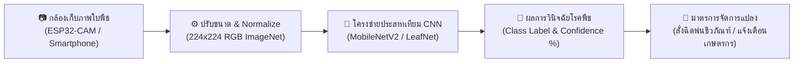
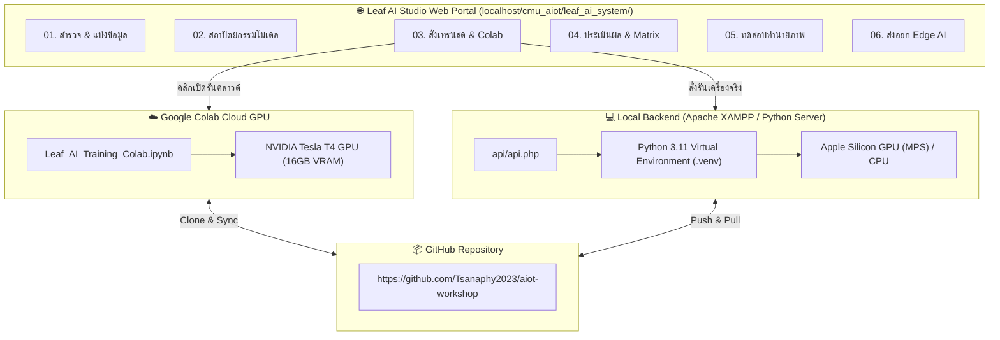

# 🍃 คู่มือการจัดกิจกรรมเชิงปฏิบัติการ: กิจกรรมที่ 12 — วิชันเอไอจำแนกโรคพืชและประเมินคุณภาพผลผลิต (Leaf Vision AI)
### คู่มือมาตรฐานสำหรับวิทยากร ผู้ช่วยสอน (TA) และผู้เรียน — โครงการ Smart Farm AIoT Workshop (มรภ.รำไพพรรณี × ม.เชียงใหม่)

---

## 📌 1. บทนำและแนวคิดวิศวกรรม (Vision AI & Edge Classification Principles)

ในกิจกรรมนี้ ผู้เรียนจะได้ก้าวข้ามจากระบบตรวจวัดเชิงตัวเลข (Scalar Telemetry) เช่น อุณหภูมิและความชื้น สู่ **ระบบคอมพิวเตอร์วิทัศน์และปัญญาประดิษฐ์ฝังตัว (Embedded Computer Vision & Edge AI)** เพื่อตรวจจับความผิดปกติของใบพืช ประเมินโรคระบาด และคัดแยกคุณภาพผลผลิตทางการเกษตร 6 ชนิด (ข้าวโพด, กาแฟ, มันฝรั่ง, ส้ม, มะม่วง, กล้วย) รวม 18 คลาส จากชุดข้อมูลภาพถ่ายจริง 5,846 ภาพ

**แนวคิดสำคัญในกิจกรรมที่ 12:**
1. **Stratified Train / Val / Test Partitioning (การแบ่งชุดข้อมูลแบบรักษาสัดส่วน):** แบ่งข้อมูล 70% สำหรับฝึกสอน, 15% สำหรับตรวจสอบระหว่างเทรน, และ 15% สำหรับทดสอบจริง โดยรักษาอัตราส่วนของทุกคลาสโรคให้สมดุลเท่ากันทุกส่วน ป้องกันปัญหา Class Imbalance
2. **Transfer Learning vs. Compact Custom CNN:** 
   * **MobileNetV2:** ใช้ Depthwise Separable Convolutions เพื่อลดภาระการคำนวณ เหมาะสำหรับอุปกรณ์พกพาและบอร์ด Raspberry Pi
   * **LeafNet (Custom CNN):** โครงข่ายขนาดเล็กเพียง 1.2M พารามิเตอร์ ออกแบบให้แปลงลงบอร์ดไมโครคอนโทรลเลอร์ ESP32-S3 ได้โดยตรง
3. **Dual Execution Runtime (การประมวลผลสองโหมด):**
   * **โหมด Local:** รันบนเครื่องคอมพิวเตอร์จริงผ่าน Apple Silicon GPU (MPS) / CUDA
   * **โหมด Cloud Colab:** เปิดรันบน Google Colab ด้วย GPU Tesla T4 ฟรี ผ่านปุ่ม One-Click Badge
4. **Evaluation Beyond Accuracy (การประเมินผลเชิงลึก):** ใช้แผนภาพความสับสน (Confusion Matrix), Macro F1-Score, Precision และ Recall เพื่อตรวจจับข้อผิดพลาดระหว่างอาการโรคที่คล้ายคลึงกัน
5. **Edge AI Model Export:** การแปลงโมเดล PyTorch (`.pth`) เป็นรูปแบบเปิด **ONNX** และ **TorchScript (`.pt`)** เพื่อนำไปรันบนอุปกรณ์ IoT ภาคสนาม

---

## ⏱️ 2. แผนการจัดการเรียนรู้และเวลา (Facilitator Time Matrix)

* **เวลารวม:** 60 นาที
* **รูปแบบการจัด:** บรรยายเชิงปฏิบัติการ (Interactive Hands-on Workshop) ผ่าน **Leaf AI Studio Web Portal** และ **Google Colab GPU T4**

```mermaid
gantt
    title ลำดับขั้นตอนกิจกรรมที่ 12: Leaf Vision AI Workshop (60 นาที)
    dateFormat  m
    axisFormat %M นาที
    section สำรวจ & แบ่งข้อมูล
    สำรวจภาพ 6 พืช & สั่ง Stratified Split   :a1, 0, 10m
    section สถาปัตยกรรม & ไฮเปอร์พารามิเตอร์
    เลือกโมเดล MobileNetV2 vs LeafNet      :a2, after a1, 10m
    section ฝึกสอนโมเดลจริง
    เทรนบน Local MPS หรือ Google Colab T4   :a3, after a2, 15m
    section ประเมินผล & Matrix
    วิเคราะห์ Confusion Matrix & F1-Score  :a4, after a3, 10m
    section ทดสอบทำนาย & ส่งออก
    ทดสอบทำนายภาพสด & ส่งออก ONNX Edge AI :a5, after a4, 15m
```

| ช่วงเวลา | กิจกรรมย่อย | บทบาทวิทยากร / TA | สิ่งที่ผู้เรียนต้องได้รับ |
| :--- | :--- | :--- | :--- |
| **00:00 - 10:00** | 12.1 สำรวจข้อมูลและสั่งรันการแบ่ง Train/Val/Test | แนะนำโครงสร้าง 6 พืช 18 คลาส, เปิดแท็บที่ 1 บนเว็บพอร์ทัล, สั่งรันการแบ่งข้อมูล | ได้ตาราง Class Distribution สมดุล 70:15:15 |
| **10:00 - 20:00** | 12.2 เลือกโมเดลและตั้งค่าพารามิเตอร์ | เปรียบเทียบ MobileNetV2, ResNet18 และ LeafNet อธิบาย Depthwise Convolutions | เข้าใจข้อดีข้อจำกัดและขนาดโมเดล Edge AI |
| **20:00 - 35:00** | 12.3 ปฏิบัติการฝึกสอนโมเดลจริง | ให้ผู้เรียนกดเริ่มเทรนบนเว็บ หรือเปิดรันบน Google Colab T4 สังเกต Terminal Log สด | เห็นกราฟ Loss ลดลง และ Accuracy พุ่งขึ้น |
| **35:00 - 45:00** | 12.4 ประเมินผลและวิเคราะห์แผนภาพความสับสน | อธิบายการอ่าน Confusion Matrix Heatmap, คำนวณ Precision, Recall, F1-Score | ชี้ชัดได้ว่าโรคใดสับสนกับโรคใด และเพราะเหตุใด |
| **45:00 - 55:00** | 12.5 ห้องทดลองทำนายภาพโรคพืชสด | ให้ผู้เรียนลากวางภาพใบไม้ หรือเลือกจากคลังตัวอย่าง ทดสอบทำนาย Top-3 | ได้ผลทำนายพร้อมแถบเปอร์เซ็นต์ความมั่นใจ |
| **55:00 - 60:00** | 12.6 ส่งออกโมเดลและสรุปคำถาม 12-Q | สาธิตการส่งออกเป็น `.onnx` และอธิบายการเชื่อมต่อเข้าบอร์ด ESP32-CAM | ไฟล์โมเดล ONNX พร้อมโค้ดรันบนอุปกรณ์ IoT |

---

## 💻 3. สถาปัตยกรรมระบบและเครื่องมือประจำเวิร์กช็อป (System Architecture & Tools)

### รายการเครื่องมือและทรัพยากร:
1. **Web Portal:** `http://localhost/cmu_aiot/leaf_ai_system/`
2. **GitHub Repository:** `https://github.com/Tsanaphy2023/aiot-workshop`
3. **Google Colab Notebook:** `Leaf_AI_Training_Colab.ipynb` (One-Click Badge)
4. **ชุดข้อมูลภาพถ่าย:** 5,846 ภาพ ครอบคลุม ข้าวโพด (Corn), มันฝรั่ง (Potato), กาแฟ (Coffee), ส้ม (Orange), มะม่วง (Mango), กล้วย (Banana)

---

## 🛠️ 4. ขั้นตอนการลงมือปฏิบัติทีละขั้น (Step-by-Step Hands-on)

### ขั้นตอนที่ 12.1: การสำรวจข้อมูลและแบ่งสัดส่วน Stratified Train/Val/Test
1. เปิดเว็บเบราว์เซอร์ไปที่ `http://localhost/cmu_aiot/leaf_ai_system/`
2. อยู่ที่แท็บ **01. สำรวจ & แบ่งข้อมูล**
3. เลือกชนิดพืชเป้าหมาย เช่น **🌽 ข้าวโพด (Corn - 4 คลาส, 3,924 ภาพ)**
4. ปรับสัดส่วน Slider: Train = 70%, Validation = 15%, Test = 15%
5. คลิกปุ่ม **"⚡ สั่งรันการแบ่งชุดข้อมูลจริง (Execute Real Split)"**
6. **สังเกตผลลัพธ์:** ระบบจะเรียกสคริปต์ `scripts/01_split_dataset.py` และสร้างไฟล์ `train.csv`, `val.csv`, `test.csv` ใน `data/splits/corn/` ทันที พร้อมแสดงตารางการกระจายตัวของคลาสที่สมดุล

### ขั้นตอนที่ 12.2: การเลือกสถาปัตยกรรมโครงข่ายประสาทเทียม
1. คลิกแท็บ **02. เลือกโมเดล & ตั้งค่า**
2. ศึกษาการเปรียบเทียบระหว่าง 3 โมเดล:
   * **MobileNetV2 (3.5M Params):** โครงสร้าง Residual คอนโวลูชันแบบแยกส่วนลึก เหมาะสำหรับกล้องติดแปลงเกษตร
   * **ResNet18 (11.7M Params):** โครงข่าย Residual มาตรฐานงานวิจัย ให้ความแม่นยำสูงสุด
   * **LeafNet (1.2M Params):** โครงข่ายขนาดเบาพิเศษ ออกแบบให้แปลงลงชิป ESP32 ได้
3. คลิกเลือกการ์ด **MobileNetV2** (จะมีขอบเรืองแสงสีเขียวแสดงสถานะเลือก)
4. ตั้งค่า: Epochs = 15, Batch Size = 32, Learning Rate = 0.001

### ขั้นตอนที่ 12.3: การฝึกสอนโมเดลจริง (Live Model Training)
1. คลิกแท็บ **03. ฝึกสอนโมเดลจริง**
2. เลือกโหมดการฝึกสอนที่ต้องการ:
   * **โหมดที่ 1 (Local):** คลิกปุ่ม **"▶ เริ่มต้นฝึกสอนบนเครื่องจริง"** -> หน้าจอ Terminal Log จะแสดงผลการคำนวณสดของแต่ละ Epoch พร้อมเวลาและความแม่นยำ
   * **โหมดที่ 2 (Colab Cloud):** คลิกปุ่มสีส้ม **"🚀 เปิดรันใน Google Colab (One-Click)"** -> ระบบจะพาไปยังสมุดบันทึกบน Google Colab ให้กด `Runtime` -> `Change runtime type` -> เลือก **T4 GPU** แล้วกด `Run All`
3. เมื่อฝึกสอนเสร็จสมบูรณ์ ระบบจะบันทึกน้ำหนักโมเดลที่ดีที่สุดไว้ที่ `outputs/checkpoints/corn_mobilenet_v2_best.pth` และวาดกราฟ Loss/Accuracy Curves อัตโนมัติ

### ขั้นตอนที่ 12.4: การประเมินผลบน Test Set และแผนภาพความสับสน
1. คลิกแท็บ **04. ประเมินผล & Matrix**
2. คลิกปุ่ม **"🔍 สั่งประเมินผลบน Test Set (Run Evaluation)"**
3. ระบบจะรันโมเดลทดสอบกับภาพที่แยกไว้ 15% (ภาพที่โมเดลไม่เคยเห็นมาก่อน)
4. **สังเกตตัวชี้วัด:**
   * **Test Accuracy:** เปอร์เซ็นต์การทายถูกโดยรวม
   * **Macro F1-Score:** ค่าเฉลี่ยฮาร์โมนิกของ Precision และ Recall
   * **Confusion Matrix Heatmap:** สังเกตแนวทแยงมุมหลัก (Diagonal) ยิ่งตัวเลขและสีน้ำเงินเข้มในแนวทแยงมากเท่าใด แสดงว่าโมเดลจำแนกได้แม่นยำถูกต้องมากเท่านั้น

### ขั้นตอนที่ 12.5: ห้องทดลองทำนายภาพโรคพืชสด (Inference Playground)
1. คลิกแท็บ **05. ทดสอบทำนายภาพ**
2. ทดลองนำเข้าภาพ 2 รูปแบบ:
   * **วิธีที่ A:** คลิกเลือกภาพใบพืชตัวอย่างจากช่องตัวเลือกด้านล่าง
   * **วิธีที่ B:** ลากไฟล์ภาพใบพืชจากเครื่องคอมพิวเตอร์ของคุณมาวางในกล่อง Dropzone
3. คลิกปุ่ม **"✨ วิเคราะห์และทำนายโรคพืช (Predict Now)"**
4. ระบบจะส่งภาพเข้าโมเดลและแสดงผลการวินิจฉัยทันที พร้อมแถบ Confidence Gauge และรายการ Top-3 Classes

### ขั้นตอนที่ 12.6: การส่งออกโมเดลสำหรับ Edge AI (ONNX / TorchScript)
1. คลิกแท็บ **06. ส่งออก Edge AI**
2. คลิกปุ่ม **"💾 แปลงและส่งออกโมเดล (Export Models)"**
3. ระบบจะแปลงโมเดลเป็นไฟล์:
   * `outputs/exported/<model>.onnx` (สำหรับ Raspberry Pi / OpenCV / Web Browser)
   * `outputs/exported/<model>.pt` (สำหรับ C++ LibTorch / Mobile Application)
   * `outputs/exported/<model>_meta.json` (ข้อมูลคลาสและค่า Normalization)
4. คลิกปุ่ม **ดาวน์โหลด** เพื่อนำไฟล์ไปใช้งานต่อในระบบสมาร์ทฟาร์ม

---

## ⚠️ 5. จุดที่มักผิดพลาดและการแก้ปัญหา (Troubleshooting & Common Pitfalls)

| ปัญหาที่พบบ่อย | สาเหตุ | วิธีการแก้ไข |
| :--- | :--- | :--- |
| **กดปุ่มบนเว็บแล้วไม่มีการตอบสนอง** | Apache หรือ XAMPP ยังไม่ได้เปิดทำงาน หรือ Backend ออฟไลน์ | ตรวจสอบแถบสถานะด้านบนขวาของหน้าเว็บ ต้องขึ้นเป็นจุดสีเขียว `Online` หากขึ้นสีแดง ให้เปิด XAMPP Control Panel และ Start Apache หรือรัน `python server.py` |
| **เทรนบนเครื่องช้ามาก** | ระบบเลือกใช้ CPU เนื่องจากไม่มี GPU Accelerator | ให้เปลี่ยนไปใช้ **โหมด Google Colab (ปุ่มสีส้ม)** ซึ่งมี GPU Tesla T4 ความเร็วสูงและใช้งานได้ฟรี |
| **โมเดล Overfitting (Train Acc สูงมาก แต่ Val Acc ต่ำ)** | โมเดลจำภาพฝึกสอนได้ แต่ไม่สามารถปรับตัวกับภาพใหม่ | เปิดใช้งาน Data Augmentation (หมุนภาพ, พลิกภาพ, ปรับสี) หรือเปิดใช้งาน `Early Stopping` ซึ่งระบบตั้งค่าไว้ที่ 5 รอบ |
| **ภาพล้นขอบเขตสีดำตอนทำนาย** | ขนาดภาพไม่ตรงกับขนาด Input Tensor ของโมเดล (224×224) | ในฟังก์ชัน `get_transforms()` ของระบบมีคำสั่ง Resize และ CenterCrop ควบคุมภาพให้อยู่ในมิติ 224×224 อัตโนมัติ |

---

## 💡 6. คำถามชวนคิดและการเชื่อมโยงสู่ฟาร์มจริง (Discussion Questions & 12-Q)

1. **คำถามที่ 1 (Data Distribution):** เหตุใดเราจึงต้องใช้การแบ่งแบบ **Stratified Sampling** แทนที่จะเป็นการสุ่มแบบ Uniform Random ธรรมดา? (แนวตอบ: เพื่อป้องกันปัญหาที่บางคลาสโรคที่มีภาพน้อย จะหลุดไปอยู่ใน Test set หมด หรือไม่มีอยู่ใน Train set เลย ทำให้โมเดลเรียนรู้ไม่ได้)
2. **คำถามที่ 2 (Model Sizing):** หากต้องการติดตั้งโมเดลนี้บนกล้องดักถ่ายแมลงพลังงานแสงอาทิตย์ที่ใช้บอร์ด ESP32-S3 ในสวนทุเรียน ควรเลือกโมเดลใดระหว่าง MobileNetV2 และ LeafNet? (แนวตอบ: ควรเลือก LeafNet ที่มีขนาดพารามิเตอร์เพียง 1.2M และโมเดลขนาด 4.8MB ทำให้สามารถโหลดเข้า PSRAM ของ ESP32-S3 ได้โดยตรง)
3. **คำถามที่ 3 (Edge vs Cloud Tradeoff):** ในฟาร์มขนาดใหญ่ที่สัญญาณอินเทอร์เน็ตเข้าไม่ถึง การรัน AI วินิจฉัยโรคพืชแบบ On-Device (Edge AI) มีข้อได้เปรียบกว่าการส่งภาพขึ้นคลาวด์อย่างไร? (แนวตอบ: ไม่ต้องพึ่งพาสัญญาณอินเทอร์เน็ต, มีความเร็วในการวินิจฉัยแบบเรียลไทม์ระดับมิลลิวินาที, ประหยัดพลังงานแบตเตอรี่ และรักษาความเป็นส่วนตัวของข้อมูลฟาร์ม)
