# 🌡️ คู่มือการจัดกิจกรรมเชิงปฏิบัติการ: กิจกรรมที่ 1 — รู้จักและทดลองอ่านค่าเซนเซอร์ (Sense)
### คู่มือมาตรฐานสำหรับวิทยากร ผู้ช่วยสอน (TA) และผู้เรียน — โครงการ Smart Farm AIoT Workshop

---

## 📌 1. บทนำและแนวคิดวิศวกรรม (Sense Principles)

ในระบบเกษตรแม่นยำ (Precision Agriculture) ข้อมูลสภาพแวดล้อมที่ถูกต้องและทันเวลาคือพื้นฐานของการตัดสินใจทั้งหมด หากปราศจากการตรวจวัดที่น่าเชื่อถือ ระบบควบคุมอัตโนมัติจะไม่สามารถทำงานได้อย่างถูกต้อง

**แนวคิดสำคัญในกิจกรรมที่ 1:**
1. **Perception Layer (ชั้นการรับรู้):** การแปลงปริมาณทางกายภาพ (อุณหภูมิ, ความชื้น, ระดับน้ำ, แรงสั่นสะเทือน) ให้อยู่ในรูปสัญญาณดิจิทัล
2. **I2C Bus Protocol:** โพรโทคอลสื่อสารแบบอนุกรม 2 สาย (SDA, SCL) ที่ช่วยให้ไมโครคอนโทรลเลอร์เชื่อมต่อกับเซนเซอร์หลายตัวบนบัสเดียวกันได้อย่างมีประสิทธิภาพ
3. **Dry Contact Sensor:** หน้าสัมผัสแบบกลไก (เช่น สวิตช์ลูกลอย) ที่ไม่มีแรงดันไฟฟ้าในตัว ต้องอาศัย Pull-up Resistor ภายในชิปเพื่ออ่านสถานะเปิด/ปิด
4. **Local mDNS & Standalone Web Server:** การเข้าถึงอุปกรณ์ IoT ผ่านชื่อโดเมนเฉพาะกิจ (เช่น `http://gogo-iot-XXXXXX.local`) โดยไม่ต้องอาศัยการเชื่อมต่ออินเทอร์เน็ตภายนอก

---

## ⏱️ 2. แผนการจัดการเรียนรู้และเวลา (Facilitator Time Matrix)

* **เวลารวม:** 45 นาที
* **รูปแบบการจัด:** ปฏิบัติการรายบุคคล/รายคู่ ตรวจสอบค่าผ่านเบราว์เซอร์ประจำกลุ่ม

```mermaid
gantt
    title ลำดับขั้นตอนกิจกรรมที่ 1: Sense (45 นาที)
    dateFormat  m
    axisFormat %M นาที
    section สำรวจ & ต่อวงจร
    รู้จักบอร์ด & ต่อสวิตช์ลูกลอย   :a1, 0, 10m
    section เชื่อมต่อ & หน้าเว็บ
    อ่าน IP & เปิดหน้าเว็บ ESPHome  :a2, after a1, 10m
    section ทดสอบเซนเซอร์
    เป่าลม/ยกสวิตช์/เคาะบอร์ด      :a3, after a2, 15m
    section สังเกต & สรุป
    วัดเวลาตอบสนอง & อภิปราย 1-Q   :a4, after a3, 10m
```



| ช่วงเวลา | กิจกรรมย่อย | บทบาทวิทยากร / TA | ผลลัพธ์ที่ต้องได้ |
| :--- | :--- | :--- | :--- |
| **00:00 - 10:00** | 1.1 รู้จักบอร์ดและต่อสวิตช์ลูกลอย | แจกจ่ายบอร์ด GoGo-IoT แนะนำพอร์ต I2C, ขั้วต่อ Terminal Block และให้ผู้เรียนขันสายสวิตช์ลูกลอย | ขันสายลูกลอยแน่นหนา ไม่หลุด |
| **10:00 - 20:00** | 1.2 & 1.3 อ่านชื่อ IP และเปิดหน้าเว็บ | ชี้จุดอ่าน MAC Address หรือสติกเกอร์ชื่อบอร์ด แนะนำการพิมพ์ `.local` ในเบราว์เซอร์ | เปิดหน้าเว็บ ESPHome ของบอร์ดสำเร็จ |
| **20:00 - 35:00** | 1.4 ทดลองอ่านค่าเซนเซอร์ | ให้ผู้เรียนทดลอง 3 สถานการณ์: (1) เป่าลมร้อน (2) ยกสวิตช์ลูกลอยพ้นน้ำ (3) เคาะโต๊ะดูแรงสั่น | เห็นตัวเลขและสถานะเปลี่ยนแบบเรียลไทม์ |
| **35:00 - 45:00** | 1.5 วัด Latency & สรุปผล 1-Q | อธิบายรอบการอัปเดต (Update Interval) และนำการอภิปรายคำถามเชิงวิศวกรรม 1-Q | บันทึกผลลงใบงานครบถ้วน |

---

## 🔌 3. รายการอุปกรณ์และการเชื่อมต่อ (Hardware BOM & Interfacing)

```mermaid
flowchart TD
    subgraph NODE["บอร์ด GoGo-IoT (ESP32-C3)"]
        MCU["ESP32-C3 SoC (32-bit RISC-V)"]
        PULLUP["Internal Pull-up (GPIO6)"]
        I2C_CTRL["Hardware I2C Controller"]
        WEB["ESPHome Local Web Server"]
    end

    SHT["SHT30: อุณหภูมิ & ความชื้น"] -->|SDA: GPIO4 / SCL: GPIO5| I2C_CTRL
    FLOAT["สวิตช์ลูกลอยระดับน้ำ"] -->|Dry Contact| PULLUP
    VIB["เซนเซอร์ตรวจจับแรงสั่นสะเทือน"] -->|Digital In: GPIO7| MCU

    MCU --> WEB
    WEB -->|HTTP / Port 80 (Wi-Fi)| LAPTOP["แล็ปท็อปผู้เรียน (เบราว์เซอร์)"]
```

| ลำดับ | รายการอุปกรณ์ | สเปก / คุณสมบัติ | หน้าที่ในระบบ |
| :---: | :--- | :--- | :--- |
| 1 | **บอร์ด GoGo-IoT (Sensor Node)** | ชิป ESP32-C3, Wi-Fi 2.4GHz, ESPHome Firmware | บอร์ดรับสัญญาณและประมวลผลเซนเซอร์ |
| 2 | **เซนเซอร์ SHT30** | ช่วงวัด -40 ถึง 125°C (±0.2°C), 0-100% RH (±2% RH) | ตรวจวัดอุณหภูมิและความชื้นสัมพัทธ์ในอากาศ |
| 3 | **สวิตช์ลูกลอย (Float Switch)** | Reed Switch สแตนเลส/พลาสติก Dry Contact | ตรวจสอบระดับน้ำในถังพัก (Wet = ปกติ, Dry = น้ำแห้ง) |
| 4 | **เซนเซอร์วัดแรงสั่นสะเทือน** | SW-420 หรือ Piezo Vibration Switch | ตรวจจับการทำงานของปั๊มน้ำหรือเครื่องกล |
| 5 | **แก้วน้ำทดลอง & สาย USB-C** | แก้วพลาสติกใส, สายชาร์จ Data USB-C 5V | ใช้ทดสอบการลอยตัวและจ่ายไฟเข้าบอร์ด |

---

## 🧪 4. ขั้นตอนการทดลองอย่างละเอียดทีละขั้น (Step-by-Step Lab Protocol)

### ขั้นตอนที่ 1.1: รู้จักบอร์ด GoGo-IoT และต่อสวิตช์ลูกลอย
1. ตรวจสอบชิ้นส่วนบนบอร์ด: สังเกตเซนเซอร์ตัวเล็กสีขาว (SHT30) และช่องขันสายสกรู (Terminal Block)
2. นำสายสวิตช์ลูกลอย 2 เส้น เสียบเข้าช่อง Terminal Block แล้วใช้ไขควงขันให้แน่น
3. *ข้อสังเกต:* สวิตช์ลูกลอยเป็นสวิตช์หน้าสัมผัสแบบกลไก (Dry Contact) จึงไม่มีขั้วบวกหรือขั้วลบ สามารถสลับสายกันได้

### ขั้นตอนที่ 1.2: อ่านชื่อและหมายเลข IP ของบอร์ด
1. เสียบสาย USB-C จ่ายไฟเข้าบอร์ด ไฟ LED สีน้ำเงิน/เขียวบนบอร์ดจะติดสว่าง
2. ดูสติกเกอร์ที่ติดบนบอร์ด จะระบุชื่อประจำตัว เช่น `gogo-iot-red-242dcc` (คำว่า `red` คือชื่อโซนสี, `242dcc` คือ MAC Address 6 ตัวท้าย)
3. หากเปิดหน้าสแกนเครือข่าย หรือดูจากหน้าจอ Dashboard ของผู้สอน จะเห็นหมายเลข IP Address เช่น `192.168.1.105`

### ขั้นตอนที่ 1.3: เปิดหน้าเว็บ Web UI ของบอร์ด
1. เปิดเว็บเบราว์เซอร์ (Google Chrome แนะนำ) บนแล็ปท็อปที่ต่อ Wi-Fi เดียวกัน
2. พิมพ์ URL: `http://gogo-iot-xxxxxx.local` (แทน xxxxxx ด้วยรหัสประจำบอร์ด) หรือพิมพ์หมายเลข IP ตรงๆ
3. หน้าจอจะแสดงรายการเซนเซอร์ทั้งหมดของบอร์ด พร้อมค่าอัปเดตแบบเรียลไทม์

### ขั้นตอนที่ 1.4: ทดลองอ่านค่าเซนเซอร์ 3 รูปแบบ
* **ทดสอบที่ 1 (SHT30):** ใช้ปากเป่าลมร้อนชื้นเบาๆ ไปที่ตัวเซนเซอร์ สังเกตค่า Relative Humidity (%) จะพุ่งสูงขึ้นเกิน 85-90% และค่อยๆ ลดลงเมื่อแห้ง
* **ทดสอบที่ 2 (Float Switch):** นำลูกลอยจุ่มลงในแก้วน้ำ สังเกตสถานะเป็น `Wet` (หรือ Off ตาม Logic) พอยกลูกลอยพ้นน้ำ สถานะจะกลายเป็น `Dry` (On)
* **ทดสอบที่ 3 (Vibration):** เคาะที่โต๊ะหรือขอบบอร์ดเบาๆ สังเกตสถานะของเซนเซอร์ตรวจจับแรงสั่นสะเทือนจะเปลี่ยนเป็นกระพริบ On/Off

### ขั้นตอนที่ 1.5: สังเกตเวลาตอบสนอง (Latency & Sampling Rate)
* สังเกตช่วงเวลาตั้งแต่เรายกสวิตช์ลูกลอย จนกระทั่งตัวอักษรบนหน้าเว็บเปลี่ยน ใช้เวลาประมาณ 1 ถึง 2 วินาที
* สาเหตุเกิดจากรอบการอ่านค่า (Update Interval) ที่ถูกโปรแกรมไว้ใน ESPHome เพื่อไม่ให้เปลืองพลังงานและทราฟฟิกเครือข่ายเกินความจำเป็น

---

## 💻 5. โค้ดและการตั้งค่าสำเร็จรูป (Ready-to-use Configurations)

```yaml
# ตัวอย่างโครงสร้างการตั้งค่าเซนเซอร์ใน ESPHome (เบื้องหลังการทำงานของบอร์ด GoGo-IoT)
i2c:
  sda: GPIO4
  scl: GPIO5
  scan: true

sensor:
  - platform: sht3xd
    temperature:
      name: "Temperature"
      id: room_temp
    humidity:
      name: "Humidity"
      id: room_humidity
    address: 0x44
    update_interval: 2s

binary_sensor:
  - platform: gpio
    pin:
      number: GPIO6
      mode: INPUT_PULLUP
      inverted: true
    name: "Float Switch"
    id: water_float_switch

  - platform: gpio
    pin:
      number: GPIO7
      mode: INPUT_PULLDOWN
    name: "Vibration Sensor"
    id: pump_vibration
```

---

## 📝 6. แนวทางการตรวจคำตอบและเฉลยใบงาน (Answer Key & Discussion)

### เฉลยคำตอบและแนวทางการตรวจใบงาน (Activity 1 Worksheet)

1. **ข้อ 1.1 การต่อสายสวิตช์ลูกลอย:**
   * *คำถาม:* สลับสายไฟขั้วซ้าย-ขวาได้หรือไม่ เพราะเหตุใด?
   * *เฉลย:* **สลับได้** เนื่องจากสวิตช์ลูกลอยเป็น Dry Contact ทำงานด้วยแม่เหล็กผลักหน้าสัมผัส Reed Switch ในท่อ จึงไม่มีขั้วทางไฟฟ้า (Non-polarized)
2. **ข้อ 1.2 ชื่อบอร์ดและ IP:**
   * บันทึกชื่อบอร์ดให้ตรงตามสติกเกอร์ (เช่น `gogo-iot-red-242dcc`) และ IP เช่น `192.168.1.105`
3. **ข้อ 1.4 ผลการทดลองอ่านค่าเซนเซอร์:**
   * อุณหภูมิห้องปกติ: ~28.0 - 32.5 °C
   * ความชื้นห้องปกติ: ~55 - 75 % (เมื่อเป่าลมชื้นจะพุ่งขึ้นเกิน 85-95 %)
   * สวิตช์ลูกลอย: อยู่ในน้ำ = `Wet` (ปิดวงจร) / พ้นน้ำ = `Dry` (เปิดวงจร)
4. **ข้อ 1.5 เวลาตอบสนอง:**
   * ประมาณ **1 - 2 วินาที** (เป็นค่ามาตรฐานเพื่อการประหยัดพลังงานและการกรองสัญญาณรบกวน)

---

### 💡 การอภิปรายเชิงวิศวกรรม (คำถาม 1-Q)
**คำถาม:** *หากเซนเซอร์อ่านค่าไม่ได้ หรือบอร์ดเซนเซอร์หลุดจากเครือข่าย จะส่งผลต่อระบบควบคุมอย่างไร และควรเตรียมการอย่างไร?*
* **ผลกระทบ:** หากคอนโทรลเลอร์สั่งงานโดยยึดค่าสุดท้ายที่อ่านได้ (Stale Data) เช่น ค้างอยู่ที่ค่าความชื้นต่ำ 40% ทั้งที่รดน้ำจนชื้นแล้ว ระบบจะสั่งปั๊มน้ำทำงานค้างไม่ยอมหยุด จนทำให้แปลงปลูกน้ำท่วมและปั๊มไหม้
* **แนวทางแก้ไขเชิงวิศวกรรม:**
  1. ระบบควบคุมส่วนกลางต้องตรวจจับสถานะ `unavailable` หรือ `unknown` ของเซนเซอร์
  2. หากขาดการส่งข้อมูลเกินเวลาที่กำหนด (Timeout) ต้องสั่งหยุดการทำงานของโหลดกำลังสูง (Fail-to-Off) ทันที
  3. ตั้งระบบแจ้งเตือนไปยังผู้ดูแลระบบให้เข้าตรวจสอบฮาร์ดแวร์หน้างาน

---

## 🛠️ 7. การแก้ไขปัญหาหน้างานที่พบบ่อย (Troubleshooting FAQ)

| ปัญหาที่พบ | สาเหตุที่เป็นไปได้ | วิธีการแก้ไข |
| :--- | :--- | :--- |
| **เปิดหน้าเว็บ `.local` ไม่ขึ้น** | แล็ปท็อปไม่ได้ต่อ Wi-Fi วงเดียวกับบอร์ด หรือ OS ไม่รองรับ mDNS | 1. ตรวจสอบว่าต่อ Wi-Fi โซนสีเดียวกัน<br>2. พิมพ์เป็นหมายเลข IP โดยตรง (เช่น `http://192.168.1.105`) |
| **ค่าอุณหภูมิ/ความชื้นขึ้น 0 หรือ NaN** | สาย I2C หลวม หรือแอดเดรส I2C ชนกัน | ตรวจสอบรอยบัดกรีของชิป SHT30 หรือปิด-เปิดไฟเลี้ยงบอร์ดใหม่ |
| **สวิตช์ลูกลอยไม่ยอมเปลี่ยนสถานะ** | แม่เหล็กในวงแหวนลูกลอยติดขัด หรือสายหลุดจาก Terminal | ตรวจสอบการขันน็อต Terminal และลองขยับวงแหวนลูกลอยขึ้น-ลงด้วยมือ |

---

## 📊 8. เกณฑ์การประเมินผลการเรียนรู้ (Assessment Rubric)

| เกณฑ์การประเมิน | ดีเยี่ยม (4-5 คะแนน) | พอใช้ (2-3 คะแนน) | ต้องปรับปรุง (0-1 คะแนน) |
| :--- | :--- | :--- | :--- |
| **การต่อวงจรและเปิดหน้าเว็บ (5 คะแนน)** | ขันสายลูกลอยถูกต้อง และเปิดหน้าเว็บ ESPHome ของบอร์ดได้รวดเร็ว | เปิดหน้าเว็บได้แต่ต้องให้ TA ช่วยตรวจสอบ IP | ไม่สามารถเปิดหน้าเว็บของบอร์ดได้ |
| **การทดสอบเซนเซอร์ครบ 3 ชนิด (5 คะแนน)** | ทดสอบเป่าลม ยกสวิตช์ และเคาะแรงสั่น ครบถ้วนพร้อมบันทึกผล | ทดสอบได้ 1-2 ชนิด บันทึกผลไม่ครบ | ไม่ได้ทำการทดสอบเซนเซอร์ |
| **การสังเกตและวัด Latency (5 คะแนน)** | อธิบายรอบเวลาตอบสนอง 1-2 วินาทีได้ถูกต้องตรงตามทฤษฎี | ระบุเวลาได้แต่ไม่เข้าใจเหตุผลทางเทคนิค | ไม่ได้ระบุเวลาตอบสนอง |
| **การตอบคำถามคิดวิเคราะห์ 1-Q (5 คะแนน)** | ชี้ประเด็น Stale Data และเสนอหลักการ Fail-safe ได้อย่างลึกซึ้ง | ตอบผลกระทบได้บางส่วน แต่ขาดแนวทางแก้ไข | ไม่ได้ตอบคำถาม 1-Q |

---
*จัดทำขึ้นสำหรับการอบรมเชิงปฏิบัติการ Smart Farm AIoT Workshop (CMU & RBRU)*
