# 💡 คู่มือการจัดกิจกรรมเชิงปฏิบัติการ: กิจกรรมที่ 2 — ต่อวงจรและสั่งงานหลอดไฟ (Act)
### คู่มือมาตรฐานสำหรับวิทยากร ผู้ช่วยสอน (TA) และผู้เรียน — โครงการ Smart Farm AIoT Workshop

---

## 📌 1. บทนำและแนวคิดวิศวกรรม (Act Principles)

ไมโครคอนโทรลเลอร์ทำงานที่แรงดันต่ำมาก (3.3V หรือ 5V) และสามารถจ่ายกระแสไฟฟ้าได้เพียงไม่กี่มิลลิแอมป์ ไม่สามารถนำไปขับอุปกรณ์กำลังสูง เช่น หลอดไฟส่องสว่าง วาล์วน้ำไฟฟ้า หรือปั๊มน้ำการเกษตรได้โดยตรง

**แนวคิดสำคัญในกิจกรรมที่ 2:**
1. **Actuation Layer (ชั้นการกระทำ):** การเปลี่ยนคำสั่งลอจิกเป็นพลังงานกลหรือไฟฟ้าที่ขับเคลื่อนอุปกรณ์จริง
2. **Galvanic Isolation (การแยกกักทางไฟฟ้า):** การแยกวงจรควบคุมแรงดันต่ำออกจากวงจรโหลดกำลังสูง เพื่อป้องกันสัญญาณรบกวนและไฟกระชากย้อนกลับไปทำลายไมโครคอนโทรลเลอร์
3. **Electromechanical Relay:** สวิตช์แม่เหล็กไฟฟ้าที่มี 3 ขั้วหลัก:
   * **COM (Common):** ขั้วร่วมที่เป็นจุดจ่ายไฟเข้า
   * **NO (Normally Open):** ปกติเปิด (วงจรขาด) จะต่อเมื่อจ่ายไฟให้คอยล์รีเลย์ทำงาน
   * **NC (Normally Closed):** ปกติติด (วงจรต่อ) จะตัดเมื่อจ่ายไฟให้คอยล์
4. **Fail-safe Terminal Selection:** การเลือกขั้ว NO เป็นค่าเริ่มต้น เพื่อให้เมื่อระบบควบคุมดับ โหลดจะหยุดทำงานทันที

---

## ⏱️ 2. แผนการจัดการเรียนรู้และเวลา (Facilitator Time Matrix)

* **เวลารวม:** 45 นาที
* **รูปแบบการจัด:** ปฏิบัติการรายคู่ เน้นความปลอดภัยทางไฟฟ้า ปิดไฟก่อนต่อสายทุกครั้ง

```mermaid
gantt
    title ลำดับขั้นตอนกิจกรรมที่ 2: Act (45 นาที)
    dateFormat  m
    axisFormat %M นาที
    section รู้จักรีเลย์
    โครงสร้างรีเลย์ & ทดสอบคลิก     :a1, 0, 10m
    section สำรวจแหล่งจ่ายไฟ
    กล่องจ่ายไฟ 12V & วงจรหลอดไฟ   :a2, after a1, 10m
    section ต่อวงจรไฟฟ้า
    ต่อสายไฟขั้ว COM และ NO (ปิดไฟ) :a3, after a2, 15m
    section ทดสอบ & สรุป
    สั่งงานผ่านเว็บ & อภิปราย 2-Q    :a4, after a3, 10m
```



| ช่วงเวลา | กิจกรรมย่อย | บทบาทวิทยากร / TA | ผลลัพธ์ที่ต้องได้ |
| :--- | :--- | :--- | :--- |
| **00:00 - 10:00** | 2.1 & 2.2 รู้จักรีเลย์และทดสอบสั่งงาน | อธิบายหลักการเหนี่ยวนำแม่เหล็กไฟฟ้าของคอยล์ ให้เปิดเว็บสั่ง On/Off เพื่อฟังเสียงคลิก | ได้ยินเสียงคลิก และไฟ LED บนบอร์ดรีเลย์ติด |
| **10:00 - 20:00** | 2.3 รู้จักกล่องจ่ายไฟและหลอด 12V | เตือนเรื่องความปลอดภัย คำนวณ P = V x I และชี้ขั้วบวก/ลบของอะแดปเตอร์ | เข้าใจทิศทางการไหลของกระแสไฟฟ้า 12V DC |
| **20:00 - 35:00** | 2.4 ต่อสายวงจรหลอดไฟ | **ตรวจสอบว่าปิดสวิตช์ไฟก่อนลงมือต่อ** ตรวจสอบการขันสายเข้า COM และ NO | ต่อวงจรเสร็จสมบูรณ์ถูกต้อง ไม่มีสายเปลือยช็อต |
| **35:00 - 45:00** | 2.5 จ่ายไฟ ทดสอบ และสรุป 2-Q | ให้เปิดสวิตช์ไฟหลัก สั่ง On/Off ผ่านหน้าเว็บ สังเกตหลอดไฟติด/ดับ | หลอดไฟสว่างตามสั่ง และบันทึกคำตอบลงใบงาน |

---

## 🔌 3. รายการอุปกรณ์และการเชื่อมต่อ (Hardware BOM & Interfacing)

```mermaid
flowchart LR
    subgraph POWER_BOX["กล่องจ่ายไฟ 12V DC"]
        DC12_POS["+12V (สายสีแดง)"]
        DC12_NEG["GND (สายสีดำ)"]
    end

    subgraph RELAY_BOARD["บอร์ด GoGo-Relay"]
        MCU2["ESP32-C3"]
        RELAY["Relay 10A 250VAC"]
        COM["ขั้ว COM (Common)"]
        NO["ขั้ว NO (Normally Open)"]
        NC["ขั้ว NC (Normally Closed)"]
        MCU2 -->|Optocoupler Isolation| RELAY
        RELAY --- COM
        RELAY --- NO
        RELAY --- NC
    end

    subgraph LOAD["โหลดไฟฟ้ากำลัง"]
        LAMP["หลอดไฟ LED 12V / ปั๊มน้ำ"]
    end

    DC12_POS -->|จ่ายไฟเข้าสวิตช์| COM
    NO -->|ไฟออกเมื่อสั่ง ON| LAMP
    LAMP -->|สายไฟกลับลงกราวด์| DC12_NEG
    NC -.->|เว้นว่างไว้ (ไม่ต่อ)| X[" "]
```

| ลำดับ | รายการอุปกรณ์ | สเปก / คุณสมบัติ | หน้าที่ในระบบ |
| :---: | :--- | :--- | :--- |
| 1 | **บอร์ด GoGo-Relay (Actuator Node)** | ชิป ESP32-C3, Relay 1-Channel (10A 250VAC/30VDC) | บอร์ดรับคำสั่งเครือข่ายและสับสวิตช์ไฟฟ้า |
| 2 | **แหล่งจ่ายไฟ 12V DC Power Box** | Switching Power Supply 12V 2A-5A พร้อมสวิตช์ตัดไฟ | จ่ายไฟกระแสตรงแรงดัน 12V ให้หลอดไฟ/ปั๊ม |
| 3 | **หลอดไฟ LED 12V DC** | กำลังไฟฟ้า 5W-10W พร้อมขั้วต่อสายไฟ | ใช้จำลองโหลดกำลังสูงในแปลงเกษตร |
| 4 | **สายไฟเชื่อมต่อพร้อมหางปลา/สายคู่** | สายทองแดงหุ้มฉนวน แดง (+) / ดำ (-) | เดินวงจรไฟฟ้าระหว่างกล่องไฟ รีเลย์ และโหลด |

---

## 🧪 4. ขั้นตอนการทดลองอย่างละเอียดทีละขั้น (Step-by-Step Lab Protocol)

### ขั้นตอนที่ 2.1: รู้จักโครงสร้างบอร์ดรีเลย์
1. สังเกตตัวกล่องสี่เหลี่ยมสีน้ำเงินบนบอร์ด: นี่คือรีเลย์กลไก ด้านในมีขดลวดแม่เหล็กและสปริงดึงหน้าสัมผัส
2. ตรวจสอบขั้ว Terminal 3 ช่อง:
   * **COM:** จุดเชื่อมต่อหลัก
   * **NO:** สวิตช์จะปิดวงจร (เชื่อมหากัน) เฉพาะเมื่อสั่ง ON
   * **NC:** สวิตช์จะปิดวงจรค้างไว้เมื่อไม่มีไฟเลี้ยง

### ขั้นตอนที่ 2.2: อ่านชื่อ IP และทดสอบสั่งงานรีเลย์เบื้องต้น
1. เสียบสาย USB-C ให้บอร์ด GoGo-Relay
2. เปิดเบราว์เซอร์ เข้า URL: `http://gogo-relay-xxxxxx.local` หรือ IP ของบอร์ด
3. กดปุ่มสวิตช์บนหน้าเว็บ สังเกต:
   * จะได้ยินเสียง **"คลิก"** เบาๆ (เสียงหน้าสัมผัสกระทบกัน)
   * ไฟ LED สีแดง/เขียวข้างตัวรีเลย์จะติดสว่างตามสถานะ

### ขั้นตอนที่ 2.3: สำรวจกล่องจ่ายไฟและคำนวณกำลังไฟ
* แรงดันไฟฟ้าในระบบขับโหลดคือ **12V DC**
* กำลังไฟฟ้าคำนวณตามสูตร $P = V 	imes I$ หากหลอดไฟขนาด 6W จะกินกระแส $I = 6 / 12 = 0.5	ext{ A}$

### ขั้นตอนที่ 2.4: ต่อสายวงจรหลอดไฟ (คำเตือนความปลอดภัย)
1. **ปิดสวิตช์ของกล่องจ่ายไฟ 12V ทุกครั้งก่อนต่อสาย**
2. ต่อสายไฟขั้วบวก (+12V สีแดง) จากกล่องไฟ เข้าที่ช่อง **COM** ของรีเลย์
3. ต่อสายไฟสีแดงจากขั้ว **NO** ของรีเลย์ ไปเข้าที่ขั้วบวกของหลอดไฟ
4. ต่อสายไฟขั้วลบ (สีดำ) จากหลอดไฟ กลับไปเข้าที่ขั้ว **GND** ของกล่องไฟโดยตรง
5. ตรวจสอบความแน่นหนาของสกรูยึดสายไฟ

### ขั้นตอนที่ 2.5: จ่ายไฟและทดสอบสั่งเปิด-ปิดหลอดไฟ
1. เปิดสวิตช์กล่องจ่ายไฟ 12V
2. สั่ง ON จากหน้าเว็บของบอร์ดรีเลย์ -> หลอดไฟต้องสว่างทันที
3. สั่ง OFF -> หลอดไฟต้องดับสนิททันที

---

## 💻 5. โค้ดและการตั้งค่าสำเร็จรูป (Ready-to-use Configurations)

```yaml
# ตัวอย่างโครงสร้างการตั้งค่ารีเลย์ใน ESPHome (เบื้องหลังบอร์ด GoGo-Relay)
switch:
  - platform: gpio
    pin: GPIO3
    name: "Relay Switch"
    id: relay_ch1
    restore_mode: ALWAYS_OFF  # เมื่อบอร์ดบูต ให้รีเลย์อยู่ในสถานะปิดเสมอเพื่อความปลอดภัย
```

---

## 📝 6. แนวทางการตรวจคำตอบและเฉลยใบงาน (Answer Key & Discussion)

### เฉลยคำตอบและแนวทางการตรวจใบงาน (Activity 2 Worksheet)

1. **ข้อ 2.1 โครงสร้างของรีเลย์:**
   * สั่งเปิดรีเลย์ จะเกิดการเชื่อมต่อระหว่างขา **COM กับ NO**
2. **ข้อ 2.2 การสั่งงานผ่านหน้าเว็บ:**
   * สั่ง ON: หลอดไฟติด / มีเสียงคลิก / ไฟ LED แสดงสถานะรีเลย์ติด
   * สั่ง OFF: หลอดไฟดับ / มีเสียงคลิก / ไฟ LED ดับ
3. **ข้อ 2.4 วงจรไฟฟ้า:**
   * รีเลย์ทำหน้าที่เป็น **สวิตช์อนุกรมคั่นที่สายไฟขั้วบวก (+12V)**

---

### 💡 การอภิปรายเชิงวิศวกรรม (คำถาม 2-Q)
**คำถาม:** *ทำไมในงานฟาร์มอัจฉริยะจึงต้องต่อโหลดเข้ากับขั้ว Normally Open (NO) เสมอ และหากใช้ขั้ว Normally Closed (NC) จะเกิดผลเสียร้ายแรงอย่างไรเมื่อเกิดไฟดับหรือบอร์ดเสีย?*
* **เฉลยเชิงวิศวกรรม:**
  * **ขั้ว NO (Normally Open):** เป็นการออกแบบตามหลัก **Fail-Safe** เมื่อบอร์ดคอนโทรลเลอร์ไฟดับ สปริงจะดึงหน้าสัมผัสให้ตัดวงจร (Open) โหลด เช่น ปั๊มน้ำ จะหยุดทำงานทันที ป้องกันปั๊มสูบน้ำท่วมแปลง
  * **หากต่อที่ขั้ว NC (Normally Closed):** ขณะที่บอร์ดดับหรือแฮงก์ หน้าสัมผัสจะปิดวงจรค้างไว้ตลอดเวลา ส่งผลให้ปั๊มน้ำเปิดทำงานเองโดยไม่มีระบบควบคุม น้ำจะท่วมขังแปลงพืช ปั๊มจะเดินแห้งจนไหม้ และทำให้สูญเสียพลังงานไฟฟ้าอย่างมหาศาล

---

## 🛠️ 7. การแก้ไขปัญหาหน้างานที่พบบ่อย (Troubleshooting FAQ)

| ปัญหาที่พบ | สาเหตุที่เป็นไปได้ | วิธีการแก้ไข |
| :--- | :--- | :--- |
| **รีเลย์คลิกแต่หลอดไฟไม่ติด** | ไม่ได้เปิดสวิตช์กล่องไฟ 12V หรือต่อผิดขั้ว | ตรวจสอบสวิตช์กล่องไฟ 12V และตรวจว่าต่อสายไฟเข้า COM และ NO ครบวงจรหรือไม่ |
| **หลอดไฟติดค้างตลอดเวลาสั่งดับไม่ได้** | ขันสายเข้าช่อง NC แทนที่จะเป็น NO | ย้ายสายจากช่อง NC มาเข้าช่อง NO |
| **บอร์ดรีเซ็ตตัวเองทันทีที่สั่งเปิดรีเลย์** | ไฟกระชาก (Inrush Current) หรือใช้แหล่งจ่ายไฟ USB ไม่พอ | แยกแหล่งจ่ายไฟ USB ของบอร์ดรีเลย์ออกจากพอร์ตคอมพิวเตอร์ หรือใช้อะแดปเตอร์ 5V 2A |

---

## 📊 8. เกณฑ์การประเมินผลการเรียนรู้ (Assessment Rubric)

| เกณฑ์การประเมิน | ดีเยี่ยม (4-5 คะแนน) | พอใช้ (2-3 คะแนน) | ต้องปรับปรุง (0-1 คะแนน) |
| :--- | :--- | :--- | :--- |
| **ความปลอดภัยในการต่อวงจร (5 คะแนน)** | ปิดสวิตช์ไฟก่อนต่อสายทุกครั้ง ขันสายแน่นหนา ไม่มีสายทองแดงโผล่ช็อต | มีการเตือนจึงปิดไฟ ขันสายเรียบร้อย | ต่อสายขณะเปิดไฟ หรือขันสายไม่แน่น |
| **การเลือกขั้วรีเลย์ถูกต้อง (5 คะแนน)** | ต่อเข้า COM และ NO ถูกต้องตรงตามวงจร | สับสนขั้วในตอนแรก แต่แก้ไขได้เอง | ต่อเข้าช่อง NC ทำให้ไฟติดค้าง |
| **การทดสอบสั่งงานผ่าน Web UI (5 คะแนน)** | ควบคุมเปิด-ปิดหลอดไฟได้อย่างคล่องแคล่วและสังเกตสถานะ | ควบคุมได้แต่ยังมีข้อติดขัดเรื่องเน็ตเวิร์ก | ไม่สามารถสั่งงานรีเลย์ได้ |
| **การตอบคำถามคิดวิเคราะห์ 2-Q (5 คะแนน)** | อธิบายความเสี่ยงของการใช้ขั้ว NC และหลัก Fail-safe ได้ชัดเจน | ตอบข้อแตกต่างของ NO/NC ได้แต่ไม่เห็นภาพความเสียหาย | ไม่เข้าใจความแตกต่างของ NO และ NC |

---
*จัดทำขึ้นสำหรับการอบรมเชิงปฏิบัติการ Smart Farm AIoT Workshop (CMU & RBRU)*
