# ⚙️ คู่มือการจัดกิจกรรมเชิงปฏิบัติการ: กิจกรรมที่ 3 — สร้างกฎควบคุมระบบ (Logic)
### คู่มือมาตรฐานสำหรับวิทยากร ผู้ช่วยสอน (TA) และผู้เรียน — โครงการ Smart Farm AIoT Workshop

---

## 📌 1. บทนำและแนวคิดวิศวกรรม (Logic Principles)

เมื่อเรามีเซนเซอร์ที่สามารถตรวจวัดค่าได้ (Sense) และมีอุปกรณ์สวิตช์ที่สามารถควบคุมได้ (Act) ขั้นตอนสำคัญถัดมาคือการสร้าง **"สมองกลและตรรกะการตัดสินใจ" (Logic Layer)** เพื่อให้ระบบทำงานสัมพันธ์กันอย่างชาญฉลาด

**แนวคิดสำคัญในกิจกรรมที่ 3:**
1. **Centralized Automation Engine:** การรวมศูนย์การควบคุมไว้ที่ Home Assistant ทำให้เราสามารถนำข้อมูลจากโหนดหนึ่งไปสั่งการอีกโหนดหนึ่งได้อย่างไร้รอยต่อ
2. **ESPHome Native API:** โพรโทคอลสื่อสารประสิทธิภาพสูงบน TCP Socket ที่มีความเร็วและความเสถียรกว่าการสื่อสารผ่านเว็บเซิร์ฟเวอร์แบบเดิม
3. **โครงสร้างของระบบอัตโนมัติ (Automation Paradigm):**
   * **Trigger (ตัวกระตุ้น):** "เมื่อเกิดอะไรขึ้น?" (เช่น ความสว่างต่ำกว่าเกณฑ์, สถานะลูกลอยเปลี่ยน)
   * **Condition (เงื่อนไขเสริม):** "ในสถานการณ์ใด?" (เช่น ตรวจสอบว่าโหมดทำงานเปิดอยู่หรือไม่)
   * **Action (การกระทำ):** "ให้ทำอะไร?" (เช่น สั่งเปิดรีเลย์, ส่งการแจ้งเตือน)
4. **Execution Traces:** เครื่องมือตรวจสอบลำดับการทำงานย้อนหลังของ Home Assistant ช่วยให้เห็นว่ากฎถูกเรียกทำงานหรือไม่ และผ่านเงื่อนไขใดบ้าง

---

## ⏱️ 2. แผนการจัดการเรียนรู้และเวลา (Facilitator Time Matrix)

* **เวลารวม:** 50 นาที
* **รูปแบบการจัด:** ปฏิบัติการเชื่อมต่อระบบเข้า Home Assistant และทดสอบด้วยเครื่องมือ Traces

```mermaid
gantt
    title ลำดับขั้นตอนกิจกรรมที่ 3: Logic (50 นาที)
    dateFormat  m
    axisFormat %M นาที
    section รวมอุปกรณ์
    เพิ่มบอร์ด GoGo-IoT & Relay เข้า HA :a1, 0, 15m
    section สำรวจ Entity
    ทดสอบกดสวิตช์ & อ่านค่าใน HA       :a2, after a1, 10m
    section เขียนกฎอัตโนมัติ
    กำหนดเกณฑ์ & สร้าง Automation เปิดไฟ :a3, after a2, 15m
    section ทดสอบ & อภิปราย
    ทดสอบด้วยของจริง & อภิปราย 3-Q     :a4, after a3, 10m
```



| ช่วงเวลา | กิจกรรมย่อย | บทบาทวิทยากร / TA | ผลลัพธ์ที่ต้องได้ |
| :--- | :--- | :--- | :--- |
| **00:00 - 15:00** | 3.1 เพิ่มบอร์ดทั้งสองเข้า Home Assistant | แนะนำเมนู Settings -> Devices -> Integrations -> ESPHome | บอร์ดทั้งสองออนไลน์ใน Home Assistant |
| **15:00 - 25:00** | 3.2 ทดสอบ Entity ใน Home Assistant | ให้ผู้เรียนเพิ่มการ์ดบนแดชบอร์ด ลองเปิด-ปิดรีเลย์ผ่าน HA | รีเลย์และเซนเซอร์ตอบสนองตรงกับหน้าจอ HA |
| **25:00 - 40:00** | 3.3 & 3.4 กำหนดเกณฑ์และสร้าง Automation | สอนโครงสร้าง Trigger, Condition, Action สร้างกฎเปิดเมื่อมืด/ชื้นต่ำ | กฎ Automation ถูกบันทึกและเปิดใช้งาน |
| **40:00 - 50:00** | 3.5 & สรุป 3-Q | ให้ผู้เรียนทดลองเอามือบังเซนเซอร์ ตรวจดู Traces และอภิปรายข้อ 3-Q | ไฟเปิด-ปิดตามกฎอัตโนมัติ และเข้าใจสถาปัตยกรรม |

---

## 🔌 3. รายการอุปกรณ์และการเชื่อมต่อ (Hardware BOM & Interfacing)

```mermaid
flowchart TD
    subgraph SENSOR_NODE["โหนดเซนเซอร์ (GoGo-IoT)"]
        SHT["SHT30: ความชื้น/อุณหภูมิ"]
        FLOAT["สวิตช์ลูกลอยระดับน้ำ"]
    end

    subgraph ACTUATOR_NODE["โหนดควบคุม (GoGo-Relay)"]
        RELAY["รีเลย์ 1-Channel"]
        LAMP["หลอดไฟ / ปั๊มน้ำ 12V"]
        RELAY --> LAMP
    end

    subgraph HA_SERVER["Home Assistant Core Engine"]
        API["ESPHome Native API Integration"]
        AUTO["Automation Engine (Triggers & Actions)"]
        TRACE["Visual Automation Traces"]
        API --> AUTO
        AUTO --> TRACE
    end

    SENSOR_NODE -->|TCP Native API (Encrypted)| API
    AUTO -->|Service Call: switch.turn_on| API
    API -->|TCP Native API| ACTUATOR_NODE
```

| ลำดับ | รายการอุปกรณ์ | สเปก / คุณสมบัติ | หน้าที่ในระบบ |
| :---: | :--- | :--- | :--- |
| 1 | **Home Assistant Server** | ติดตั้งบน VirtualBox หรือ Mini PC ในวงแลน | เซิร์ฟเวอร์ประมวลผลกฎอัตโนมัติและเก็บข้อมูล |
| 2 | **บอร์ด GoGo-IoT** | ESPHome Native API Enabled | ส่งค่าเซนเซอร์เข้า Home Assistant แบบ Real-time |
| 3 | **บอร์ด GoGo-Relay** | ESPHome Native API Enabled | รับคำสั่งเปิด/ปิดสวิตช์จาก Home Assistant |
| 4 | **หลอดไฟจำลอง 12V** | ต่อผ่านขั้ว COM/NO ของรีเลย์ | โหลดทางกายภาพที่ถูกควบคุมตามกฎ |

---

## 🧪 4. ขั้นตอนการทดลองอย่างละเอียดทีละขั้น (Step-by-Step Lab Protocol)

### ขั้นตอนที่ 3.1: เพิ่มบอร์ดทั้งสองเข้า Home Assistant
1. เปิดหน้าเว็บ Home Assistant (`http://localhost:8123` หรือ IP ของ VirtualBox)
2. ไปที่ **Settings** -> **Devices & Services**
3. ระบบจะค้นพบบอร์ด ESPHome อัตโนมัติ (Discovered) กด **Configure** -> **Submit** ทั้งบอร์ด GoGo-IoT และ GoGo-Relay
4. กำหนด Area ให้เรียบร้อย (เช่น "แปลงปลูก" และ "โรงเรือน")

### ขั้นตอนที่ 3.2: สำรวจและทดสอบ Entity
1. ไปที่แท็บ **Entities** ค้นหาชื่ออุปกรณ์ของกลุ่ม
2. ทดสอบกด Toggle ที่สวิตช์รีเลย์ (`switch.gogo_relay_xxxxxx_relay`) -> หลอดไฟต้องติด/ดับตามคลิกเมาส์
3. สังเกตค่าเซนเซอร์ความชื้น (`sensor.gogo_iot_xxxxxx_humidity`) และสวิตช์ลูกลอย

### ขั้นตอนที่ 3.3: เลือกเกณฑ์ตัดสินใจ (Threshold)
* ตรวจสอบค่าความชื้นหรือความสว่างปกติในห้อง
* กำหนดเกณฑ์: ตัวอย่างเช่น หากใช้ความชื้น ให้ตั้งเกณฑ์ที่ **60%** (หากต่ำกว่า 60% ถือว่าแห้ง ต้องเปิดรดน้ำ)

### ขั้นตอนที่ 3.4: สร้างกฎเปิด-ปิดอัตโนมัติ
1. ไปที่ **Settings** -> **Automations & Scenes** -> **Create Automation**
2. **Trigger:** Numeric State -> Entity: เซนเซอร์ความชื้น -> Below: `60`
3. **Action:** Call Service / Device -> เลือกสวิตช์รีเลย์ -> Turn on
4. บันทึกชื่อกฎ: `Auto - เปิดไฟเมื่อความชื้นต่ำ`
5. สร้างกฎตัวที่สองสำหรับปิดเมื่อความชื้นกลับมาปกติ (Numeric State Above `70` -> Turn off)

### ขั้นตอนที่ 3.5: ทดสอบการทำงานและตรวจดู Traces
1. จำลองสถานการณ์: เป่าลมแห้งหรือปล่อยให้เซนเซอร์อ่านค่าต่ำกว่าเกณฑ์
2. หลอดไฟต้องเปิดทำงานโดยอัตโนมัติ
3. กดปุ่ม **Traces** ที่มุมขวาบนของหน้ารายการ Automation เพื่อดูเส้นทางการประเมินตรรกะว่ากฎทำงานเวลาใดและใช้เวลากี่มิลลิวินาที

---

## 💻 5. โค้ดและการตั้งค่าสำเร็จรูป (Ready-to-use Configurations)

```yaml
# โค้ด Automation YAML ตัวอย่างใน Home Assistant
alias: "Auto - เปิดไฟเมื่อความชื้นต่ำ"
description: "สั่งเปิดรีเลย์เมื่อความชื้นต่ำกว่าเกณฑ์ 60%"
trigger:
  - platform: numeric_state
    entity_id: sensor.gogo_iot_red_242dcc_khwamchun_humidity
    below: 60
condition: []
action:
  - service: switch.turn_on
    target:
      entity_id: switch.gogo_relay_red_b97df0_riley_relay
mode: single
```

---

## 📝 6. แนวทางการตรวจคำตอบและเฉลยใบงาน (Answer Key & Discussion)

### เฉลยคำตอบและแนวทางการตรวจใบงาน (Activity 3 Worksheet)

1. **ข้อ 3.1 รายชื่ออุปกรณ์ที่ตรวจพบ:**
   * บอร์ดเซนเซอร์: `gogo-iot-[zone]-[mac]`
   * บอร์ดรีเลย์: `gogo-relay-[zone]-[mac]`
2. **ข้อ 3.3 เกณฑ์ตัดสินใจ:**
   * เกณฑ์เปิด: ความชื้น < 60% หรือ ความสว่าง < 200 lx
   * เกณฑ์ปิด: ความชื้น > 70% หรือ ความสว่าง > 400 lx
3. **ข้อ 3.5 ผลการทดสอบ Automation Traces:**
   * Trigger ทำงานเมื่อข้ามเส้น Threshold จากบนลงล่าง
   * Action สั่ง Call Service `switch.turn_on` สำเร็จ

---

### 💡 การอภิปรายเชิงวิศวกรรม (คำถาม 3-Q)
**คำถาม:** *หากไม่มี Home Assistant เซิร์ฟเวอร์ บอร์ดเซนเซอร์และบอร์ดรีเลย์จะสามารถควบคุมกันเองได้หรือไม่ และมีข้อดี-ข้อจำกัดอย่างไรเมื่อเทียบกับการมีเซิร์ฟเวอร์ส่วนกลาง?*
* **เฉลยเชิงวิศวกรรม:**
  * **ควบคุมกันเองได้ (Peer-to-Peer):** สามารถเขียนโปรแกรมในเฟิร์มแวร์ ESPHome หรือ MicroPython ให้บอร์ดเซนเซอร์ส่งคำสั่งผ่าน HTTP Request หรือโพรโทคอล ESP-NOW ไปยังบอร์ดรีเลย์โดยตรง
  * **ข้อดีของการไม่มีเซิร์ฟเวอร์:** ประหยัดค่าใช้จ่าย ไม่มี Single Point of Failure ที่ตัวเซิร์ฟเวอร์ ทำงานได้รวดเร็วระดับมิลลิวินาที
  * **ข้อจำกัดของการไม่มีเซิร์ฟเวอร์:** ขาดระบบเก็บบันทึกประวัติข้อมูลย้อนหลัง (History), ไม่มีหน้าจอ Dashboard มอนิเตอร์แบบรวมศูนย์, ขาดการประสานงานกับเงื่อนไขซับซ้อน (เช่น พยากรณ์อากาศ, เวลาพระอาทิตย์ขึ้น-ตก), และปรับเปลี่ยนค่าเกณฑ์ได้ยากต้องแฟลชโค้ดใหม่

---

## 🛠️ 7. การแก้ไขปัญหาหน้างานที่พบบ่อย (Troubleshooting FAQ)

| ปัญหาที่พบ | สาเหตุที่เป็นไปได้ | วิธีการแก้ไข |
| :--- | :--- | :--- |
| **Home Assistant ไม่ค้นพบบอร์ดอัตโนมัติ** | Multicast DNS (mDNS) ถูกบล็อกใน VirtualBox Network | ไปที่ Settings -> Devices -> Add Integration -> พิมพ์ "ESPHome" แล้วกรอก IP ของบอร์ดตรงๆ |
| **ความชื้นต่ำกว่าเกณฑ์แล้วแต่ไฟไม่เปิด** | ค่าความชื้น "ต่ำกว่าเกณฑ์อยู่ก่อนแล้ว" ตอนบันทึกกฎ | **Numeric State Trigger** จะทำงานเฉพาะเมื่อค่า **"ก้าวข้ามเส้นเกณฑ์"** (Crossing Threshold) ให้เป่าลมให้ค่าสูงขึ้นก่อน แล้วรอให้ค่าตกลงมาตัดเส้นอีกครั้ง |
| **กดปุ่ม Traces ไม่ขึ้นข้อมูลการทำงาน** | กฎยังไม่เคยถูก Trigger เลยแม้แต่ครั้งเดียว | ตรวจสอบ Entity ID ในช่อง Trigger ว่าสะกดตรงกับชื่อของบอร์ดหรือไม่ |

---

## 📊 8. เกณฑ์การประเมินผลการเรียนรู้ (Assessment Rubric)

| เกณฑ์การประเมิน | ดีเยี่ยม (4-5 คะแนน) | พอใช้ (2-3 คะแนน) | ต้องปรับปรุง (0-1 คะแนน) |
| :--- | :--- | :--- | :--- |
| **การเชื่อมต่อบอร์ดเข้า HA (5 คะแนน)** | เพิ่มบอร์ดทั้งสองเข้า Home Assistant ได้ถูกต้องและระบุ Entity ได้ | เพิ่มบอร์ดได้แต่ต้องขอความช่วยเหลือเรื่อง IP | ไม่สามารถเชื่อมต่ออุปกรณ์เข้า HA ได้ |
| **การสร้าง Automation (5 คะแนน)** | ตั้ง Trigger และ Action ได้ถูกต้องตามโครงสร้าง Home Assistant | ตั้งกฎได้แต่ระบุ Service หรือ Entity ผิด | ไม่สามารถเขียนกฎอัตโนมัติได้ |
| **การทดสอบและใช้ Traces (5 คะแนน)** | ทดสอบจำลองค่าและใช้เครื่องมือ Traces วิเคราะห์ข้อผิดพลาดได้ | ทดสอบได้แต่ดูข้อมูล Traces ไม่เป็น | ไม่ได้ทำการทดสอบ |
| **การตอบคำถามคิดวิเคราะห์ 3-Q (5 คะแนน)** | เปรียบเทียบสถาปัตยกรรม Peer-to-Peer กับ Client-Server ได้ลึกซึ้ง | บอกข้อดีข้อเสียได้บางส่วน | ตอบไม่ตรงประเด็นวิศวกรรม |

---
*จัดทำขึ้นสำหรับการอบรมเชิงปฏิบัติการ Smart Farm AIoT Workshop (CMU & RBRU)*
