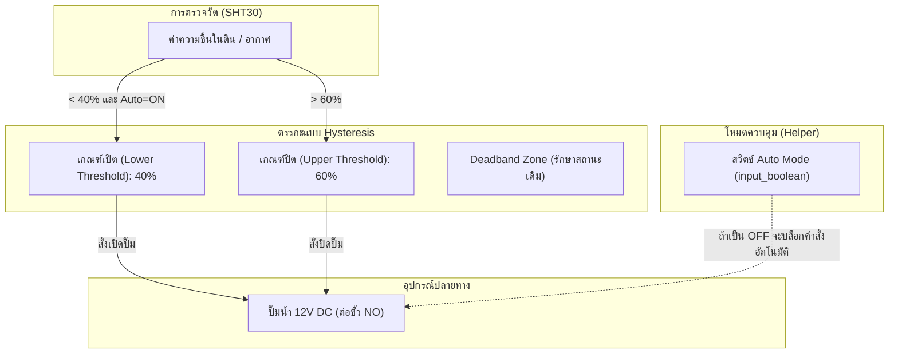

# 🧠 คู่มือการจัดกิจกรรมเชิงปฏิบัติการ: กิจกรรมที่ 4 — ตั้งกฎให้ระบบทำงานอัตโนมัติ (Think)
### คู่มือมาตรฐานสำหรับวิทยากร ผู้ช่วยสอน (TA) และผู้เรียน — โครงการ Smart Farm AIoT Workshop

---

## 📌 1. บทนำและแนวคิดวิศวกรรม (Think Principles)

ในระบบควบคุมจริง การตั้งกฎอัตโนมัติแบบชั้นเดียว (Single Threshold) มักนำไปสู่อันตรายร้ายแรงต่อเครื่องจักรทางกล เช่น การที่ปั๊มน้ำตัดต่อรัว ๆ เมื่อค่าเซนเซอร์แกว่งตัวรอบจุดตัด (Chattering Phenomenon)

**แนวคิดสำคัญในกิจกรรมที่ 4:**
1. **Chattering & Hunting Problem:** ปรากฏการณ์ที่สัญญาณรบกวน (Noise) ขนาดเล็ก ทำให้ค่าเซนเซอร์กระเพื่อมข้ามไปมาเหนือเส้นเกณฑ์ ส่งผลให้สวิตช์หรือรีเลย์สับต่อถี่ ๆ สร้างความเสียหายต่อหน้าสัมผัสและมอเตอร์
2. **Hysteresis Band (แถบความคลาดเคลื่อน):** การแยกเกณฑ์สั่งเปิด (Turn-on threshold) ให้อยู่ต่ำกว่าเกณฑ์สั่งปิด (Turn-off threshold) เพื่อสร้างระยะปลอดภัย
3. **Time-Window Conditions:** การจำกัดให้ระบบทำงานเฉพาะในช่วงเวลาที่เหมาะสม (เช่น รดน้ำเฉพาะช่วงเช้าตรู่ 06:00-08:00 หรือเปิดไฟช่วง 18:00-22:00)
4. **Manual Override (Input Boolean Helper):** สวิตช์ซอฟต์แวร์จำลองที่อนุญาตให้ผู้ใช้งานเลือกว่าจะให้ระบบทำงานอัตโนมัติ (Auto Mode) หรือควบคุมด้วยมือ (Manual Mode)

---

## ⏱️ 2. แผนการจัดการเรียนรู้และเวลา (Facilitator Time Matrix)

* **เวลารวม:** 50 นาที
* **รูปแบบการจัด:** ปฏิบัติการเชิงลึกด้านตรรกะระบบควบคุมอัตโนมัติและการป้องกันเครื่องจักรชำรุด

```mermaid
gantt
    title ลำดับขั้นตอนกิจกรรมที่ 4: Think (50 นาที)
    dateFormat  m
    axisFormat %M นาที
    section ปัญหา Chattering
    จำลองไฟกะพริบถี่ & สังเกตผล       :a1, 0, 10m
    section Hysteresis
    แยกเกณฑ์เปิด-ปิด (Hysteresis Band) :a2, after a1, 10m
    section เงื่อนไขเวลา & ปั๊ม
    เพิ่ม Time Condition & ต่อปั๊มน้ำ :a3, after a2, 15m
    section Auto/Manual & สรุป
    สร้าง Input Boolean & อภิปราย 4-Q  :a4, after a3, 15m
```



| ช่วงเวลา | กิจกรรมย่อย | บทบาทวิทยากร / TA | ผลลัพธ์ที่ต้องได้ |
| :--- | :--- | :--- | :--- |
| **00:00 - 10:00** | 4.1 สังเกตปัญหาไฟกะพริบ | ให้ตั้งเกณฑ์เปิดปิดที่ค่าเดียวกัน แล้วขยับเซนเซอร์ใกล้จุดเกณฑ์ให้เห็นการกะพริบ | ผู้เรียนเห็นปัญหา Chattering ด้วยตาตนเอง |
| **10:00 - 20:00** | 4.2 แก้ไขด้วย Hysteresis | สอนหลักการแยกเกณฑ์ เช่น เปิดเมื่อ < 40% ปิดเมื่อ > 60% | ระบบนิ่ง หลอดไฟไม่กะพริบแม้สัญญาณรบกวน |
| **20:00 - 35:00** | 4.3 & 4.6 เพิ่ม Time & สลับโหลดเป็นปั๊มน้ำ | เพิ่มเงื่อนไขเวลา และนำปั๊มน้ำ 12V มาต่อแทนหลอดไฟ | ปั๊มน้ำทำงานเฉพาะช่วงเวลาที่อนุญาต |
| **35:00 - 50:00** | 4.7 & 4.8 สร้างโหมด Auto/Manual & สรุป 4-Q | สร้าง Helper `input_boolean.farm_auto_mode` ใช้เป็น Condition | มีสวิตช์หน้าแดชบอร์ดสลับโหมด และบันทึกคำตอบ |

---

## 🔌 3. รายการอุปกรณ์และการเชื่อมต่อ (Hardware BOM & Interfacing)



| ลำดับ | รายการอุปกรณ์ | สเปก / คุณสมบัติ | หน้าที่ในระบบ |
| :---: | :--- | :--- | :--- |
| 1 | **ปั๊มน้ำแรงดันต่ำ 12V DC** | ปั๊มจุ่มหรือไดอะแฟรม 12V 1A-2A | จำลองระบบชลประทานในฟาร์มจริง |
| 2 | **หลอดไฟ LED 12V** | ใช้ในการทดลองสังเกตปัญหา Chattering ก่อนเปลี่ยนเป็นปั๊ม | โหลดทดสอบที่ไม่เสี่ยงต่อการชำรุดจากการสับถี่ |
| 3 | **Input Boolean Helper** | ฟีเจอร์ตัวแปรสวิตช์จำลองใน Home Assistant | เก็บสถานะสลับโหมด Manual / Automatic |
| 4 | **สายยางและภาชนะรองน้ำ** | สายยาง 8mm และแก้วน้ำ | ทดสอบการสูบน้ำจริง |

---

## 🧪 4. ขั้นตอนการทดลองอย่างละเอียดทีละขั้น (Step-by-Step Lab Protocol)

### ขั้นตอนที่ 4.1: จำลองและสังเกตปัญหาไฟกะพริบ (Chattering)
1. ตั้งเกณฑ์เปิดเมื่อแสง < 300 lx และปิดเมื่อแสง > 300 lx
2. ปรับระยะห่างวัตถุบังแสงให้อยู่ปริ่ม ๆ 300 lx
3. สังเกต: สัญญาณแอนะล็อกมี Noise รบกวนเล็กน้อย ทำให้ค่าแกว่ง 299 -> 301 -> 299 ส่งผลให้รีเลย์สับต่อรัว ๆ (เสียงคลิกถี่ หลอดไฟกะพริบ)
4. *อันตราย:* หากโหลดเป็นปั๊มน้ำ มอเตอร์จะไหม้ภายในเวลาไม่กี่นาที และหน้าสัมผัสรีเลย์จะเกิดประกายไฟอาร์กจนละลาย

### ขั้นตอนที่ 4.2: แก้ไขปัญหาด้วย Hysteresis (แยกเกณฑ์เปิด-ปิด)
1. สร้างแถบความต่าง (Deadband):
   * **เกณฑ์สั่งเปิด:** ความชื้นต่ำกว่า **40%**
   * **เกณฑ์สั่งปิด:** ความชื้นสูงกว่า **60%**
2. ระหว่างช่วง 40% ถึง 60% ระบบจะไม่เปลี่ยนสถานะใด ๆ (รักษาสถานะเดิมไว้)
3. ทดสอบเป่าลมและปล่อยให้แห้ง: สังเกตว่ารีเลย์จะเปิดครั้งเดียวจนน้ำชื้นถึง 60% แล้วจึงดับสนิท ไม่มีการกะพริบรัวอีกต่อไป

### ขั้นตอนที่ 4.3 & 4.4: เพิ่มเงื่อนไขจำกัดเวลาทำงาน (Time Condition)
1. ใน Automation เพิ่มส่วน **Condition**:
   * Condition Type: **Time**
   * After: `06:00:00`
   * Before: `18:00:00`
2. ทดสอบ: แม้ความชื้นจะต่ำกว่า 40% ในเวลากลางคืน ระบบก็จะไม่เปิดรดน้ำ

### ขั้นตอนที่ 4.6 & 4.7: สลับโหลดเป็นปั๊มน้ำและสร้างระบบรดน้ำ
1. ปิดสวิตช์กล่องไฟ 12V ปลดสายหลอดไฟออก แล้วต่อสายปั๊มน้ำ 12V เข้าขั้ว COM และ NO แทน
2. จุ่มท่อดูดน้ำลงในแก้วน้ำ เปิดกล่องไฟ และทดสอบรดน้ำตามเกณฑ์ความชื้น

### ขั้นตอนที่ 4.8: สร้างระบบสลับโหมด Auto และ Manual
1. ไปที่ **Settings** -> **Devices & Services** -> **Helpers** -> **Create Helper**
2. เลือก **Toggle** ตั้งชื่อว่า `farm_auto_mode` (ระบบรดน้ำอัตโนมัติ)
3. นำ Entity นี้ไปใส่ใน Condition ของกฎรดน้ำ: "State of `input_boolean.farm_auto_mode` is `on`"
4. หากเกษตรกรปิดสวิตช์นี้ กฎอัตโนมัติจะไม่ทำงาน เกษตรกรสามารถกดเปิดปิดปั๊มเองได้อิสระ

---

## 💻 5. โค้ดและการตั้งค่าสำเร็จรูป (Ready-to-use Configurations)

```yaml
# Automation ที่สมบูรณ์แบบพร้อม Hysteresis, Time Condition และ Auto/Manual Mode
alias: "Smart Farm - ระบบรดน้ำอัจฉริยะแบบ Robust"
description: "เปิดปั๊มเมื่อชื้นต่ำกว่า 40% เฉพาะเวลากลางวัน และเมื่อโหมด Auto เปิดอยู่"
trigger:
  - platform: numeric_state
    entity_id: sensor.gogo_iot_red_242dcc_khwamchun_humidity
    below: 40
condition:
  - condition: state
    entity_id: input_boolean.farm_auto_mode
    state: "on"
  - condition: time
    after: "06:00:00"
    before: "18:00:00"
action:
  - service: switch.turn_on
    target:
      entity_id: switch.gogo_relay_red_b97df0_riley_relay
  - service: persistent_notification.create
    data:
      title: "ระบบรดน้ำอัตโนมัติ"
      message: "ความชื้นต่ำกว่า 40% เริ่มเปิดปั๊มน้ำรดแปลงเรียบร้อยแล้ว"
mode: single
```

---

## 📝 6. แนวทางการตรวจคำตอบและเฉลยใบงาน (Answer Key & Discussion)

### เฉลยคำตอบและแนวทางการตรวจใบงาน (Activity 4 Worksheet)

1. **ข้อ 4.1 สังเกตปัญหาไฟกะพริบ:**
   * อาการที่พบ: หลอดไฟเปิด-ปิดถี่ สลับไปมา รีเลย์ส่งเสียงคลิกรัว
   * ผลเสียต่ออุปกรณ์จริง: หน้าสัมผัสรีเลย์อาร์กไหม้ มอเตอร์ปั๊มน้ำรับแรงกระชากจนขดลวดไหม้
2. **ข้อ 4.2 การตั้งค่า Hysteresis:**
   * เกณฑ์เปิด (Turn ON): 40%
   * เกณฑ์ปิด (Turn OFF): 60%
   * ระยะ Deadband: 20% (60% - 40%)
3. **ข้อ 4.8 การสร้างโหมดควบคุม:**
   * Entity Helper: `input_boolean.farm_auto_mode`
   * เมื่อสลับเป็น OFF: ระบบอัตโนมัติหยุดทำงานทั้งหมด ผู้ใช้กดปุ่ม Manual ได้อย่างปลอดภัย

---

### 💡 การอภิปรายเชิงวิศวกรรม (คำถาม 4-Q)
**คำถาม:** *ทำไมในระบบเกษตรอัจฉริยะเชิงพาณิชย์ จึงจำเป็นต้องมีสวิตช์ Manual Override ควบคู่กับระบบอัตโนมัติเสมอ?*
* **เฉลยเชิงวิศวกรรม:**
  1. **งานบำรุงรักษาและซ่อมบำรุง (Maintenance):** ช่างหรือเกษตรกรจำเป็นต้องทดสอบท่อ ไล่ลมในปั๊ม หรือซ่อมแซมสปริงเกลอร์โดยไม่ต้องการให้ระบบอัตโนมัติติดขึ้นมาเองกะทันหัน ซึ่งอาจทำให้เกิดอุบัติเหตุ
  2. **การให้ปุ๋ยและยาเฉพาะกิจ (Fertigation / Spraying):** มีหลายสถานการณ์ที่ต้องเปิดน้ำผสมปุ๋ยตามรอบเวลาพิเศษที่อยู่นอกเหนือกฎความชื้น
  3. **กรณีฉุกเฉิน (Emergency Fallback):** หากเซนเซอร์ชำรุดส่งค่าเพี้ยน เกษตรกรสามารถตัดเข้าระบบควบคุมด้วยมือทันทีเพื่อรักษาชีวิตของพืชในแปลงไว้ได้ทันท่วงที

---

## 🛠️ 7. การแก้ไขปัญหาหน้างานที่พบบ่อย (Troubleshooting FAQ)

| ปัญหาที่พบ | สาเหตุที่เป็นไปได้ | วิธีการแก้ไข |
| :--- | :--- | :--- |
| **ตั้ง Time Condition แล้วปั๊มไม่ยอมติด** | เวลาของ VirtualBox ไม่ตรงกับเวลาจริงในห้องเรียน | ตรวจสอบ Time Zone ใน Home Assistant (Settings -> System -> General -> Timezone ต้องเป็น `Asia/Bangkok`) |
| **ปิดโหมด Auto แล้วปั๊มยังเปิดอยู่** | กฎรดน้ำถูกกระตุ้นไปก่อนหน้าที่จะปิดสวิตช์ Auto | การปิดโหมด Auto เป็นเพียงการ "บล็อกกฎรอบถัดไป" หากต้องการให้ปั๊มดับทันทีที่ปิด Auto ต้องสร้าง Automation สั่ง Turn Off เมื่อ Helper เปลี่ยนเป็น off |
| **ปั๊มน้ำส่งเสียงร้องครางแต่น้ำไม่ไหล** | ปั๊มจุ่มมีฟองอากาศขังอยู่ด้านใน (Air Lock) หรือขั้วไฟกลับด้าน | เขย่าปั๊มในน้ำเพื่อไล่อากาศ และตรวจขั้วสายไฟว่าต่อถูกต้องตามลูกศรทางเดินน้ำหรือไม่ |

---

## 📊 8. เกณฑ์การประเมินผลการเรียนรู้ (Assessment Rubric)

| เกณฑ์การประเมิน | ดีเยี่ยม (4-5 คะแนน) | พอใช้ (2-3 คะแนน) | ต้องปรับปรุง (0-1 คะแนน) |
| :--- | :--- | :--- | :--- |
| **ความเข้าใจปัญหา Chattering (5 คะแนน)** | อธิบายกลไกการเกิด Chattering และผลกระทบต่อมอเตอร์ได้อย่างถูกต้อง | เห็นอาการไฟกะพริบแต่อธิบายสาเหตุเชิงลึกไม่ได้ | ไม่เข้าใจปัญหา |
| **การสร้าง Hysteresis Band (5 คะแนน)** | แยกเกณฑ์เปิดและปิดได้อย่างเหมาะสม และทดสอบระบบได้นิ่งสนิท | ตั้งเกณฑ์แยกกันแต่ระยะแคบเกินไปจนยังมีอาการแกว่ง | ตั้งเกณฑ์เปิดปิดที่ค่าเดียวกัน |
| **การผสาน Time & Helper (5 คะแนน)** | สร้าง Helper และใส่ Condition เวลาและ Auto Mode ได้อย่างสมบูรณ์ | สร้าง Helper ได้แต่ลืมนำไปผูกใน Automation | ไม่สามารถสร้าง Helper ได้ |
| **การตอบคำถามคิดวิเคราะห์ 4-Q (5 คะแนน)** | ชี้เหตุผลความปลอดภัยและการใช้งานจริงในแปลงเกษตรได้ครบถ้วน | ตอบได้เฉพาะเรื่องการซ่อมบำรุง | ไม่ได้ตอบคำถาม 4-Q |

---
*จัดทำขึ้นสำหรับการอบรมเชิงปฏิบัติการ Smart Farm AIoT Workshop (CMU & RBRU)*
