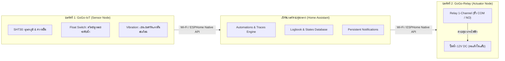
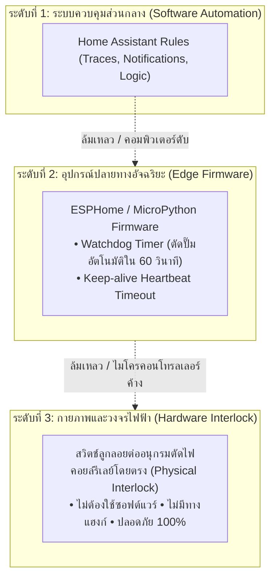

# 🛡️ คู่มือการจัดกิจกรรมเชิงปฏิบัติการ: กิจกรรมที่ 5 — จำลองปัญหาและเพิ่มระบบป้องกัน (Failure Lab)
### คู่มือมาตรฐานสำหรับวิทยากร ผู้ช่วยสอน (TA) และผู้เรียน — โครงการ Smart Farm AIoT Workshop

---

## 📌 1. บทนำและแนวคิดวิศวกรรมความปลอดภัย (Fail-safe Engineering)

ในระบบฟาร์มอัจฉริยะ (Smart Farm Automation) ข้อผิดพลาดทางกายภาพเป็นสิ่งที่ **หลีกเลี่ยงไม่ได้** ไม่ว่าจะเป็น แหล่งน้ำแห้ง, ปั๊มน้ำขัดข้อง, สายไฟหลุด, เซนเซอร์ชำรุด หรือบอร์ดไมโครคอนโทรลเลอร์ดับ หากระบบควบคุมอัตโนมัติทำงานโดยเชื่อถือข้อมูลเพียงด้านเดียว (Blind Trust) อาจส่งผลให้เกิดความเสียหายร้ายแรง เช่น:
1. **ปั๊มน้ำไหม้ (Pump Burnout):** จากการเดินแห้ง (Dry-run) เมื่อไม่มีน้ำในถัง
2. **น้ำท่วมขังแปลงพืช (Flooding/Root Rot):** เมื่อเซนเซอร์อ่านค่าไม่ได้แล้วปั๊มเปิดค้าง
3. **ระบบรดน้ำไม่ทำงานโดยไม่มีใครรู้ (Crop Damage):** สั่งเปิดรีเลย์แล้วแต่สายปั๊มหลุดหรือใบพัดติด

**วัตถุประสงค์ของกิจกรรมที่ 5:**
* มุ่งเน้นกระบวนการ **"จำลองปัญหา (Fault Injection) → สังเกตผลลัพธ์ (Observation) → ออกแบบกลไกป้องกัน (Fail-safe Implementation) → ทดสอบซ้ำ (Verification)"**
* ฝึกฝนการใช้เครื่องมือวินิจฉัยของ Home Assistant เช่น **Traces**, **Logbook** และ **Persistent Notification**
* วางแผนการบำรุงรักษาเชิงป้องกัน (Preventive Maintenance) ในระดับฟาร์มจริง
* ทำความเข้าใจข้อจำกัดของระบบซอฟต์แวร์ และการออกแบบระบบป้องกันระดับฮาร์ดแวร์ (Hardware Interlock)

---

## ⏱️ 2. แผนการจัดการเรียนรู้และเวลา (Facilitator Time Matrix)

* **เวลารวม:** 55 นาที
* **รูปแบบการจัด:** จับคู่กลุ่มข้างเคียง (Peer Review / Partner Checking) ร่วมกันตรวจสอบ Traces และผลการทดสอบ

```mermaid
gantt
    title ลำดับขั้นตอนกิจกรรมที่ 5 (55 นาที)
    dateFormat  m
    axisFormat %M นาที
    section ตรวจสอบความพร้อม
    ตรวจสถานะอุปกรณ์และบอร์ดทั้งสอง   :a1, 0, 5m
    section 5.1 น้ำหมด
    จำลอง Dry Run & เพิ่มกฎป้องกัน :a2, after a1, 10m
    section 5.2 สั่งแล้วไม่เดิน
    ถอดสายปั๊ม & ตั้งกฎตรวจการสั่น  :a3, after a2, 10m
    section 5.3 เซนเซอร์ดับ
    ปิดสวิตช์บอร์ด & ตั้งกฎ Unavailable :a4, after a3, 10m
    section 5.4 ปั๊มเดินนานเกิน
    จำลองน้ำไม่ขึ้น & ตั้งกฎ Safety Timeout :a5, after a4, 10m
    section 5.5 & สรุปผล
    วางแผนบำรุงรักษา & สรุปอภิปราย 5-Q :a6, after a5, 10m
```



| ช่วงเวลา | กิจกรรมย่อย | บทบาทวิทยากร / TA | ผลลัพธ์ที่ต้องได้ |
| :--- | :--- | :--- | :--- |
| **00:00 - 05:00** | ก่อนเริ่ม (Prep & Pre-flight) | ตรวจสอบว่าปั๊มต่ออยู่กับรีเลย์ และสวิตช์ลูกลอยแช่อยู่ในแก้วน้ำ (Wet) | ระบบพร้อมทดสอบ, โหมด Auto เปิดอยู่ |
| **05:00 - 15:00** | **5.1 น้ำหมด (Dry Run)** | แนะนำการยกสวิตช์ลูกลอยพ้นน้ำ (Dry) และสั่ง On เพื่อให้เห็นปัญหาปั๊มเดินแห้ง | สร้างกฎ `Fail-safe - น้ำหมด` และเพิ่ม Condition ในกฎเปิดปั๊ม |
| **15:00 - 25:00** | **5.2 สั่งแล้วปั๊มไม่เดิน** | ย้ำให้ถอดปลั๊กก่อนถอดสายที่ขั้ว NO ของรีเลย์ และดูสถานะ `pump_running` | สร้างกฎ `Fail-safe - สั่งแล้วไม่เดิน` ตัดที่ 15 วินาที |
| **25:00 - 35:00** | **5.3 บอร์ดเซนเซอร์ดับ** | ชี้ตำแหน่งสวิตช์ ON/OFF บนบอร์ด GoGo-IoT (ไม่ใช่ปุ่ม Boot) | สร้างกฎ `Fail-safe - เซนเซอร์หาย` เมื่อเป็น unavailable |
| **35:00 - 45:00** | **5.4 ปั๊มเดินนานเกินไป** | อธิบายสถานการณ์ท่อหลุดหรือความชื้นไม่ขึ้น | สร้างกฎ `Fail-safe - จำกัดเวลาเปิดปั๊ม` ตัดที่ 30 วินาที |
| **45:00 - 55:00** | **5.5 แผนบำรุงรักษา & สรุป** | นำผู้เรียนร่วมอภิปรายคำถาม 5-Q และตรวจตารางบำรุงรักษา 5 รายการ | บันทึกใบงานครบถ้วน และดาวน์โหลดไฟล์ JSON สำรอง |

---

## 🔌 3. รายการอุปกรณ์และการเชื่อมต่อ (Hardware BOM & Interfacing)



### รายการอุปกรณ์ประจำกลุ่ม (Hardware Checklist):
1. **บอร์ดประมวลผลเซนเซอร์ (GoGo-IoT ESP32):**
   * บอร์ดพร้อมแบตเตอรี่ในตัวและสวิตช์เปิด-ปิด (Slide Switch)
   * เซนเซอร์วัดอุณหภูมิและความชื้นอากาศ SHT30
   * เซนเซอร์วัดความเร่ง/ความสั่นสะเทือนแบบแกน (Accelerometer/Vibration)
   * สายต่อเซนเซอร์สวิตช์ลูกลอย (Float Switch) แบบ Dry Contact
2. **บอร์ดควบคุมรีเลย์ (GoGo-Relay ESP32):**
   * โมดูลรีเลย์ (Relay) พิกัด 10A 250VAC / 30VDC
   * ขั้วต่อสายไฟแบบ Terminal Block (COM = Common, NO = Normally Open)
3. **โหลดทดสอบ (Actuator Load):**
   * ปั๊มน้ำไดอะแฟรม 12V DC หรือหลอดไฟทดสอบ
   * สายไฟ DC ต่อเข้ากับหน้าสัมผัส NO ของรีเลย์
4. **อุปกรณ์จำลองสภาพแวดล้อม:**
   * แก้วน้ำทรงสูง สำหรับใส่สวิตช์ลูกลอย

---

## 🧪 4. รายละเอียดขั้นตอนการทดลองทั้ง 4 ฐาน (Lab Execution Guide)

---

### ฐานที่ 5.1: ปัญหาน้ำแห้งแต่ปั๊มยังเดิน (Low Water / Dry-run Protection)

#### 🔴 อาการปัญหา (The Problem)
เมื่อน้ำในถังเก็บลดต่ำลงจนหมด สวิตช์ลูกลอยจะตกลงและอ่านสถานะได้เป็น **Dry** (หน้าสัมผัสตัดวงจร) แต่ในกฎควบคุมอัตโนมัติเดิมตรวจดูเฉพาะ **ความชื้นอากาศ/ความชื้นดิน** เท่านั้น ทำให้ปั๊มน้ำยังคงถูกสั่งเปิดและเดินแห้ง (Dry Run) ส่งผลให้เกิดความร้อนสูง ใบพัดเสียหาย และมอเตอร์ไหม้

#### 🟢 กลไกการป้องกัน (Fail-safe Logic)
1. **ตรวจจับ 2 เหตุการณ์ (Dual Triggers):**
   * เมื่อสวิตช์ลูกลอยเปลี่ยนเป็น Dry (`Moisture cleared`) ในขณะที่ปั๊มกำลังเดินอยู่
   * เมื่อมีผู้ใช้หรือกฎอื่นสั่งเปิดรีเลย์ (`Switch turned on`) ในขณะที่น้ำแห้งอยู่แล้ว
2. **เงื่อนไขตรวจสอบ (Condition):**
   * ระดับน้ำเป็น Dry (`Moisture is not detected`)
3. **การกระทำ (Action):**
   * สั่งปิดรีเลย์ทันที (`Turn off switch`)
   * ส่งการแจ้งเตือนแบบปักหมุด (`Send persistent notification`) ข้อความ: `"น้ำในถังต่ำ หยุดปั๊มแล้ว"`
4. **ปรับปรุงกฎเดิม:**
   * ในกฎ `รดน้ำ - เปิดปั๊ม` ต้องเพิ่มเงื่อนไขว่าระดับน้ำต้องเป็น **Wet** เท่านั้นจึงจะอนุญาตให้ปั๊มเปิดได้

#### 📋 โค้ด YAML (Home Assistant):
```yaml
alias: Fail-safe - น้ำหมด
description: ตัดปั๊มทันทีถ้าน้ำในถังต่ำ (Dry) และมีคนสั่ง On หรือน้ำแห้งระหว่างทำงาน
trigger:
  - platform: state
    entity_id: binary_sensor.gogo_iot_red_242dcc_switchnam_float_switch
    to: "off"
  - platform: state
    entity_id: switch.gogo_relay_red_b97df0_riley_relay
    to: "on"
condition:
  - condition: state
    entity_id: binary_sensor.gogo_iot_red_242dcc_switchnam_float_switch
    state: "off"
action:
  - service: switch.turn_off
    target:
      entity_id: switch.gogo_relay_red_b97df0_riley_relay
  - service: persistent_notification.create
    data:
      title: "ระบบความปลอดภัย"
      message: "น้ำในถังต่ำ หยุดปั๊มแล้ว"
mode: single
```

---

### ฐานที่ 5.2: ปัญหาสั่งแล้วปั๊มไม่เดิน (Pump Stall / Disconnected Wire Detection)

#### 🔴 อาการปัญหา (The Problem)
สถานะของรีเลย์ในหน้าจอ Home Assistant แสดงเป็น **On** ยืนยันได้เพียงแค่ว่า "หน้าสัมผัสของรีเลย์ต่ออยู่" แต่ไม่ได้ยืนยันว่า "ปั๊มน้ำหมุนจริงหรือมีน้ำไหลจริง" หากสายไฟขาดใน, ขั้วต่อหลวม, ปั๊มติดขัด (Stall) หรือฟิวส์ขาด ผู้ใช้จะไม่ทราบเลยว่าแปลงเกษตรไม่ได้รับน้ำ

#### 🟢 กลไกการป้องกัน (Fail-safe Logic)
ใช้เซนเซอร์วัดแรงสั่นสะเทือน (Vibration Sensor) ที่ติดตั้งแนบชิดกับตัวปั๊ม เพื่อเป็น **สัญญาณตรวจยืนยันการทำงานจริง (Operational Feedback Loop)**
1. **Trigger:** รีเลย์เปิดค้างไว้เป็นเวลา 15 วินาที (`For at least: 15s`)
2. **Condition:** เซนเซอร์ตรวจจับการสั่นสะเทือนยังคงเป็น Off (`pump_running is off`)
3. **Action:**
   * สั่งปิดรีเลย์ (`Turn off switch`)
   * ส่งการแจ้งเตือน: `"สั่งปั๊มแล้วแต่ไม่มีการสั่น ตรวจสายและระดับน้ำ"`

#### 📋 โค้ด YAML (Home Assistant):
```yaml
alias: Fail-safe - สั่งแล้วไม่เดิน
description: ตัดการทำงานเมื่อสั่งเปิดปั๊มแล้วไม่มีแรงสั่นสะเทือนภายใน 15 วินาที
trigger:
  - platform: state
    entity_id: switch.gogo_relay_red_b97df0_riley_relay
    to: "on"
    for:
      seconds: 15
condition:
  - condition: state
    entity_id: binary_sensor.gogo_iot_red_242dcc_khwamsansatheuxn_vibration
    state: "off"
action:
  - service: switch.turn_off
    target:
      entity_id: switch.gogo_relay_red_b97df0_riley_relay
  - service: persistent_notification.create
    data:
      title: "ระบบความปลอดภัย"
      message: "สั่งปั๊มแล้วแต่ไม่มีการสั่น ตรวจสายและระดับน้ำ"
mode: single
```

---

### ฐานที่ 5.3: ปัญหาบอร์ดเซนเซอร์ดับหรือขาดการเชื่อมต่อ (Sensor Offline / Unavailable)

#### 🔴 อาการปัญหา (The Problem)
เมื่อบอร์ดเซนเซอร์ในสวนแบตเตอรี่หมด, ถูกตัดไฟ, หรือสัญญาณ Wi-Fi หลุด ค่าความชื้นใน Home Assistant จะกลายเป็น **unavailable** หรือ **unknown** หากไม่มีกฎป้องกัน รีเลย์ที่เปิดค้างอยู่จะไม่มีทางได้รับค่าความชื้นที่เพิ่มขึ้นเพื่อสั่งปิด ทำให้ปั๊มทำงานค้างตลอดเวลา

#### 🟢 กลไกการป้องกัน (Fail-safe Logic)
1. **Trigger:** เมื่อค่าความชื้นเปลี่ยนสถานะเป็น `unavailable` หรือ `unknown`
2. **Action:**
   * สั่งปิดรีเลย์ทันที (`Turn off switch`)
   * ส่งการแจ้งเตือน: `"ไม่ได้รับค่าจากเซนเซอร์ หยุดปั๊มเพื่อความปลอดภัย"`

#### 📋 โค้ด YAML (Home Assistant):
```yaml
alias: Fail-safe - เซนเซอร์หาย
description: สั่งหยุดปั๊มทันทีเมื่อบอร์ดเซนเซอร์ออฟไลน์หรืออ่านค่าไม่ได้
trigger:
  - platform: state
    entity_id: sensor.gogo_iot_red_242dcc_khwamchun_humidity
    to:
      - "unavailable"
      - "unknown"
action:
  - service: switch.turn_off
    target:
      entity_id: switch.gogo_relay_red_b97df0_riley_relay
  - service: persistent_notification.create
    data:
      title: "ระบบความปลอดภัย"
      message: "ไม่ได้รับค่าจากเซนเซอร์ หยุดปั๊มเพื่อความปลอดภัย"
mode: single
```

---

### ฐานที่ 5.4: ปัญหาปั๊มเดินนานเกินเวลา (Pump Overrun / Safety Timeout)

#### 🔴 อาการปัญหา (The Problem)
หากเกิดเหตุสุดวิสัย เช่น ท่อน้ำแตกหลุดกลางทาง ทำให้น้ำไม่ไหลไปถึงหัวรดน้ำและเซนเซอร์วัดความชื้นดินไม่ได้รับน้ำ ค่าความชื้นจะไม่ยอมขึ้นถึงเกณฑ์ปิด ปั๊มจะสูบน้ำทิ้งไปเรื่อยๆ จนน้ำหมดแหล่งกักเก็บ

#### 🟢 กลไกการป้องกัน (Fail-safe Logic)
กำหนด **เพดานเวลาทำงานสูงสุด (Maximum Run-time Limit / Safety Timeout)** ในการทดลองตั้งไว้ที่ 30 วินาที (ในการใช้งานจริงในแปลงอาจตั้งไว้ 5–15 นาทีตามความจุแปลง)
1. **Trigger:** รีเลย์เปิดค้างไว้เป็นเวลา 30 วินาที (`For at least: 30s`)
2. **Action:**
   * สั่งปิดรีเลย์ (`Turn off switch`)
   * ส่งการแจ้งเตือน: `"ปั๊มเดินเกินเวลา ตัดการทำงานแล้ว โปรดตรวจสอบ"`

#### 📋 โค้ด YAML (Home Assistant):
```yaml
alias: Fail-safe - จำกัดเวลาเปิดปั๊ม
description: ตัดปั๊มทันทีเมื่อทำงานต่อเนื่องครบ 30 วินาที ป้องกันน้ำท่วมหรือท่อแตก
trigger:
  - platform: state
    entity_id: switch.gogo_relay_red_b97df0_riley_relay
    to: "on"
    for:
      seconds: 30
action:
  - service: switch.turn_off
    target:
      entity_id: switch.gogo_relay_red_b97df0_riley_relay
  - service: persistent_notification.create
    data:
      title: "ระบบความปลอดภัย"
      message: "ปั๊มเดินเกินเวลา ตัดการทำงานแล้ว โปรดตรวจสอบ"
mode: single
```

---

## 📅 5. แผนการบำรุงรักษาเชิงป้องกัน (Preventive Maintenance Planning)

การป้องกันด้วยซอฟต์แวร์ไม่สามารถทดแทนการดูแลอุปกรณ์กายภาพได้ วิทยากรควรให้ผู้เรียนร่วมกันวางแผนการบำรุงรักษาตามมาตรฐาน 5 ด้าน:

| รายการอุปกรณ์ | บทบาทผู้รับผิดชอบ | รอบความถี่ | สิ่งที่ต้องตรวจเช็กและวิธีการปฏิบัติ |
| :--- | :--- | :--- | :--- |
| **1. เซนเซอร์บนบอร์ด (SHT30)** | เจ้าของฟาร์ม / เกษตรกร | ทุก 1 สัปดาห์ | ตรวจดูคราบฝุ่นละออง ใยแมงมุม หรือตะไคร่น้ำบนตัวป้องกันเซนเซอร์ เช็ดทำความสะอาดเบาๆ ด้วยแปรงขนนุ่มแห้ง และตรวจเทียบค่าอุณหภูมิ/ความชื้นกับเทอร์โมมิเตอร์มาตรฐาน |
| **2. สวิตช์ลูกลอย (Float Switch)** | คนงานประจำแปลง / ผู้ดูแล | ทุก 3 วัน | ทดสอบใช้มือขยับแกนลูกลอยขึ้น-ลง ตรวจสอบว่าไม่ติดขัด ล้างคราบตะกรัน ตะไคร่ และเศษขยะที่อาจเข้าไปขัดขวางการเคลื่อนที่ของลูกลอย |
| **3. ปั๊มน้ำและระบบท่อส่งน้ำ** | ช่างประจำฟาร์ม | ทุก 1 เดือน | ตรวจรอยรั่วซึมตามข้อต่อท่อ ถอดล้างตะแกรงกรองทางดูด (Strainer) ตรวจฟังเสียงการทำงานที่ผิดปกติ วัดอุณหภูมิความร้อนที่ตัวเรือนมอเตอร์ และตรวจวัดระดับการสั่นสะเทือน |
| **4. รีเลย์และตู้ควบคุม (Control Box)** | ช่างไฟฟ้า | ทุก 3 เดือน | ตรวจขันสกรูขั้วต่อสายไฟทุกจุดให้แน่น ตรวจหารอยไหม้หรือคราบเขม่าที่หน้าสัมผัสรีเลย์ ตรวจดูความชื้น ซีลยางกันน้ำ และสารดูดความชื้น (Silica gel) ภายในตู้ |
| **5. เครือข่ายและระบบ Home Assistant** | ผู้ดูแลระบบไอที / เจ้าของฟาร์ม | ทุก 1 สัปดาห์ | ตรวจเช็กสถานะการเชื่อมต่อ Wi-Fi และค่าความแรงสัญญาณ (RSSI), ตรวจสอบพื้นที่ว่างบนดิสก์ของเครื่องโฮสต์ ทำการสำรองข้อมูล (Backup Automation & Database) และรีสตาร์ตระบบตามรอบการบำรุงรักษา |

---

## 🧠 6. การอภิปรายเชิงวิศวกรรม: สถาปัตยกรรมการป้องกันหลายระดับ (Defense in Depth)

### คำถามท้ายกิจกรรมที่ 5 (Key Discussion Question):
> *"ถ้าเราตั้งกฎป้องกันทั้ง 4 ข้อใน Home Assistant ไว้อย่างสมบูรณ์แล้ว แต่วันหนึ่งเครื่องคอมพิวเตอร์ที่รัน Home Assistant เกิดแฮงก์ ดับ หรือเครือข่ายล่ม กฎเหล่านี้ยังช่วยเราได้หรือไม่ และเราควรเพิ่มการป้องกันไว้ที่ใด?"*



### สรุปหลักการออกแบบเชิงอุตสาหกรรม (Engineering Principles):
1. **ซอฟต์แวร์ส่วนกลาง (Software Layer):** มีความยืดหยุ่นสูง ปรับแต่งตรรกะได้ง่าย แจ้งเตือนได้รวดเร็ว แต่มีความเสี่ยงที่จะล้มเหลวจาก OS, เครือข่าย หรือเซิร์ฟเวอร์
2. **เฟิร์มแวร์ปลายทาง (Firmware Layer):** ติดตั้ง Safety Watchdog บนบอร์ดรีเลย์ ESP32 โดยตรง เช่น ตั้งเวลา `on_turn_on: delay 60s -> switch.turn_off` หรือตรวจจับ Heartbeat หากไม่ได้รับคำสั่งจาก HA ภายใน 30 วินาที ให้สั่งตัดปั๊มเอง
3. **ฮาร์ดแวร์อินเตอร์ล็อก (Hardware Interlock Layer):** เป็นระดับความปลอดภัยสูงสุด (Fail-safe True Physical Loop) โดยนำหน้าสัมผัสของสวิตช์ลูกลอยไปต่อ **อนุกรม (Series)** เข้ากับสายไฟเลี้ยงคอยล์ของรีเลย์ หรือต่ออนุกรมกับปั๊มน้ำโดยตรง ทำให้น้ำหมดเมื่อใด วงจรไฟฟ้าจะถูกตัดขาดทางกายภาพทันที แม้คอมพิวเตอร์จะพังหรือไมโครคอนโทรลเลอร์จะแฮงก์ก็ตาม

---

## 🎯 7. เกณฑ์การประเมินผลการเรียนรู้ (Assessment Rubric)

| หัวข้อประเมิน | ระดับดีเยี่ยม (3 คะแนน) | ระดับผ่านเกณฑ์ (2 คะแนน) | ต้องปรับปรุง (1 คะแนน) |
| :--- | :--- | :--- | :--- |
| **1. การจำลองปัญหา (Fault Injection)** | จำลองสถานการณ์ทั้ง 4 ฐานได้ถูกต้องครบถ้วน และอธิบายพฤติกรรมผิดปกติได้อย่างแม่นยำ | จำลองสถานการณ์ได้ 3 ฐาน และสังเกตพฤติกรรมได้ถูกต้อง | จำลองสถานการณ์ไม่ได้ หรือไม่เข้าใจอาการปัญหา |
| **2. การสร้างกฎความปลอดภัย (Automation Logic)** | สร้างกฎ Automation ใน HA ถูกต้องครบทั้ง Trigger, Condition, Action และมี Notification ครบ 4 กฎ | สร้างกฎได้ถูกต้อง 3 กฎ และสามารถตัดการทำงานของปั๊มได้ | กฎไม่ทำงาน หรือระบุ Entity ID ไม่ถูกต้อง |
| **3. การตรวจวิเคราะห์ (Traces & Diagnostics)** | สามารถเปิด Traces เพื่อยืนยันว่ากฎใดเป็นผู้สั่งตัดปั๊ม และอธิบายเส้นทาง Step execution ได้ | ดู Traces ได้แต่ยังอธิบายเงื่อนไขที่ผ่าน/ไม่ผ่านได้ไม่ครบถ้วน | ไม่สามารถเปิดหรือดู Traces ได้ |
| **4. แผนบำรุงรักษา & สรุปผล** | กรอกตารางบำรุงรักษาครบ 5 ข้อ และอธิบายแนวคิด Hardware Interlock ได้อย่างถูกต้องชัดเจน | กรอกตารางครบถ้วน แต่อธิบายแนวคิด Interlock ได้บางส่วน | กรอกตารางไม่ครบถ้วน หรือขาดคำอธิบายเชิงป้องกัน |

---

## ❓ 8. ปัญหาที่พบบ่อยและวิธีแก้ไขสำหรับผู้จัดกิจกรรม (Facilitator Troubleshooting)

1. **ปัญหา: ผู้เรียนยกสวิตช์ลูกลอยเป็น Dry แล้วสั่ง On แต่ปั๊มไม่ตัด**
   * *สาเหตุ:* ลืมเพิ่ม Condition ในกฎ `Fail-safe - น้ำหมด` หรือเลือก Entity สวิตช์ลูกลอยผิดบอร์ด
   * *วิธีแก้:* ให้ตรวจเช็กชื่อ Entity ของกลุ่มตนเองให้ถูกต้อง (`binary_sensor.gogo_iot_..._switchnam_float_switch`) และตรวจว่าสถานะในหน้าจอเปลี่ยนเป็น Dry จริงหรือไม่
2. **ปัญหา: ในข้อ 5.4 ปั๊มถูกตัดก่อนครบ 30 วินาที (ตัดที่ประมาณ 15 วินาที)**
   * *สาเหตุ:* บอร์ด GoGo-IoT วางห่างจากตัวปั๊ม ทำให้ตรวจไม่พบแรงสั่นสะเทือน กฎข้อ 5.2 (`Fail-safe - สั่งแล้วไม่เดิน`) จึงทำงานตัดก่อน
   * *วิธีแก้:* ขยับบอร์ด GoGo-IoT ให้แตะชิดกับตัวเรือนปั๊มน้ำ หรือเพิ่มค่าความไวของการสั่นสะเทือนในหน้าแดชบอร์ด
3. **ปัญหา: ปิดสวิตช์บอร์ดในข้อ 5.3 แล้ว สถานะใน Home Assistant ไม่เปลี่ยนเป็น unavailable ทันที**
   * *สาเหตุ:* Home Assistant รอเวลา Timeout ของการเชื่อมต่อ ESPHome Native API (ประมาณ 5–15 วินาที)
   * *วิธีแก้:* ให้ผู้เรียนรอประมาณ 10–15 วินาที สถานะจะเปลี่ยนเป็น unavailable และกฎจะทำงานตามลำดับ

---
*เอกสารนี้จัดทำขึ้นสำหรับโครงการฝึกอบรม Smart Farm AIoT & Cloud Automation สามารถนำไปปรับใช้ ทำซ้ำ และเผยแพร่เพื่อการศึกษาได้*
