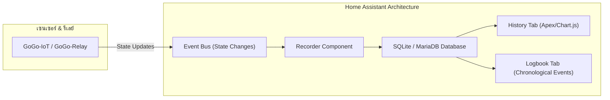

# 📈 คู่มือการจัดกิจกรรมเชิงปฏิบัติการ: กิจกรรมที่ 6 — การอ่านข้อมูลที่บันทึกไว้ย้อนหลัง (History)
### คู่มือมาตรฐานสำหรับวิทยากร ผู้ช่วยสอน (TA) และผู้เรียน — โครงการ Smart Farm AIoT Workshop

---

## 📌 1. บทนำและแนวคิดวิศวกรรม (History Principles)

ข้อมูลเซนเซอร์แบบเรียลไทม์บอกได้เพียงว่า "ขณะนี้เกิดอะไรขึ้น" แต่การทำความเข้าใจพฤติกรรมพืช สภาพอากาศ และความผิดปกติของเครื่องจักร จำเป็นต้องอาศัย **"ข้อมูลอนุกรมเวลาในอดีต" (Historical Time-Series Data)**

**แนวคิดสำคัญในกิจกรรมที่ 6:**
1. **Time-Series Database & Recorder:** กลไกการจัดเก็บข้อมูลของ Home Assistant ที่บันทึกทุก State Change พร้อมประทับเวลา (Timestamp)
2. **Logbook Audit Trail:** บันทึกปูมเหตุการณ์ที่ระบุชัดเจนว่า "ใครหรือกฎข้อใด" เป็นผู้สั่งเปิด/ปิดอุปกรณ์ในเวลาใด
3. **Diurnal Cycle Analysis:** วงจรรอบวันของอุณหภูมิและความชื้น (สัมพันธ์แบบผกผัน: เมื่อแดดออกอุณหภูมิพุ่งสูง ความชื้นสัมพัทธ์จะลดต่ำลง)
4. **Data Gap Forensics:** ร่องรอยของข้อมูลที่ขาดหายไปบนกราฟ (เส้นกราฟขาดเป็นช่องว่าง) ซึ่งเป็นหลักฐานสำคัญของปัญหาเครือข่ายหลุดหรือไฟดับ

---

## ⏱️ 2. แผนการจัดการเรียนรู้และเวลา (Facilitator Time Matrix)

* **เวลารวม:** 45 นาที
* **รูปแบบการจัด:** ปฏิบัติการวิเคราะห์ข้อมูลและตรวจสอบไทม์ไลน์เชิงลึก (Timeline & Forensic Analysis)

```mermaid
gantt
    title ลำดับขั้นตอนกิจกรรมที่ 6: History (45 นาที)
    dateFormat  m
    axisFormat %M นาที
    section สำรวจกราฟ
    เปิดแท็บ History & ปรับแกนเวลา   :a1, 0, 10m
    section ตรวจสอบเหตุการณ์
    จับคู่ยอดกราฟกับการทดลองที่ผ่านมา :a2, after a1, 10m
    section วิเคราะห์ตัวเลข
    หาค่า Min / Max & ความชัน      :a3, after a2, 15m
    section หาสาเหตุข้อมูลขาด
    วิเคราะห์ช่องว่าง & สรุป 6-Q     :a4, after a3, 10m
```



| ช่วงเวลา | กิจกรรมย่อย | บทบาทวิทยากร / TA | ผลลัพธ์ที่ต้องได้ |
| :--- | :--- | :--- | :--- |
| **00:00 - 10:00** | 6.1 เปิดกราฟดูข้อมูลย้อนหลัง | แนะนำการเข้าแท็บ History การเลือก Entity และการซูมช่วงเวลา 1h / 24h | ดึงกราฟความชื้นและรีเลย์ขึ้นมาดูได้ |
| **10:00 - 20:00** | 6.2 เชื่อมกราฟกับการทดลอง | ชี้ให้ดูจุดที่ผู้เรียนเป่าลมร้อน (Spike) และจุดที่สั่งปั๊มทำงาน | ผู้เรียนจับคู่ยอดกราฟกับสิ่งที่ทำในแล็บได้ |
| **20:00 - 35:00** | 6.3 อ่านค่าต่ำสุด-สูงสุด | สอนวิธีเอาเมาส์ Hover บนเส้นเพื่ออ่านตัวเลข Min, Max และคำนวณช่วงการเปลี่ยนแปลง | บันทึกค่าตัวเลขลงในตารางใบงาน |
| **35:00 - 45:00** | 6.4 วินิจฉัยข้อมูลขาดหาย & 6-Q | ชี้ให้เห็นเส้นกราฟที่ขาดช่วงจากการถอดสายไฟในกิจกรรมที่ 5 และอภิปราย 6-Q | สรุปสาเหตุ Data Gap และผลของการเก็บข้อมูลถี่เกิน |

---

## 🔌 3. รายการอุปกรณ์และการเชื่อมต่อ (Hardware BOM & Interfacing)



| ลำดับ | รายการอุปกรณ์ | สเปก / คุณสมบัติ | หน้าที่ในระบบ |
| :---: | :--- | :--- | :--- |
| 1 | **Home Assistant Database** | SQLite Database (ค่าเริ่มต้น) บันทึกย้อนหลัง 10 วัน | เก็บข้อมูลค่าตัวเลขและสถานะการเปลี่ยนสถานะ |
| 2 | **History Component** | เครื่องมือพล็อตกราฟเส้นอนุกรมเวลาในตัว HA | แสดงแนวโน้มและการเปลี่ยนแปลงของข้อมูล |
| 3 | **Logbook Component** | ปูมบันทึกเหตุการณ์แบบเรียงตามเวลา | ตรวจสอบย้อนหลังว่าระบบหรือผู้ใช้คนใดสั่งการ |

---

## 🧪 4. ขั้นตอนการทดลองอย่างละเอียดทีละขั้น (Step-by-Step Lab Protocol)

### ขั้นตอนที่ 6.1: การเปิดกราฟดูข้อมูลย้อนหลัง
1. ในแถบเมนูด้านซ้ายของ Home Assistant คลิกที่ไอคอน **History**
2. คลิกเลือก Entity:
   * เซนเซอร์ความชื้น (`sensor.gogo_iot_xxxxxx_humidity`)
   * เซนเซอร์อุณหภูมิ (`sensor.gogo_iot_xxxxxx_temperature`)
   * สถานะสวิตช์รีเลย์ (`switch.gogo_relay_xxxxxx_relay`)
3. เลือกช่วงเวลา: ปรับจากแถบด้านบนเป็น "Today" หรือเลือกช่วง 2 ชั่วโมงล่าสุด

### ขั้นตอนที่ 6.2: เชื่อมโยงกราฟกับการทดลองในแล็บ
1. เลื่อนเมาส์ไปตามเส้นกราฟ สังเกตยอดกราฟ (Peak/Spike):
   * จุดที่กราฟความชื้นพุ่งขึ้นแตะ 90%+ คือช่วงเวลาที่มีการเป่าลมชื้นในกิจกรรมที่ 1
   * แถบสีของสวิตช์รีเลย์ที่เปลี่ยนเป็นสีเขียว คือช่วงที่มีการสั่งเปิดปั๊มน้ำ
2. เปิดแท็บ **Logbook** ควบคู่กัน เพื่อดูว่าเวลานั้นเกิดจาก Automation ตัวใดเป็นผู้สั่งงาน

### ขั้นตอนที่ 6.3: การอ่านค่าต่ำสุด-สูงสุด (Min/Max & Trends)
1. นำเมาส์ไปชี้ที่จุดต่ำสุดของกราฟ บันทึกค่า Min และเวลา
2. ชี้ที่จุดสูงสุดของกราฟ บันทึกค่า Max และเวลา
3. คำนวณช่วงการแกว่งตัว $\Delta = 	ext{Max} - 	ext{Min}$

### ขั้นตอนที่ 6.4: หาสาเหตุของข้อมูลที่ขาดหาย (Data Gaps)
1. เลื่อนดูกราฟในช่วงกิจกรรมที่ 5 ที่ผ่านมา สังเกตบางช่วงเส้นกราฟขาดหายไป (เป็นช่องว่างสีเทา)
2. เทียบเวลากับการทดลอง: ช่องว่างนั้นตรงกับจังหวะที่ผู้เรียนปิดสวิตช์บอร์ด หรือถอดสาย USB
3. สรุปความหมาย: เส้นกราฟที่ขาดช่วงแสดงว่า Home Assistant ขาดการติดต่อกับอุปกรณ์ ไม่ได้รับข้อมูลตัวเลขใด ๆ เข้ามาในฐานข้อมูล

---

## 💻 5. โค้ดและการตั้งค่าสำเร็จรูป (Ready-to-use Configurations)

```yaml
# ตัวอย่างการตั้งค่า Recorder ใน configuration.yaml เพื่อจำกัดขนาดฐานข้อมูล
recorder:
  purge_keep_days: 7  # เก็บลบข้อมูลเก่าที่เกิน 7 วันออกอัตโนมัติ
  commit_interval: 10 # รวมข้อมูลเขียนลงดิสก์ทุก 10 วินาทีเพื่อถนอม SSD
  include:
    entities:
      - sensor.gogo_iot_red_242dcc_khwamchun_humidity
      - switch.gogo_relay_red_b97df0_riley_relay
```

---

## 📝 6. แนวทางการตรวจคำตอบและเฉลยใบงาน (Answer Key & Discussion)

### เฉลยคำตอบและแนวทางการตรวจใบงาน (Activity 6 Worksheet)

1. **ข้อ 6.2 การจับคู่ยอดกราฟ:**
   * ยอดความชื้นพุ่งสูงสัมพันธ์กับการเป่าลมร้อนในกิจกรรมที่ 1
   * แถบสวิตช์ On สัมพันธ์กับการทดสอบเปิดไฟในกิจกรรมที่ 2 และ 3
2. **ข้อ 6.3 ค่าต่ำสุด-สูงสุด:**
   * ค่าความชื้น Min: ~55 - 65% / Max: ~88 - 98%
   * อุณหภูมิ Min: ~27.5 °C / Max: ~32.0 °C
3. **ข้อ 6.4 สาเหตุของกราฟแหว่ง (Data Gap):**
   * เกิดจากการปิดสวิตช์บอร์ด GoGo-IoT หรือการหลุดของการเชื่อมต่อ Wi-Fi ในกิจกรรมที่ 5

---

### 💡 การอภิปรายเชิงวิศวกรรม (คำถาม 6-Q)
**คำถาม:** *หากตั้งความถี่ในการบันทึกข้อมูลของเซนเซอร์ให้ถี่มากเกินไป (เช่น ส่งทุก 0.1 วินาที แทนที่จะเป็นทุก 1-5 นาที) จะส่งผลเสียอย่างไรต่อระบบฟาร์มอัจฉริยะ?*
* **เฉลยเชิงวิศวกรรม:**
  1. **Database Bloat & Storage Exhaustion:** ขนาดฐานข้อมูลจะขยายตัวเร็วมาก การบันทึกทุก 0.1 วินาทีจะสร้างข้อมูลถึง 864,000 จุดต่อเซนเซอร์ในวันเดียว ทำให้พื้นที่ดิสก์ (SD Card/SSD) เต็มอย่างรวดเร็ว
  2. **Wear-out of Storage Media:** หน่วยความจำแบบ Flash (SD Card บน Raspberry Pi) จะเสื่อมสภาพและพังอย่างรวดเร็วจากการเขียนข้อมูลซ้ำ ๆ ไม่หยุด
  3. **High Power Consumption:** หากเป็นเซนเซอร์ที่ใช้แบตเตอรี่และโซลาร์เซลล์ การตื่นมาส่งข้อมูลถี่จะทำให้พลังงานหมดภายในเวลาไม่กี่ชั่วโมง
  4. **Network Congestion:** ทราฟฟิกในวง Wi-Fi ฟาร์มจะแออัดโดยไม่จำเป็น ในทางการเกษตร ค่าความชื้นและอุณหภูมิเปลี่ยนแปลงช้า การบันทึกทุก 1 ถึง 5 นาทีก็เพียงพอต่อการควบคุมแล้ว

---

## 🛠️ 7. การแก้ไขปัญหาหน้างานที่พบบ่อย (Troubleshooting FAQ)

| ปัญหาที่พบ | สาเหตุที่เป็นไปได้ | วิธีการแก้ไข |
| :--- | :--- | :--- |
| **เปิดหน้า History แล้วกราฟไม่ยอมโหลด** | ช่วงเวลาที่เลือกกว้างเกินไป (เช่น 7 วัน) ฐานข้อมูลใหญ่ | ปรับตัวกรองช่วงเวลาให้แคบลงเหลือ 1-2 ชั่วโมงล่าสุด |
| **เส้นกราฟความชื้นเป็นเส้นตรงเรียบสนิท** | เซนเซอร์ค้าง หรือไม่มีการเปลี่ยนแปลงค่า | ลองเป่าลมร้อนที่เซนเซอร์ แล้วกด Refresh เบราว์เซอร์ |
| **เวลาบนแกนนอนของกราฟไม่ตรงกับนาฬิกา** | Timezone ของเซิร์ฟเวอร์ยังเป็น UTC | ไปที่ Settings -> System -> General ปรับ Time Zone เป็น `Asia/Bangkok` |

---

## 📊 8. เกณฑ์การประเมินผลการเรียนรู้ (Assessment Rubric)

| เกณฑ์การประเมิน | ดีเยี่ยม (4-5 คะแนน) | พอใช้ (2-3 คะแนน) | ต้องปรับปรุง (0-1 คะแนน) |
| :--- | :--- | :--- | :--- |
| **การใช้งานแท็บ History (5 คะแนน)** | เรียกดูและเลือก Entity เซนเซอร์และรีเลย์ได้อย่างคล่องแคล่ว | เรียกดูได้แต่ปรับแกนเวลาไม่คล่อง | ไม่สามารถเปิดหน้ากราฟดูได้ |
| **การจับคู่เหตุการณ์ (5 คะแนน)** | ระบุจุดเชื่อมโยงระหว่างการทดลองในห้องกับยอดกราฟได้อย่างแม่นยำ | บอกยอดกราฟได้แต่ไม่แน่ใจว่าเกิดจากขั้นตอนใด | จับคู่เหตุการณ์ไม่ได้ |
| **การอ่านค่า Min/Max (5 คะแนน)** | อ่านค่าตัวเลขและเวลาได้อย่างถูกต้องพร้อมหน่วย | อ่านค่าได้แต่ระบุเวลาคลาดเคลื่อน | อ่านค่ากราฟไม่ถูกต้อง |
| **การตอบคำถามคิดวิเคราะห์ 6-Q (5 คะแนน)** | อธิบายผลเสียของการบันทึกข้อมูลถี่เกินไปทั้ง 4 มิติได้ครบถ้วน | ตอบได้เฉพาะเรื่องพื้นที่ดิสก์เต็ม | ไม่ได้ตอบคำถาม 6-Q |

---
*จัดทำขึ้นสำหรับการอบรมเชิงปฏิบัติการ Smart Farm AIoT Workshop (CMU & RBRU)*
