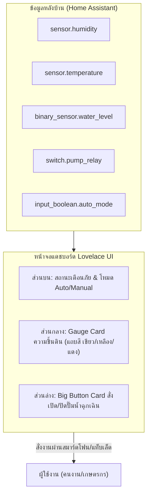

# 📊 คู่มือการจัดกิจกรรมเชิงปฏิบัติการ: กิจกรรมที่ 7 — สร้างหน้าจอติดตามและควบคุมฟาร์ม (Dashboard)
### คู่มือมาตรฐานสำหรับวิทยากร ผู้ช่วยสอน (TA) และผู้เรียน — โครงการ Smart Farm AIoT Workshop

---

## 📌 1. บทนำและแนวคิดวิศวกรรม (Dashboard Principles)

หน้าจอแดชบอร์ดที่ดีไม่ใช่หน้าจอที่มีข้อมูลมากที่สุด แต่เป็นหน้าจอที่ **"แสดงข้อมูลที่ถูกต้อง ให้แก่คนที่ถูกคน ในเวลาที่ต้องการ"** เพื่อให้การตัดสินใจสั่งการเกิดขึ้นได้อย่างรวดเร็วและไม่ผิดพลาด

**แนวคิดสำคัญในกิจกรรมที่ 7:**
1. **User Persona (กลุ่มผู้ใช้งานในฟาร์ม):**
   * **เจ้าของฟาร์ม / ผู้บริหาร:** ต้องการดูภาพรวมรายวัน สรุปสถานะ สภาพอากาศ และความพร้อมของระบบ
   * **คนงานหน้าแปลง:** ต้องการปุ่มกดสั่งงานขนาดใหญ่ แสดงสถานะปั๊มชัดเจน มองเห็นง่ายกลางแดด
   * **ช่างเทคนิค:** ต้องการดูระดับแบตเตอรี่ ความแรงสัญญาณ Wi-Fi และข้อความแจ้งเตือนความผิดพลาด
2. **Information Hierarchy (การจัดลำดับการรับรู้):** วางข้อมูลสำคัญที่สุด (Critical Status) ไว้บนสุด ตามด้วยเกจวัดค่าหลัก และปุ่มควบคุม
3. **Lovelace UI Cards:** โมดูลการ์ดแสดงผลมาตรฐานของ Home Assistant เช่น **Gauge Card** (เกจวัดเข็มพร้อมแถบสี), **Entities Card** (รายการสวิตช์), และ **Button Card** (ปุ่มกดด่วน)
4. **Peer Usability Testing:** การทดสอบให้ผู้อื่นลองสั่งงานโดยไม่อธิบาย เพื่อค้นหาจุดบกพร่องในการออกแบบ

---

## ⏱️ 2. แผนการจัดการเรียนรู้และเวลา (Facilitator Time Matrix)

* **เวลารวม:** 45 นาที
* **รูปแบบการจัด:** ปฏิบัติการออกแบบหน้าจอและสลับให้เพื่อนต่างกลุ่มทดสอบการใช้งานจริง (Peer Usability Testing)

```mermaid
gantt
    title ลำดับขั้นตอนกิจกรรมที่ 7: Dashboard (45 นาที)
    dateFormat  m
    axisFormat %M นาที
    section วิเคราะห์ Persona
    เลือกกลุ่มเป้าหมาย & วางโครงสร้าง :a1, 0, 10m
    section สร้างแดชบอร์ด
    เพิ่ม Gauge, Button, Entities Cards :a2, after a1, 20m
    section ทดสอบกับเพื่อน
    สลับให้เพื่อนกด & ประเมินผล     :a3, after a2, 10m
    section ปรับปรุง & สรุป
    บันทึกข้อเสนอแนะ & อภิปราย 7-Q   :a4, after a3, 5m
```



| ช่วงเวลา | กิจกรรมย่อย | บทบาทวิทยากร / TA | ผลลัพธ์ที่ต้องได้ |
| :--- | :--- | :--- | :--- |
| **00:00 - 10:00** | 7.1 กำหนด Persona & วางผัง | อธิบายความต่างระหว่างหน้าจอเจ้าของฟาร์มกับคนงาน ให้เลือกโจทย์ 1 แบบ | แผนผังหน้าจอคร่าว ๆ ในกระดาษ/ใบงาน |
| **10:00 - 30:00** | 7.2 & 7.3 สร้างแดชบอร์ด Lovelace | แนะนำการกด Edit Dashboard -> Add Card สร้าง Gauge, Entities, Button | แดชบอร์ดที่ใช้งานได้จริง มีเกจและปุ่มกด |
| **30:00 - 40:00** | 7.4 ให้เพื่อนต่างกลุ่มทดลองใช้ | ให้สลับเครื่องกันลองกดสั่งปั๊ม และสังเกตว่าเพื่อนกดถูกหรือไม่ | บันทึกผล Usability Feedback |
| **40:00 - 45:00** | สรุปผลและอภิปราย 7-Q | สรุปหลัก UX สำหรับเกษตรกรหน้างาน และตอบคำถาม 7-Q | สรุปผลลงใบงานครบถ้วน |

---

## 🔌 3. รายการอุปกรณ์และการเชื่อมต่อ (Hardware BOM & Interfacing)



| ลำดับ | การ์ดใน Home Assistant | ชนิดการ์ด | ประโยชน์การใช้งาน |
| :---: | :--- | :--- | :--- |
| 1 | **Gauge Card** | เกจวัดเข็มครึ่งวงกลม | แสดงค่าความชื้นสัมพัทธ์ พร้อมแบ่งช่วงสี (เขียว=พอดี, แดง=แห้งแล้ง) |
| 2 | **Button Card** | ปุ่มสัมผัสขนาดใหญ่ | สั่งเปิด-ปิดปั๊มน้ำได้สะดวกรวดเร็ว แม้ใช้งานบนมือถือ |
| 3 | **Entities Card** | การ์ดรวมรายการสวิตช์ | รวมสวิตช์ Auto Mode และสถานะสวิตช์ลูกลอย |
| 4 | **History Graph Card** | มินิกราฟเส้น | แสดงแนวโน้มความชื้นย้อนหลัง 24 ชั่วโมงในหน้าเดียว |

---

## 🧪 4. ขั้นตอนการทดลองอย่างละเอียดทีละขั้น (Step-by-Step Lab Protocol)

### ขั้นตอนที่ 7.1: วิเคราะห์กลุ่มผู้ใช้งาน (Persona)
1. ตอบคำถามในใบงาน: หน้าจอนี้ออกแบบให้ **"คนงานดูแลแปลง"** หรือ **"เจ้าของฟาร์ม"**?
2. หากเป็นคนงาน: ต้องเน้นปุ่มกดใหญ่ ไม่ซับซ้อน ตัวอักษรใหญ่ชัดเจน
3. หากเป็นเจ้าของฟาร์ม: เน้นสรุปตัวเลขสถิติ กราฟประวัติ และการตั้งค่าโหมด

### ขั้นตอนที่ 7.2: เลือกข้อมูลและสร้างแดชบอร์ดใหม่
1. ใน Home Assistant ไปที่ **Overview** -> คลิกจุดสามจุดมุมบนขวา -> **Edit Dashboard**
2. คลิกปุ่ม **+ Add Card** เพื่อเริ่มวางการ์ด

### ขั้นตอนที่ 7.3: สร้างการ์ดแสดงผลหลัก 3 แบบ
* **การ์ดที่ 1: Gauge Card (เกจวัดความชื้นดิน):**
  * Entity: `sensor.gogo_iot_xxxxxx_humidity`
  * กำหนดช่วงสี: Green (60-80%), Yellow (40-60%), Red (0-40%)
* **การ์ดที่ 2: Big Button Card (ปุ่มควบคุมปั๊มน้ำ):**
  * Entity: `switch.gogo_relay_xxxxxx_relay`
  * Name: "ปั๊มน้ำแปลงที่ 1", Show Name, Show State
* **การ์ดที่ 3: Entities Card (การ์ดสถานะความปลอดภัย):**
  * รวมสวิตช์ Auto Mode, สวิตช์ลูกลอยระดับน้ำ, และอุณหภูมิ

### ขั้นตอนที่ 7.4: ทดสอบการใช้งานกับเพื่อน (Peer Testing)
1. สลับหน้าจอให้เพื่อนกลุ่มข้างเคียงทดลองสั่งงาน
2. มอบหมายภารกิจ: "สั่งเปิดปั๊มน้ำด้วยตนเอง แล้วตรวจสอบว่ามีน้ำในถังหรือไม่"
3. สังเกตว่าเพื่อนต้องใช้เวลากี่วินาทีในการหาปุ่มเจอ และมีจุดสับสนหรือไม่

---

## 💻 5. โค้ดและการตั้งค่าสำเร็จรูป (Ready-to-use Configurations)

```yaml
# ตัวอย่าง Lovelace Dashboard YAML Configuration
type: vertical-stack
cards:
  - type: gauge
    entity: sensor.gogo_iot_red_242dcc_khwamchun_humidity
    name: ความชื้นในแปลงปลูก
    min: 0
    max: 100
    needle: true
    severity:
      red: 0
      yellow: 40
      green: 60
  - type: horizontal-stack
    cards:
      - type: button
        entity: switch.gogo_relay_red_b97df0_riley_relay
        name: ปั๊มน้ำแปลง 1
        icon: mdi:water-pump
        tap_action:
          action: toggle
      - type: button
        entity: input_boolean.farm_auto_mode
        name: ระบบ Auto
        icon: mdi:robot
        tap_action:
          action: toggle
```

---

## 📝 6. แนวทางการตรวจคำตอบและเฉลยใบงาน (Answer Key & Discussion)

### เฉลยคำตอบและแนวทางการตรวจใบงาน (Activity 7 Worksheet)

1. **ข้อ 7.1 กลุ่มผู้ใช้เป้าหมาย:**
   * เลือกบทบาท (เช่น คนงานรดน้ำในแปลง)
2. **ข้อ 7.2 ข้อมูลที่ต้องแสดง:**
   * ลำดับที่ 1: สถานะปั๊มน้ำและปุ่มเปิด-ปิด
   * ลำดับที่ 2: ค่าความชื้นในดิน/ระดับน้ำในถัง
   * ลำดับที่ 3: โหมดการทำงาน (Auto/Manual)
3. **ข้อ 7.4 ผลการทดสอบจากเพื่อน:**
   * บันทึกคำติชม เช่น "ปุ่มกดหาเจอง่าย", "ควรเปลี่ยนสีตัวหนังสือให้สว่างขึ้น"

---

### 💡 การอภิปรายเชิงวิศวกรรม (คำถาม 7-Q)
**คำถาม:** *การออกแบบแดชบอร์ดสำหรับคนงานที่ต้องใช้งานผ่านสมาร์ตโฟนกลางแดดจัดในแปลงเกษตรจริง ควรคำนึงถึงปัจจัย UI/UX ใดเป็นพิเศษ?*
* **เฉลยเชิงวิศวกรรม:**
  1. **High Contrast & Light/Dark Mode:** กลางแดดจ้า แสงสะท้อนบนหน้าจอมือถือจะสูงมาก ต้องใช้พื้นผิวที่มีความเปรียบต่างสูง (High Contrast) หลีกเลี่ยงตัวหนังสือสีเทาจาง ๆ
  2. **Large Touch Targets (Fat Finger Friendly):** คนงานเกษตรอาจสวมถุงมือหรือนิ้วเปื้อนดิน ปุ่มกดต้องมีขนาดใหญ่ไม่ต่ำกว่า 48x48 พิกเซล และเว้นระยะห่างเพื่อไม่ให้แตะโดนปุ่มข้างเคียง
  3. **Visual & Haptic Confirmation:** ต้องมีไฟสถานะเปลี่ยนสีอย่างชัดเจนเมื่อปั๊มเปิด (เช่น เปลี่ยนเป็นสีเขียวสดใส) และเปิดระบบสั่น (Haptic Feedback) เพื่อยืนยันว่าการกดสำเร็จแล้ว
  4. **Minimal Typing:** ไม่ควรมีการพิมพ์ข้อความใด ๆ บนหน้าจอควบคุม ทุกคำสั่งต้องเป็นปุ่มกดหรือสวิตช์ Toggle

---

## 🛠️ 7. การแก้ไขปัญหาหน้างานที่พบบ่อย (Troubleshooting FAQ)

| ปัญหาที่พบ | สาเหตุที่เป็นไปได้ | วิธีการแก้ไข |
| :--- | :--- | :--- |
| **เกจวัดไม่ขึ้นแถบสีตามที่ตั้งไว้** | ไม่ได้เปิดฟังก์ชัน `needle: true` หรือกำหนดช่วงตัวเลขกลับด้าน | ตรวจสอบค่า min (0) ถึง max (100) และกำหนดช่วง severity ให้ถูกต้อง |
| **การ์ดกระจัดกระจายไม่เป็นระเบียบ** | ไม่ได้จัดกลุ่มด้วย Horizontal/Vertical Stack | ใช้การ์ดประเภท Stack เพื่อล็อกตำแหน่งการ์ดให้อยู่ในแถวเดียวกัน |
| **หน้าจอในมือถือตัวหนังสือเล็กเกินไป** | ใช้ Theme ตัวอักษรมาตรฐานที่เล็ก | ปรับขนาดฟอนต์ในการ์ด หรือใช้การ์ดประเภท Tile/Button ที่ขยายตามความกว้างจอ |

---

## 📊 8. เกณฑ์การประเมินผลการเรียนรู้ (Assessment Rubric)

| เกณฑ์การประเมิน | ดีเยี่ยม (4-5 คะแนน) | พอใช้ (2-3 คะแนน) | ต้องปรับปรุง (0-1 คะแนน) |
| :--- | :--- | :--- | :--- |
| **การจัดลำดับข้อมูล (5 คะแนน)** | จัดวางข้อมูลสำคัญไว้บนสุด แยกแยะกลุ่มข้อมูลได้ชัดเจนตาม Persona | วางข้อมูลได้ครบแต่ลำดับยังสับสนเล็กน้อย | วางการ์ดปะปนกันโดยไม่มีโครงสร้าง |
| **ความสวยงามและใช้งานง่าย (5 คะแนน)** | แดชบอร์ดสะอาด สวยงาม มีเกจวัดสี และปุ่มกดที่ชัดเจน | แดชบอร์ดใช้งานได้ แต่ดีไซน์ยังไม่ลงตัว | ขาดการ์ดสำคัญ |
| **การทดสอบ Usability (5 คะแนน)** | ให้เพื่อนทดสอบจริงและบันทึกข้อเสนอแนะเชิงลึก | ให้เพื่อนทดสอบแต่ไม่ได้บันทึกรายละเอียด | ไม่ได้ทำการทดสอบกับผู้อื่น |
| **การตอบคำถามคิดวิเคราะห์ 7-Q (5 คะแนน)** | ระบุข้อจำกัดหน้างานกลางแจ้งและแนวทางแก้ปัญหา UI/UX ได้ครอบคลุม | ตอบได้เรื่องปุ่มใหญ่ แต่ขาดเรื่องแสงสะท้อนและการยืนยันสถานะ | ตอบไม่ตรงประเด็น |

---
*จัดทำขึ้นสำหรับการอบรมเชิงปฏิบัติการ Smart Farm AIoT Workshop (CMU & RBRU)*
