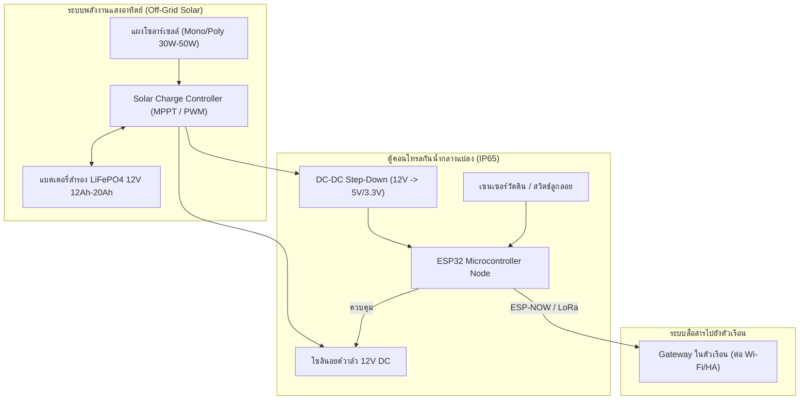

# 📐 คู่มือการจัดกิจกรรมเชิงปฏิบัติการ: กิจกรรมที่ 8 — ออกแบบระบบสำหรับฟาร์ม (Design)
### คู่มือมาตรฐานสำหรับวิทยากร ผู้ช่วยสอน (TA) และผู้เรียน — โครงการ Smart Farm AIoT Workshop

---

## 📌 1. บทนำและแนวคิดวิศวกรรม (Design Principles)

การทดลองในห้องปฏิบัติการใช้อุปกรณ์ที่เสียบไฟบ้านและต่อ Wi-Fi ที่มีสัญญาณเต็ม แต่ใน **"ฟาร์มจริง"** แปลงเกษตรอาจอยู่ห่างไกลเป็นร้อยเมตร ไม่มีไฟฟ้า ไม่มีสัญญาณอินเทอร์เน็ต และต้องตากแดดตากฝนตลอด 24 ชั่วโมง

**แนวคิดสำคัญในกิจกรรมที่ 8:**
1. **Farm Network Topology Selection:**
   * **Wi-Fi:** แบนด์วิดท์สูง แต่กินไฟมาก ระยะทางจำกัด (30-50 เมตร)
   * **ESP-NOW:** ระยะกลาง (100-200 เมตร) กินไฟต่ำมาก สื่อสารระหว่างชิปโดยตรง
   * **LoRa / LoRaWAN:** ระยะไกลมาก (2-10 กิโลเมตร) แบนด์วิดท์ต่ำมาก กินไฟต่ำมาก เหมาะกับแปลงห่างไกล
   * **Cellular (4G LTE / NB-IoT):** ส่งตรงขึ้นคลาวด์ได้ทุกที่ที่มีสัญญาณมือถือ มีค่าบริการซิมการ์ดรายเดือน
2. **Cloud & Remote Access Architecture:** การเลือกใช้วิธีเข้าถึงระบบจากนอกฟาร์ม เช่น Cloudflare Tunnel, Tailscale VPN หรือ Nabu Casa Cloud โดยไม่ต้องเปิดพอร์ตเราเตอร์ให้เสี่ยงต่อการถูกแฮก
3. **Power Budgeting & Solar Sizing:**
   * คำนวณพลังงานที่อุปกรณ์ใช้ต่อวัน ($E = P 	imes t$ เป็น Watt-hour/day)
   * คำนวณขนาดแผงโซลาร์เซลล์รองรับวันแดดน้อย ($W_p$)
   * คำนวณขนาดความจุแบตเตอรี่สำรอง (Ah) พร้อมพิจารณา Depth of Discharge (DOD) ของแบตเตอรี่ชนิดต่าง ๆ (LiFePO4 vs Lead-Acid)

---

## ⏱️ 2. แผนการจัดการเรียนรู้และเวลา (Facilitator Time Matrix)

* **เวลารวม:** 50 นาที
* **รูปแบบการจัด:** กิจกรรมการวางแผนวิศวกรรมและการคำนวณสเปกฮาร์ดแวร์เพื่อการใช้งานจริงในฟาร์ม

```mermaid
gantt
    title ลำดับขั้นตอนกิจกรรมที่ 8: Design (50 นาที)
    dateFormat  m
    axisFormat %M นาที
    section กำหนดโจทย์
    เลือกแปลงปลูก & วิเคราะห์ข้อจำกัด :a1, 0, 10m
    section เลือกเครือข่าย & คลาวด์
    เปรียบเทียบ Network & Remote Access :a2, after a1, 15m
    section คำนวณพลังงาน
    คำนวณ Watt-hour, แผงโซลาร์, แบตเตอรี่ :a3, after a2, 15m
    section สรุปพิมพ์เขียว
    ร่างสถาปัตยกรรม & อภิปราย 8-Q   :a4, after a3, 10m
```



| ช่วงเวลา | กิจกรรมย่อย | บทบาทวิทยากร / TA | ผลลัพธ์ที่ต้องได้ |
| :--- | :--- | :--- | :--- |
| **00:00 - 10:00** | 8.1 เลือกโจทย์ฟาร์ม | แนะนำบริบท 3 แบบ (สวนทุเรียน 10 ไร่, โรงเรือนเมลอน, ผักไฮโดรโปนิกส์) | กลุ่มเลือกโจทย์และระบุขนาดพื้นที่ |
| **10:00 - 25:00** | 8.2 & 8.3 เลือกเครือข่ายและคลาวด์ | อธิบายตารางเปรียบเทียบ Wi-Fi, ESP-NOW, LoRa, 4G และแนวทาง VPN | สรุปโพรโทคอลเครือข่ายที่เหมาะสมกับโจทย์ |
| **25:00 - 40:00** | 8.4 & 8.5 คำนวณพลังงานโซลาร์และแบตเตอรี่ | สอนสูตรคำนวณ $Wh/day$, แผงวัตต์, และความจุแอมป์-ชั่วโมง ($Ah$) | ตัวเลขขนาดแผงโซลาร์และขนาดแบตเตอรี่ที่ถูกต้อง |
| **40:00 - 50:00** | 8.6 พิมพ์เขียวระบบ & สรุป 8-Q | ให้ผู้เรียนวาดผังระบบรวม และร่วมอภิปรายคำถามสภาพแวดล้อมจริง | พิมพ์เขียวระบบฟาร์ม 1 จุดที่สมบูรณ์ |

---

## 🔌 3. รายการอุปกรณ์และการเชื่อมต่อ (Hardware BOM & Interfacing)



| ลำดับ | รายการอุปกรณ์ในฟาร์มจริง | สเปกแนะนำ | หน้าที่ในระบบ |
| :---: | :--- | :--- | :--- |
| 1 | **ตู้พักอุปกรณ์กันน้ำ** | ตู้พลาสติก ABS เกรดกันน้ำ IP65 พร้อม Cable Gland | ป้องกันฝน ฝุ่น และความชื้นสะสม |
| 2 | **แผงโซลาร์เซลล์ (Solar Panel)** | Monocrystalline 30W - 50W 18V | เปลี่ยนพลังงานแสงอาทิตย์เป็นไฟฟ้ากระแสตรง |
| 3 | **ตัวควบคุมการชาร์จ (Charge Controller)** | MPPT หรือ PWM 10A 12V พร้อมระบบตัดไฟต่ำ/สูง | ควบคุมการประจุไฟลงแบตเตอรี่อย่างปลอดภัย |
| 4 | **แบตเตอรี่สำรอง (Battery Storage)** | Lithium Iron Phosphate (LiFePO4) 12.8V 12Ah - 20Ah | เก็บสำรองพลังงานสำหรับใช้งานกลางคืนและวันฝนตก |
| 5 | **ตัวแปลงไฟ (DC-DC Step-Down)** | Buck Converter 12V เป็น 5V 3A (ประสิทธิภาพ > 90%) | แปลงแรงดันให้เหมาะกับบอร์ดควบคุม ESP32 |

---

## 🧪 4. ขั้นตอนการทดลองอย่างละเอียดทีละขั้น (Step-by-Step Lab Protocol)

### ขั้นตอนที่ 8.1: เลือกโจทย์และระบุข้อจำกัดของพื้นที่
* เลือกโจทย์ฟาร์มของกลุ่ม เช่น:
  * **โจทย์ ก: โรงเรือนเพาะปลูกเมลอน (Greenhouse):** ระยะทาง 40 เมตร มีโครงสร้างเหล็กและพลาสติกคลุม
  * **โจทย์ ข: สวนทุเรียนกลางแจ้ง (Open Orchard):** แปลงปลูกห่างจากบ้าน 200-500 เมตร มีร่มเงาต้นไม้บัง ไม่มีเสาไฟ
  * **โจทย์ ค: ระบบสูบน้ำบ่อบาดาลพลังงานแสงอาทิตย์:** อยู่ห่างจากตัวเรือน 1 กิโลเมตร

### ขั้นตอนที่ 8.2: เลือกเทคโนโลยีเครือข่ายสื่อสาร
| เทคโนโลยี | ระยะทาง | การกินพลังงาน | แบนด์วิดท์ | ความเหมาะสม |
| :--- | :--- | :--- | :--- | :--- |
| **Wi-Fi** | 30 - 50 ม. | สูงมาก | สูงมาก | เหมาะเฉพาะในตัวเรือนหรือโรงเรือนใกล้บ้าน |
| **ESP-NOW** | 100 - 200 ม. | ต่ำมาก | ปานกลาง | **คุ้มค่าที่สุด** สำหรับแปลงห่าง 100-200 เมตร |
| **LoRa** | 1 - 5 กม. | ต่ำมาก | ต่ำมาก | ดีที่สุดสำหรับฟาร์มขนาดใหญ่แปลงห่างไกล |
| **4G Cellular** | ทั่วประเทศ | สูง | สูง | ดีที่สุดหากไม่มีตัวเรือนใกล้เคียง (มีค่าเน็ตรายเดือน) |

### ขั้นตอนที่ 8.3: การเข้าถึงระบบจากนอกฟาร์ม (Remote Cloud Access)
* **วิธีแนะนำ:** ใช้ **Cloudflare Tunnel** หรือ **Home Assistant Cloud (Nabu Casa)**
* ข้อดี: ไม่ต้องขอ Public IP ไม่ต้องเปิด Port Forwarding ที่เราเตอร์ ปลอดภัยจากการถูกสแกนเจาะระบบ

### ขั้นตอนที่ 8.4 & 8.5: คำนวณขนาดโซลาร์เซลล์และแบตเตอรี่ (Power Budget)
1. **คำนวณการใช้พลังงานรวมต่อวัน ($E$):**
   * โหนด ESP32 (Deep Sleep ส่วนใหญ่): กินไฟเฉลี่ย $0.5	ext{ W} 	imes 24	ext{ ชม.} = 12	ext{ Wh}$
   * วาล์วน้ำ 12V 1A (เปิดวันละ 2 ครั้ง ครั้งละ 15 นาที = 0.5 ชม.): $12	ext{V} 	imes 1	ext{A} 	imes 0.5	ext{ ชม.} = 6	ext{ Wh}$
   * พลังงานรวมต่อวัน $= 12 + 6 = 18	ext{ Wh/day}$
2. **คำนวณขนาดแบตเตอรี่ (สำรองไฟ 2 วันที่แดดไม่ออก):**
   * ความจุที่ต้องการ $= 18	ext{ Wh} 	imes 2	ext{ วัน} = 36	ext{ Wh}$
   * แบตเตอรี่ LiFePO4 (DOD ปลอดภัย 80%): ความจุขั้นต่ำ $= 36 / (12.8	ext{V} 	imes 0.8) pprox 3.5	ext{ Ah}$
   * *สเปกแนะนำเผื่อความปลอดภัย:* เลือกแบตเตอรี่ **LiFePO4 12V 6Ah ถึง 12Ah**
3. **คำนวณขนาดแผงโซลาร์เซลล์ (แดดเฉลี่ยวันละ 4.5 ชั่วโมง):**
   * กำลังผลิตที่ต้องการ $= 18	ext{ Wh} / (4.5	ext{ ชม.} 	imes 0.7	ext{ ประสิทธิภาพระบบ}) pprox 5.7	ext{ W}$
   * *สเปกแนะนำเผื่อวันฟ้าหลัว:* เลือกแผงโซลาร์ **20W ถึง 30W 18V**

---

## 💻 5. โค้ดและการตั้งค่าสำเร็จรูป (Ready-to-use Configurations)

```text
========================================================================
สูตรการคำนวณระบบพลังงานโซลาร์เซลล์สำหรับสถานีตรวจวัดในฟาร์ม (Power Budgeting)
========================================================================

1. คำนวณพลังงานที่ใช้ต่อวัน (Daily Energy Consumption: E):
   E = (P_mcu * t_mcu) + (P_sensor * t_sensor) + (P_actuator * t_actuator)  [Wh/day]

2. คำนวณขนาดความจุแบตเตอรี่ (Battery Capacity: Ah):
   Ah = (E * Days_of_Autonomy) / (V_system * DoD)
   - Days_of_Autonomy: จำนวนวันที่ระบบต้องอยู่ได้แม้ไม่มีแดด (ปกติ 2 - 3 วัน)
   - V_system: แรงดันระบบแบตเตอรี่ (เช่น 12.8 V)
   - DoD (Depth of Discharge):
     * แบตเตอรี่ตะกั่ว-กรด (Lead-Acid / Deep Cycle): 50% (0.50)
     * แบตเตอรี่ลิเธียมฟอสเฟต (LiFePO4): 80% - 90% (0.80 - 0.90)

3. คำนวณขนาดแผงโซลาร์เซลล์ (Solar Panel Watt-Peak: Wp):
   Wp = E / (Peak_Sun_Hours * System_Efficiency)
   - Peak_Sun_Hours: ชั่วโมงแดดเฉลี่ยประเทศไทย (ประมาณ 4.0 - 4.8 ชม./วัน)
   - System_Efficiency: ประสิทธิภาพรวมของแผงและชาร์จเจอร์ (ประมาณ 0.65 - 0.75)
========================================================================
```

---

## 📝 6. แนวทางการตรวจคำตอบและเฉลยใบงาน (Answer Key & Discussion)

### เฉลยคำตอบและแนวทางการตรวจใบงาน (Activity 8 Worksheet)

1. **ข้อ 8.1 - 8.2 การเลือกเครือข่าย:**
   * สวนระยะ 100-200 ม.: เลือก **ESP-NOW** คุ้มค่าที่สุด ไม่ต้องลากสาย ไม่ต้องตั้งเสา Wi-Fi
   * สวนระยะ > 1 กม.: เลือก **LoRaWAN** หรือ **4G Cellular**
2. **ข้อ 8.4 ชนิดแบตเตอรี่:**
   * ทำไม **LiFePO4** จึงดีกว่าแบตเตอรี่รถยนต์ทั่วไป (Lead-Acid)?
     * รอบการใช้งาน (Cycle Life): LiFePO4 ทนทานกว่า 2,000-4,000 รอบ เทียบกับตะกั่วกรดที่ได้เพียง 300-500 รอบ
     * น้ำหนักเบา ขนาดกะทัดรัดกว่าเกือบ 3 เท่า
     * สามารถดึงประจุ (DOD) ได้ลึกถึง 80-90% โดยแบตเตอรี่ไม่เสื่อมสภาพเร็ว
3. **ข้อ 8.5 ผลการคำนวณพลังงาน:**
   * ขนาดแผงโซลาร์เซลล์ที่เหมาะสม: 20W - 30W
   * ขนาดแบตเตอรี่สำรองที่เหมาะสม: 12V 6Ah - 12Ah

---

### 💡 การอภิปรายเชิงวิศวกรรม (คำถาม 8-Q)
**คำถาม:** *สภาพแวดล้อมจริงในแปลงเกษตร (ความร้อนใต้แสงแดด, ความชื้นไอฝน, สัตว์ แมลง และฟ้าผ่า) ส่งผลต่อการออกแบบกล่องควบคุมอย่างไร และต้องป้องกันอย่างไร?*
* **เฉลยเชิงวิศวกรรม:**
  1. **ความร้อนสะสมในตู้คอนโทรล (Thermal Accumulation):** ตู้ที่ตากแดดตรง ๆ ภายในอาจร้อนเกิน 60-70°C จนบอร์ดแฮงก์ ต้องติดตั้ง **หลังคากันแดดสองชั้น (Sunshade Double Roof)** เพื่อให้มีช่องระบายอากาศ และเลือกตู้สีขาวสะท้อนความร้อน
  2. **มด แมลง และจิ้งจก (Insects Intrusion):** แมลงมักเข้าไปทำรังในตู้ที่มีไออุ่น ขาแมลงอาจทำให้ลายวงจรช็อต ต้องอุดช่องเดินสายไฟด้วย **Cable Gland และซิลิโคน/ดินน้ำมันกันแมลง (Duct Seal)**
  3. **หยดน้ำและไอชื้นสะสม (Condensation):** ในช่วงกลางคืนที่อากาศเย็น ความชื้นภายในตู้จะกลั่นตัวเป็นหยดน้ำบนแผงวงจร ต้องฉีดพ่นสเปรย์เคลือบแผงวงจร **(Conformal Coating)** เพื่อป้องกันสนิมและการลัดวงจร
  4. **ฟ้าผ่าและแรงดันเหนี่ยวนำ (Surge & Lightning):** สายไฟเซนเซอร์ที่ฝังดินหรือขึงยาวทำหน้าที่เป็นเสารับคลื่นเหนี่ยวนำจากฟ้าผ่า ต้องติดตั้งอุปกรณ์ป้องกันไฟกระชาก **(Surge Protection Device: SPD / TVS Diode)** และต่อสายดิน (Ground Rod) ให้ถูกต้อง

---

## 🛠️ 7. การแก้ไขปัญหาหน้างานที่พบบ่อย (Troubleshooting FAQ)

| ปัญหาที่พบ | สาเหตุที่เป็นไปได้ | วิธีการแก้ไข |
| :--- | :--- | :--- |
| **แบตเตอรี่หมดเกลี้ยงในวันที่ 2 ที่ฝนตก** | คำนวณชั่วโมงแดดสูงเกินจริง หรือไม่ได้ใช้โหมด Deep Sleep | ปรับปรุงเฟิร์มแวร์ให้บอร์ดหลับ (Deep Sleep) ตื่นมาส่งข้อมูลเพียง 2 วินาทีต่อรอบ |
| **บอร์ดช็อตดับหลังจากใช้งานกลางแจ้งได้ 1 สัปดาห์** | มีน้ำซึมเข้าทางรูเจาะสายไฟ หรือมดเข้าไปทำรังใต้แผง | ขัน Cable Gland ให้แน่น ทาซิลิโคนอุดรูเจาะ และฉีดสเปรย์เคลือบวงจร |
| **สัญญาณ Wi-Fi หลุดบ่อยเมื่อต้นไม้โตขึ้น** | ใบไม้และผลไม้มีน้ำเป็นส่วนประกอบ ทำให้ดูดกลืนคลื่น 2.4 GHz | ยกเสาอากาศให้สูงพ้นแนวพุ่มไม้ หรือเปลี่ยนไปใช้โพรโทคอล ESP-NOW / LoRa |

---

## 📊 8. เกณฑ์การประเมินผลการเรียนรู้ (Assessment Rubric)

| เกณฑ์การประเมิน | ดีเยี่ยม (4-5 คะแนน) | พอใช้ (2-3 คะแนน) | ต้องปรับปรุง (0-1 คะแนน) |
| :--- | :--- | :--- | :--- |
| **การเลือกเครือข่ายสื่อสาร (5 คะแนน)** | เปรียบเทียบข้อดี-ข้อจำกัดของ Wi-Fi/ESP-NOW/LoRa ได้ตรงโจทย์ | เลือกเทคโนโลยีได้ถูกต้องแต่อธิบายเหตุผลไม่ชัดเจน | เลือกเทคโนโลยีไม่เหมาะสมกับพื้นที่ |
| **การคำนวณ Power Budget (5 คะแนน)** | คำนวณพลังงาน ขนาดแผง และขนาดแบตเตอรี่ได้ถูกต้องตามสูตรวิศวกรรม | คำนวณได้แต่ลืมคิดค่าประสิทธิภาพหรือ DOD | คำนวณผิดพลาดอย่างมีนัยสำคัญ |
| **การออกแบบความปลอดภัยฮาร์ดแวร์ (5 คะแนน)** | คำนึงถึงการป้องกันแดด ฝน แมลง และฟ้าผ่าอย่างครบถ้วน | ระบุเรื่องกันน้ำได้ แต่ลืมเรื่องความร้อนหรือแมลง | ไม่ได้คำนึงถึงสภาพแวดล้อมจริง |
| **การตอบคำถามคิดวิเคราะห์ 8-Q (5 คะแนน)** | อภิปรายปัญหาและเสนอวิธีแก้ไขเชิงวิศวกรรมทั้ง 4 ด้านได้ลึกซึ้ง | ตอบได้บางด้าน เช่น เรื่องฝนและความชื้น | ตอบไม่ตรงประเด็น |

---
*จัดทำขึ้นสำหรับการอบรมเชิงปฏิบัติการ Smart Farm AIoT Workshop (CMU & RBRU)*
