# 📡 คู่มือการจัดกิจกรรมเชิงปฏิบัติการ: กิจกรรมที่ 9 — อัปเดตบอร์ดที่แปลงให้ส่งข้อมูลด้วย ESP-NOW (Send)
### คู่มือมาตรฐานสำหรับวิทยากร ผู้ช่วยสอน (TA) และผู้เรียน — โครงการ Smart Farm AIoT Workshop

---

## 📌 1. บทนำและแนวคิดวิศวกรรม (Send Principles)

ในแปลงเกษตรขนาดใหญ่ สัญญาณ Wi-Fi จากตัวเรือนมักแผ่ไปไม่ถึง และการตั้งเสาขยายสัญญาณ Wi-Fi กลางแดดก็มีค่าใช้จ่ายสูงและกินพลังงานมาก **ESP-NOW** คือโพรโทคอลสื่อสารไร้สายความเร็วสูงที่พัฒนาโดย Espressif ซึ่งส่งข้อมูลตรงระหว่างชิป ESP32 โดยไม่ต้องเชื่อมต่อเราเตอร์

**แนวคิดสำคัญในกิจกรรมที่ 9:**
1. **Connectionless Protocol (ไร้การจับคู่แบบดั้งเดิม):** ไม่ต้องรอการจับมือ 4 ทาง (4-Way Handshake) ไม่ต้องขอ IP ผ่าน DHCP ทำให้ตื่นขึ้นมาส่งข้อมูลเสร็จภายในเวลาเพียง 2-5 มิลลิวินาที
2. **Web Serial API & ESP Web Tools:** เทคโนโลยีเว็บเบราว์เซอร์ยุคใหม่ที่สามารถสื่อสารตรงกับพอร์ต USB Serial บนชิป ESP32 ทำให้แฟลชเฟิร์มแวร์ผ่านเว็บได้โดยไม่ต้องติดตั้งไดรเวอร์หรือโปรแกรมเสริม
3. **Broadcast Transmission:** การยิงแพ็กเก็ตข้อมูลออกสู่อากาศโดยใช้แอดเดรสปลายทางแบบบรอดคาสต์ (`FF:FF:FF:FF:FF:FF`) ทำให้บอร์ดตัวรับใด ๆ ในรัศมีสัญญาณสามารถดักฟังข้อมูลได้
4. **Dual-Stack Operation:** ในกิจกรรมนี้ เฟิร์มแวร์รุ่นใหม่ถูกออกแบบให้ส่งข้อมูล 2 ช่องทางพร้อมกัน: ต่อ Wi-Fi เดิมเพื่อส่งให้ Home Assistant และยิง ESP-NOW ออกอากาศ เพื่อเตรียมรับมือกับสถานการณ์ Wi-Fi ดับ

---

## ⏱️ 2. แผนการจัดการเรียนรู้และเวลา (Facilitator Time Matrix)

* **เวลารวม:** 45 นาที
* **รูปแบบการจัด:** ปฏิบัติการแฟลชเฟิร์มแวร์ผ่านเบราว์เซอร์และการดักฟังสัญญาณแพ็กเก็ตบรอดคาสต์

```mermaid
gantt
    title ลำดับขั้นตอนกิจกรรมที่ 9: ESP-NOW Send (45 นาที)
    dateFormat  m
    axisFormat %M นาที
    section แฟลชเฟิร์มแวร์
    เสียบสาย USB & แฟลชผ่าน Web Tools :a1, 0, 15m
    section ตรวจสอบบูต
    อ่าน Log บูต & บันทึก MAC Address  :a2, after a1, 10m
    section ตรวจสอบสองทาง
    ตรวจค่าบนเว็บเดิม & ใน HA         :a3, after a2, 10m
    section สรุป & วิศวกรรม
    วิเคราะห์ข้อได้เปรียบ & อภิปราย 9-Q :a4, after a3, 10m
```



| ช่วงเวลา | กิจกรรมย่อย | บทบาทวิทยากร / TA | ผลลัพธ์ที่ต้องได้ |
| :--- | :--- | :--- | :--- |
| **00:00 - 15:00** | 9.1 แฟลชเฟิร์มแวร์ใหม่ | แนะนำเว็บ `web.esphome.io` เลือกไฟล์เฟิร์มแวร์โซนสีของกลุ่ม (เช่น `red_espnow.bin`) | แฟลชผ่าน 100% บอร์ดรีสตาร์ตสำเร็จ |
| **15:00 - 25:00** | 9.2 ตรวจสอบ Log และ MAC | ให้ผู้เรียนเปิด Logs ในเบราว์เซอร์ ดูข้อความการส่ง ESP-NOW และจด MAC Address | จดค่า MAC Address 6 ไบต์ของบอร์ดตนเอง |
| **25:00 - 35:00** | 9.3 ดูค่าใหม่บนหน้าเว็บ & HA | ตรวจดูว่าหน้าเว็บเดิมของบอร์ดยังเข้าได้ และใน Home Assistant อุปกรณ์กลับมาออนไลน์ | ข้อมูลใน HA อัปเดตปกติ แสดงว่า Dual-stack สมบูรณ์ |
| **35:00 - 45:00** | สรุปวิศวกรรมเครือข่าย & 9-Q | อธิบายความต่างระหว่าง Wi-Fi Packet กับ ESP-NOW Action Frame | ตอบคำถาม 9-Q ลงใบงานครบถ้วน |

---

## 🔌 3. รายการอุปกรณ์และการเชื่อมต่อ (Hardware BOM & Interfacing)

```mermaid
flowchart TD
    subgraph GOGO_BOARD["บอร์ด GoGo-IoT (ส่งข้อมูล)"]
        SHT["SHT30: อุณหภูมิ/ความชื้น"]
        ESP["ESP32-C3 Firmware v2 (ESP-NOW Enabled)"]
        SHT --> ESP
    end

    subgraph PATH_A["เส้นทางที่ 1: เครือข่าย Wi-Fi เดิม (ห้องอบรม)"]
        AP["Wi-Fi Access Point (โซนสี)"]
        HA["Home Assistant Server"]
        ESP -->|Wi-Fi Station (TCP/IP)| AP --> HA
    end

    subgraph PATH_B["เส้นทางที่ 2: คลื่นไร้สาย ESP-NOW (เตรียมใช้จริง)"]
        AIR["คลื่นวิทยุ 2.4 GHz (Broadcast Packets)"]
        ESP -->|ESP-NOW Action Frames (No Router)| AIR
    end
```

| ลำดับ | รายการอุปกรณ์ | สเปก / คุณสมบัติ | หน้าที่ในระบบ |
| :---: | :--- | :--- | :--- |
| 1 | **บอร์ด GoGo-IoT (Sensor Node)** | ESP32-C3 พร้อมเซนเซอร์เดิมจากช่วงที่ 1 | อัปเกรดเป็นโหนดส่งสัญญาณ ESP-NOW |
| 2 | **สาย USB-C Data Cable** | สายเชื่อมต่อ USB ที่มีสายข้อมูลครบ 4 เส้น | ใช้สำหรับเบิร์นเฟิร์มแวร์ผ่าน Web Serial |
| 3 | **Google Chrome เบราว์เซอร์** | รองรับ Web Serial API | โปรแกรมสำหรับติดต่อฮาร์ดแวร์เพื่อแฟลชโค้ด |
| 4 | **ไฟล์เฟิร์มแวร์ ESP-NOW (.bin)** | เฟิร์มแวร์ที่คอมไพล์สำเร็จรูปตรงตามโซนสี | โปรแกรมควบคุมระบบสื่อสารสองทาง |

---

## 🧪 4. ขั้นตอนการทดลองอย่างละเอียดทีละขั้น (Step-by-Step Lab Protocol)

### ขั้นตอนที่ 9.1: ดาวน์โหลดและติดตั้งเฟิร์มแวร์รุ่นใหม่ผ่าน Web Serial
1. นำสาย USB-C ของบอร์ด GoGo-IoT มาเสียบเข้ากับพอร์ต USB ของแล็ปท็อป
2. เปิด Google Chrome ไปที่หน้าติดตั้งเฟิร์มแวร์ของโครงการ (หรือ `web.esphome.io`)
3. กดปุ่ม **Connect** -> จะมีหน้าต่าง Pop-up ให้เลือกพอร์ต (เช่น `USB Serial JTAG` หรือ `ttyUSB0`) -> กดเลือกแล้วคลิก **Connect**
4. เลือกไฟล์เฟิร์มแวร์ที่ตรงกับ **"สีโซนของกลุ่ม"** (ระวัง: ห้ามเลือกผิดโซน เพราะค่า Wi-Fi จะไม่ตรง)
5. กดปุ่ม **Install** รอแถบเปอร์เซ็นต์วิ่งจนครบ 100% (ใช้เวลาประมาณ 1-2 นาที)

### ขั้นตอนที่ 9.2: ตรวจสอบ Log และจดหมายเลข MAC Address
1. เมื่อติดตั้งเสร็จ ให้คลิกที่ปุ่ม **Logs & Console**
2. กดรีเซ็ตบอร์ดหนึ่งครั้ง สังเกตข้อความบรรทัดเริ่มต้น:
   * จะแสดงหมายเลข MAC Address ของบอร์ด เช่น `MAC: 24:D7:EB:24:2D:CC`
   * จะแสดงข้อความการส่งแพ็กเก็ต: `[ESP-NOW] Broadcast packet sent: Temp=30.2, Hum=65.4`
3. **จดหมายเลข MAC Address นี้ไว้อย่างถูกต้อง** เพราะจำเป็นต้องใช้ในกิจกรรมที่ 10

### ขั้นตอนที่ 9.3: ตรวจสอบความพร้อมของระบบเดิม
1. เปิดหน้าเว็บเดิมของบอร์ด (`http://gogo-iot-xxxxxx.local`) ตรวจสอบว่าค่ายังขึ้นปกติ
2. ตรวจสอบใน Home Assistant: Entity ของบอร์ดยังต้องออนไลน์และส่งค่าตามปกติ

---

## 💻 5. โค้ดและการตั้งค่าสำเร็จรูป (Ready-to-use Configurations)

```cpp
// ตัวอย่างโครงสร้างโค้ด ESP-NOW Sender บน ESP32-C3
#include <esp_now.h>
#include <WiFi.h>

typedef struct struct_message {
    char board_id[16];
    float temp;
    float hum;
    bool float_switch;
} struct_message;

struct_message myData;
uint8_t broadcastAddress[] = {0xFF, 0xFF, 0xFF, 0xFF, 0xFF, 0xFF};

void setup() {
    WiFi.mode(WIFI_AP_STA); // ทำงานควบคู่ทั้ง Wi-Fi และ ESP-NOW
    if (esp_now_init() != ESP_OK) return;
    
    esp_now_peer_info_t peerInfo = {};
    memcpy(peerInfo.peer_addr, broadcastAddress, 6);
    peerInfo.channel = 0;
    peerInfo.encrypt = false;
    esp_now_add_peer(&peerInfo);
}

void loop() {
    // อ่านค่าเซนเซอร์แล้วส่งออกอากาศทุก 3 วินาที
    myData.temp = readTemp();
    myData.hum = readHum();
    esp_now_send(broadcastAddress, (uint8_t *) &myData, sizeof(myData));
    delay(3000);
}
```

---

## 📝 6. แนวทางการตรวจคำตอบและเฉลยใบงาน (Answer Key & Discussion)

### เฉลยคำตอบและแนวทางการตรวจใบงาน (Activity 9 Worksheet)

1. **ข้อ 9.2 หมายเลข MAC Address ของบอร์ดที่แปลง:**
   * บันทึกเลขฐานสิบหก 12 ตัว (คั่นด้วยโคลอน 6 คู่) เช่น `24:D7:EB:24:2D:CC`
2. **ข้อ 9.3 ความเปลี่ยนแปลงบนหน้าเว็บและ Home Assistant:**
   * หน้าเว็บยังแสดงค่าเซนเซอร์เหมือนเดิม
   * ใน Home Assistant อุปกรณ์ไม่หลุด (ยังออนไลน์ตามปกติผ่าน Dual-Stack)

---

### 💡 การอภิปรายเชิงวิศวกรรม (คำถาม 9-Q)
**คำถาม:** *ในแปลงเกษตรที่ห่างไกลและไม่มีโครงข่ายไฟฟ้า ทำไมการส่งข้อมูลด้วย ESP-NOW จึงประหยัดพลังงานแบตเตอรี่ได้มากกว่าการเชื่อมต่อ Wi-Fi ทั่วไปอย่างมหาศาล?*
* **เฉลยเชิงวิศวกรรม:**
  1. **Zero Association Overhead:** การต่อ Wi-Fi มาตรฐาน โหนดต้องสแกนหา SSID, ส่ง Authentication Frame, ทำ 4-Way Handshake เพื่อยืนยันรหัส WPA2, และรอรับ IP ผ่าน DHCP ขั้นตอนนี้ใช้เวลานานถึง **3 - 8 วินาที** ซึ่งชิปต้องใช้พลังงานสูงตลอดเวลานี้
  2. **Sub-10ms Transmission:** ESP-NOW เป็นโพรโทคอลแบบ Connectionless ทำงานที่ระดับ MAC Layer เมื่อไมโครคอนโทรลเลอร์ตื่นจาก Deep Sleep สามารถยิงแพ็กเก็ตข้อมูลออกสู่อากาศได้ทันทีในเวลาเพียง **3 - 10 มิลลิวินาที** แล้วกลับเข้าสู่ Deep Sleep ได้ทันที
  3. **อายุการใช้งานแบตเตอรี่:** ด้วยความต่างของเวลาทำงาน (3 วินาที เทียบกับ 5 มิลลิวินาที) โหนดเซนเซอร์ที่ใช้ ESP-NOW สามารถทำงานด้วยแบตเตอรี่ก้อนเดิมได้นานกว่า Wi-Fi มาตรฐานถึง **10 ถึง 50 เท่า** (อยู่ได้นับปี)

---

## 🛠️ 7. การแก้ไขปัญหาหน้างานที่พบบ่อย (Troubleshooting FAQ)

| ปัญหาที่พบ | สาเหตุที่เป็นไปได้ | วิธีการแก้ไข |
| :--- | :--- | :--- |
| **เบราว์เซอร์มองไม่เห็นพอร์ต USB Serial** | ใช้สายชาร์จที่ไม่มีสายดาต้า (Charge-only cable) หรือขาดไดรเวอร์ CH340/CP2102 | เปลี่ยนสาย USB เส้นใหม่ หรือกดปุ่ม **BOOT** บนบอร์ดค้างไว้ขณะเสียบสาย |
| **แฟลชหยุดชะงักที่ 50% หรือ Error** | จ่ายไฟผ่านพอร์ต USB ไม่พอ หรือสายหลวม | ขยับสายให้แน่น และปิดโปรแกรม Terminal/Arduino IDE อื่นที่แย่งพอร์ตอยู่ |
| **บอร์ดไม่ต่อ Wi-Fi เดิมหลังแฟลชเสร็จ** | เลือกไฟล์เฟิร์มแวร์ผิดสีโซน | ดาวน์โหลดไฟล์เฟิร์มแวร์ที่ตรงกับสีกลุ่มตนเอง แล้วทำการแฟลชใหม่อีกครั้ง |

---

## 📊 8. เกณฑ์การประเมินผลการเรียนรู้ (Assessment Rubric)

| เกณฑ์การประเมิน | ดีเยี่ยม (4-5 คะแนน) | พอใช้ (2-3 คะแนน) | ต้องปรับปรุง (0-1 คะแนน) |
| :--- | :--- | :--- | :--- |
| **การแฟลชเฟิร์มแวร์ผ่านเว็บ (5 คะแนน)** | แฟลชเฟิร์มแวร์ได้ตรงตามโซนสี และบอร์ดรีสตาร์ตสำเร็จในครั้งแรก | แฟลชได้สำเร็จแต่ต้องได้รับคำแนะนำเรื่องสายหรือพอร์ต | ไม่สามารถแฟลชบอร์ดได้ |
| **การบันทึกหมายเลข MAC (5 คะแนน)** | เปิด Log และจดหมายเลข MAC Address ได้ถูกต้องครบทั้ง 6 ไบต์ | จด MAC ได้แต่มีพิมพ์ผิดบางตัวอักษร | ไม่สามารถหา MAC Address ได้ |
| **การตรวจสอบ Dual-Stack (5 คะแนน)** | ตรวจสอบทั้งหน้าเว็บและ Home Assistant ว่ายังทำงานได้ครบถ้วน | ตรวจสอบได้เฉพาะหน้าเว็บของบอร์ด | ไม่ได้ทำการตรวจสอบ |
| **การตอบคำถามคิดวิเคราะห์ 9-Q (5 คะแนน)** | อธิบายกลไก Handshake และการลดเวลาตื่นของชิปได้อย่างลึกซึ้ง | ตอบได้เรื่องประหยัดแบตเตอรี่แต่ไม่อธิบายกลไก | ตอบไม่ตรงประเด็น |

---
*จัดทำขึ้นสำหรับการอบรมเชิงปฏิบัติการ Smart Farm AIoT Workshop (CMU & RBRU)*
